# 第 23 章 `No-code & IDE/Terminal: 长尾 11 集成`

> 本章目标:读完本章,你将能够
> - 用 **n8n / Dify / Second Brain** 三种无代码入口把 Cognee 接入自动化流与聊天机器人
> - 用 **VS Code 扩展**给每个仓库挂一个 `vscode_<hash>` dataset,实现带引用的问答
> - 在 **OpenClaw / Vellum / OpenCode / Aider / Codex CLI / Hermes** 六种终端 Agent 内启用 Cognee 记忆
> - 复用 **Skill self-improve** 模板(beginner / advanced)让 SKILL.md 自动迭代

## 前置知识

- 已读完 [[chapter-20-claude-code|第 20 章 Claude Code / Claude Agent SDK 集成(主流)]](./chapter-20-claude-code.md),理解 v1 / v2 记忆 API、`remember`/`recall`/`improve`/`forget` 的语义以及 mode 选择(managed_endpoint / integration_local / embedded)
- 已读完 [[chapter-21-frameworks|第 21 章 Strands / LangGraph / CrewAI / Google ADK 集成(主流 4 框架)]](./chapter-21-frameworks.md),理解 LangGraph / CrewAI / Strands / Google ADK 的工具接入套路与多租户 dataset 模型
- 需要 `cognee>=1.4.0`、`asyncio`;无代码/IDE 部分只需一台本地 Cognee 服务器或一个 Cognee Cloud tenant
- 需要 Node.js ≥ 20.15(n8n 节点、VS Code、OpenClaw、Vellum、OpenCode);Python ≥ 3.10(Second Brain、Aider、Hermes)

## 本章导览

- 23.1:无代码平台三件套 — n8n、Dify(Cloud + Self-hosted)、Second Brain
- 23.2:IDE 扩展 — VS Code(命令面板 / 设置 / per-repo dataset)
- 23.3:终端 Agent 六款 — OpenClaw、Vellum Assistant、OpenCode、Aider、Codex CLI、Hermes Agent
- 23.4:Skill self-improve loop 与 n8n beginner/advanced 模板
- 23.5:11 集成速查表
- 23.6:按场景选型的决策树

---

## 23.1 无代码平台:n8n / Dify / Second Brain

为什么不写代码就不能用 Cognee?核心原因是 Cognee 对外只暴露稳定的 HTTP
API(`/api/v1/...`)和 Python SDK,只要有一个能发 HTTP 请求的图形化前端,就能
把 add → cognify → search → forget 这条管线搬进工作流。本节覆盖三条独立
路径:通用自动化平台(n8n)、低代码 LApp 平台(Dify)、跨前端个人助理
(Second Brain)。

### 23.1.1 n8n 节点(`n8n-nodes-cognee`)

n8n 是 fair-code 授权的工作流自动化平台,在企业内部署或 SaaS 都行。Cognee
官方维护一个社区节点,包名 `n8n-nodes-cognee`(npm 注册,
`<COGNEE_INTEGRATIONS_REPO>/integrations/n8n/package.json` 第 2 行)。

安装走 n8n 的 **Settings → Community Nodes** 搜索 `n8n-nodes-cognee`,或在
实例目录下执行:

```bash
npm install n8n-nodes-cognee
```

随后在 n8n 里新建凭证类型 **Cognee API**,填 **Base URL**
(形如 `https://tenant-xxx.aws.cognee.ai`,**不要带末尾的 `/api`**,节点会自动
追加)与 **API Key**。节点会用 `X-Api-Key` header 携带密钥
(`<COGNEE_INTEGRATIONS_REPO>/integrations/n8n/credentials/CogneeApi.credentials.ts` 第 32 行说明、第 41–43 行 health check headers,实际请求在 `Cognee.node.ts` 第 157 行统一注入)。

节点暴露 5 个 Resource、对应不同操作:

| Resource | Operation | Endpoint | 用途 |
|---|---|---|---|
| **Add Data** | Add | `POST /api/add_text` | 把多段文本写入指定 dataset |
| **Cognify** | Cognify | `POST /api/cognify` | 对已写入的数据跑管线、生成知识图 |
| **Search** | Search | `POST /api/search` | 检索(支持 `GRAPH_COMPLETION` / `GRAPH_COMPLETION_COT` / `RAG_COMPLETION` 等) |
| **Delete** | Delete Dataset / Delete Data | `DELETE /api/datasets/{id}` 等 | 删数据集或单条数据 |
| **Skill** | Ingest / Review / Propose / Get Proposal / Apply / Get | `/api/v1/skill*` | **Skill self-improve loop** 的六个原子动作(见 23.4) |

> 两套 API 注意:**Add / Cognify / Search / Delete** 走 Cognee Cloud 的
> `/api/*`;**Skill** 走 `/api/v1/*`,目前需要自托管 Cognee 服务器或等 Cloud
> 把 `/api/v1` 路由上线。把凭证的 Base URL 指向任意能提供这两个端面的
> 后端即可(本地 `http://localhost:8000`)。

最简工作流节点图(纯 n8n 视角):Webhook → Cognee **Add Data** → 间隔 →
Cognee **Cognify** → Cognee **Search**(RAG_COMPLETION)→ HTTP Response。

### 23.1.2 Dify 工具插件(`cognee`,Cloud 版)

Dify 是国产开源 LLApp 平台,核心交互是 Chatflow / Workflow,每个步骤可挂
**Tool Plugin**。Cognee 在 Dify 官方市场上以包名 `cognee` 发布工具集
(`<COGNEE_INTEGRATIONS_REPO>/integrations/dify/manifest.yaml`)。
该插件假设你已经购买了 Cognee Cloud(或持有 tenant 的 Base URL 与 API Key)。

9 个工具清单(每个都是 `python dify` 端点,源码在
`<COGNEE_INTEGRATIONS_REPO>/integrations/dify/tools/`)如下:

| Tool | 用途 | 关键参数 |
|---|---|---|
| **Create Dataset** | 创建或幂等返回同名 dataset | `datasetName` |
| **Add Data** | 摄取文本(可多条换行) | `textData`、`datasetName`/`datasetId`、`nodeSet` |
| **Add File** | 上传 PDF/DOCX/TXT 等 | `files`、`datasetName`/`datasetId` |
| **Cognify** | 跑管线生成知识图 | `datasets`/`datasetIds`、`customPrompt`、`ontologyKey` |
| **Search** | 14 种 `SearchType` 任选 | `query`、`searchType`、`topK`、`onlyContext` |
| **Get Datasets** | 列出所有 dataset | — |
| **Get Dataset Data** | 列出某 dataset 下的 data items | `datasetName`/`datasetId` |
| **Delete Dataset** | 删除整个 dataset | `datasetId` |
| **Delete Data** | 删除单条 data item | `datasetId`、`dataId` |

典型 Chatflow 用法:**开始节点(用户问题)** → **Tool 节点调用 Search** →
**LLM 节点把检索结果当上下文** → **直接回复节点**。也可在 Workflow 中组合
多个 Tool(先 Add Data 写入 FAQ → 触发 Cognify → 用户提问时 Search)拼出
"导入即问答"的运维手册机器人。

### 23.1.3 Dify 自托管版(`dify-sdk`)

如果你已经在内网部署了开源 Cognee 服务器(由 Ch28 的 `docker-compose.yml`
一键起),但 Dify 是 SaaS 版无法直接访问内网 API,或要求 SDK 直连,使用
`dify-sdk` 包(`<COGNEE_INTEGRATIONS_REPO>/integrations/dify-sdk/`)。
二者工具集几乎一致,只是把 Base URL 指向 `http://cognee-server:8000`,
且该版本把 **`Search` 的可选项收窄为 v0.5.5 服务端支持的子集**(测试基准为
`cognee 0.5.5`,新版本可能要核对 API 路径)。

### 23.1.4 Second Brain — 跨前端个人助理

Second Brain 不属于"工作流平台",而是一个**跨 Telegram / Web 的统一大脑**,
仓库路径 `<COGNEE_INTEGRATIONS_REPO>/integrations/second-brain/`。
它解决一个看似小众却高频的问题:在 Telegram 上随手记的笔记,能否用 Web 找回
并互相引用?Second Brain 用一个 `ChatMemoryAdapter` 把 HTTP cognee
封装起来,关键创新是**跨前端身份合并**。

实现层面,代码组织成单一职责的文件
(`<COGNEE_INTEGRATIONS_REPO>/integrations/second-brain/cognee_integration_second_brain/`):

| 文件 | 职责 |
|---|---|
| `http_client.py` | 跟 cognee 服务器对话的薄 HTTP 客户端,**不导入 cognee** |
| `interface.py` | `ChatMemoryAdapter` 抽象 + `Conversation` / `Message` / `Answer` / `Citation` 数据类 |
| `fake_adapter.py` | 内存假实现,用于零密钥冒烟测试 |
| `cognee_adapter.py` | 真适配器,带引用保护(citation guard) |
| `identity.py` | 外部身份 → canonical user 的链接表 + 一次性 code linking |
| `consent.py` | 每用户的 opt-in / opt-out |
| `commands.py` | `/link`、`/forget`、`/optin`、`/optout`、`/help` |
| `router.py` | 解析身份、路由 capture vs recall、渲染回复 |
| `telegram_transport.py` | Telegram 长轮询,纯 httpx |
| `web_transport.py` | 单端点 FastAPI,`POST /message` |

最快上手路径(零密钥):

```bash
USE_FAKE_ADAPTER=true python -m cognee_integration_second_brain
# Web transport 起在 127.0.0.1:8080/message

# 1) alice 写一条
curl -s localhost:8080/message -H 'content-type: application/json' \
  -d '{"user":"alice","text":"I parked the car on level 3 of the garage"}'
# {"reply":"Saved to your brain."}

# 2) alice 提一个问题(末尾加 ? 触发 recall)
curl -s localhost:8080/message -H 'content-type: application/json' \
  -d '{"user":"alice","text":"where did I park?"}'
```

要接上真 cognee,只需在 `.env` 里设 `COGNEE_BASE_URL=http://localhost:8000`、
`COGNEE_API_KEY=...`、可选 `TELEGRAM_BOT_TOKEN=...`。bot 内部把所有用户的笔记
放进 `brain:{user}` 这一个 dataset,然后用 `search_type=GRAPH_COMPLETION` +
`include_references=true` 跑多跳检索并附引用。**身份合并** 是它最有意思的
部分:在 Telegram 发 `/link`,bot 返回一个短码;在 Web 发 `/link <that code>`,
两个 external identity 合并到一个 canonical user,从今往后两边写的东西共用
同一个 brain。`/forget me` 会一键抹掉所有跨前端数据并清空链接表。

### 23.1.5 无代码三类入口速览



---

## 23.2 IDE 扩展:VS Code

VS Code 扩展把 Cognee 接入**编辑器级别的工作流**——你正在写代码,选中一段、
按一下 `Cmd+Shift+P`,知识图就把相关上下文喂回来,而且能点开引用直接跳到
源文件。

扩展源代码在 `<COGNEE_INTEGRATIONS_REPO>/integrations/vscode/`。
它有两个分层:`src/core/`(纯 TypeScript、不依赖 `vscode`,便于在其他编辑器
如 JetBrains 中复用)和 `src/extension/`(绑定 `vscode.commands`、`vscode.window`
等编辑器 API,见 `<COGNEE_INTEGRATIONS_REPO>/integrations/vscode/src/extension/extension.ts`)。

### 23.2.1 命令面板:8 条命令

打开 Command Palette(`Cmd+Shift+P`)输入 `Cognee`,会看到:

| Command ID | 标题 | 触发行为 |
|---|---|---|
| `cognee.askProjectMemory` | `Ask My Project Memory` | 打开侧边面板提问,结果带可点击引用 |
| `cognee.recall` | `Recall` | 单次 query,常用于脚本式检索 |
| `cognee.rememberSelection` | `Remember Selection` | 把当前选区(或整文件)写入当前 repo 的 dataset |
| `cognee.rememberFile` | `Remember File` | 整文件入库(也在 explorer 右键菜单) |
| `cognee.rememberNote` | `Remember Note` | 弹一个输入框,记一条自由文本 |
| `cognee.indexWorkspace` | `Index Workspace` | 批量摄取,带 preflight 摘要与 `.gitignore`/`.cogneeignore` 过滤 |
| `cognee.forgetProject` | `Forget Project Memory` | 二选一:清空图(保留文件)/ 删除 dataset |
| `cognee.setup` | `Set Up` | 写 endpoint、API Key,跑一次健康检查 |

`Ask My Project Memory` 是核心交互:扩展发 `POST /api/v1/recall` 并带
`include_references=true`,把答案里的 `Evidence:` 块解析成 chunk/document 级
引用,按相关性去重、排名,最终在面板中以"答案 + 引用列表"形式呈现。
点引用会直接打开对应的源文件——精确到行级,而非只看文件名。

### 23.2.2 设置项:9 个 knob

扩展的所有配置都在 VS Code settings(用户或工作区级),源码里的 schema 在
`<COGNEE_INTEGRATIONS_REPO>/integrations/vscode/src/extension/settings.ts`。

| Setting | 默认 | 说明 |
|---|---|---|
| `cognee.endpoint` | `http://localhost:8011` | Cognee 后端地址(本地或 Cloud tenant) |
| `cognee.apiKey` | `""` | `X-Api-Key` 头,优先用 `Set Up` 命令写入 OS keychain |
| `cognee.datasetOverride` | `""` | 显式 dataset 名;留空则按 repo 自动派生 |
| `cognee.searchType` | `auto` | 检索策略,`auto` 让 Cognee 自己选 |
| `cognee.topK` | `15` | 召回结果数 |
| `cognee.includeReferences` | `true` | 是否要带引用回答案 |
| `cognee.ingestion.respectGitignore` | `true` | 索引时跳过 `.gitignore`/`.cogneeignore`(依赖/构建目录永远跳过) |
| `cognee.ingestion.maxFileSizeKb` | `512` | 超过此大小的文件索引时跳过 |
| `cognee.requestTimeoutMs` | `300000` | HTTP 请求超时 |

### 23.2.3 Per-repo dataset:`vscode_<hash>`

**隔离** 是这套扩展的关键设计:每个打开的 repo 自动落到自己的 dataset,
默认命名形如 `vscode_<hash>`,哈希源是 git origin remote URL(若存在)或
workspace 路径。这样:

- 同账号开两个 repo,它们的记忆互不干扰;
- 同一个 repo 在不同机器克隆,hashing 出来是一致的;
- `datasetOverride` 留空时,扩展自己派生;非空时强制用该名字(常用于跨机器
  共享的"团队记忆"dataset)。

派生规则在 `<COGNEE_INTEGRATIONS_REPO>/integrations/vscode/src/core/scope.ts` 第 84 行
`deriveDatasetName()`:优先用 override、否则用 normalized git remote 的
sha256 前 16 位,最差用 workspace path 的 sha256 前 16 位。

另外,`src/extension/pathIndex.ts` 实现了一个 **path index**:Cognee 的引用
只携带文件名 basename,可能撞名;path index 把每次 remember 的相对路径记
住,引用解析时优先回到精确路径,失败再降级到 snippet 匹配、最后才弹文件选择器。

### 23.2.4 最小使用流

```bash
# 1) 装扩展(在 VS Code Marketplace 搜 cognee)
code --install-extension cognee.cognee-vscode

# 2) 装扩展后打开一个项目,Cmd+Shift+P → "Cognee: Set Up"
#    填 http://localhost:8011 或 Cognee Cloud tenant URL
#    API Key(若有)会进 OS keychain,不会落到 settings.json
```

随后:Ctrl+Shift+P → `Cognee: Remember Selection`(选中一段)→
`Cognee: Ask My Project Memory`(问"这个函数在哪里被调用")→ 答案带引用,
点引用跳回源文件。

---

## 23.3 终端 Agent:OpenClaw / Vellum / OpenCode / Aider / Codex / Hermes

终端/CLI Agent 这一类(共 6 个集成)面向开发者最常用的两种形态:**嵌在某个
已有 CLI 工具里**(OpenClaw、Vellum Assistant、OpenCode、Aider、Codex CLI、
Hermes)以及**可独立调用的 Python 函数包**(Aider)。它们的共同点是:插件/
工具/CLI 自身不直接实现知识图,而是把每个 hook 点(用户提交 prompt、工具
执行完成、对话结束)的语义挂到 cognee 的 v1 记忆 API 上(`remember` /
`recall` / `improve` / `forget`)。

### 23.3.1 OpenClaw(`@cognee/cognee-openclaw`)

源码:`<COGNEE_INTEGRATIONS_REPO>/integrations/openclaw/`。这是
本节最复杂的一个,因为 OpenClaw 是一个独立的 gateway/CLI,有 plugin slot、
hook 协议、记忆作用域(scope)抽象。OpenClaw 插件的 6 个特性:

1. **多作用域 dataset**:同时支持 company / user / agent 三种 scope,按目录
   glob 路由写入哪个 dataset。默认 `recallScopes: ["agent","user","company"]`,
   recall 时按优先级合并;
2. **14 种 SearchType**:默认 `HYBRID_COMPLETION`(向量+图混合),可选
   `GRAPH_COMPLETION`、`GRAPH_COMPLETION_COT`、`FEELING_LUCKY` 等;
3. **AUTO_FEEDBACK 反馈环**:开启 `captureSession` 后,每次 tool call 落
   `TraceEntry`、prompt/answer 落 `QAEntry`;若 Cognee 容器设置
   `AUTO_FEEDBACK=true`,后续消息会自动分类为 feedback 挂到上一条 QA 上;
4. **Circuit breaker**:默认 5 次连续失败(网络错、5xx)打开 120 秒,期间
   recall 直接跳过——状态文件 `~/.cognee-plugin/recall-breaker.json` 与
   Claude Code、Codex 插件**共享**(所有 cognee 插件共享同一个 server 时
   一起 backoff);
5. **Lazy dataset resolution**:首次 prompt 时若 UUID 未缓存,按 dataset 名
   查服务器;
6. **CLI 子命令**:`openclaw cognee {setup,index,status,health,scopes,forget,improve}`。

CLI 常用命令(摘自 `<COGNEE_INTEGRATIONS_REPO>/integrations/openclaw/README.md` 第 404 行起):

```bash
# 一次性 setup,把 cognee 设为默认记忆后端
openclaw cognee setup              # 完全替换内置 memory
openclaw cognee setup --hybrid     # 配置层保留内置,但运行层 cognee 独占

# 手动把 memory 文件夹同步进 cognee
openclaw cognee index

# 看健康状态 / scope 路由
openclaw cognee health
openclaw cognee scopes

# 遗忘(谨慎使用)
openclaw cognee forget --dataset <name>
openclaw cognee forget --everything --confirm

# 把 session cache 的 QA 桥接到永久图
openclaw cognee improve                       # 当前 dataset 的所有 session
openclaw cognee improve --session-id <id>     # 单 session
```

circuit breaker 实现见 `<COGNEE_INTEGRATIONS_REPO>/integrations/openclaw/src/breaker.ts`,
关键判断函数 `isBreakerError()`:**只有 5xx / 网络错 / 超时才计入 breaker,
4xx(鉴权错、stale id)是用户问题,等着没用**。

### 23.3.2 Vellum Assistant(`cognee` plugin for Vellum)

源码:`<COGNEE_INTEGRATIONS_REPO>/integrations/vellum-assistant/`。
这是 **TypeScript + Bun** 插件,有 **12 个 src 文件**(client / config / server
manager / session bridge 等)、**6 个 hooks**、3 个 skills、1 个 model-visible tool。
生命周期 4 个关键 hook:

| Hook | 触发时机 | 作用 |
|---|---|---|
| `init.ts` | 插件 install 时 | 创建 venv → 安装 cognee → 启动 uvicorn;写 `memory.enabled=false` 关掉 Vellum 内置记忆 |
| `user-prompt-submit.ts` | 用户每次提交 prompt | 自动 recall,注入上下文 |
| `post-tool-use.ts` | 每次工具执行完 | 把 tool trace 落 session cache |
| `stop.ts` | 对话结束 | 桥接 session → 永久图(`/improve`) |

电路断路器设计 **与 OpenClaw/Codex 同一份设计**:失败 5 次开 120 秒,
状态写在 `$VELLUM_WORKSPACE_DIR/plugins/cognee/data/recall-breaker.json`。
会话映射走 first-writer-wins,把 Vellum 的 `conversationId` 派生出确定
Cognee `session_id`,这样断线重连后记忆不丢。

最快上手(本地模式,自带服务器):

```bash
vellum hatch --name my-assistant --remote docker -d
vellum exec my-assistant -- assistant credentials set sk-... \
  --service cognee --field llm_api_key
vellum exec my-assistant -- assistant plugins install cognee
vellum message my-assistant "hello"
```

### 23.3.3 OpenCode(`@cognee/cognee-opencode`)

源码:`<COGNEE_INTEGRATIONS_REPO>/integrations/opencode/`。OpenCode
是一个极简 CLI 风格的 IDE/Agent,集成方式最简单——只用在 `opencode.json` 里加
一行 plugin:

```json
{
  "$schema": "https://opencode.ai/config.json",
  "plugin": ["@cognee/cognee-opencode"]
}
```

插件内部装 4 个 OpenCode hook(`tool.execute.after`、`experimental.session.compacting`
等)与 2 个 model-visible tool(`cognee_remember`、`cognee_search`)。
工具签名见 `<COGNEE_INTEGRATIONS_REPO>/integrations/opencode/src/plugin.ts` 第 138 行起:

- `cognee_remember(fact, category?)` — 把事实/偏好/项目细节写入长期图,可选
  类别 `user` / `project` / `agent`
- `cognee_search(query)` — 在图记忆里做检索

环境变量:`COGNEE_SERVICE_URL`(默认 `http://localhost:8000`)、`COGNEE_API_KEY`、
`COGNEE_MODE`(local/cloud)。

### 23.3.4 Aider(`cognee_integration_aider`)

源码:`<COGNEE_INTEGRATIONS_REPO>/integrations/aider/`。这一节
**思路和上面三个不太一样**:Aider 没有官方的 Python tool 注册机制(目前),
所以 Cognee 集成给的是一对**纯 Python 函数**,供你自己用 Aider 的
[scripting API](https://aider.chat/docs/scripting.html) 包一层:

`<COGNEE_INTEGRATIONS_REPO>/integrations/aider/cognee_integration_aider/tools.py`
定义了 4 个关键函数:

- `session_dataset(session)` — 把 session id 哈希成 `aider_session_<slug>_<8hex>`
  这种 dataset 名,**避免两个项目 session 哈希碰撞**
- `add_project_memory(session, content)` — 写入 + cognify
- `search_project_memory(session, query)` — 用 `CHUNKS` search + `node_name`
  过滤,**只召回本 session 内容**,避免别的项目数据被串到结果里
- `get_sessionized_cognee_tools(session)` — 工厂函数,返回已经绑定到该
  session 的 `(add, search)` 工具对

**为什么是 `CHUNKS` 而不是 `GRAPH_COMPLETION`?**
因为本地 cognee 的图是跨 dataset 共享的,`GRAPH_COMPLETION` 不按
`node_name` 过滤检索范围,会跨项目串味。`CHUNKS` + `node_name=[dataset]`
是真正隔离的(源码注释里已验证)。

完整示例 `<COGNEE_INTEGRATIONS_REPO>/integrations/aider/examples/aider_with_memory.py`:

```python
import asyncio
from cognee_integration_aider import get_sessionized_cognee_tools
from aider.coders import Coder
from aider.io import InputOutput
from aider.models import Model

async def main():
    add_memory, search_memory = get_sessionized_cognee_tools("my-project")

    # 1) 召回已有项目上下文
    context = await search_memory("conventions and decisions for this project")

    # 2) 把它作为 Aider 任务的上下文
    coder = Coder.create(main_model=Model("gpt-4o-mini"), io=InputOutput(yes=True))
    coder.run(with_message=f"Known project context:\n{context}\n\nAdd a /health endpoint.")

    # 3) 把决策落库,下次直接用
    print(await add_memory("Added a /health endpoint returning 200 OK."))

asyncio.run(main())
```

#### 23.3.4.1 本地化跑(Ollama)

> **更新(2026-07-26):**Aider 包随附 `.env.example` 内已注明本地跑 Ollama 的一组开关(`<COGNEE_INTEGRATIONS_REPO>/integrations/aider/.env.example:8-15`,原样为注释示例,启用时把行首 `#` 去掉):

```bash
# 工程根 .env(避免写入绝对路径)
# LLM_PROVIDER=ollama
# LLM_MODEL=llama3.2:1b
# LLM_ENDPOINT=http://localhost:11434/v1
# LLM_API_KEY=ollama
# EMBEDDING_PROVIDER=ollama
# EMBEDDING_MODEL=all-minilm
# EMBEDDING_ENDPOINT=http://localhost:11434/api/embed
# EMBEDDING_DIMENSIONS=384
```

随后启动 `ollama serve`,Aider 会用本地 Ollama 的 LLM 与 embedding,不再消耗
云端 token;这与 `<COGNEE_REPO>/cognee/infrastructure/llm/ollama_support.py` 描述的
Ollama 模型支持矩阵共用同一条 `LLM_PROVIDER=ollama` 路径,适合网络受限或成本敏感场景。

### 23.3.5 Codex CLI(cognee marketplace)

源码:`<COGNEE_INTEGRATIONS_REPO>/integrations/codex/`。这是一个
**纯 Markdown + Python 脚本** 的 Codex marketplace 插件,**结构最像 Claude Code 插件**:
`plugins.json` + `hooks.json` 触发 6 个事件 + 4 个 skill。

4 个 skill:

| Skill 名 | 何时用 |
|---|---|
| `memory` | 记忆/召回/搜索/改进/遗忘 |
| `setup` | 检查 / 配置 Cognee CLI |
| `codebase` | 摄入代码库到 Cognee |
| `local-ui` | 启动本地 UI / 后端 |

6 个 hooks(`<COGNEE_INTEGRATIONS_REPO>/integrations/codex/plugins/cognee/hooks.json`):
`SessionStart`、`UserPromptSubmit`、`PostToolUse`、`Stop`、`PreCompact`、`SessionEnd`,
分别对应启动初始化、召回 + 存 prompt、存 tool trace、存 assistant 回复、
构建 memory anchor、同步 session → 永久图。

session 行为:每次 terminal 启动新 `session_id`(可由 `COGNEE_SESSION_ID`
环境变量固定),dataset 默认 `agent_sessions`(与 Claude Code 插件共用,
跨集成自动共享记忆)。Cloud 模式还是 local mode 由 `COGNEE_BASE_URL`
是否设置决定。

> **更新(2026-07-26):**Codex 插件 v1.1.0 的变更记录写在
> `<COGNEE_INTEGRATIONS_REPO>/integrations/codex/plugins/cognee/CHANGELOG.md`(`Bundles the arc since the automatic install/server-bootstrap work. Shares most changes with the Claude Code plugin`),而 `<COGNEE_INTEGRATIONS_REPO>/integrations/codex/` 仓库根目录下没有独立 `CHANGELOG.md`;Codex 不通用 Claude Code 独有的 `MEMORY.md` 偏好回写与 `settings.json` 状态行自清理条目,因为 Codex 是内联渲染状态。

### 23.3.6 Hermes Agent(`cognee-integration-hermes-agent`)

源码:`<COGNEE_INTEGRATIONS_REPO>/integrations/hermes-agent/`。Hermes
是一个研究型 agent CLI,有自己的 plugin entry point 协议
(`hermes_agent.plugins`)。Hermes 已经**关闭了 in-tree provider 接受**,
所以这个集成是**唯一可用**的 Cognee provider 路径。

3 种 mode(在 `provider.py` 实现):

| Mode | 触发条件 | 行为 |
|---|---|---|
| `local-server`(默认) | 未设 `COGNEE_BASE_URL`、`COGNEE_EMBEDDED` 未设 | 启动/复用本地 cognee HTTP server,做 thin client |
| `remote` | 设置 `COGNEE_BASE_URL` | 纯 thin client 连远程/Cognee Cloud |
| `embedded` | `COGNEE_EMBEDDED=true` | 进程内运行 cognee(**只建议单进程离线**) |

CLI 命令(由 `cli.py` 实现,`hermes cognee {status, setup, config, install}`):

```bash
hermes memory setup                 # 在 provider 选择器里选 cognee
hermes cognee status                # 打印模式、dataset、密钥状态
hermes cognee config                # 打印当前配置(JSON,密钥打码)
```

设计上的一个关键点:**没有 silent fallback**——如果 `COGNEE_BASE_URL` 设置了
但连不上,直接报错,不会偷偷降级到 local 模式。这避免了"远程配置但本地
跑"的潜在数据不一致问题。

---

## 23.4 Skill self-improve loop

程序性记忆(Skill)是 cognee 的四层记忆模型之一。**Skill self-improve loop**
的含义是:把一份 `SKILL.md` 摄取进 cognee → 用该 skill 跑一个 review 任务
→ 用 LLM 做对照评估 → 如果分数低于阈值,生成改进 proposal → 对照 diff →
人/自动化审批 → 应用。下面分别讲手工闭环与 n8n 自动化。

### 23.4.1 手工闭环(SDK 视角)

底层 API 见 `<COGNEE_REPO>/cognee/api/v1/improve/improve.py`,
关键流程:

1. `cognee.add(SKILL.md 文本, dataset_name="agent_skills")` 摄取
2. `cognee.cognify(datasets=["agent_skills"])` 生成 skill 图
3. `cognee.search(review_task, "AGENTIC_COMPLETION")` 让 skill 跑一次
4. 用 LLM-as-judge 给本次 review 打分;低于阈值 → 触发 `propose_improvement`
5. 获取 `proposal`(old_procedure / proposed_procedure / rationale / confidence)
6. 审批 → `apply_improvement(proposal_id)`

### 23.4.2 n8n 自动化:`n8n-nodes-cognee` Skill Resource

n8n 节点的 **Skill** Resource 把上面六步封装成 6 个原子操作
(`<COGNEE_INTEGRATIONS_REPO>/integrations/n8n/nodes/Cognee/Cognee.node.ts` 第 326 行):

| Operation | 节点行为 |
|---|---|
| **Ingest Skill** | `POST /v1/skills` 摄入 SKILL.md(body: `skills_text` / `skill_name` / `dataset_name`) |
| **Review Skill** | `POST /v1/search`,`search_type=AGENTIC_COMPLETION` + `skills=[...]` 触发 skill 跑 review |
| **Propose Improvement** | `POST /v1/remember/entry`,body 内嵌 `skill_improvement={apply:false, score_threshold}`,返回 `proposal_id` |
| **Get Proposal** | `GET /v1/proposals/{id}`,返回 diff 三件套 |
| **Apply Improvement** | `POST /v1/remember/entry`,body 内嵌 `skill_improvement={apply:true, proposal_id}`,提交审批 |
| **Get Skill** | `GET /v1/skills/{id}` 校验最终 procedure |

n8n workflow 分两档(`<COGNEE_INTEGRATIONS_REPO>/n8n_workflows/cognee_skill_self_improve/`)。

**(1) beginner(完全节点化、零 Python)**
目录 `beginner/`,`workflow.json` 是导入即用的模板。流程是:
**Demo Controls → Ingest Skill → Review Skill → IF(Should Improve?)→ Propose → Get Proposal → Code 节点构造 diff → IF(Approved?)→ Apply → Get Skill + 渲染 delta**。
README 强调:**eval_score 不让 agent 自评**,由 Demo Controls 给定,保留 n8n
对阈值决策的所有权;生产环境把 "Approved?" 分支换成 Slack + Wait for webhook 即可。

**(2) advanced(节点 + Python runner)**
目录 `advanced/`,把 `apply_improvement(proposal_id, apply=True)` 这步交给
`run_self_improve_skill.py`(因为当前 n8n HTTP 节点没暴露 apply=true 参数)。
需要启动 n8n 时显式打开 Execute Command:`NODES_EXCLUDE=[] N8N_PORT=5680 npx n8n`。

两档模板都能跑通完整闭环,差别只是 apply 这步的"最后一公里"放哪。

### 23.4.3 闭环示意



---

## 23.5 11 集成速查表

> **更新(2026-07-26):**章节标题与速查表沿用"长尾 11 集成"作为面向读者的口径;实际上
> integrations 目录当前落地 **22 个集成目录**(含 `openclaw-skills` 与 `chat-memory`
> 等子包),`inventory.yml` 共 **24 个 slug**(仍保留了 `claude`(已被 `claude-code` / `claude-agent-sdk`
> 取代)、重复 `strands`、`vercel-ai-sdk` / `openai-agents` 等 pending 条目)。**真实来源是
> `<COGNEE_INTEGRATIONS_REPO>/integrations/` 下的 22 个目录**;`inventory.yml` 是迁移
> 期的旧账,以目录为准。

| # | 集成 | 入口形态 | 调用方式 | 关键能力 | 安装路径 |
|---|---|---|---|---|---|
| 1 | **n8n** | 自动化平台 | 5 个 Resource、6 个 Skill 操作 | Cognee Cloud `/api/*` + Skill `/api/v1/*` | `<COGNEE_INTEGRATIONS_REPO>/integrations/n8n/` |
| 2 | **Dify(Cloud)** | LLApp 平台 | 9 个 Tool Plugin | 数据集 CRUD + Cognify + 14 SearchType | `<COGNEE_INTEGRATIONS_REPO>/integrations/dify/` |
| 3 | **Dify(Self-hosted)** | LLApp 平台 | 工具同 9 个 | 指向自托管 cognee 服务器 | `<COGNEE_INTEGRATIONS_REPO>/integrations/dify-sdk/` |
| 4 | **Second Brain** | 跨前端 bot | HTTP + slash command | Telegram/Web 共享 `brain:{user}`,`/link` 合并身份 | `<COGNEE_INTEGRATIONS_REPO>/integrations/second-brain/` |
| 5 | **VS Code** | IDE 扩展 | 8 条命令 + 9 个 setting | 每 repo 一个 `vscode_<hash>` dataset、带引用答案 | `<COGNEE_INTEGRATIONS_REPO>/integrations/vscode/` |
| 6 | **OpenClaw** | CLI gateway 插件 | `openclaw cognee {setup,index,...}` + hook | 多 scope、14 SearchType、AUTO_FEEDBACK、circuit breaker | `<COGNEE_INTEGRATIONS_REPO>/integrations/openclaw/` |
| 7 | **Vellum Assistant** | Bun 插件 | 6 hooks + 1 tool + 3 skills | 本地模式自起 uvicorn、关掉 Vellum 内置记忆 | `<COGNEE_INTEGRATIONS_REPO>/integrations/vellum-assistant/` |
| 8 | **OpenCode** | `opencode.json` 一行 plugin | 4 hook + 2 tool(`cognee_remember/search`) | 自动 capture tool、自动 recall | `<COGNEE_INTEGRATIONS_REPO>/integrations/opencode/` |
| 9 | **Aider** | Python 包 | `get_sessionized_cognee_tools(session)` | 每项目一个 dataset + node_name 隔离 recall | `<COGNEE_INTEGRATIONS_REPO>/integrations/aider/` |
| 10 | **Codex CLI** | Codex marketplace | 6 hooks + 4 skills | SessionStart/PreCompact/SessionEnd 全自动 | `<COGNEE_INTEGRATIONS_REPO>/integrations/codex/` |
| 11 | **Hermes Agent** | Hermes memory provider | `hermes memory setup` 选 cognee | 3 mode、CLI 状态查询、无 silent fallback | `<COGNEE_INTEGRATIONS_REPO>/integrations/hermes-agent/` |

---

## 23.6 选型决策



三条经验法则:

1. **选 n8n 还是 Dify**:n8n 擅长"任意触发 → 任意服务"的横向编排;Dify 擅长
   "用户提问 → 检索 → LLM 答"的纵向 Chatflow。如果业务里 cognee 只是众多
   HTTP 服务中的一个,选 n8n;如果 cognee 是 Chatflow 的**主记忆后端**,
   选 Dify。
2. **IDE 选 VS Code 还是其他 CLI Agent**:你日常主力编辑器就是 VS Code,
   用 VS Code 扩展;你更常在终端里与 Aider / Codex / Hermes 对话,用对应
   终端 Agent 集成;你跑的是 OpenClaw / Vellum 这种 gateway,装它们各自
   的插件。
3. **多机器共享记忆**:Cognee Cloud 是天然的多点共享;自托管时,把
   `cognee-server` 部署在内网,所有 Agent 通过 `http://<server>:8000` +
   `X-Api-Key` 连接(dataset 名按场景命名,例如 `agent_sessions`、
   `agent_sessions-<user>`、`vscode_<hash>`、`aider_session_<slug>_<hash>`、
   `brain:<user>`)。

---

## 小结

- **无代码侧**:n8n 是横向编排主力(5 Resource)、Dify 是纵向 Chatflow 主力
  (9 工具,有 Cloud + Self-hosted 两版)、Second Brain 解决跨前端身份合并
- **IDE 侧**:VS Code 扩展按 repo 自动派 `vscode_<hash>` dataset,带精确
  路径索引的引用,9 个 setting 覆盖 endpoint/凭证/摄取/超时
- **终端 Agent 侧**:6 个集成各有侧重——OpenClaw 多 scope + breaker、
  Vellum 自起服务器 + 关默认记忆、OpenCode 一行配置、Aider Python 包 + per-session
  隔离、Codex 6 hooks + 4 skills、Hermes 三 mode + 无 silent fallback
- **Skill self-improve**:n8n beginner 是纯节点化闭环;advanced 用 Python
  runner 补最后一公里;核心是把 `propose → review diff → approve → apply`
  这条管线自动化
- **共享设计**:VS Code path index / circuit breaker / session 路由都是
  为了"多个 Agent 共享同一台 cognee 时互不踩踏"——这是 11 个集成一致的
  选型哲学

## 实践作业

1. **(基础)** 在本地起一个 cognee server(参考 Ch28 `docker-compose.yml`),
   装 VS Code 扩展并执行 `Cognee: Set Up`,对一个 demo repo 跑通
   `Remember Selection` + `Ask My Project Memory`,截图答案里的引用跳转到
   源文件的那一步。
2. **(进阶)** 在 n8n 里新建 Cognee API 凭证,导入
   `<COGNEE_INTEGRATIONS_REPO>/n8n_workflows/cognee_skill_self_improve/beginner/workflow.json`,
   用你本地的 `SKILL.md`(可从 cognee 仓库 `cognee/skill.md` 复制一段)替换
   Demo Controls,跑一次完整闭环,把 `skill_delta_markdown` 贴到提交里。
3. **(挑战)** 选两个集成(推荐 **VS Code + Codex CLI** 或 **OpenClaw +
   Aider**)实现一个跨工具记忆互通:同一项目分别在两个工具里提问,要求
   第二个工具能召回第一个工具写入的片段。提示:`agent_sessions` 是 Claude
   Code 与 Codex 共用的默认 dataset;`aider_session_*` 之间天然隔离——
   你需要为这个共享场景另建 dataset 并在两边显式指定。

## 推荐阅读

- [[chapter-20-claude-code|第 20 章 Claude Code / Claude Agent SDK 集成(主流)]](./chapter-20-claude-code.md):Claude Code 插件的 hooks、mode 选择与
  `cognee-mcp` 接入
- [[chapter-21-frameworks|第 21 章 Strands / LangGraph / CrewAI / Google ADK 集成(主流 4 框架)]](./chapter-21-frameworks.md):框架集成的工具注册套路
- [[chapter-28-api-server-deploy|第 28 章 API Server:FastAPI / 认证 / 多租户 / Docker / K8s]](../part-05-production/chapter-28-api-server-deploy.md):
  cognee 服务器的 Docker / K8s / Postgres 部署拓扑,所有无代码与 IDE 集成
  最终都连到这里
- 仓库 inventory:`<COGNEE_INTEGRATIONS_REPO>/integrations/inventory.yml`
  列出全部 24 个 slug 的版本号、owner、cognee_dependency
- 集成总目录:`<COGNEE_INTEGRATIONS_REPO>/README.md`

## 下一章预告

第 24 章将进入 **Part V · 实战与运维** 的开篇——*Ch24:端到端综合项目*,
我们会在一个 SaaS 多租户场景中,把 Ch19–Ch23 的全部能力拼起来:CLI 入口、
HTTP API、记忆协议、聊天机器人和 IDE 扩展一起服务于一个真实业务。