# 第 24 章 `Config & Datasets: 配置与数据集治理`

> 本章目标:读完本章,你将能够
> - 区分环境变量、`cognee.config`、CLI 与已初始化存储引擎的生效边界
> - 按团队规模设计 Dataset schema、命名规则与生命周期
> - 用 Tenant、Role、User 与 Dataset ACL 落实最小权限
> - 把子代理绑定到被授权的数据集,形成可审计的记忆边界

## 前置知识

- 已读完 [[chapter-06-module-map|第 6 章 模块总览与代码地图]](../part-02-architecture/chapter-06-module-map.md)
- 需要的基础库:`cognee>=1.4.0`、`pydantic>=2.0`、`asyncio`
- 环境:Python 3.10–3.14;默认栈 SQLite + LanceDB + Ladybug

## 本章导览

- 24.1:梳理 LLM、数据库、缓存与 Storage 的配置面
- 24.2:通过 Python、CLI 与 REST 管理 Dataset 及其 schema
- 24.3:把子代理身份、连接和数据集权限分开治理
- 24.4:用 Tenant、Role、User、ACL 建立多租户边界
- 24.5:把开发、团队和生产参数固化为可审计预设
- 24.6:按规模、并发、合规要求完成选型

---

## 24.1 `cognee.config` 全参数

为什么先治理配置?因为模型、嵌入维度或存储 provider 的变化,不只是“换一个字符串”:它可能令旧向量不可比较、
让新请求连接到另一张图,或使多个进程继续持有旧引擎。公共入口位于
`<COGNEE_REPO>/cognee/api/v1/config/config.py`,各配置对象由 Pydantic
`BaseSettings` 从环境变量与 `.env` 装载。

### 24.1.1 主要配置项对照表

下表用 `{A,B}` 表示分别展开 A、B,例如 `DB_{HOST,PORT}` 表示 `DB_HOST` 与 `DB_PORT`。

| 域 | 主要环境变量/字段 | 源码默认值 | 治理要点 |
|---|---|---|---|
| LLM | `LLM_{API_KEY,PROVIDER,MODEL,ENDPOINT}` | 无 / `openai` / `openai/gpt-5-mini` / 空 | Key 进 Secret |
| LLM 路由 | `LLM_{EXTRACTION,SUMMARIZATION,QUERY}_{MODEL,PROVIDER}` | 空,回退基础模型 | 按阶段控本 |
| Embedding | `EMBEDDING_{PROVIDER,MODEL,DIMENSIONS,API_KEY}` | 由配置类决定 | 模型、维度绑定索引 |
| 向量库 | `VECTOR_DB_{PROVIDER,URL,KEY}`、`VECTOR_DATASET_DATABASE_HANDLER` | `lancedb` / 本地路径 | provider 匹配 handler |
| 图数据库 | `GRAPH_DATABASE_{PROVIDER,URL,NAME}`、`GRAPH_DATASET_DATABASE_HANDLER` | `ladybug` / 空 | 切库不迁移旧图 |
| 关系库 | `DB_{PROVIDER,HOST,PORT,NAME,USERNAME,PASSWORD}` | `sqlite` / `cognee_db` | 保存 ACL 与状态 |
| 缓存 | `CACHE_{BACKEND,DB_URL,HOST,PORT,USERNAME,PASSWORD}` | `sqlite` / `localhost:6379` | 多副本用共享后端 |
| Storage | `DATA/SYSTEM/CACHE_ROOT_DIRECTORY`、`COGNEE_LOGS_DIR` | 本地目录 | 分卷并设置保留期 |

这些字段分别可在以下真实实现中核对:

- LLM:`<COGNEE_REPO>/cognee/infrastructure/llm/config.py`
- Embedding:`<COGNEE_REPO>/cognee/infrastructure/databases/vector/embeddings/config.py`
- 向量:`<COGNEE_REPO>/cognee/infrastructure/databases/vector/config.py`
- 图:`<COGNEE_REPO>/cognee/infrastructure/databases/graph/config.py`
- 关系:`<COGNEE_REPO>/cognee/infrastructure/databases/relational/config.py`
- 缓存:`<COGNEE_REPO>/cognee/infrastructure/databases/cache/config.py`
- Chunking:`<COGNEE_REPO>/cognee/infrastructure/data/chunking/config.py`
- Storage:`<COGNEE_REPO>/cognee/base_config.py`

除 provider 与连接信息外,全量治理还应覆盖四组运行参数:LLM 的 `LLM_TEMPERATURE`、
`LLM_STREAMING`、`LLM_MAX_COMPLETION_TOKENS` 与请求/Token 限流;图引擎的
`GRAPH_DATABASE_SUBPROCESS_ENABLED`、`KUZU_NUM_THREADS`、`KUZU_BUFFER_POOL_SIZE`、
`KUZU_MAX_DB_SIZE`;向量引擎的 `VECTOR_DB_SUBPROCESS_ENABLED`、`VECTOR_POOL_ARGS`;
缓存的 TLS、`SESSION_TTL_SECONDS`、锁超时、usage log TTL。Chunk 的 `CHUNK_SIZE`、
`CHUNK_OVERLAP`、`CHUNK_STRATEGY` 也应随模型与 schema 一起版本化,否则同一份数据会因切分策略变化而产生不同图。

注意当前 1.4.0 的规范名:关系库是 `DB_PROVIDER`,图数据库是
`GRAPH_DATABASE_PROVIDER`;Storage 使用四个 `*_ROOT_DIRECTORY`/`COGNEE_LOGS_DIR`。
`DATABASE_PROVIDER`、`GRAPH_DB_PROVIDER`、`DATA_STORAGE_DIR`、`SYSTEM_DIR`、`CACHE_DIR`、
`LOGS_DIR` 并不是上述配置类的字段。Redis 也不读取单一 `REDIS_URL`,而读取
`CACHE_HOST/PORT/USERNAME/PASSWORD`。部署模板若使用这些别名,应在入口层显式转换,不要假设 Cognee 会识别。

### 24.1.2 分阶段 LLM 路由

`LLMConfig.stage_config()` 会把 `llm_extraction_*`、`llm_summarization_*`、
`llm_query_*` 覆盖到基础配置;空值则回退。阶段上下文实现位于
`<COGNEE_REPO>/cognee/infrastructure/llm/pipeline_stage.py`。

```python
from pathlib import Path

import cognee
from cognee.infrastructure.databases.cache.config import get_cache_config
from cognee.infrastructure.llm.config import get_llm_config

root = Path("./.cognee-demo").resolve()
cognee.config.system_root_directory(str(root / "system"))
cognee.config.data_root_directory(str(root / "data"))
cognee.config.set_vector_db_provider("lancedb")
cognee.config.set_graph_database_provider("ladybug")
cognee.config.set_relational_db_config({"db_provider": "sqlite"})
cognee.config.set_llm_config({
    "llm_provider": "openai",
    "llm_model": "openai/gpt-5-mini",
    "llm_extraction_model": "openai/gpt-5-mini",
    "llm_summarization_model": "openai/gpt-5-mini",
    "llm_query_model": "openai/gpt-5-mini",
})
get_cache_config().cache_backend = "sqlite"

cfg = get_llm_config()
for stage in ("extraction", "summarization", "query"):
    effective = cfg.stage_config(stage)
    print(stage, effective.llm_provider, effective.llm_model)
```

`cognee-cli config {get,set,unset,list,reset}` 的命令定义在
`<COGNEE_REPO>/cognee/cli/commands/config_command.py`。必须看清版本边界:

| 子命令 | 1.4.0 当前行为 |
|---|---|
| `set key value` | 调用 `cognee.config.set`;仅改变该 CLI 进程内对象,不是持久配置中心 |
| `get [key]` | 公共 `config.get/get_all` 尚未实现,会提示不可用 |
| `list` | 输出静态的常用 key 清单,不是全配置快照 |
| `unset` | 只支持命令文件中列出的少量 key,写回硬编码默认值 |
| `reset` | 仅提示“尚未完全实现”,不会完成全量重置 |

因此生产配置应由 `.env`、容器环境变量或 Secret 管理器持久化,启动后再做健康检查;不要把一次
`cognee-cli config set` 当作跨进程配置发布。



环境变量通常在 import/进程启动时装载,而引擎工厂可能缓存既有连接。涉及 provider、URL、嵌入模型或维度的变更,
应采用“停止写入 → 迁移/重建索引 → 滚动重启 → 读写探针”的发布顺序。

---

## 24.2 `cognee.datasets` CRUD

为什么 Dataset 是治理核心?因为它同时是摄取/检索范围、权限资源和多租户数据库路由键。模型
`<COGNEE_REPO>/cognee/modules/data/models/Dataset.py` 包含 `owner_id`、
`tenant_id`、`acls` 与一对一 `configuration`。不要只按文件格式切 Dataset;应按“相同信任边界、保留期、
schema 与检索策略”切分。

### 24.2.1 API 现实边界

REST 路由实现在
`<COGNEE_REPO>/cognee/api/v1/datasets/routers/get_datasets_router.py`。应用的真实前缀是
`/api/v1/datasets`（文档中常简写为 `/v1/datasets`）:

| 操作 | REST | Python 1.4.0 |
|---|---|---|
| 创建 | `POST /api/v1/datasets` | `cognee.add/remember(..., dataset_name=...)` 间接创建 |
| 列表 | `GET /api/v1/datasets` | `await cognee.datasets.list_datasets()` |
| 状态 | `GET /api/v1/datasets/status` | `await cognee.datasets.get_status(ids)` |
| 图 | `GET /api/v1/datasets/{id}/graph` | 公共 namespace 暂无 `get_graph`;底层用 `get_formatted_graph_data` |
| schema | `GET/PUT /api/v1/datasets/{id}/schema` | 公共 namespace 暂无 `get_schema` |
| 删除 | `DELETE /api/v1/datasets/{id}` | `await cognee.datasets.empty_dataset(id)` |

也就是说,不要编写不存在的 `cognee.datasets.create/list/status/get_graph/get_schema`。
当前源码 `<COGNEE_REPO>/cognee/api/v1/datasets/datasets.py` 的实际方法名是
`list_datasets`、`list_data`、`get_status`、`empty_dataset` 等;创建、图与 schema 优先走 REST。

下面的 SDK 示例可在本地默认栈运行,并展示 create/list/status/graph/delete 生命周期;图在未运行 `cognify` 时可以为空。

```python
import asyncio

import cognee
from cognee.modules.graph.methods import get_formatted_graph_data
from cognee.modules.users.methods import get_default_user


async def main():
    name = "team-handbook-demo"
    await cognee.add("SRE 团队维护支付服务。", dataset_name=name)

    all_datasets = await cognee.datasets.list_datasets()
    dataset = next(item for item in all_datasets if item.name == name)
    print("dataset:", dataset.id, dataset.name)
    print("status:", await cognee.datasets.get_status([dataset.id]))

    user = await get_default_user()
    graph = await get_formatted_graph_data(dataset.id, user)
    print("graph nodes:", len(graph["nodes"]))

    await cognee.datasets.empty_dataset(dataset.id)


asyncio.run(main())
```

### 24.2.2 schema 不是一张随意的 JSON

`DatasetConfiguration` 位于
`<COGNEE_REPO>/cognee/modules/data/models/DatasetConfiguration.py`,只保存
`graph_schema` 与 `custom_prompt`。当前路由接受任意 JSON,没有内建 schema 版本、兼容性检查或审批流;
而 `cognify` 仍通过 `graph_model`、`custom_prompt` 参数接收运行时约束。因此团队服务层应把两者绑定,
而不能把“PUT 成功”误当成“认知化已自动采用”。

建议 schema 至少约定:`schema_version`、节点类型、稳定 identity 字段、必填属性、关系方向、允许枚举、PII 分级。
变更遵循“新增可选字段可原位升级;改 identity、删字段、改关系方向则新建 Dataset 并迁移”的规则。

```python
import asyncio
import os

import httpx


async def main():
    base = os.getenv("COGNEE_API_URL", "http://localhost:8000")
    headers = {"X-Api-Key": os.environ["COGNEE_API_KEY"]}
    schema = {
        "schema_version": "1.0.0",
        "nodes": {
            "Service": {"identity": ["name"], "required": ["name", "owner"]},
            "Team": {"identity": ["name"], "required": ["name"]},
        },
        "edges": [{"from": "Team", "type": "OWNS", "to": "Service"}],
    }

    async with httpx.AsyncClient(base_url=base, headers=headers) as client:
        created = await client.post("/api/v1/datasets", json={"name": "service-catalog"})
        created.raise_for_status()
        dataset_id = created.json()["id"]

        saved = await client.put(
            f"/api/v1/datasets/{dataset_id}/schema",
            json={"graph_schema": schema, "custom_prompt": "只抽取明确出现的归属关系。"},
        )
        saved.raise_for_status()
        loaded = await client.get(f"/api/v1/datasets/{dataset_id}/schema")
        loaded.raise_for_status()
        print(loaded.json())

        graph = await client.get(f"/api/v1/datasets/{dataset_id}/graph")
        graph.raise_for_status()
        print("graph:", graph.json())

        deleted = await client.delete(f"/api/v1/datasets/{dataset_id}")
        deleted.raise_for_status()


asyncio.run(main())
```

---

## 24.3 `cognee.agents` 子代理定义

为什么不能只给所有子代理同一个 API Key?因为“会话名不同”并不等于权限隔离。`agents.create` 会创建一个带
`parent_user_id` 的代理 User 和一次性 API Key;调用者必须先对每个 Dataset 拥有 `read`,随后代理才获得
`read/write`。实现见 `<COGNEE_REPO>/cognee/api/v1/agents/agents.py`。

要区分两类对象:`create/list/get/delete` 管理持久代理身份;`register/unregister/list_connections/get_connection`
管理运行中的连接及其 `dataset_ids/dataset_names`、`session_id`、`memory_mode` 元数据。连接记录用于发现与审计,
不能替代 Dataset ACL。

```python
import asyncio
from uuid import UUID

import cognee
from cognee.modules.users.methods import get_user


async def main():
    dataset_name = "support-private"
    await cognee.add("退款规则只供客服团队使用。", dataset_name=dataset_name)
    dataset = next(
        item for item in await cognee.datasets.list_datasets() if item.name == dataset_name
    )

    created = await cognee.agents.create("refund-helper", datasets=[dataset.id])
    agent_id = UUID(created["agent_id"])
    agent_user = await get_user(agent_id)
    print("请安全保存一次性 key:", created["agent_api_key"])
    print("agent:", await cognee.agents.get(agent_id))

    connection = await cognee.agents.register(
        "refund-helper-session",
        user=agent_user,
        dataset_ids=[str(dataset.id)],
        memory_mode="cognee",
        source="api",
    )
    print("connection:", connection)
    print(
        "connections:",
        await cognee.agents.list_connections(user=agent_user, agent_id=agent_id),
    )

    await cognee.agents.unregister("refund-helper-session", user=agent_user)
    await cognee.agents.delete(agent_id)


asyncio.run(main())
```

架构上应坚持“一类职责一个代理身份”,而不是“一位员工一个万能代理”。例如客服问答代理只读政策库、可写自身反馈库;
认知化 worker 可写目标 Dataset;审计代理只读多个 Dataset。API Key 只展示一次,必须进入 Secret 管理器并定期轮换。

---

## 24.4 多租户与权限

为什么 Tenant 之外仍需要 ACL?Tenant 解决组织归属,Role 解决批量授权,Dataset ACL 才表达某个 Principal
对具体数据集的动作。`Tenant`、`Role`、`User`、`ACL`、`Permission` 等 Principal/ACL 模型位于
`<COGNEE_REPO>/cognee/modules/users/`;`Dataset` 模型本身位于
`<COGNEE_REPO>/cognee/modules/data/models/Dataset.py`,记录 `owner_id`、`tenant_id`,
通过 `acls` 关联权限;`ACL` 以 `principal_id + permission_id + dataset_id` 表达授权。

权限名是 `read`、`write`、`delete`、`share`。REST 前缀为 `/api/v1/permissions`,路由源码
`<COGNEE_REPO>/cognee/api/v1/permissions/routers/get_permissions_router.py` 提供:

- `/datasets/{principal_id}`:授予或撤销 Dataset 权限;
- `/roles`、`/users/{user_id}/roles`:创建角色与维护成员;
- `/tenants`、`/users/{user_id}/tenants`、`/tenants/select`:组织与当前 Tenant;
- `/tenants/{tenant_id}/users`、`/roles`:审计成员和角色。

最小权限的落地顺序是:先建 Tenant,再建按职责命名的 Role,将用户加入 Tenant 与 Role,最后由 Dataset owner
把权限授予 Role。优先 Role ACL,临时例外才授予 User;离职时移除 Tenant/Role 成员关系,不要逐条猜测并删除 ACL。
端到端范例见
`<COGNEE_REPO>/examples/configurations/permissions_example/tenant_role_setup_example.py`。

`ENABLE_BACKEND_ACCESS_CONTROL=true` 不只打开接口鉴权,还会校验图/向量 provider 与 dataset handler,
并通过 `<COGNEE_REPO>/cognee/context_global_variables.py` 为当前 Dataset 解析存储上下文。
这才是数据面隔离;名称前缀如 `tenantA_` 只能帮助运营,不能成为安全边界。

---

## 24.5 配置预设

为什么需要预设?因为手工改几十个变量无法复现,更无法审计。把预设分成公开的非敏感参数与 Secret 两层,
以镜像版本 + preset 版本共同标识。下面是三个最小基线:

| 预设 | 关系/向量/图 | 缓存 | Dataset 策略 | 适用范围 |
|---|---|---|---|---|
| `local-dev` | SQLite / LanceDB / Ladybug | SQLite | 每项目 1 个,必要时按保密级拆分 | 个人与原型 |
| `team-shared` | Postgres / PGVector / Postgres Graph | Postgres 或 Redis | 按业务域 × 环境 × 保留期 | 5–50 人团队 |
| `enterprise` | Postgres / PGVector / Postgres Graph | HA Redis/Postgres | Tenant × 域 × 分级 | 多团队、合规 |

持久预设使用 `LLM_API_KEY`、`LLM_PROVIDER`、`LLM_MODEL`、`DB_PROVIDER`、
`GRAPH_DATABASE_PROVIDER`、`VECTOR_DB_PROVIDER` 等规范环境变量。Cognee 1.4.0 的核心 `cognee-cli` 并没有全局
`--llm-provider`、`--graph-database-provider` flag;若团队要求这种体验,应由自己的启动器接收 flag 后调用公共 setter:

```python
import argparse

import cognee

parser = argparse.ArgumentParser()
parser.add_argument("--llm-provider", default="openai")
parser.add_argument("--graph-database-provider", default="ladybug")
args = parser.parse_args()

cognee.config.set_llm_provider(args.llm_provider)
cognee.config.set_graph_database_provider(args.graph_database_provider)
print("preset applied:", args.llm_provider, args.graph_database_provider)
```

这类 flag 只适合本进程启动;正式部署仍应把解析后的规范变量写进 Deployment/Compose 配置,让滚动重启可复现。

---

## 24.6 选型决策

为什么不能用“Dataset 越少越简单”?单一大 Dataset 会扩大误授权、重建和删除的爆炸半径;Dataset 过碎又会增加
ACL、跨库检索和运维成本。用下表做架构评审:

| 决策问题 | 建议 |
|---|---|
| 数据是否跨越 Tenant 或法律主体? | 必须分 Dataset/Tenant,禁止只靠 query filter |
| schema、保留期、密级是否不同? | 任一不同就拆 Dataset |
| 只是来源格式不同,权限与生命周期相同? | 保持同一 Dataset,在节点属性记录来源 |
| 多副本是否并发访问? | 采用共享 Postgres/PGVector/远程图与共享缓存,避免各 Pod 本地文件分叉 |
| 主要是简单检索还是深图遍历? | 前者优先统一 Postgres 栈;后者评估 Neo4j,同时验证多租户 handler |
| schema 是否破坏性变化? | 创建 `v2` Dataset、双写/回填、验证后切读,不要原位覆盖 |
| 授权对象是稳定岗位还是临时个人? | 稳定岗位授予 Role;个人 ACL 必须有到期和复核记录 |

一个可执行的 Dataset 命名法是 `{domain}-{environment}-{classification}-{schema_major}`,
如 `billing-prod-confidential-v2`。名称帮助识别,真正的身份仍是 UUID;所有删除、授权和迁移操作都应记录 UUID、
操作者、schema 版本与变更单号。

上线评审还应设置四个量化门槛:授权矩阵零越权、schema 样例校验全部通过、旧新 Dataset 关键查询结果在容差内、
回滚演练能在目标恢复时间内完成。每季度导出 Tenant 成员、Role 成员和 Dataset ACL 做三方对账;发现孤儿代理、
长期个人授权或无人负责的 Dataset 时,先冻结写入并确认 owner,再撤权或归档。这样治理对象才不只是“建库时的表格”,
而是持续运行的控制面。

---

## 小结

- 配置分为启动时 BaseSettings、进程内 setter 与已缓存引擎三层;provider/维度变更通常需要迁移和重启。
- Dataset 是 schema、生命周期、权限与数据面路由的共同边界,应按信任边界而非文件类型设计。
- 当前 Python namespace 与 REST 能力并不完全对称;创建、图和 schema 治理以真实 1.4.0 API 为准。
- 子代理身份、连接登记与 Dataset ACL 是三件事;只有 ACL 与后端访问控制构成安全边界。
- 多租户授权优先 Tenant + Role + Dataset ACL,个人授权只作为有期限的例外。

## 实践作业

1. **(基础)** 建立 `local-dev` 预设,运行 24.2 的 SDK 示例,记录 Dataset UUID、状态与删除结果。
2. **(进阶)** 为“研发、客服、审计”设计三个 Role 和两个 Dataset,给出 `read/write/delete/share` 矩阵,
   并基于 `<COGNEE_REPO>/examples/configurations/permissions_example/` 跑通授权与拒绝用例。
3. **(挑战)** 设计 `service-catalog` schema v1→v2 的破坏性迁移:建立新 Dataset、双写、回填、图节点数校验、
   ACL 对账、切读与回滚方案,同时证明两个 Tenant 不能互读。

## 推荐阅读

- [[chapter-25-migration|第 25 章 数据迁移:Mem0 / Zep(Graphiti) / Letta / COGXArchive]](./chapter-25-migration.md)
- 配置入口:`<COGNEE_REPO>/cognee/api/v1/config/config.py`
- Dataset 路由:`<COGNEE_REPO>/cognee/api/v1/datasets/routers/get_datasets_router.py`
- 权限示例:`<COGNEE_REPO>/examples/configurations/permissions_example/`

## 下一章预告

第 25 章将把这里定义的 Dataset、schema 与 ACL 作为迁移目标,讲解从 Mem0、Zep、Letta 与 COGXArchive
导入和导出记忆数据。
