# 第 25 章 `Migration: 数据迁移 Mem0 / Zep / Letta / COGXArchive`

> 本章目标:读完本章,你将能够
> - 解释 cognee 迁移子系统的"5 个源 + COGX 中心格式"架构
> - 把 Mem0 / Zep / Graphiti / Letta 的导出文件读入 Cognee
> - 用 `cognee.export()` 把图谱导出为 COGXArchive / JSON / GraphML / Cypher
> - 选对 `re-derive` / `preserve` / `hybrid` 三种导入保真度
> - 避开时区、嵌入维度、身份字段冲突等典型迁移陷阱

## 前置知识
- 已读完 [[chapter-03-add-cognify-search|第 3 章 Hello World:`add` / `cognify` / `search` 三步走]](../part-01-foundation/chapter-03-add-cognify-search.md):理解 DataPoint、Entity、Edge 三类核心模型。
- 已读完 [[chapter-18-agent-memory|第 18 章 Agent Memory:`cognee.agent_memory` 与子代理]](../part-03-api/chapter-18-agent-memory.md):理解短期记忆、长期记忆与 session 的关系,以及程序性记忆的运作方式。
- 需要的基础库:`cognee>=1.4.0`、`pydantic>=2.0`、`asyncio`。
- 环境:Python 3.10–3.14;默认栈 SQLite + LanceDB + Ladybug。

## 本章导览
- 25.1 5 个迁移源:Mem0Source / ZepSource / GraphitiSource / LettaSource / COGXArchiveSource
- 25.2 迁移流程:scan → transform → add → cognify → 验证
- 25.3 双向迁移策略:迁入为主,迁出兜底
- 25.4 常见踩坑:Schema 差异、嵌入维度、时区、identity_fields
- 25.5 COGXArchive 格式:JSON Lines + manifest.json
- 25.6 迁移管道:mermaid 全景图与一键脚本

---

## 25.1 5 个迁移源

cognee 把"如何把别人的数据搬进来"抽象成一个统一的源接口 `MemorySource`,位于 `<COGNEE_REPO>/cognee/modules/migration/sources/base.py`。每一种源只需要把外部数据流化成 `COGXRecord`(详见 25.5 节),剩下的事就交给 cognee 自己。

```python
class MemorySource(ABC):
    source_system: str = "unknown"
    replayable: bool = True
    social_layer: Optional[dict] = None
    migration_revision: Optional[str] = None

    def __init__(self, mode: str = "re-derive"): ...
    @abstractmethod
    def records(self) -> AsyncIterator[COGXRecord]: ...
```

`mode` 是 cognee 提供的"导入保真度旋钮",共三档,定义见同文件的 `IMPORT_MODES = ("re-derive", "preserve", "hybrid")`:

- `re-derive`(默认):把原始文本摄取进 cognee,**让 cognee 自己重新抽取图谱**。这条路径有 LLM 调用成本,但能利用 cognee 的 chunk → extract graph → summarize 全链路。
- `preserve`:源系统已经抽好图谱,**零 LLM 调用**直接映射成 `Entity` + `Edge`,保留 `valid_at` / `invalid_at` 时态。
- `hybrid`:既保留源系统的图谱,又对原始内容再 cognify 一遍。适合"既要又要"的稳健迁移。

当前 5 个内置源全部在 `<COGNEE_REPO>/cognee/modules/migration/sources/` 下,公共入口 `<COGNEE_REPO>/cognee/migration/__init__.py` 已统一导出。

| 源类 | 源系统名 | 主要文件 | 默认 mode | 适用场景 |
|---|---|---|---|---|
| `Mem0Source` | `mem0` | `<COGNEE_REPO>/cognee/modules/migration/sources/mem0.py` | `re-derive` | 把 Mem0 平台的 memory 条目迁入 |
| `ZepSource` | `zep` | `<COGNEE_REPO>/cognee/modules/migration/sources/zep.py` | `hybrid` | 把 Zep/Graphiti 的 episode + 实体 + fact 迁入 |
| `GraphitiSource` | `graphiti` | 同上(`ZepSource` 子类) | `hybrid` | OSS Graphiti 导出文件(同 Zep 图格式) |
| `LettaSource` | `letta` | `<COGNEE_REPO>/cognee/modules/migration/sources/letta.py` | `re-derive` | 把 Letta `.af` agent 文件迁入 |
| `COGXArchiveSource` | `cognee` | `<COGNEE_REPO>/cognee/modules/migration/sources/cogx_archive.py` | `preserve` | 恢复 cognee 自己导出的 COGXArchive 目录 |

> 关键实现见 `<COGNEE_REPO>/cognee/modules/migration/sources/base.py` 第 14–70 行(抽象类 + `IMPORT_MODES` 三档常量)。

### 25.1.1 Mem0Source:条目型

Mem0 把每条记忆存成"短文本 + categories + user/agent/run scope",迁入时每个条目产出一条 `COGXMemory`。源码见 `<COGNEE_REPO>/cognee/modules/migration/sources/mem0.py` 第 25–73 行。

它容忍三种输入形态:文件路径(读 JSON)、原始 dict、原始 list,并自动识别 `results` / `memories` / `items` 顶层包装键。文本字段会从 `memory` / `text` / `data` / `content` 中按优先级取出。

### 25.1.2 ZepSource / GraphitiSource:图型

Zep 与 Graphiti 都是"episodes + entity nodes + fact edges"三元组模型,差别只在字段命名约定。ZepSource 用 `_first_list` 容错函数兼容 `entities` / `nodes` / `entity_nodes` 与 `facts` / `edges` / `entity_edges` 两套命名。源码见 `<COGNEE_REPO>/cognee/modules/migration/sources/zep.py` 第 48–124 行。

> `GraphitiSource` 在同文件第 127–130 行被声明为 `ZepSource` 的子类,只覆盖 `source_system = "graphiti"`,解析逻辑完全复用。

每个 episode 渲染成 `COGXEpisode`(带 turn 时序),每个实体节点映射为 `COGXEntity`,每条边映射为 `COGXFact`,保留 `valid_at` / `invalid_at` / `expired_at` 时态信息。

### 25.1.3 LettaSource:记忆块型

Letta 的 agent 文件(`.af`)是 JSON,核心结构是 `core_memory`(块) + `messages`(对话) + `archival_memory`(归档段落)。源码见 `<COGNEE_REPO>/cognee/modules/migration/sources/letta.py` 第 54–138 行。

三类 COGX 记录会按如下规则产出:

- `core_memory` 列表 → 一组 `COGXMemoryBlock`(label + value + limit)
- `messages` 列表 → 一个 `COGXEpisode`(turns 按时间排序,过滤掉 system/tool)
- `archival_memory` 列表 → 多个 `COGXDocument`(每条 passage 一份)

Letta 的 message `content` 可能是字符串,也可能是 typed parts 列表,所以 `_message_text` 会把 `{text: ...}` 的部分按行拼接。

### 25.1.4 COGXArchiveSource:自有归档

`COGXArchiveSource` 不是外部系统的桥,而是 cognee 自己导出文件的还原端。它从 `manifest.json` 读出版本号、`source_system`、`migration_revision`,并从 `permissions.json`(如有)读出 social layer。源码见 `<COGNEE_REPO>/cognee/modules/migration/sources/cogx_archive.py` 第 19–52 行。

`mode` 默认是 `preserve`,因为 cognee 原生归档已经带"已抽取的图谱 + 原始节点",直接零 LLM 还原最稳。

---

## 25.2 迁移流程

无论迁的是哪一家,流程都可以归纳为一条管道:

```
scan 原始数据
  → transform 到 cognee 数据模型(记忆条目/三元组)
    → add → cognify
      → 验证与回填
```

在 cognee 内部,这条管道由 `<COGNEE_REPO>/cognee/modules/migration/import_source.py` 的 `import_memory_source()` 串起来(第 266–318 行)。`cognee.remember()` 检测到参数是 `MemorySource` 子类时就会自动调用它,无需手写编排。

`import_memory_source` 根据 source 形态选择两条执行路径:

- **streaming**(preserve + replayable):数据项先按 `DATA_ITEMS_PER_ADD = 200` 一批一批走 `add()`,然后用 `run_custom_pipeline` 启动 `stream_graph_from_source`,在管道内**重新流式遍历源两次**(第一次节点,第二次边),用恒定内存吃下百万级 fact。详见 `<COGNEE_REPO>/cognee/modules/migration/loader.py` 第 489–625 行。
- **buffered**(re-derive / hybrid 或不可回放源):先把记录翻译成 `data_items` + `graph_batches`,再分别走 `add` → `remember`(触发 cognify)与 `run_custom_pipeline(store_imported_graph)`。

最简调用:

```python
import asyncio
import cognee
from cognee.migration import Mem0Source, ZepSource, LettaSource, COGXArchiveSource

async def migrate_from_mem0():
    # 1. 把 Mem0 导出文件迁入 cognee
    await cognee.add("")  # 占位:确保有默认 dataset
    result = await cognee.remember(Mem0Source("mem0_export.json"))
    print("Mem0 import:", result.items)

    # 2. 用默认 mode="re-derive" 让 cognee 自己重新抽取图谱
    #    切换到 preserve(零 LLM)只需:
    #    await cognee.remember(Mem0Source("mem0_export.json", mode="preserve"))
    return result

asyncio.run(migrate_from_mem0())
```

> 关键实现见 `<COGNEE_REPO>/cognee/modules/migration/import_source.py` 第 266–318 行(`import_memory_source` 编排器)与 `<COGNEE_REPO>/cognee/modules/migration/loader.py` 第 489–625 行(`stream_graph_from_source` 流式两遍导入)。

---

## 25.3 双向迁移策略

### 25.3.1 迁入(主路径)

迁入走 `cognee.remember(<MemorySource>)`。`remember` 路由见 `<COGNEE_REPO>/cognee/api/v1/remember/routers/get_remember_router.py`,会把任何 `MemorySource` 实例 dispatch 到 `import_memory_source`(详见 `cognee/api/v1/remember/remember.py` 第 721–761 行的 `isinstance(data, MemorySource)` 分支)。

5 个源对应的典型形态:

| 源 | 形态 | 字段映射要点 |
|---|---|---|
| `Mem0Source` | `memory`/`text`/`data`/`content` 字符串 | `user_id`/`agent_id`/`run_id` 写入 `COGXScope` |
| `ZepSource` | `episodes` + `entities` + `facts` | `valid_at`/`invalid_at` 进入 `COGXFact` |
| `GraphitiSource` | 与 Zep 同形 | 同上,只换 `source_system` |
| `LettaSource` | `core_memory` + `messages` + `archival_memory` | `label`/`value` 进入 `COGXMemoryBlock` |
| `COGXArchiveSource` | `manifest.json` + `*.jsonl` | 完整 dataset + 节点 + 边 |

### 25.3.2 迁出(备份/移交)

迁出走 `<COGNEE_REPO>/cognee/api/v1/export/export.py` 暴露的 `cognee.export()` 函数(SDK 入口)。它支持 5 种格式:

- `pydantic`(默认):返回内存中的 `GraphSnapshot`(typed DataPoint,可 `model_dump_json()` 序列化)
- `cogx`:写到目录,可用 `COGXArchiveSource` 还原
- `json` / `graphml` / `cypher`:写到单文件

```python
import asyncio
import cognee

async def export_and_restore():
    # 默认 pydantic,直接拿对象图
    snapshot = await cognee.export("main_dataset")
    alice = snapshot.find(name="Alice")[0]
    print("Alice:", alice.description)

    # COGXArchive:写到目录,后续可用 COGXArchiveSource 还原
    await cognee.export(
        "main_dataset",
        format="cogx",
        destination="backup_cogx",
        include_permissions=True,  # 同时带 permissions.json(仅超级用户,见 25.5)
    )

    # GraphML 给 Gephi / yEd / NetworkX 互操作
    await cognee.export("main_dataset", format="graphml", destination="graph.graphml")

asyncio.run(export_and_restore())
```

> 关键实现见 `<COGNEE_REPO>/cognee/api/v1/export/export.py` 第 48–105 行(SDK 包装)与 `<COGNEE_REPO>/cognee/modules/migration/export.py` 第 195–308 行(底层 `export_dataset`)。

迁出场景里有一处常被忽视的安全开关:`include_permissions=True` 会把 `permissions.json` 也写进归档,里面包含 owner 的 email、密码哈希和账户标志位,**因此这种归档必须按秘密数据对待**。详细约束见 `<COGNEE_REPO>/cognee/modules/migration/cogx.py` 第 280–289 行(`write_social_layer` 的"secret" docstring);调用点在 `<COGNEE_REPO>/cognee/modules/migration/export.py` 第 283–284 行(`if include_permissions: write_social_layer(...)`)。

---

## 25.4 常见踩坑

迁移不是机械搬运,把任何一种外部模型硬塞进 cognee 都会遇到四个高发问题。

### 25.4.1 Schema 差异

| 框架 | 数据形态 | 主要 schema 元素 | cognee 对应 |
|---|---|---|---|
| Mem0 | 条目型 | `memory`(短文本)+ `categories` | `COGXMemory`(content + categories) |
| Zep / Graphiti | 图型 | `episodes` / `entities` / `facts` | `COGXEpisode` / `COGXEntity` / `COGXFact` |
| Letta | 记忆块型 | `core_memory` + `messages` + `archival_memory` | `COGXMemoryBlock` / `COGXEpisode` / `COGXDocument` |

最容易踩坑的是 Letta 的 `core_memory`,它有 `value` 与 `limit` 两个字段,迁入后会以 `COGXMemoryBlock.label=value:\n...` 的形态被 `data_item_from_record` 渲染成文本,然后参与 cognify——所以**不要把 limit 误当成 token 容量约束**,cognee 内部不会再做限长处理。

### 25.4.2 嵌入维度差

cognee 默认的 embedding model(由 `cognee.infrastructure.databases.vector.embeddings.config.get_embedding_context_config` 决定)与 Mem0/Zep/Letta 默认的 embedding **几乎肯定维度不同**。如果用 `preserve` 模式把外部 embedding 一并迁入,会出现向量空间错位;推荐做法:

- `re-derive` / `hybrid`:让 cognee 在 cognify 时用自己的 embedding 重新生成,源 embedding 只作为 metadata 保留。
- `preserve`:仅当外部 embedding 与 cognee 当前模型完全一致才使用,否则请改用 `hybrid`。

### 25.4.3 时间戳处理

`<COGNEE_REPO>/cognee/modules/migration/cogx.py` 第 23–46 行的 `parse_timestamp` 已经把 ISO 字符串与 epoch 秒/毫秒/微秒/纳秒统一为带时区的 `datetime`,并以启发式 `> 2e10` 自动降单位。所以:

- Zep 的 `created_at`(UTC ISO 字符串)直接可用。
- Graphiti 的 `valid_at` / `invalid_at` 会原样搬到 `COGXFact.valid_at` / `invalid_at`。
- Letta 用的是相对时间(`message["created_at"]` 可能是 unix 毫秒),`parse_timestamp` 会自动识别并归一化。

迁移完成后做一次搜索验证:

```python
import asyncio
import cognee

async def verify():
    # 时态搜索验证(valid_at 在 2025 年的事实)
    results = await cognee.search("2025 年发生的关系", "TEMPORAL")
    print(results)

asyncio.run(verify())
```

### 25.4.4 identity_fields 全局唯一冲突

cognee 的 `Entity.id_for(name)` 是基于类名 + identity_fields 的确定性哈希,**同名记录必须合并**。在 `_register_entity`(见 `<COGNEE_REPO>/cognee/modules/migration/loader.py` 第 156–218 行)中,如果两次遇到同名实体,描述会拼接、别名会合并,**不会创建重复节点**——这通常是你想要的。但如果你的源数据里故意有"同名但语义不同"的实体(如两个不同人叫"张伟"),迁入前请用 `aliases` 区分或提前在源端重命名。

---

## 25.5 COGXArchive 格式

COGXArchive 是 cognee 自己定义的可移植归档格式,目录里至少有 `manifest.json` 与一组按 record kind 切分的 JSON Lines 文件:

```
backup_cogx/
├── manifest.json          # COGXManifest:cogx_version / source_system / counts / embedding_model
├── documents.jsonl        # COGXDocument
├── episodes.jsonl         # COGXEpisode
├── entities.jsonl         # COGXEntity
├── facts.jsonl            # COGXFact
├── memories.jsonl         # COGXMemory
├── memory_blocks.jsonl    # COGXMemoryBlock
├── nodes.jsonl            # COGXRawNode(无 typed 映射时的全保真节点)
└── permissions.json       # (可选)owner + ACL + 凭据,仅 include_permissions=True 写出
```

各 record 文件名是 `<COGNEE_REPO>/cognee/modules/migration/cogx.py` 第 161–168 行的固定常量 `RECORD_FILES` 决定的,`COGXArchiveWriter` 在打开归档时会把旧文件清空以避免重复追加。`COGX_VERSION = "0.1"`,而 `validate_cogx_version`(同文件第 193–204 行)会拒绝比 reader 更新的主版本号。

`COGXManifest` 字段:

- `cogx_version`:格式主版本。
- `source_system`:导出方标识(`"cognee"` / `"mem0"` / ...)。
- `exported_at`:UTC 导出时间。
- `counts`:每种 record 的数量。
- `embedding_model`:导出时 cognee 使用的嵌入模型名(仅 `cogx` 格式)。
- `migration_revision`:源 store 的数据迁移版本戳(仅 cognee-origin 归档)。
- `notes`:导出时人工写入的备注。

### 25.5.1 permissions.json 的安全语义

`permissions.json` 一旦写入,归档即视为秘密:里面包含 owner 的 `email` / `hashed_password` / `is_active` / `is_superuser` / `is_verified`,以及一组 ACL grant(每条 grant 也带凭据)。`import_memory_source` 检测到 `social_layer` 存在时,会要求 importer 是**超级用户**,并把导入以 owner 身份运行(因为 dataset 的物理位置由 owner id 决定,导入之后无法再换)。

---

## 25.6 迁移管道

下图给出从外部系统迁入到 cognee,以及 cognee 反向导出的完整数据流向:



### 25.6.1 一键迁入脚本

```python
import asyncio
import cognee
from cognee.migration import (
    Mem0Source,
    ZepSource,
    GraphitiSource,
    LettaSource,
    COGXArchiveSource,
)

async def migrate_all():
    # 1. Mem0 导出迁入(条目型 → 走 re-derive 重新抽取图谱)
    await cognee.prune.prune_system(graph=True, vector=True, metadata=True, cache=True)  # 清掉旧数据,演示场景
    await cognee.remember(Mem0Source("exports/mem0.json"))

    # 2. Zep 导出迁入(图型,默认 hybrid)
    await cognee.remember(ZepSource("exports/zep.json", mode="hybrid"))

    # 3. OSS Graphiti 导出(同 Zep 格式,只是 source_system 不同)
    await cognee.remember(GraphitiSource("exports/graphiti.json"))

    # 4. Letta agent 文件(默认 re-derive)
    await cognee.remember(LettaSource("exports/agent.af"))

    # 5. cognee-to-cognee 归档还原(preserve,零 LLM)
    await cognee.remember(COGXArchiveSource("backup_cogx"))

    # 验证:跨源数据用图检索打通
    results = await cognee.search("我导入了哪些来源的记忆", "GRAPH_COMPLETION")
    print(results)

asyncio.run(migrate_all())
```

> 关键实现见 `<COGNEE_REPO>/cognee/migration/__init__.py` 第 22–52 行(5 个源的统一再导出),以及 `<COGNEE_REPO>/cognee/modules/migration/import_source.py` 第 266–318 行(`import_memory_source` 编排)。

---

## 小结

- cognee 把跨框架迁移抽象成 `MemorySource` + `COGXRecord`,目前内置 5 个源:`Mem0Source` / `ZepSource` / `GraphitiSource`(别名)/ `LettaSource` / `COGXArchiveSource`。
- 导入保真度三档 `re-derive` / `preserve` / `hybrid` 分别对应"重抽 / 零 LLM 保留 / 两者皆做",按数据形态与 LLM 成本权衡。
- 双向:迁入走 `cognee.remember(<source>)`;迁出走 `cognee.export()`,支持 `pydantic` / `cogx` / `json` / `graphml` / `cypher` 5 种格式。
- 典型踩坑:Mem0 条目型 vs Zep/Graphiti 图型 vs Letta 块型 schema 差异、嵌入维度错配、时区/时间戳精度、`identity_fields` 同名冲突。
- COGXArchive 是 cognee 自有的 JSONL + manifest 目录格式,`include_permissions=True` 会写 `permissions.json`,归档成为秘密。

## 实践作业

1. **(基础)** 准备一份 `mem0_export.json`(可用 `Mem0Source` 注释里给的"内容键"模式手工造 5 条),跑通 `cognee.remember(Mem0Source(...))` 并用 `GRAPH_COMPLETION` 检索验证。
2. **(进阶)** 把同一份 Mem0 文件分别用 `re-derive` / `preserve` / `hybrid` 三种 mode 迁入,观察 `cognee.datasets()` 中 dataset 大小与 LLM 调用次数(用 `enable_tracing` + `get_last_trace` 看 trace)。
3. **(挑战)** 用 `cognee.export(..., format="cogx", destination="backup")` 导出 COGXArchive,然后故意删掉 SQLite 中的 DataPoint 行,再用 `cognee.remember(COGXArchiveSource("backup"))` 还原;对比还原前后的图谱一致性与 `migration_revision` 是否回退。

## 推荐阅读

- [[chapter-18-agent-memory|第 18 章 Agent Memory:`cognee.agent_memory` 与子代理]](../part-03-api/chapter-18-agent-memory.md):理解记忆层是迁移目的地的最终形态。
- [[chapter-14-v2-memory-api|第 14 章 v2 内存 API:`remember` / `recall` / `improve` / `forget`]](../part-03-api/chapter-14-v2-memory-api.md):`cognee.remember()` 在收到 `MemorySource` 时会怎么 dispatch。
- 源码:`<COGNEE_REPO>/cognee/migration/__init__.py`、`<COGNEE_REPO>/cognee/modules/migration/sources/`、`<COGNEE_REPO>/cognee/modules/migration/cogx.py`、`<COGNEE_REPO>/cognee/modules/migration/loader.py`、`<COGNEE_REPO>/cognee/modules/migration/import_source.py`、`<COGNEE_REPO>/cognee/modules/migration/export.py`、`<COGNEE_REPO>/cognee/api/v1/export/export.py`。
- 示例:`<COGNEE_REPO>/examples/demos/remember_recall_improve_example.py`(1.0 内存 API,可作为迁移目标的最小验证用例)。

## 下一章预告

第 26 章将介绍 `Evals & BEAM`:如何用 `cognee eval` 在迁移前后做 BEAM / HotpotQA 基准对照,确保迁入后的 cognee 记忆系统达到生产质量门。