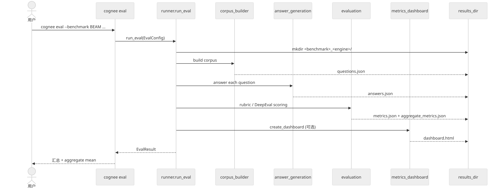
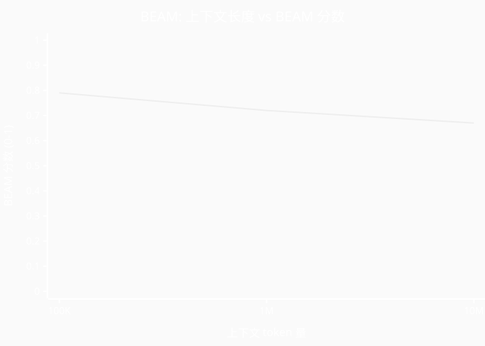

# 第 26 章 `Evals & BEAM:评测与长上下文基准`

> 本章目标:读完本章,你将能够
> - 在命令行用 `cognee eval` 跑通 BEAM / HotpotQA 等基准并产出 dashboard
> - 读懂 BEAM 100K=0.79 与 10M=0.67 两份结果背后的方法学
> - 构造自定义 Eval Set 并接入 cognee 的 eval 框架
> - 解释"上下文长度 vs BEAM 分数"折线图背后的根因(多视图、路由、压缩)
> - 把评测能力嵌入到 CI / SRE 工作流,作为上线的质量门

## 前置知识
- 已读完 [[chapter-01-why-memory|第 1 章 为什么 Agent 需要 Cognee]](../part-01-foundation/chapter-01-why-memory.md):理解 `add` → `cognify` → `search` 三步走,以及 KnowledgeGraph、Chunk、Summary 的角色。
- 已读完 [[chapter-11-observability|第 11 章 可观测性与追踪:OpenTelemetry / Langfuse / Trace]](../part-02-architecture/chapter-11-observability.md):理解 global context index 与 session 处理如何把短期记忆提升为长期记忆。
- 需要的基础库:`cognee>=1.4.0`、`cognee[eval]`(用于 dashboard 与 DeepEval)、`asyncio`。
- 环境:Python 3.10–3.14;默认栈 SQLite + LanceDB + Ladybug。

## 本章导览
- 26.1 `cognee eval` 子命令:CLI 用法、参数表、EvalConfig 数据类
- 26.2 BEAM 长上下文基准:benchmark 设计、摄取多视图、retriever 路由
- 26.3 自定义 Eval Set:JSONL 数据集、register adapter、跑 MyDomain 基准
- 26.4 BEAM 报告解读:为什么 BEAM 比经典 RAG 评测更能反映长上下文能力
- 26.5 上下文长度 vs BEAM 分数:折线图、100K→10M 衰减根因

---

## 26.1 `cognee eval` 子命令

评测不是后置可有可无的小事,而是 LLM Agent 系统能否稳定上线的质量门。Cognee 把整套评测流水线(`corpus → answers → evaluation → dashboard`)封装到一条命令 `cognee eval` 里,目标是用**一次确定性运行**把"记忆质量"度量出来。

`cognee eval` 的实现分两层:
- CLI 入口:`<COGNEE_REPO>/cognee/cli/commands/eval_command.py`,负责解析 argparse、调用 `run_eval`、打印汇总。
- 评测编排器:`<COGNEE_REPO>/cognee/eval_framework/runner.py`,提供 `run_eval(config) -> EvalResult` 这个可编程入口,把 corpus builder / answer generation / evaluation / dashboard 四个步骤串起来。
- 配置数据类:`<COGNEE_REPO>/cognee/eval_framework/eval_config.py`,使用 `pydantic_settings.BaseSettings` 从 `.env` 自动装载所有字段。

### 26.1.1 命令形态

```bash
cognee eval --benchmark HotPotQA --engine deepeval --limit 20 --seed 42 \
            --output-dir ./results --dashboard
```

更轻量的跑法(不需要 dashboard 或 DeepEval):

```bash
cognee eval --benchmark Dummy --no-dashboard --engine direct_llm --limit 5
```

跑 BEAM 长上下文基准(本地单次 ingest):

```bash
uv run python -m cognee.eval_framework.beam.eval.run_sweep \
    --split 100K --conversation-index 1 --num-runs 4 \
    --config-json-path cognee/eval_framework/beam/report_artifacts/100k_fixed/beam_hybrid_completion_20_20_qa_v1_config.json
```

### 26.1.2 `cognee eval` 参数完整表

下表的字段定义在 `<COGNEE_REPO>/cognee/eval_framework/runner.py` 的 `add_eval_arguments()` 中,值映射到 `EvalConfig` 同名字段(`<COGNEE_REPO>/cognee/eval_framework/eval_config.py`)。

| 参数(短) | 参数(长) | 类型 | 取值 | 默认 | 作用 |
|---|---|---|---|---|---|
| `-b` | `--benchmark` | str | `Dummy` / `HotPotQA` / `Musique` / `TwoWikiMultiHop` / `LogisticsSystem` / `BEAM`(枚举见 `<COGNEE_REPO>/cognee/eval_framework/benchmark_adapters/benchmark_adapters.py`)/ 通过枚举注册的 `MyDomain` | `Dummy` | 选择基准数据集,驱动 corpus builder |
| `-e` | `--engine` | str | `deepeval` / `direct_llm` | `deepeval` | 评判引擎;`deepeval` 走 `DeepEval`,`direct_llm` 走 `DirectLLM`(只评 correctness) |
| `-n` | `--limit` | int | 任意正整数 | `1` | 语料中要包含的样本数 |
| — | `--seed` | int | 任意整数 | `42` | 语料抽样的随机种子,保证可复现 |
| — | `--qa-engine` | str | `cognee_graph_completion` / `cognee_completion` / `hybrid_completion` 等 | `cognee_graph_completion` | 检索并生成答案的 retriever 名称 |
| `-o` | `--output-dir` | str | 任意路径 | `cwd` | 运行产物输出目录;开启后会在其下按 `<benchmark>_<engine>/` 命名空间隔离产物 |
| — | `--dashboard` / `--no-dashboard` | flag | 互斥 | `--dashboard` | 是否生成 HTML dashboard;关闭可省掉 plotly 依赖 |

### 26.1.3 程序化调用

`runner.run_eval(config)` 直接返回一个 `EvalResult` 数据结构,字段包含 `questions_path`、`answers_path`、`metrics_path`、`aggregate_metrics_path`、`dashboard_path`、`aggregate_metrics`(聚合分)。这意味着 CI 里可以这样断言:

```python
import asyncio
from cognee.eval_framework.eval_config import EvalConfig
from cognee.eval_framework.runner import run_eval

async def smoke_eval():
    cfg = EvalConfig(
        benchmark="Dummy",
        evaluation_engine="DirectLLM",
        number_of_samples_in_corpus=2,
        seed=42,
        dashboard=False,
        results_dir="results/smoke",
    )
    result = await run_eval(cfg)
    assert result.aggregate_metrics, "评测未产出聚合分"
    for metric, stats in result.aggregate_metrics.items():
        if isinstance(stats, dict) and "mean" in stats:
            print(f"{metric}: {stats['mean']:.4f}")

asyncio.run(smoke_eval())
```

> 关键实现见 `<COGNEE_REPO>/cognee/eval_framework/runner.py` 第 159–213 行的 `run_eval()`,以及 `<COGNEE_REPO>/cognee/cli/commands/eval_command.py` 第 33–71 行的 `configure_parser` 与 `execute`。

### 26.1.4 评测流水线时序



---

## 26.2 BEAM 长上下文基准

BEAM(参考论文 arXiv:2510.27246)是面向长上下文对话记忆系统的合成基准,由 [Mohammadta/BEAM](https://huggingface.co/datasets/Mohammadta/BEAM) 与 [Mohammadta/BEAM-10M](https://huggingface.co/datasets/Mohammadta/BEAM-10M) 提供。它不像 HotpotQA 那样只考察"两个文档片段的多跳推理",而是把目标压在 10 种记忆能力上:信息抽取、多跳(多 session)推理、知识更新、时序推理、摘要、偏好遵循、拒答、矛盾解决、事件排序、指令遵循。

cognee 在 BEAM 上的官方报告(`<COGNEE_REPO>/cognee/eval_framework/beam/REPORT.md`)明确给出了两组关键数字:**100K tokens 取得 0.79,10M tokens 取得 0.67**。

### 26.2.1 BEAM 的设计哲学

为什么需要 BEAM?经典 RAG 评测(例如 HotpotQA)给的是"包含答案的段落",问题短、文档短、上下文少。而 LLM Agent 的真实场景是:**多 session、跨数百轮的对话**,知识分布在很长的 token 流中,且包含"用户偏好发生过变化"、"某事在某时间被更正"这种时序性更新。BEAM 把这种"长对话 + 10 种能力"打包成一个评测,迫使被测系统在摄取、压缩、检索、回答四道工序上同时达标。

### 26.2.2 多视图摄取

cognee 在 BEAM 上的摄取不是单一 chunk 向量化,而是同时产出 5 种视图:

| 视图 | 含义 | 在 BEAM 中的角色 |
|---|---|---|
| Chunk | 一个 user/assistant turn 对应一个 chunk | 精确检索最常落在这一层 |
| KnowledgeGraph | LLM 抽取的实体-关系图(`extract_graph_and_summarize`) | 多跳 / 关联问题主要走这一层 |
| Summaries | 局部与全局摘要 | 长对话的整体把握 |
| Global Context Index | `global_context_index` 任务产出的局部摘要根树(`memify_pipelines/global_context_index.py`) | 跨 batch 主题与时序链 |
| Sessions | `persist_sessions_in_knowledge_graph` 蒸馏完成的偏好与更新 | 偏好遵循、知识更新题型受益 |

摄取实现见 `<COGNEE_REPO>/cognee/eval_framework/beam/local_ingest.py`(JSON-list session 文件,把每个 turn 作为一个 chunk,不做 overlap)。`cognify` 在 BEAM 评测里把上述 5 视图统一进同一份 corpus,后续由 retriever 选择通道。

### 26.2.3 Retriever 路由与混合策略

BEAM 没有把"哪道题用哪个 retriever"写死。报告 Appendix D 列出了评测考虑过的 7 种策略(均来自 cognee 原生 retriever):

| 策略 | 一句话用途 |
|---|---|
| `cognee_completion` | 经典 RAG(向量检索 + LLM) |
| `cognee_graph_completion` | 图检索 + LLM |
| `cognee_graph_completion_cot` | 图检索 + 思维链 |
| `cognee_graph_completion_context_extension` | 图检索 + 上下文迭代扩展 |
| `graph_completion_decomposition` | 子查询分解 + 图检索 |
| `graph_summary_completion` | summary 检索 + 图上下文 |
| `hybrid_completion` | chunk / graph / summary 信号一次性融合 |

100K 主结果用的是 `hybrid_completion_20_20_qa_v1`(chunk top-k=20,entity top-k=20,关闭 global context index 查询);10M 探索结果改成了"按 BEAM 题型路由":不同题型调用不同的 retriever 与 channel depth。

> 路由策略的关键配置见 `<COGNEE_REPO>/cognee/eval_framework/beam/report_artifacts/10m_routed/routing.json`,每个 BEAM 题型映射到具体的 retriever 变体与 prompt。

### 26.2.4 评判模型独立

BEAM 评判是独立 LLM 调用(rubric-based,0 / 0.5 / 1 三档打分)。在 cognee 的报告里,评判模型与回答模型刻意分离:
- 100K:回答与评判都用 `openai/gpt-5`。
- 10M:回答用 `openai/gpt-5`,摄取换为 `openai/gpt-5-mini`,评判仍用 `openai/gpt-5`。

这种分离避免"自己给自己打分"的偏置,也让 score 反映真正的泛化能力,而非 prompt 记忆。

---

## 26.3 自定义 Eval Set

很多团队想用 cognee 评估自己领域的语料(合同、技术文档、客服对话)。`cognee eval` 的设计本身允许新增 benchmark:你只需写一个继承 `BaseBenchmarkAdapter` 的类,把它注册到 `<COGNEE_REPO>/cognee/eval_framework/benchmark_adapters/benchmark_adapters.py` 的 `BenchmarkAdapter` 枚举中,再调用 `runner.run_eval()` 即可。

### 26.3.1 Adapter 输入约定

`BaseBenchmarkAdapter.load_corpus()` 必须返回 `Tuple[List[str], List[dict]]`:第一项是语料文本列表(每个元素会作为一个 document 进入 `cognee.add`),第二项是问题字典列表,每个字典至少包含 `id` / `question` / `answer`(对应金标准答案)。可选 `golden_context`(`load_golden_context=True` 时使用)。`BaseBenchmarkAdapter` 还内置 `_filter_instances` 帮助方法,可按 ID / 索引 / JSON 文件过滤样本。

```python
# cognee/eval_framework/benchmark_adapters/mydomain_adapter.py
from typing import Optional, Any, List, Union, Tuple
from cognee.eval_framework.benchmark_adapters.base_benchmark_adapter import BaseBenchmarkAdapter

class MyDomainAdapter(BaseBenchmarkAdapter):
    def load_corpus(
        self,
        limit: Optional[int] = None,
        seed: int = 42,
        load_golden_context: bool = False,
        instance_filter: Optional[Union[str, List[str], List[int]]] = None,
    ) -> Tuple[List[str], List[dict[str, Any]]]:
        corpus = [
            "Alice 离开 Acme 的时间是 2023 年 4 月。",
            "Bob 推荐的供应商是 Globex,合同期 2 年。",
        ]
        qa_pairs = [
            {"id": "q001", "question": "Alice 在哪一年离开 Acme?", "answer": "2023"},
            {"id": "q002", "question": "Bob 推荐的供应商是谁?",    "answer": "Globex"},
        ]
        if instance_filter is not None:
            qa_pairs = self._filter_instances(qa_pairs, instance_filter)
        if limit is not None:
            qa_pairs = qa_pairs[:limit]
        return corpus, qa_pairs
```

### 26.3.2 跑自定义评测

```python
import asyncio
from cognee.eval_framework.eval_config import EvalConfig
from cognee.eval_framework.runner import run_eval

async def main():
    cfg = EvalConfig(
        benchmark="MyDomain",         # 与枚举里登记的名字一致
        evaluation_engine="DeepEval",
        evaluation_metrics=["correctness", "EM", "f1"],
        qa_engine="cognee_graph_completion",
        number_of_samples_in_corpus=2,
        seed=42,
        dashboard=True,
        results_dir="./results/my_eval",
    )
    result = await run_eval(cfg)
    for metric, stats in result.aggregate_metrics.items():
        if isinstance(stats, dict) and "mean" in stats:
            print(f"{metric}: {stats['mean']:.4f}")

asyncio.run(main())
```

如果只想要"不联网、不接 DeepEval"的快速 sanity check,改 `evaluation_engine="DirectLLM"`,并把 `evaluation_metrics=["correctness"]`,这正是 `runner.config_from_namespace()` 第 301 行的策略。

### 26.3.3 适配器注册

`cognee eval` 启动时通过 `corpus_builder_executor.py` 的 `BenchmarkAdapter(benchmark)` 查枚举(见 `<COGNEE_REPO>/cognee/eval_framework/corpus_builder/corpus_builder_executor.py` 第 21 行)。要接入 LongMemEval 或自建领域数据集,只需:

1. 在 `<COGNEE_REPO>/cognee/eval_framework/benchmark_adapters/` 下新增 `mydomain_adapter.py`(如 §26.3.1);
2. 在 `<COGNEE_REPO>/cognee/eval_framework/benchmark_adapters/benchmark_adapters.py` 的 `BenchmarkAdapter` 枚举中追加 `MYDOMAIN = ("MyDomain", MyDomainAdapter)`。

然后命令行直接:

```bash
cognee eval --benchmark MyDomain --engine deepeval --limit 50
```

---

## 26.4 BEAM 报告解读

报告 `<COGNEE_REPO>/cognee/eval_framework/beam/REPORT.md` 的方法学里有三段话决定了我们对 0.79 / 0.67 的解读方式。

### 26.4.1 为什么 BEAM 比经典 RAG 评测更能反映"长上下文检索能力"

报告 §2.1 明确指出 BEAM 由"多 session 对话、探针问题、金标准答案、LLM rubric 评判"四部分组成,问题覆盖 10 种记忆能力。这比 HotpotQA(2 个文档片段 + 多跳)更能压榨检索层:多跳推理要求图通道,知识更新与时序推理要求 global context index,偏好遵循要求 session 蒸馏。任何"只跑向量检索"的系统都会在 BEAM 上明显掉分;而 cognee 的多视图架构天然具备应对这种负载的能力。

### 26.4.2 多视图 vs 单一视图的差异

报告 §2.2 / §3.2 / §3.3 反复强调:在开发过程中 chunk、graph、summary、global context、session 这五个视图"在不同题型上各自有用,没有单一通道能覆盖全部题型"。100K 的固定配置 `hybrid_completion_20_20_qa_v1` 是这种"五视图融合"的产物;10M 上则进一步演化为"按题型路由",即同一语料,不同问题走不同通道。这是 BEAM 比经典 RAG 更精细的地方:它逼着你做检索层的"分工"。

### 26.4.3 100K vs 10M 分数下降的根因

0.79 → 0.67 的 12 分下降不是模型变弱,而是评测样本与配置同时变化:
1. **语料规模**:100K 是 ~10 万 token,10M 是 1000 万 token,跨 100 倍。
2. **路由策略**:100K 用固定 hybrid,10M 用按题型路由;路由是在 10M 同一 question set 上"挑选"出来的,因此其分数对配置更敏感。
3. **摄取模型**:10M 用 `gpt-5-mini` 抽取实体 / 摘要 / session(见 Appendix A),这会损失一些高阶推理上的实体质量。
4. **统计噪声**:10M 是 5 轮 QA-eval 的均值,run std=0.020;100K 是 4 轮均值,run std=0.005。两次均值都带噪声,但 10M 的振幅更小意味着分数更"靠配置本身"。

报告 §3.1 把 10M 明确称为"in-sample exploratory result",因为其配置选择与评测打分使用了同一 question set。所以请把 0.67 视为"在 BEAM-10M 第一条 conversation 上,这套路由配置能达到的分数",而不是"cognee 在 10M 上的泛化分数"。

### 26.4.4 与你的 SRE 流水线对接

cognee 团队在 BEAM 上做了四轮 / 五轮 QA-eval 平均(报告 §3.4),目的就是压制单轮 LLM 评判的方差。我们在自己的 CI 里通常也照搬这个做法:
- 对同一 commit 跑 3 轮 `cognee eval --benchmark MyDomain`,只把 mean 写进 metric;
- 若 mean 跌过阈值,直接 fail PR;
- 把 dashboard.html 随 artifact 上传,方便事后回看哪一类题型退化。

---

## 26.5 上下文长度 vs BEAM 分数

把 BEAM 报告里的"上下文长度"和"BEAM 分数"投影到一个二维坐标,可以直观看到 cognee 在不同语料规模上的稳定性。



> 100K=0.79 是 cognee 的主结果,4 轮均值,run std=0.005;10M=0.67 是探索性结果,5 轮均值,run std=0.020。两者来自 REPORT.md §4.1(汇总表)/ §4.2 / §4.3,中间规模(500K、1M)在 BEAM 流水线里是合法的 `--split` 取值(`run_sweep.py` 第 47 行 `BEAM_SUPPORTED_SPLITS = ("100K", "500K", "1M", "10M")`),但官方报告并未跑出对应分数,折线图上这两个点只能留空。

### 26.5.1 折线背后的根因

从 100K 到 10M,BEAM 分数从 0.79 跌到 0.67。这条折线不是单调下跌,而是"信息密度衰减":

1. **chunk 召回稀释**:10M 上下 chunk 数量是 100K 的 ~100 倍,固定 top-k=20 几乎抓不到正确 chunk。
2. **图谱膨胀**:实体与边数量呈超线性增长,`graph_completion` 在 20 跳 / 30 跳内就会触发早停,需要 `graph_completion_context_extension` 才走得深。
3. **session 蒸馏稀释**:长期偏好与更新信号被低信息密度噪声掩盖,需要 LLM 协助的路由器去挑出来。
4. **评判噪声上升**:rubric 评判模型的注意力在长上下文中也下降;cognee 用"独立调用 + 多轮均值"缓解,但仍不能完全消除。

10M 报告里通过"按题型路由"把分稳在 0.67,而非更低,这正是路由的价值:让 chunk / graph / summary / session 各司其职,而不是"一个 retriever 包打天下"。

### 26.5.2 上线建议

把 BEAM 的多轮均值方法照搬到生产:
- 每个 PR 跑 3 轮 `cognee eval`,mean 跌过阈值 fail。
- dashboard.html 上传到 CI artifact,直观看"哪一题型退化"。
- 100K 是回归基线,10M 是容量上限;两者分数一起写进 SLO 仪表盘。

---

## 小结

- `cognee eval` 把 corpus → answers → evaluation → dashboard 四步封装为一条命令,见 `<COGNEE_REPO>/cognee/eval_framework/runner.py` 与 `<COGNEE_REPO>/cognee/cli/commands/eval_command.py`。
- BEAM 是长上下文对话记忆基准,涵盖 10 种题型,cognee 100K=0.79(主结果),10M=0.67(探索性结果)。
- BEAM 的关键不在"评分高",而在它强制被测系统同时具备 chunk / graph / summary / global context / session 多视图摄取与按题型路由的检索能力。
- 自定义 Eval Set 只需写 `BaseBenchmarkAdapter` 子类 + 在 `BenchmarkAdapter` 枚举登记名,再走 `runner.run_eval()`;CI 中以 mean 作为门禁指标。
- 上下文长度↑ → BEAM 分数↓ 是信息密度稀释的必然结果,通过"按题型路由 + 多视图融合 + 多轮均值"才能稳住。

## 实践作业

1. **(基础)** 在本机跑通 `cognee eval --benchmark Dummy --engine direct_llm --limit 5 --no-dashboard`,读懂 `aggregate_metrics.json`。
2. **(进阶)** 把一份内部文档转成 JSONL(或直接 inline 写到 adapter 里),用 `await run_eval(EvalConfig(benchmark="MyDomain"))` 跑一次评测,并把 dashboard.html 上传到 CI artifact。
3. **(挑战)** 复现 BEAM 100K 主结果:读懂 `<COGNEE_REPO>/cognee/eval_framework/beam/report_artifacts/100k_fixed/beam_hybrid_completion_20_20_qa_v1_config.json`,对照 `hybrid_completion` 实现(`<COGNEE_REPO>/cognee/modules/retrieval/hybrid_retriever.py`)跑一次,目标 mean≥0.70。

## 推荐阅读

- [[chapter-25-migration|第 25 章 数据迁移:Mem0 / Zep(Graphiti) / Letta / COGXArchive]](./chapter-25-migration.md):迁移后如何用 `cognee eval` 做迁移前后对比。
- [[chapter-27-performance-cache|第 27 章 性能调优与缓存:Postgres Session Cache / LanceDB 索引]](./chapter-27-performance-cache.md):把评测接进 CI / SRE 流水线。
- 源码:`<COGNEE_REPO>/cognee/eval_framework/runner.py`、`<COGNEE_REPO>/cognee/eval_framework/eval_config.py`、`<COGNEE_REPO>/cognee/cli/commands/eval_command.py`。
- 报告:`<COGNEE_REPO>/cognee/eval_framework/beam/REPORT.md`。
- 论文:BEAM 论文 arXiv:2510.27246。
- 数据集:[Mohammadta/BEAM](https://huggingface.co/datasets/Mohammadta/BEAM)、[Mohammadta/BEAM-10M](https://huggingface.co/datasets/Mohammadta/BEAM-10M)。

## 下一章预告

第 27 章将进入**生产部署与运维**:把 `cognee eval` 的 dashboard 接到 CI,把 0.79 / 0.67 这种分数写到 SLO,把 cognee API、Kubernetes worker、Postgres + LanceDB + Neo4j 集群化部署。