# 第 27 章 `Performance & Cache: 性能调优与缓存`

> 本章目标:读完本章,你将能够
> - 用基准测试区分 Cold Start、Warm Start 与 LLM 生成延迟
> - 调整 pipeline、Embedding、图数据库和向量数据库的并行与缓存策略
> - 用单一 Postgres 实例减少跨存储跳转,把纯检索延迟压到 100–500 ms 区间

## 前置知识

- 已读完 [[chapter-10-storage-backends|第 10 章 存储后端:SQLite / LanceDB / Ladybug 与 Postgres 全栈]](../part-02-architecture/chapter-10-storage-backends.md)
- 已读完 [[chapter-12-graph-governance|第 12 章 大图治理:Sync / Migrations / Truth Subspace / Prune]](../part-02-architecture/chapter-12-graph-governance.md)
- 需要的基础库:`cognee>=1.4.0`、`asyncio`;环境为 Python 3.10–3.14

## 本章导览

- 27.1:把 session cache、关系数据、图和向量放进同一 Postgres
- 27.2–27.4:控制 pipeline 并行度,理解 LanceDB 与图查询的缓存边界
- 27.5–27.7:用增量同步、预热和 Embedding 批处理稳定百毫秒级检索

---

## 27.1 SESSION_POSTGRES_CACHE_PLAN

为什么先优化存储跳转?一次 Agent 回忆可能依次访问 session cache、关系库、图数据库和向量库。
当它们分散在 Redis、SQLite、Ladybug 与 LanceDB 中时,连接建立、IPC、网络往返和数据拼装会叠加。
`<COGNEE_REPO>/SESSION_POSTGRES_CACHE_PLAN.md` 的核心就是为 session cache 增加
Postgres 后端;结合 Postgres graph 与 PGVector,最终让四类数据共享一个 Postgres 实例。

该设计已经演化为通用 `SqlCacheAdapter`:默认 cache 是 SQLite,生产环境可切换为 Postgres。
`<COGNEE_REPO>/cognee/infrastructure/databases/cache/sql/SqlCacheAdapter.py` 使用连接池、
`FOR UPDATE`、滑动 TTL 和 Postgres advisory lock;
`<COGNEE_REPO>/cognee/infrastructure/databases/cache/sql/tables.py` 则定义了带 session、过期时间
索引的 `cache_qa_entries`、`cache_trace_entries`、`cache_session_context`、usage log 与 KV 表。

```bash
DB_PROVIDER=postgres
VECTOR_DB_PROVIDER=pgvector
GRAPH_DATABASE_PROVIDER=postgres
CACHE_BACKEND=postgres

DB_HOST=localhost
DB_PORT=5432
DB_USERNAME=cognee
DB_PASSWORD=cognee
DB_NAME=cognee_db
```

`<COGNEE_REPO>/cognee/infrastructure/databases/cache/get_cache_engine.py` 会在未设置
`CACHE_DB_URL` 时复用关系库的 `DB_*` 配置。这样做减少的是跨服务往返,不是自动把所有操作合并为一个事务;
仍需分别观察 cache、graph 与 vector 的慢查询。

实际的收益有两个层次。第一层是连接层:cache adapter、graph adapter 与 PGVector adapter 都能复用
Postgres 连接池,避免请求路径反复握手。第二层是数据层:session 的 QA、trace 和 context 行按
`(user_id, session_id, seq)` 排序,读最新记录时能走索引;`expires_at` 在读取时过滤,写入时刷新,
因此 TTL 清理不会阻塞热路径。Postgres 的 JSONB 仍保留完整 payload,便于排查命中内容,但生产压测要
特别关注 context 过大造成的网络和反序列化成本。

切换时不要把“同一实例”误解成“同一套表”。关系 metadata、graph、vector 和 cache 仍由各自 adapter
负责;切换后应先做一次 schema 初始化,再分别测 `CHUNKS`、`GRAPH_COMPLETION` 与 session recall。
如果旧 cache 中有敏感会话,不要直接复用生产库,应设置独立 schema 或独立数据库并配置最小权限。



---

## 27.2 pipeline 并行度

为什么不能把并行度直接拉满?Cognee pipeline 同时消耗 LLM 配额、内存、文件句柄和数据库写锁。
默认 Ladybug 与 LanceDB 还会运行在 subprocess 模式;配置定义分别位于
`<COGNEE_REPO>/cognee/infrastructure/databases/graph/config.py` 与
`<COGNEE_REPO>/cognee/infrastructure/databases/vector/config.py`,两者的 subprocess 默认值均为
`True`。并发过高会把等待从应用层推到 IPC、限流器或文件锁。

需要先纠正一个配置名:在本书基线源码中不存在 `task_concurrency` 环境变量,设置它不会改变执行器。
真实控制点如下:

- `data_per_batch`:每个 dataset 同时处理的数据项数,默认 20;
  `<COGNEE_REPO>/cognee/modules/pipelines/operations/run_tasks.py` 用
  `asyncio.Semaphore(data_per_batch)` 实现有界并发。
- `chunks_per_batch`:相邻 Task 之间传递的片段批量;默认 cognify pipeline 在未配置时取 100。
- `DATABASE_MAX_LRU_CACHE_SIZE`:图、向量和关系引擎实例上限,默认 6;subprocess 模式下也限制子进程数。
- `DATASET_QUEUE_MAX_CONCURRENT`:并发 dataset 槽位,默认跟随上一个值。

把“任务并行度”写成部署参数时可称为 `task_concurrency`,但必须映射到上述真实参数。文件型默认栈先从
`data_per_batch=2~4` 开始;Postgres 后端可从 4~8 开始,每次翻倍后比较 p95、429 比例与 RSS,不要只看吞吐。

还要区分 dataset 并发与同一 dataset 内的 item 并发。`<COGNEE_REPO>/cognee/modules/pipelines/operations/pipeline.py`
的 `run_pipeline` 对**同一调用内的多个 dataset 是顺序执行**(`for dataset in authorized_datasets:`),
对**同一 dataset 的多次外部调用**用进程级 `asyncio.Lock` 串行化(`_dataset_locks` + `_get_dataset_lock`);
`DATASET_QUEUE_MAX_CONCURRENT` 控制的是多次 `cognee.add` / `cognee.cognify` 跨进程入口的并发上限,
不加快单次 run_pipeline 对单 dataset 的写入。把队列上限调大,不会让同一数据集的写入线性加速,
但能并行消化不同 dataset。一个实用的上限估算是:可用 CPU 核数、Embedding 服务并发上限、
数据库连接池可用连接数三者的最小值,再为 API 请求保留余量。例如四核机器、
Embedding 供应商允许 8 个请求、数据库池有 10 个连接时,不要直接设置 10 个 pipeline;
先以 2 或 4 个 item 做基线,确认图写入没有排队后再增加。

---

## 27.3 LanceDB 索引参数

为什么索引不是越早建越好?小表的精确扫描没有训练和维护成本;大表才会从近似最近邻索引获益。
`<COGNEE_REPO>/cognee/infrastructure/databases/vector/lancedb/LanceDBAdapter.py` 当前只创建表、
批量 upsert 并调用 `vector_search`,没有调用 `create_index`,也没有暴露 `index_cache_size` 或
`max_compaction_bytes`。因此把这两个名字写进 `.env` 同样不会生效。

如果通过 LanceDB SDK 或自定义 Adapter 补建索引,选型原则是:

| 负载 | 选择 | 原因 |
|---|---|---|
| 小表或持续变化的开发集 | Flat scan | 零训练成本,结果精确 |
| 大型、较稳定、内存敏感 | IVF / IVF-PQ | 用分区和量化换取更低内存 |
| 高 QPS、重视低延迟与召回 | HNSW / HNSW-SQ | 图式导航快,但占用更多内存 |

`index_cache_size` 应按“热索引数量”而非总 collection 数设置;
`max_compaction_bytes` 应受维护窗口 I/O 预算约束。当前推荐值是保留 LanceDB SDK 默认值,先记录
recall@k、p95 与 RSS,再在自定义适配层显式调节。索引建成后还要做增量索引或离峰 compaction,否则新写入
fragment 与过多小文件会逐步拉高延迟。

上线索引前先固定一份检索集,包含常见问题、长尾问题和没有答案的问题。分别比较精确扫描与 ANN 的
recall@10,因为 IVF/HNSW 降低的是搜索成本,不是 Embedding 或图遍历成本。若索引训练数据只覆盖旧语料,
增量数据可能出现召回下降;这时应定期重训或保留精确扫描作为回退。索引参数也要跟 `top_k` 一起测,
只测 top-1 往往掩盖 top-15 的延迟和召回变化。

---

## 27.4 Kuzu / Neo4j 查询缓存

为什么重复 Cypher 仍可能慢?缓存命中要求查询文本稳定、参数分离,并且连接不能每次重建。
`<COGNEE_REPO>/cognee/infrastructure/databases/graph/kuzu/adapter.py` 目前只是 Ladybug 的兼容导入;
真实执行路径在
`<COGNEE_REPO>/cognee/infrastructure/databases/graph/ladybug/adapter.py`。
它复用持久 `Connection`,把阻塞查询放入 `ThreadPoolExecutor`,并执行
`connection.execute(query, params)`,但没有 Python 层 prepared statement cache 开关。

因此 Ladybug/Kuzu 的优化顺序是:保持参数化查询、避免动态拼接不同文本、复用 Adapter、合理设置
`KUZU_NUM_THREADS` 与 buffer pool。开启 shared lock 时每次查询还会获取跨进程锁并重建原生资源,它解决一致性,
不是低延迟方案。若图查询仍是瓶颈,先把 `LIMIT`、起始节点和关系类型下推到 Cypher,避免把整张图读到
Python 再过滤;同时用固定 query shape 做一组冷、热查询对照。

Neo4j 的路径是
`<COGNEE_REPO>/cognee/infrastructure/databases/graph/neo4j_driver/adapter.py`。
`AsyncGraphDatabase.driver` 自带连接池,Adapter 为每次查询借用一个 session,并设置
`max_connection_lifetime=120` 与 `keep_alive=True`。不要按请求创建 Adapter;保持 Cypher 文本一致并通过
`params` 传值,才能稳定利用 Neo4j 服务端查询计划缓存。当前 Cognee 未暴露 pool size 和显式 prepared
statement cache,需要这两个旋钮时应扩展 Adapter,而不是添加无效环境变量。

---

## 27.5 增量同步

为什么多副本不应反复全量认知化?`<COGNEE_REPO>/cognee/api/v1/sync/sync.py` 先比较本地与
Cognee Cloud 的 content hash,只上传或下载缺失文件;仅在发现变化时触发远端或本地 `cognify`。
`<COGNEE_REPO>/cognee/modules/sync/models/SyncOperation.py` 把 `run_id`、进度、字节数和每个
Dataset 的 hash 记录到关系库,便于另一副本读取状态。

这是一种文件级增量同步,不是 Postgres graph/PGVector 的数据库复制。它适合多副本共享任务状态与减少重复传输,
但实际工作由进程内 `asyncio.create_task` 承担;Pod 退出后任务不会自动迁移。生产环境应把执行放进共享队列,
并用数据库唯一约束或分布式锁防止两个副本同时启动同一用户的 sync。

在应用层调用时,把 sync 当作长任务而不是请求内事务:立即返回 `run_id`,由 worker 负责上传、下载、触发
cognify,状态页只读取 `SyncOperation`。文件 hash 是幂等边界,但图和向量写入仍可能在认知化阶段产生新版本;
因此副本切换后应等待该 run 到 `completed`,再把流量切到新副本。对于只读副本,优先同步原始文件与 hash,
让一个受控 worker 执行 cognify,避免多个副本同时调用 LLM。

---

## 27.6 Cold Start vs Warm Start

为什么“第一次很慢”不能和稳态 SLO 混在一起?Cold Start 包含首次 `add`、`cognify`、模型加载、子进程启动、
建表和填充 OS page cache,通常是几十秒到几分钟。Warm Start 复用 Embedding 单例、数据库连接与热页;
增量 `add` 可到秒级,不含 LLM 生成的 `CHUNKS`/`SUMMARIES` 检索才适合设 100–500 ms 目标。
`GRAPH_COMPLETION` 包含 LLM,仍可能是秒级。

下面的脚本把一次预热排除在样本外,分别输出 warm p50 与 p95:

```python
import asyncio
import math
import statistics
import time

import cognee
from cognee import SearchType


async def main():
    dataset = "performance_demo"
    started = time.perf_counter()
    await cognee.add(
        ["Cognee 将文本转换为图与向量记忆。"],
        dataset_name=dataset,
        data_per_batch=2,
    )
    await cognee.cognify(
        datasets=[dataset],
        data_per_batch=2,
        chunks_per_batch=32,
    )
    print(f"cold ingest+cognify: {time.perf_counter() - started:.2f}s")

    await cognee.search("Cognee 转换什么?", SearchType.CHUNKS, datasets=[dataset])
    samples = []
    for _ in range(20):
        started = time.perf_counter()
        await cognee.search("Cognee 转换什么?", SearchType.CHUNKS, datasets=[dataset])
        samples.append((time.perf_counter() - started) * 1000)

    ordered = sorted(samples)
    p95 = ordered[math.ceil(len(ordered) * 0.95) - 1]
    print(f"warm p50={statistics.median(samples):.1f}ms, p95={p95:.1f}ms")


asyncio.run(main())
```

部署时至少按 query type、dataset、cold/warm 和结果数分桶;只报平均值会掩盖连接重建和 compaction 引起的长尾。

---

## 27.7 Embedding 批处理

为什么 Embedding 批处理通常是 ingest 最先见效的优化?网络调用固定开销高,逐条请求还容易碰到 rate limit。
`<COGNEE_REPO>/cognee/infrastructure/databases/vector/embeddings/LiteLLMEmbeddingEngine.py`
通过 `litellm.aembedding` 发送列表;
`<COGNEE_REPO>/cognee/infrastructure/databases/vector/embeddings/FastembedEmbeddingEngine.py`
则在本地模型中批量生成向量。`EMBEDDING_BATCH_SIZE` 默认 36,而
`<COGNEE_REPO>/cognee/tasks/storage/index_data_points.py` 按该值切批,最多保持 4 个索引批次并发。

不要混淆三个维度:`data_per_batch` 控制文档并发,`chunks_per_batch` 控制 Task 间的片段批量,
`embedding_batch_size` 控制一次向量化的条数。可以先用下面的保守配置压测:

```python
import asyncio

import cognee
from cognee.infrastructure.databases.vector.embeddings.config import EmbeddingConfig


async def main():
    embedding = EmbeddingConfig(embedding_batch_size=36)
    documents = [f"性能样本文档 {index}: Cognee 记忆工程。" for index in range(40)]

    await cognee.add(
        documents,
        dataset_name="batch_demo",
        data_per_batch=4,
        embedding_config=embedding,
    )
    await cognee.cognify(
        datasets=["batch_demo"],
        data_per_batch=4,
        chunks_per_batch=32,
        embedding_config=embedding,
    )


asyncio.run(main())
```

远端 Embedding 从 36 起步,观察 429 与单批字节数;Fastembed 可从 64–128 起步,观察 RSS 与 CPU。
遇到上下文超限时两个引擎都会拆分输入,但这属于恢复路径,不能替代正确的 chunk 大小。

### 关键调优点表

| 参数 | 路径 | 推荐起点 |
|---|---|---|
| `CACHE_BACKEND` | `<COGNEE_REPO>/cognee/infrastructure/databases/cache/config.py` | 生产全 Postgres 栈取 `postgres` |
| `SESSION_TTL_SECONDS` | `<COGNEE_REPO>/cognee/infrastructure/databases/cache/config.py` | `604800`(7 天),按隐私策略缩短 |
| `CACHE_PURGE_INTERVAL_SECONDS` | `<COGNEE_REPO>/cognee/infrastructure/databases/cache/config.py` | `900`;高 churn 再缩短 |
| `data_per_batch` | `<COGNEE_REPO>/cognee/api/v1/add/add.py`、`<COGNEE_REPO>/cognee/api/v1/cognify/cognify.py` | 文件栈 2–4,Postgres 4–8 |
| `chunks_per_batch` | `<COGNEE_REPO>/cognee/api/v1/cognify/cognify.py` | 32 起测;资源充足再接近默认 100 |
| `EMBEDDING_BATCH_SIZE` | `<COGNEE_REPO>/cognee/infrastructure/databases/vector/embeddings/config.py` | 远端 36,Fastembed 64–128 |
| `GRAPH_DATABASE_SUBPROCESS_ENABLED` | `<COGNEE_REPO>/cognee/infrastructure/databases/graph/config.py` | `true`,隔离原生引擎 |
| `VECTOR_DB_SUBPROCESS_ENABLED` | `<COGNEE_REPO>/cognee/infrastructure/databases/vector/config.py` | `true`,隔离 LanceDB |
| `DATABASE_MAX_LRU_CACHE_SIZE` | `<COGNEE_REPO>/cognee/shared/lru_cache.py` | 默认 6,按子进程 RSS 反推 |
| `KUZU_NUM_THREADS` | `<COGNEE_REPO>/cognee/infrastructure/databases/graph/config.py` | `0` 自动;多 worker 时限制到 1–4 |
| `index_cache_size` | `<COGNEE_REPO>/cognee/infrastructure/databases/vector/lancedb/LanceDBAdapter.py` | Cognee 未暴露,先保留 SDK 默认 |
| `max_compaction_bytes` | `<COGNEE_REPO>/cognee/infrastructure/databases/vector/lancedb/LanceDBAdapter.py` | Cognee 未暴露,按离峰 I/O 预算设置 |

---

## 小结

- 百毫秒目标应限定为 Warm Start 的纯检索,不能把 LLM 生成时间混入同一 SLO。
- 单一 Postgres 可承载 session cache、metadata、graph 与 PGVector,减少跨服务往返。
- 本基线没有 `task_concurrency`、LanceDB 索引缓存或 compaction 的直接环境变量,必须调真实入口。
- 并行、批量和缓存都要用 p95、召回率、429 与 RSS 联合验证,而不是追求单一最大值。

## 实践作业

1. **(基础)** 运行 27.6 的脚本,记录 Cold Start、Warm p50 与 p95,并确认 `CHUNKS` 不包含 LLM 生成。
2. **(进阶)** 分别用 `data_per_batch=2/4/8`、`chunks_per_batch=32/64/100` 做矩阵压测,
   输出吞吐、p95、错误率和峰值 RSS。
3. **(挑战)** 将 cache、graph、vector 切到同一 Postgres,对比默认三栈与全 Postgres 的查询次数、
   网络往返和 p95;再设计一个显式调用 LanceDB `create_index` 与离峰 compaction 的自定义 Adapter。

## 推荐阅读

- [[chapter-28-api-server-deploy|第 28 章 API Server:FastAPI / 认证 / 多租户 / Docker / K8s]](./chapter-28-api-server-deploy.md):把本章参数落实到 FastAPI、多租户、Docker 与 K8s。
- 源码:`<COGNEE_REPO>/cognee/modules/pipelines/operations/`
- 设计:`<COGNEE_REPO>/SESSION_POSTGRES_CACHE_PLAN.md`

## 下一章预告

第 28 章将把这些性能参数带入 API Server、认证、多租户、Docker 与 Kubernetes 生产拓扑。
