# 第 28 章 `API Server & Deploy`

> 本章目标:读完本章,你将能够
> - 理解 Cognee FastAPI 的启动、认证和关闭生命周期。
> - 按资源调用 `/api/v1` HTTP/WS API,并管理 API Key。
> - 用 Docker Compose 验证服务,再用共享 Postgres 和 Kubernetes/Helm 扩展。

## 前置知识

- 已读完 [[chapter-24-config-datasets|第 24 章 配置与数据集治理:`cognee.config` / datasets / agents / 权限]](./chapter-24-config-datasets.md)。
- 基础环境:`cognee>=1.4.0`、Python 3.10–3.14、Docker、Postgres、Kubernetes、Helm。

## 本章导览

- 28.1 FastAPI 应用与认证。
- 28.2 路由资源清单。
- 28.3 `serve` 与 API Keys。
- 28.4 Docker 部署。
- 28.5 Kubernetes / Helm。
- 28.6 生产部署拓扑。

---

## 28.1 FastAPI 应用

为什么需要统一的 API Server?团队 Agent 不应各自持有数据库文件、LLM 密钥和用户上下文;服务端应统一做迁移、身份认证、Dataset ACL、任务恢复和资源回收。FastAPI 入口是 `<COGNEE_REPO>/cognee/api/client.py`。

源码按环境决定 debug,并注册 lifespan:

```python
app = FastAPI(debug=app_environment != "prod", lifespan=lifespan)
```

`lifespan` 启动阶段执行 `run_migrations()`;首次数据库不存在时取得关系引擎并 `create_database()`,然后重试迁移。随后调用 `get_default_user()` 初始化默认用户,调用 `recover_stale_cognify_runs_on_startup()` 恢复上次异常退出后遗留的 cognify 运行。关闭时清理图引擎和向量引擎缓存,即 `_create_graph_engine.cache_clear()` 与 `_create_vector_engine.cache_clear()`,使 Ladybug 有机会 checkpoint WAL。完整实现见 `<COGNEE_REPO>/cognee/api/client.py` 第 62–105 行。

生产注意两点。第一,每个 Gunicorn worker/Pod 都可能经过 lifespan,所以迁移必须幂等,扩容时最好使用独立 migration Job 或数据库锁。第二,`CORS_ALLOWED_ORIGINS` 应显式设置为前端域名;不要把 Compose 中的 `*` 直接带入公网。

### 28.1.1 认证与多租户

`get_authenticated_user` 是业务路由的共同依赖。`ENABLE_BACKEND_ACCESS_CONTROL` 是多租户主开关,默认开启;`REQUIRE_AUTHENTICATION` 未设置时继承它。如果多租户开启却设置 `REQUIRE_AUTHENTICATION=false`,源码会告警并强制认证,防止请求落到默认用户而造成数据串租户。逻辑见 `<COGNEE_REPO>/cognee/modules/users/methods/get_authenticated_user.py` 第 13–109 行。

FastAPI Users 提供登录、注册、密码重置和验证;OpenAPI 还声明 `BearerAuth` 与 `X-Api-Key` 两种安全方案。机器到机器调用优先使用 `X-Api-Key`,TLS 应在 Ingress 或反向代理终止。健康检查可从运维机执行:

```python
from urllib.request import Request, urlopen

request = Request("http://localhost:8000/health", headers={"X-Api-Key": "<你的API_KEY>"})
with urlopen(request, timeout=10) as response:
    print(response.status, response.read().decode("utf-8"))
```

当前源码实际前缀是 `/api/v1`,例如 `/api/v1/add`;一些旧文档或网关把 `/api` 去掉而称 `/v1/add`,应以 `/openapi.json` 和代理规则为准。

---

## 28.2 路由资源清单

为什么先看清单?HTTP API 的契约不仅包含 SDK 动作,还包含 method、权限、任务状态和返回格式。以下为当前 `<COGNEE_REPO>/cognee/api/client.py` 的实际挂载路径;`/v1` 是去掉 `/api` 的外部别名,不是应用源码的默认前缀。

| # | 方法与路径 | 说明 |
|---:|---|---|
| 1 | `POST /api/v1/add` | 摄取文本、文件或数据 |
| 2 | `POST /api/v1/cognify` | 认知化,生成图和向量 |
| 3 | `WS /api/v1/cognify/subscribe/{id}` | 订阅 cognify 运行进度 |
| 4 | `GET/POST /api/v1/search` | 搜索历史与图/向量检索 |
| 5 | `GET/POST /api/v1/recall` | 回忆历史与召回结果 |
| 6 | `POST /api/v1/remember` | 内存 API,记忆输入 |
| 7 | `POST /api/v1/remember/entry` | 直接写入 MemoryEntry |
| 8 | `POST /api/v1/improve` | 根据反馈强化记忆 |
| 9 | `POST /api/v1/memify` | 运行记忆化管道 |
| 10 | `POST /api/v1/forget` | 遗忘记忆 |
| 11 | `DELETE /api/v1/delete` | 兼容删除入口 |
| 12 | `PATCH /api/v1/update` | 更新数据或记忆 |
| 13 | `GET/POST /api/v1/datasets` | Dataset 列表与创建 |
| 14 | `DELETE /api/v1/datasets/{id}` | 删除 Dataset |
| 15 | `DELETE /api/v1/datasets/{id}/data/{data_id}` | 删除一个数据项 |
| 16 | `GET /api/v1/datasets/{id}/graph` | Dataset 图节点与关系 |
| 17 | `GET /api/v1/datasets/{id}/data` | 列出数据元信息 |
| 18 | `GET /api/v1/datasets/{id}/data/{data_id}/raw` | 下载原始文件 |
| 19 | `GET /api/v1/datasets/status` | add/cognify 状态 |
| 20 | `GET/PUT /api/v1/datasets/{id}/schema` | 读取/更新 graph schema |
| 21 | `POST/DELETE /api/v1/permissions/datasets/{principal_id}` | 授予/撤销 Dataset ACL |
| 22 | `POST/DELETE /api/v1/permissions/roles...` | 角色创建与删除 |
| 23 | `POST/DELETE /api/v1/permissions/users/{id}/roles` | 角色成员管理 |
| 24 | `POST/DELETE /api/v1/permissions/tenants...` | tenant 创建、选择、成员管理 |
| 25 | `GET /api/v1/permissions/tenants/me` | 当前用户的 tenants |
| 26 | `GET /api/v1/permissions/tenants/{id}/roles` | tenant 角色与成员查询 |
| 27 | `POST /api/v1/auth/login`、`GET /api/v1/auth/me` | 登录与当前用户 |
| 28 | `POST /api/v1/auth/logout` | 注销会话 |
| 29 | `/api/v1/auth/register`、`forgot-password`、`reset-password` | FastAPI Users 用户/密码流程 |
| 30 | `/api/v1/auth/request-verify-token`、`verify` | 邮箱验证流程 |
| 31 | `GET/POST /api/v1/auth/api-keys` | API Key 列表与创建 |
| 32 | `DELETE /api/v1/auth/api-keys/{id}` | 删除 API Key |
| 33 | `GET/PATCH /api/v1/users/{id}`、`/me`、`POST /api/v1/users/get-user-id` | 用户查询 |
| 34 | `/api/v1/users/...configuration...` | 用户配置读写 |
| 35 | `GET/POST /api/v1/settings` | 服务设置 |
| 36 | `POST /api/v1/configuration` | 配置管理 |
| 37 | `GET /api/v1/visualize`、`POST /api/v1/visualize/multi` | 图可视化 |
| 38 | `GET /api/v1/schema/inventory` | Schema inventory |
| 39 | `GET /api/v1/schema/provenance` | memory-provenance HTML 视图 |
| 40 | `POST/GET/DELETE /api/v1/ontologies` | 本体管理 |
| 41 | `POST /api/v1/responses/` | OpenAI Responses 兼容 |
| 42 | `GET/POST/DELETE /api/v1/agents/...` | Agent 与连接管理 |
| 43 | `GET /api/v1/sessions`、`stats`、`cost-by-model` | 会话与成本聚合 |
| 44 | `GET /api/v1/sessions/{session_id}` | 会话详情 |
| 45 | `GET /api/v1/activity/pipeline-runs`、`spans` | pipeline 与 tracing 活动 |
| 46 | `GET /api/v1/activity/users`、`agents`、`export/{id}` | 用户、Agent、Dataset 活动 |
| 47 | `POST/GET /api/v1/skills`、`/skills/{id}` | Skill 摄取、列表、详情 |
| 48 | `GET /api/v1/proposals/{id}` | Skill 改进提案 |
| 49 | `POST /api/v1/sync`、`GET /api/v1/sync/status` | 数据同步 |
| 50 | `POST /api/v1/checks/connection` | Cloud 连接测试 |
| 51 | `GET /health`、`GET /health/detailed` | 健康检查 |

表中 51 项是资源级清单,具体 query/body 以 OpenAPI 为准。跨用户检索时使用 `dataset_id` UUID,不要依赖名称;名称通常只解析到当前用户拥有的 Dataset。`cognify` 的 `run_in_background=true` 会返回运行元数据,可用 WebSocket 或 Dataset status 继续观察。路由工厂的真实入口可查 `<COGNEE_REPO>/cognee/api/v1/cognify/routers/get_cognify_router.py`、`<COGNEE_REPO>/cognee/api/v1/search/routers/get_search_router.py` 和 `<COGNEE_REPO>/cognee/api/v1/datasets/routers/get_datasets_router.py`。

---

## 28.3 `serve` 子命令与 API Keys

为什么用 `serve`?它把远端 URL、认证 header 和客户端状态集中管理。命令实现位于 `<COGNEE_REPO>/cognee/cli/commands/serve_command.py`,协调器位于 `<COGNEE_REPO>/cognee/api/v1/serve/serve.py`。

已有服务可直连,不经过 Auth0:

```bash
cognee-cli serve --url http://localhost:8000 --api-key '<你的API_KEY>'
export COGNEE_SERVICE_URL=https://memory.example.com
export COGNEE_API_KEY='<你的API_KEY>'
cognee-cli serve
cognee-cli serve --logout
```

没有 `--url` 时进入 Cloud 模式:Auth0 Device Code Flow 登录,Management API 发现/创建 tenant,得到 service URL,再获取 API Key。管理端可用 `--management-url` 覆盖,也可设置 `COGNEE_CLOUD_URL`。Cloud 客户端使用 `X-Api-Key`,直连客户端会先访问 `/health`。

```python
import asyncio
import cognee


async def main():
    client = await cognee.serve(url="http://localhost:8000", api_key="<你的API_KEY>")
    print(client.service_url)
    await client.close()


asyncio.run(main())
```

API Key 管理实现在 `<COGNEE_REPO>/cognee/api/v1/api_keys/`;创建时用 `secrets.token_hex(32)`,数据库保存哈希值,原始值只返回一次,每用户默认最多 10 个。Cloud 的 `get_or_create_api_key` 先获取已有 key,没有时创建并重试;随后把 URL、tenant 和 key 缓存到 `~/.cognee/cloud_credentials.json`,文件权限为 `0600`。这是客户端凭证缓存,不是服务端保存明文。管理逻辑见 `<COGNEE_REPO>/cognee/api/v1/serve/management_api.py` 第 117–153 行。

密钥轮换采用“新建、写入 Secret、验证、撤销旧 key”:创建接口是 `POST /api/v1/auth/api-keys`,删除接口是 `DELETE /api/v1/auth/api-keys/{api_key_id}`。不要把 key 写入 URL、Git、镜像层或访问日志。

---

## 28.4 Docker 部署

`<COGNEE_REPO>/Dockerfile` 使用 `uv` 多阶段构建,运行阶段带 `libpq5`、`curl` 和项目虚拟环境。`<COGNEE_REPO>/docker-compose.yml` 默认是单个 API 服务,可按 profile 启动 Postgres、Neo4j、Redis 和 MCP Server;healthcheck 请求 `/health`。

```bash
cp <COGNEE_REPO>/.env.template <COGNEE_REPO>/.env
cd <COGNEE_REPO>
docker compose up --build -d cognee
curl --fail http://localhost:8000/health
```

团队服务不要把默认 SQLite + LanceDB + Ladybug 目录同时挂给多个副本。若使用 Postgres,在 `.env` 或 Secret 设置:

```bash
export DB_PROVIDER=postgres
export VECTOR_DB_PROVIDER=pgvector
export GRAPH_DATABASE_PROVIDER=postgres
export CACHE_BACKEND=postgres
export DB_HOST=postgres DB_PORT=5432 DB_NAME=cognee_db
export DB_USERNAME=cognee DB_PASSWORD='<数据库密码>'
docker compose --profile postgres up --build -d cognee postgres
curl --fail http://localhost:8000/health/detailed
```

项目 `pyproject.toml` 提供 `aws`、`postgres`、`postgres-binary`、`neo4j` 等 extras。当前 Dockerfile 的 `uv sync --extra ...` 是固定列表,不会自动解析 `EXTRAS=aws,postgres,postgres-binary,neo4j`;定制镜像时要显式添加对应 `--extra`。`entrypoint.sh` 会先跑 Alembic,然后以 Gunicorn 加 Uvicorn worker 启动 `cognee.api.client:app`;生产中应移除源码热挂载,用 Secret 注入 LLM 与数据库凭证。

---

## 28.5 Kubernetes / Helm

Helm 示例位于 `<COGNEE_REPO>/deployment/helm/README.md` 和 `<COGNEE_REPO>/deployment/`。README 明确说明 chart 尚未达到生产就绪;当前 API、Postgres 都是单副本,Postgres 使用 PVC。因此它适合作为 Service、Deployment 和 Secret 的起点,不等于高可用方案。

```bash
cd <COGNEE_REPO>
helm upgrade --install cognee deployment/helm \
  --namespace cognee --create-namespace \
  --set cognee.env.LLM_API_KEY='<你的LLM_API_KEY>'
kubectl port-forward svc/cognee-cognee -n cognee 8000:8000
curl --fail http://localhost:8000/health
```

生产扩展需要同时改四件事。第一,把 API Deployment 改为 2–3 副本,Service 后接 TLS Ingress,并增加 `/health` readiness/liveness probe。第二,使用共享或托管 Postgres,明确设置 `DB_PROVIDER=postgres`、`VECTOR_DB_PROVIDER=pgvector`、`GRAPH_DATABASE_PROVIDER=postgres`、`CACHE_BACKEND=postgres`;不要让多个 Pod 写同一个本地 LanceDB/Ladybug 目录。第三,迁移用独立 Job 或数据库锁,不要让每个副本同时首次建库。第四,LLM key、数据库密码和 API Key 全部放 Kubernetes Secret,不写入 `values.yaml`。

还要处理后台任务。`get_cognify_router.py` 的订阅队列在应用进程内初始化;多副本时,创建任务的 Pod 与 WebSocket 连接的 Pod 可能不同。短期可使用 sticky session,更可靠的方案是把 pipeline 事件放到共享队列,由 worker 消费并把状态写入共享数据库。仅增加 `replicas` 不能自动获得分布式 cognify。

---

## 28.6 部署拓扑



拓扑的原则是“无状态 API、共享状态存储”。若暂时采用嵌入式数据库,应退化成单副本加持久卷;只有图、向量、关系、缓存和任务事件都能被副本安全共享时,才适合横向扩展。

---

## 小结

- lifespan 负责迁移、默认用户、stale cognify 恢复,关闭时清理图/向量引擎。
- 当前真实前缀为 `/api/v1`;认证支持 FastAPI Users、Bearer 和 `X-Api-Key`,多租户模式强制认证。
- API Key 原始值只在创建时返回;`serve` 会自动获取/创建并缓存客户端凭证。
- Docker 适合验证,多副本 Kubernetes 必须共享 Postgres 等后端,并单独设计迁移和 WebSocket 事件。

## 实践作业

1. **(基础)** 启动 Compose,用 `/health` 和 Python 探针验证,再用 `cognee-cli serve --url ...` 连接服务。
2. **(进阶)** 启用 Postgres 与 `ENABLE_BACKEND_ACCESS_CONTROL=true`,创建两个用户和 Dataset,验证没有 ACL 的用户无法搜索对方数据。
3. **(挑战)** 为 `<COGNEE_REPO>/deployment/helm/` 增加 API 三副本、迁移 Job、健康探针、Secret 轮换和 WebSocket 共享事件方案,并测试异常恢复。

## 推荐阅读

- [[chapter-29-frontend-ui|第 29 章 前端 UI:cognee-frontend Next.js 控制台]](./chapter-29-frontend-ui.md)
- FastAPI:`<COGNEE_REPO>/cognee/api/client.py`
- `serve`:`<COGNEE_REPO>/cognee/api/v1/serve/serve.py`
- API Keys:`<COGNEE_REPO>/cognee/api/v1/api_keys/routers/get_api_key_management_router.py`
- Docker:`<COGNEE_REPO>/Dockerfile`、`<COGNEE_REPO>/docker-compose.yml`
- Helm:`<COGNEE_REPO>/deployment/helm/README.md`

## 下一章预告

第 29 章将介绍 Cognee 前端 UI、图谱可视化和团队用户的操作界面。
