# 第 29 章 `Frontend UI: cognee-frontend Next.js 控制台`

> 本章目标:读完本章,你将能够
> - 了解 `cognee-frontend` Next.js 控制台的模块划分、路由表与页面职责
> - `cognee-cli -ui` 一键启动前端与后端并尝试拉起 MCP;用 `cognee.start_ui()` 按需控制各服务
> - 在 `cognee_network_visualization` 与 `SEMANTIC_MAP` 中区分"经典图谱"与"语义平面"两种渲染策略
> - 调用 `cognee.get_schema_inventory()` 与 `cognee.get_memory_provenance_graph()` 列出 EntityType、关系类型以及记忆溯源
> - 在前端页面上完成数据集 CRUD、Cognify 任务监控、Graph Explorer 浏览与轻量对话

## 前置知识

- 已读完 [[chapter-28-api-server-deploy|第 28 章 API Server:FastAPI / 认证 / 多租户 / Docker / K8s]](./chapter-28-api-server-deploy.md):知道 REST 后端跑在 8000、MCP 跑在 8001、Postgres/LanceDB/Ladybug 三栈的拓扑
- 需要的基础库:`cognee>=1.4.0`、`node>=20.9.0`、`pnpm`(或 npm)、`pydantic>=2.0`
- 本章涉及 Python 与 TypeScript 双栈,前端代码引用均以 `<COGNEE_REPO>/cognee-frontend/` 为根
- 若使用 `cognee-cli -ui` 拉起 MCP,还需确保本地已安装并启动 Docker;否则 CLI 会跳过 MCP

## 本章导览

- 29.1 `cognee-frontend` 项目结构与 13 个核心模块
- 29.2 启动 UI(`cognee-cli -ui` / `cognee.start_ui()` / 独立 `pnpm dev`)
- 29.3 `cognee_network_visualization` 经典图谱渲染(节点/边/颜色映射)
- 29.4 Semantic Memory Map:PCA → k-means → UMAP 的语义平面
- 29.5 Schema Inventory 与 Memory Provenance(API + REST)
- 29.6 完整启动方式与端口矩阵
- 29.7 UI 页面/路由速查表

---

## 29.1 cognee-frontend 项目

cognee 的官方 Web 控制台位于子仓库 `<COGNEE_REPO>/cognee-frontend/`。从 `package.json` 可以看到,这是一个 **Next.js 16 + React 19 + TypeScript** 的现代前端项目,UI 框架采用 [Mantine 8](https://mantine.dev/),可视化采用 `react-force-graph-2d`,HTTP 状态缓存使用 `@tanstack/react-query`。

### 29.1.1 技术栈关键依赖

```jsonc
// <COGNEE_REPO>/cognee-frontend/package.json (节选)
{
  "dependencies": {
    "@mantine/core": "^8.3.13",
    "@mantine/dropzone": "^8.3.14",
    "@mantine/form": "^8.3.13",
    "@mantine/hooks": "^8.3.13",
    "@mantine/modals": "^8.3.13",
    "@mantine/notifications": "^8.3.14",
    "@tanstack/react-query": "^5.101.2",
    "d3-force-3d": "^3.0.6",
    "next": "^16.0.8",
    "react": "^19.1.2",
    "react-error-boundary": "^6.0.0",
    "react-force-graph-2d": "^1.29.0",
    "react-markdown": "^10.1.0",
    "valibot": "^1.2.0"
  }
}
```

> 注意:`valibot` 是与 Mantine 表单校验绑定的轻量 schema 库,`jose` 用于 JWT 解码(管理 Cloud 模式下的会话 cookie)。Next.js 16 要求 Node >=20.9.0,推荐使用 pnpm。

### 29.1.2 目录结构与路由

```
cognee-frontend/src/
├── app/                # Next.js App Router(路由就在这里)
│   ├── (app)/          # 登录后的应用壳
│   ├── (auth)/         # 登录 / 注册
│   ├── (graph)/        # Graph Explorer(图谱浏览)
│   ├── (setup)/        # 首次引导
│   ├── api/            # Next 的 API 代理
│   ├── waitlist/       # 候补名单落地页
│   ├── layout.tsx
│   └── globals.css
├── modules/            # 业务模块(目录式的 feature module)
├── services/           # 抽象 HTTP / Auth / Tenant 调用
├── ui/                 # 通用 UI 组件(Mantine 之上再封装)
└── utils/
```

`app/(app)` 目录是主应用区域,使用 Next.js 的 route group(括号包目录)避免 URL 多一层但依然共享布局。展开后,主要业务路由有:

```
<COGNEE_REPO>/cognee-frontend/src/app/ 下的 (app)/
├── dashboard/         # 总览仪表盘
├── datasets/          # 数据集 CRUD 列表 + 详情
├── graph-models/      # 图模型编辑入口(列表页重定向到 Datasets)
├── knowledge-graph/   # 图谱浏览入口
├── schema/            # EntityType / 关系模式浏览
├── search/            # 多 SearchType 检索面板
├── sessions/          # 多会话/多租户历史
├── skills/            # 程序性记忆(Skill)管理
├── api-keys/          # API Key 管理
├── connections/       # 数据源连接
├── integrations/      # 第三方集成(Notion / Slack / ...)
├── settings/          # 偏好、主题、租户设置
└── onboarding/        # 应用内引导组件(无 page.tsx)
```

`cognee-frontend/src/app/(graph)/` 保留了一组 React 图谱组件:`GraphVisualization.tsx`、`GraphControls.tsx`、`GraphLegend.tsx`、`getColorForNodeType.ts`,它们是对 `react-force-graph-2d` 的可复用包装;当前 `/knowledge-graph` 页面则加载后端生成的 HTML 图谱。

### 29.1.3 一个截图占位

下面用 mermaid 描述主控制台的布局,作为"图占位":



> 截图说明:`*此处建议截取实际页面的 Datasets 列表 + 右侧分屏详情*`(Datasets 列表显示名称、状态、更新时间;右侧分屏显示选中数据集的文档、Chunk 数、向量/图索引统计、上次 Cognify 时间)。

---

## 29.2 启动 UI

cognee 提供了三种启动 UI 的路径,覆盖"pip 用户"、"dev 用户"、"生产用户"三种场景。

### 29.2.1 `cognee-cli -ui`(零配置)

CLI 的 `-ui` 选项在 `<COGNEE_REPO>/cognee/cli/_cognee.py` 第 144-148 行注册:

```python
# <COGNEE_REPO>/cognee/cli/_cognee.py (节选)
parser.add_argument(
    "-ui",
    action=UiAction,
    help="Start the cognee web UI interface",
)
```

`UiAction` 设置启动标记后,CLI 会以 `auto_download=True` 调用 `cognee.start_ui()`,固定拉起前端与 FastAPI 后端,并尝试通过 Docker 拉起 MCP Server。前端会从 GitHub Release 下载到用户主目录下的 `.cognee/ui-cache/`,首次运行执行一次 `npm install`,之后复用缓存。

```bash
# 前端 3000 + FastAPI 8000,并尝试启动 MCP 8001
cognee-cli -ui
```

> `cognee-cli -ui` 不注册 `--start-backend` 或 `--start-mcp` 参数;若要按需启停服务,使用下一节的 Python API。CLI 会静默下载前端;Docker 不可用时会跳过 MCP。任一待检查端口已占用时,函数返回 `None` 并打印占用信息。

### 29.2.2 `cognee.start_ui()`(Python API)

高级用户可以在脚本里直接调 `cognee.start_ui`,其声明在 `<COGNEE_REPO>/cognee/api/v1/ui/ui.py` 第 424 行:

```python
# <COGNEE_REPO>/cognee/api/v1/ui/ui.py (节选)
def start_ui(
    pid_callback: Callable[[int], None],
    port: int = 3000,
    open_browser: bool = True,
    auto_download: bool = False,
    start_backend: bool = False,
    backend_port: int = 8000,
    start_mcp: bool = False,
    mcp_port: int = 8001,
) -> Optional[subprocess.Popen]:
    """Start the cognee frontend UI server, optionally with the backend API server
    and MCP server. ..."""
```

```python
import cognee

def emit_pid(pid: int) -> None:
    print(f"subprocess started, pid={pid}")

cognee.start_ui(
    pid_callback=emit_pid,
    start_backend=True,
    start_mcp=True,
    open_browser=True,
)
```

> 注意:`cognee.start_ui()` 必需一个 `pid_callback` 来接收子进程 PID;CLI 提供内置回调,并预设 `auto_download=True`、`start_backend=True`、`start_mcp=True`。Python API 用户需要自己提供回调和服务开关。

### 29.2.3 独立启动 `cognee-frontend`(dev 用户)

如果是前端开发者,推荐从子仓库单独拉起,迭代更轻:

```bash
cd <COGNEE_REPO>/cognee-frontend
pnpm install
pnpm dev         # 实际是 next dev --turbopack
```

此时控制台跑在 [http://localhost:3000](http://localhost:3000),它通过 `services/` 里的 fetch wrapper 去打 8000 端口的 REST API。你需要另行启动后端:

```bash
# 在另一个终端
uvicorn cognee.api.client:app --reload --host 0.0.0.0 --port 8000
```

> `pnpm dev` 默认绑定 `--turbopack`,启动比 `webpack` 快很多;若网络受限可改用 `next dev`。

---

## 29.3 cognee_network_visualization 图谱渲染

`cognee_network_visualization` 是 cognee 后端的 HTML 图谱渲染器,产出一个静态文件。你既可以在 `cognee.visualize_graph()` 中调用它,也可以让前端通过 `GET /api/v1/visualize?dataset_id=UUID` 取得 HTML。

### 29.3.1 入口与职责

主入口位于 `<COGNEE_REPO>/cognee/modules/visualization/cognee_network_visualization.py`,docstring 说明了它的工作流:

> Single entry point `cognee_network_visualization(graph_data, ...)`:
> 1. Preprocesses the raw graph into a renderer-facing snapshot(`preprocessor.preprocess`).
> 2. Reads the HTML shell from `template.html`.
> 3. Asks each view module(`views/*`)and layout module(`layouts/*`)to emit its JS chunk.
> 4. Substitutes `__TOKEN__` placeholders — JS chunks first, then the JSON data payloads — and writes the final HTML.

也就是说,它采用 **"HTML 模板 + 视图/布局 JS 注入 + JSON 数据注入"** 的策略,而不是走服务端实时渲染。每一个 `views/*.py`(如 `inspector.py`、`memory_map.py`、`schema_view.py`、`semantic_map.py`、`story_view.py`、`ui_chrome.py`)负责输出一个 tab 的 JS chunk。

### 29.3.2 节点大小、边粗细、颜色映射规则

具体的视觉规则写在 `preprocessor.py` 与 `getColorForNodeType.ts`(前端)中。后端的预处理器在 `preprocessor.preprocess()` 第二轮迭代中,用每个节点的度(degree)经 `log1p` 归一化算出 `importance ∈ [0, 1]` 视觉权重,用于半径缩放;边的 `weight` 字段决定线条粗细;`ontology_valid` 决定颜色。

| 映射 | 来源 | 视觉效果 |
|---|---|---|
| 节点大小 | `node["importance"]`(由 degree 经 log1p 计算) | 重要节点半径更大 |
| 边粗细 | `edge["weight"]` | 高频/高置信度关系更粗 |
| 节点颜色 | `node["ontology_valid"]`(覆盖为 `#FF5CA8`) | 粉=通过 ontology 校验,灰=未通过 |
| 节点类型色 | `node["type"]`(`_TYPE_COLOR_MAP`,固定十六进制) | TextDocument / DocumentChunk / Entity / EntityType / NodeSet 各有专属色 |
| 节点形状 | 节点类型(`Entity` / `DocumentChunk` / `EntityType` / `NodeSet` ...) | 前端用 `getColorForNodeType.ts` 分色 |

> 配色:后端的权威色板是 `preprocessor._TYPE_COLOR_MAP`,前端 `cognee-frontend/src/app/(graph)/getColorForNodeType.ts` 用 Tailwind/culori 重新映射一遍(用于 Interactive React 图)。这是 `cognee_network_visualization` 与前端 Graph Explorer 各自维护一份,后端色决定静态 HTML,前端色决定实时图。

### 29.3.3 一个可跑的最小例子

```python
import asyncio
import cognee
from cognee.api.v1.visualize.visualize import visualize_graph

async def main():
    await cognee.add([
        "Alice is the CEO of Acme Corp, founded in 2010.",
        "Acme Corp is based in San Francisco.",
        "Bob is the CTO of Acme Corp.",
    ])
    await cognee.cognify()
    # 直接生成自包含 HTML(节点大小映射 importance(由 degree 算得),边粗细映射 weight)
    await visualize_graph(destination_file_path="acme-graph.html")

asyncio.run(main())
```

打开生成的 `acme-graph.html` 即可看到节点图,顶部 tab 分别是 **Structural**(默认拓扑布局)与 **Semantic**(语义平面,见下一节)。

---

## 29.4 Semantic Memory Map(PCA + k-means + UMAP)

为了让图谱"按意义而不是按拓扑"排列,cognee 引入了一个独立的视图 **Semantic Memory Map**,把图中节点嵌入到它们原本就有的向量里,然后投影到二维平面。它对应的设计与算法说明写在 `<COGNEE_REPO>/cognee/modules/visualization/SEMANTIC_MAP.md`(共 81 行)。

### 29.4.1 算法四步

1. **`embedding_join.fetch_node_embeddings`** — 把图中节点 id 直接作为 vector-row id(`str(data_point.id)`)去 LanceDB 的 `{Type}_{field}` collection(`Entity_name`、`DocumentChunk_text` 等)取向量。一次查询一个 collection;若底层适配器不支持 `include_vector`,会自动重 embed 兜底(代价是每次渲染都要额外调 LLM)。命中率为 0 时,日志写一行 `hit-rate`,便于诊断空白图。
2. **`layouts/semantic_layout.compute_positions`** — 用 **PCA**(numpy SVD,带 sign-stabilized 让结果可复现)把向量降到 2D。位置归一化并钉住,没有力导向;没有向量的节点放到邻居质心,完全孤立的节点按圆环均布。设置环境变量 `SEMANTIC_MAP_PROJECTION=umap` 可切到 UMAP(需要安装 `umap-learn`,否则降级到 PCA)。
3. **`semantic_clusters.compute_clusters`** — 在**全维向量**上跑纯 numpy 的 k-means(无 scikit-learn 依赖)。`default_k(n) = min(12, max(2, round(sqrt(n/2))))`,初始化是种子化 k-means++(种子 `CLUSTER_SEED=42`),可复现。每个节点还会预算 top-5 cosine neighbors,供 hover 面板使用。
4. **Token substitution** — 编排器把 `__SEMANTIC_*__` 占位符替换为前面算好的 JS chunk 与 JSON payload。任何一步失败都不会拖垮渲染:异常被捕获,token 变 `null`,tab 显示空状态。

> 关键设计点是"零新依赖"——numpy 已经核心依赖,UMAP 是可选的延迟导入。`SEMANTIC_MAP.md` 末尾也强调:**clustering 跑在全维而不是 2D**,这样聚集反映的是真实语义而非投影伪影。

### 29.4.2 一段端到端语义图例子

可运行示例位于 `<COGNEE_REPO>/examples/python/semantic_memory_map.py`,文档建议直接调用 `visualize_graph()`,生成的 HTML 自带 Semantic tab。交互细节:

- **Cluster / Type** 切换:按聚类或按 ontology 类型上色
- **Hover** 节点:高亮最近邻 + 列出关系
- **Legend**:单选某一 cluster/type 进行过滤
- **Semantic ⇄ Structural**:在语义平面和拓扑平面之间切换
- **Recall overlay**:高亮历史某次 recall 命中的节点(便于回看检索路径)


---

## 29.5 Schema Inventory 与 Memory Provenance

单纯看节点图还不够,运维场景常常想知道:**这个数据集里到底出现了哪些实体类型?关系类型分布如何?每条记忆由哪个租户、哪个用户、哪份原始文档产生?**cognee 为此提供两条互补路径:

### 29.5.1 `cognee.get_schema_inventory()`

实现位于 `<COGNEE_REPO>/cognee/api/v1/visualize/get_schema_inventory.py` 第 76 行:

```python
# <COGNEE_REPO>/cognee/api/v1/visualize/get_schema_inventory.py (节选)
async def get_schema_inventory(
    dataset: str | UUID | None = None,
    samples_per_type: int = 5,
    sort: str = "count",
) -> list[dict[str, Any]]:
    """Summarize the knowledge graph by semantic type.

    Parameters:
        dataset: optional dataset id/name to scope the graph databases to.
        samples_per_type: maximum number of sample instance names per type.
        sort: one of VALID_SORTS. "count" (default) orders types by
            descending count, then type name; "none" preserves discovery order.
    """
```

返回值是一个列表,每个元素形如 `{"type", "count", "samples", "sample_size", "relationships": [{"to_type","relation","count"}]}`。它先从 `graph_engine.get_graph_data()` 拿原始节点/边,过滤掉内部 taxonomy 类型(`_INTERNAL_TYPES`),然后按类型聚合。它会和 visualize router 一样,通过 `set_database_global_context_variables` 切换数据源,做"按数据集隔离"。

REST 暴露在 `<COGNEE_REPO>/cognee/api/v1/visualize/routers/get_schema_router.py`,HTTP router 在 `cognee/api/client.py` 第 247 行以 `prefix="/api/v1/schema"` 挂载,所以实际 URL 为 `GET /api/v1/schema/inventory`,接受 `?dataset_id=<uuid>&samples_per_type=5&sort=count`。

> **多租户注意**:Python SDK 的全局视角可不传 `dataset`;按数据集隔离时传 `dataset=UUID`,函数会从关系库解析 owner。REST 端点则必须传 `dataset_id=UUID`,并通过认证用户校验读取权限。字符串形式的 dataset 名不会自动 resolve 到 owner,会跳过 scoping(`get_schema_inventory._resolve_dataset_owner` 仅在 `dataset` 为 `UUID` 实例时返回 owner)。

### 29.5.2 `cognee.get_memory_provenance_graph()` / `cognee.visualize_memory_provenance()`

`memory_provenance.py` 第 451 行(读者接口)与第 566 行(渲染接口)是这一对 API:

```python
# <COGNEE_REPO>/cognee/api/v1/visualize/memory_provenance.py (节选)
async def get_memory_provenance_graph(
    include_memory: bool = False,
    scope_tenant_ids: Optional[List[Any]] = None,
    scope_user_ids: Optional[List[Any]] = None,
) -> Tuple[List[Node], List[EdgeData]]:
    """Read live relational data and project it into a provenance (nodes, edges).

    Args:
        include_memory: when True, fold in the extracted memory from the
            relational nodes/edges tables and link it to source files.
        scope_tenant_ids: when set, restrict the graph to these tenants (and the
            users/datasets/agents/sessions/memory within them). REQUIRED in
            multi-tenant deployments...
    """
    pass  # 签名+docstring 节选;源码位置 <COGNEE_REPO>/cognee/api/v1/visualize/memory_provenance.py

async def visualize_memory_provenance(*args, **kwargs):
    """Render the live memory-provenance graph to a self-contained HTML file."""
    pass
```

简单说:**它从关系库直接读 `Tenant / User / Dataset / Data` 等实体,再补入 Agent 与 Session,并把它们与节点图里的 Entity 通过 `source_ref_key` 关联起来**,形成"哪个租户 → 哪个用户 → 哪个数据集 → 哪份文件 → 哪些实体/Chunk"的链路。

REST 暴露为 `GET /api/v1/schema/provenance`(`get_schema_router` 同前缀,接受 `?include_memory=true|false` 查询参数),返回一段自包含 HTML;路由在 `cognee/api/client.py` 第 247 行以 `prefix="/api/v1/schema"` 挂载。

```python
import asyncio
import cognee

async def main():
    inventory = await cognee.get_schema_inventory(samples_per_type=3, sort="count")
    for row in inventory:
        print(row["type"], row["count"], row["samples"][:3])

    nodes, edges = await cognee.get_memory_provenance_graph(
        include_memory=True,
        # scope_tenant_ids=[...],  # 多租户部署必须开启
    )
    print(f"memory provenance nodes={len(nodes)} edges={len(edges)}")

asyncio.run(main())
```

### 29.5.3 三种"看图"路径的差异

| 路径 | 数据来源 | 布局策略 | 何时用 |
|---|---|---|---|
| `visualize_graph()` `Structural` tab | 图数据库节点/边 | 力导向拓扑布局 | 看节点连边关系 |
| `visualize_graph()` `Semantic` tab | 向量库 + 图节点 | PCA/UMAP 全维 k-means | 看语义聚类 |
| `visualize_memory_provenance()` | 关系库(Tenant/User/File/...) | 源点展开为树形 | 治理、审计、追溯数据血缘 |

> 重要实践:直接调用 Python API 时,多租户场景必须传 `scope_tenant_ids`,否则会读到所有租户的 actors 和 file,造成跨租户数据泄露;REST 路由会从认证用户自动派生 tenant/user scope。OSS 单机默认无 scope,可读全部。

---

## 29.6 启动方式

把三种启动方式与端口汇总到一个速查表:

| 启动方式 | 命令 | 默认端口 | 适用人群 |
|---|---|---|---|
| CLI 一键启动 | `cognee-cli -ui` | 3000 + 8000 + 8001(MCP 可降级跳过) | 本地一键体验 |
| Python 脚本(仅前端) | `cognee.start_ui(pid_cb)` | 3000 | 连接已有后端 |
| Python 脚本(按需拉服务) | `cognee.start_ui(pid_cb, start_backend=True, start_mcp=True)` | 3000 + 8000 + 8001 | 自动化场景 |
| 前端独立 dev | `pnpm dev`(在 `cognee-frontend/` 下) | 3000 | 前端开发者 |
| 后端独立 dev | `uvicorn cognee.api.client:app --reload --port 8000` | 8000 | 后端开发者 |

### 29.6.1 推荐组合

dev 三件套(推荐让前端 / 后端 / MCP 各占一个终端):

```bash
# 终端 1:后端
cd <COGNEE_REPO>
uvicorn cognee.api.client:app --reload --port 8000

# 终端 2:前端
cd <COGNEE_REPO>/cognee-frontend
pnpm dev

# 终端 3:MCP(可选,Docker)
docker run --rm -p 8001:8000 -e TRANSPORT_MODE=sse \
  -e API_URL=http://host.docker.internal:8000 \
  cognee/cognee-mcp:main
```

然后在 [http://localhost:3000](http://localhost:3000) 完成 onboarding、创建数据集、上传几份文档,在 Datasets 页面查看处理状态,再到 Knowledge Graph 切换 Structural / Semantic 布局。

> `host.docker.internal` 是 Docker Desktop 给容器访问宿主机的内置域名;Linux 平台需要传 `--add-host=host.docker.internal:host-gateway`。

---

## 29.7 UI 页面/路由表

| 路由 | 模块名 | 用途 | 主要功能点 |
|---|---|---|---|
| `/` | `(app)/dashboard` | 总览 | 数据集数、最近 Cognify、最近 Recall |
| `/datasets` | `(app)/datasets` | 数据集 CRUD | 列表、新建、上传、删除、查看 |
| `/datasets/[id]` | `(app)/datasets/[id]` | 数据集详情 | 文档列表、Cognify 触发、状态 |
| `/knowledge-graph` | `(app)/knowledge-graph` | Graph Explorer | 后端 HTML 图谱、Structural / Semantic 布局 |
| `/schema` | `(app)/schema` | Schema Inventory | EntityType 与关系分布统计 |
| `/search` | `(app)/search` | 多 SearchType 检索 | 切换 CHUNKS / GRAPH_COMPLETION / CYPHER |
| `/sessions` | `(app)/sessions` | 多会话/多租户历史 | 列出 QAEntry / TraceEntry / FeedbackEntry |
| `/skills` | `(app)/skills` | 程序性记忆 | 浏览与触发 `Skill` |
| `/graph-models` | `(app)/graph-models` | 跳转入口 | 重定向到 `/datasets` |
| `/graph-models/[id]` | `(app)/graph-models/[id]` | 图模型编辑 | 编辑抽取 schema |
| `/api-keys` | `(app)/api-keys` | API Key 管理 | 创建、撤销、轮换 |
| `/connections` | `(app)/connections` | 数据源连接 | Notion / Slack / Postgres 等 |
| `/integrations` | `(app)/integrations` | 集成 OAuth 入口 | 第三方授权 |
| `/settings` | `(app)/settings` | 偏好 | 主题、租户、用户 |
| `/onboarding` | `(setup)/onboarding` | 引导向导 | 首次使用步骤 |

> 当前 release 的 `src/app/` 没有独立 Chat 路由;`react-markdown` 用于 `/search` 页面与活动终端中的 LLM 输出。

---

## 小结

- `cognee-frontend/` 是 Next.js 16 + React 19 + Mantine 8 的独立子仓库,路由通过 App Router 的 `(app) / (graph) / (auth) / (setup)` 分组呈现
- 启动 UI 有三种路径:`cognee-cli -ui`(前端 + 后端并尝试 MCP)、`cognee.start_ui()`(可按需启停服务)、独立 `pnpm dev`(前端 dev);默认端口分别为 3000 / 8000 / 8001
- `cognee_network_visualization` 用 HTML 模板 + views/layouts JS 注入产出单个 HTML 图谱文件,节点半径基于 `importance`(由 degree 经 log1p 算得)、边粗细映射 `weight`、节点颜色在通过 `ontology_valid` 时覆盖为 `#FF5CA8`
- Semantic Memory Map 是 PCA → 全维 k-means → 可选 UMAP 的四步流水线,API 在 `cognee_network_visualization._semantic_payload`,文档在 `SEMANTIC_MAP.md`
- Schema Inventory(`get_schema_inventory`)与 Memory Provenance(`get_memory_provenance_graph` + `visualize_memory_provenance`)分别负责"按类型聚合"与"按租户/用户/文件溯源";多租户部署直接调用 Python API 时必须显式传 `scope_tenant_ids`

## 实践作业

1. **(基础)** 在 `<COGNEE_REPO>/cognee-frontend/` 下执行 `pnpm install && pnpm dev`,并在 [http://localhost:3000](http://localhost:3000) 完成 onboarding、创建一个数据集、上传一份 `.txt` 文档并触发 Cognify。
2. **(进阶)** 跑通 `<COGNEE_REPO>/examples/python/semantic_memory_map.py`,在生成的 HTML 中切换 Structural / Semantic tab,记录同一份图谱在不同 tab 下的聚类颜色与节点位置差异。
3. **(挑战)** 修改 `get_schema_inventory` 调用,显式传入一个 `dataset` UUID,验证 `set_database_global_context_variables` 的 scoping 生效;再切到 `get_memory_provenance_graph(include_memory=True)` 多租户部署场景,把 `scope_tenant_ids` 与 `scope_user_ids` 两种 scope 都试一遍,确认 Memory Provenance 在切换时返回的节点集合差异。

## 推荐阅读

- [[chapter-28-api-server-deploy|第 28 章 API Server:FastAPI / 认证 / 多租户 / Docker / K8s]](./chapter-28-api-server-deploy.md):后端三栈与 MCP 容器化是本章的部署前置。
- [[chapter-26-evals-beam|第 26 章 评测:BEAM 与 `cognee eval`]](./chapter-26-evals-beam.md):把图谱与 Schema Inventory 的统计喂给 BEAM 评测。
- 源码:`<COGNEE_REPO>/cognee/api/v1/ui/ui.py`(start_ui)、`<COGNEE_REPO>/cognee/modules/visualization/cognee_network_visualization.py`(主渲染器)、`<COGNEE_REPO>/cognee/modules/visualization/SEMANTIC_MAP.md`(语义地图设计说明)、`<COGNEE_REPO>/cognee/api/v1/visualize/get_schema_inventory.py`、`<COGNEE_REPO>/cognee/api/v1/visualize/memory_provenance.py`
- 前端:`<COGNEE_REPO>/cognee-frontend/src/app/` 下的 `(app)/`(业务路由)与 `(graph)/`(图谱组件)
- 论文:Markovic 2025, *Optimizing the Interface Between Knowledge Graphs and LLMs for Complex Reasoning*, arXiv:2505.24478(语义平面与图谱布局的相关参考)

## 下一章预告

第 30 章《Contributing:从 AGENTS.md 到模块扩展》将介绍贡献规范、测试策略、数据库 worker、分布式部署与迁移流程。
