# 第 30 章 `Contributing:从 AGENTS.md 到模块扩展`

> 本章目标:读完本章,你将能够
> - 区分 `AGENTS.md`、`CLAUDE.md`、`CONTRIBUTING.md` 三个治理文件的边界
> - 在 fork 上完成一次合规 PR:Fork → 分支 → 测试 → DCO 签名 → 模板填写
> - 按 cognee 的架构分层把新功能落到正确的扩展点(Task / Adapter / SearchType)
> - 用 `cognee_db_workers` 的子进程模式绕过 Python GIL 瓶颈
> - 用 Alembic 为关系库追加新模型,完整地跑一次 upgrade head
> - 维护 cognee-starter-kit 模板与 distributed 部署脚本,让贡献可被他人复用

## 前置知识

- 已读完 [[chapter-06-module-map|第 6 章 模块总览与代码地图]](../part-02-architecture/chapter-06-module-map.md):熟悉 `cognee/` 的目录分层与 `modules / infrastructure / tasks / api` 之间的关系
- 已读完 [[chapter-24-config-datasets|第 24 章 配置与数据集治理:`cognee.config` / datasets / agents / 权限]](./chapter-24-config-datasets.md):理解环境变量、`cognee.config` 与存储 provider 的生效边界
- 需要的基础库:`cognee>=1.4.0`、`uv`、`ruff`、`pytest`、`alembic`
- 环境:Python 3.10–3.14;Linux/macOS;GitHub 账号

## 本章导览

- 30.1 `AGENTS.md` 项目治理规则:贡献者入门、分支策略、DCO
- 30.2 `CLAUDE.md` 开发者指南:安装 extras、测试、架构、CLI、扩展点
- 30.3 `CONTRIBUTING.md` + DCO:完整流程与签署要求
- 30.4 测试策略:unit / e2e / performance 三层 + pytest + fixtures
- 30.5 `cognee_db_workers`:Ladybug / LanceDB 子进程隔离 GIL
- 30.6 `cognee-starter-kit`:面向新手的模板与迁移提示
- 30.7 `distributed/`:Modal 等部署驱动与分布式任务
- 30.8 `cognee/alembic`:关系库迁移的增删改查
- 30.9 PR 模板与 Release 流程:`docs_edit.md` / `release.md`
- 30.10 贡献生命周期 mermaid 图:从 issue 到 merge 的端到端视图

---

## 30.1 `AGENTS.md` 项目治理规则

`<COGNEE_REPO>/AGENTS.md`(130 行)是写给人类贡献者的精简 README。它只回答 5 个问题:为什么贡献、怎么开始、怎么改、怎么提、DCO 是什么。

> 关键实现:`<COGNEE_REPO>/AGENTS.md` 第 1–130 行

### 30.1.1 五条核心规则

| 主题 | 关键约束 |
|---|---|
| 分支起点 | 必须从 `dev` 创建分支,不要从 `main` |
| 工具链 | Python + `uv` + `pre-commit` |
| 验证 | PR 必须附带本地单测/集成测试通过截图 |
| Changelog | 维护者在 `CHANGELOG.md` 的 `Unreleased` 段追加条目 |
| DCO | `git commit -s` 自动加 Signed-off-by |

### 30.1.2 必须从 `dev` 拉分支

```bash
git checkout dev
git pull origin dev
git checkout -b feature/your-feature-name
```

> 为什么要从 `dev`?`dev` 是 cognee 的活跃开发分支,`main` 只接收经过 review 的稳定提交
> (见 `CONTRIBUTING.md` 第 1–2 行 `[!IMPORTANT]` 方框提示)。

### 30.1.3 pre-commit 与 ruff

```bash
uv run pip install pre-commit
pre-commit install
```

`CONTRIBUTING.md` 第 120 行规定:提交前必须 `pre-commit run` 一次;CI 镜像同样的 ruff 检查(详见 30.2.2)。

---

## 30.2 `CLAUDE.md` 开发者指南

`<COGNEE_REPO>/CLAUDE.md`(605 行)是面向 AI Agent / 高级开发者的"代码级地图",回答 8 个工程问题:怎么装、怎么测、怎么写、怎么跑、怎么配、怎么扩、怎么调、术语是什么。

> 关键实现:`<COGNEE_REPO>/CLAUDE.md` 第 1–605 行

### 30.2.1 安装 extras

`pyproject.toml` 把可选能力切成 34 个 extras,常见分组:

| 类别 | extras |
|---|---|
| 向量 / 图数据库 | `postgres`、`postgres-binary`、`neo4j`、`neptune`、`chromadb` |
| LLM | `anthropic`、`gemini`、`ollama`、`mistral`、`groq`、`llama-cpp`、`huggingface` |
| 摄取 / 处理 | `docs`、`scraping`、`docling`、`codegraph` |
| 框架集成 | `langchain`、`llama-index` |
| 工程 | `dev`、`debug`、`tracing`、`distributed`、`evals`、`deepeval` |

```bash
uv pip install -e ".[postgres,neo4j,docs,chromadb]"
```

> 关键实现:`<COGNEE_REPO>/CLAUDE.md` 第 31–60 行

### 30.2.2 CI 镜像命令

CI(`.github/workflows/basic_tests.yml` 第 50 行起)与本地命令 1:1 对齐:

```bash
uv run pytest cognee/tests/unit/ -v
uv run pytest cognee/tests/integration/ -v
uv run ruff check .
uv run ruff format .
uv run ty check .
```

> 关键实现:`<COGNEE_REPO>/AGENTS.md` 第 50–65 行

### 30.2.3 架构分层

CLAUDE.md 第 144–159 行把系统画成七层金字塔:

```
API Layer (cognee/api/v1/)
    ↓
Main Functions (add, cognify, search, memify)
    ↓
Pipeline Orchestrator (cognee/modules/pipelines/)
    ↓
Task Execution Layer (cognee/tasks/)
    ↓
Domain Modules (graph, retrieval, ingestion, ...)
    ↓
Infrastructure Adapters (LLM, databases)
    ↓
External Services (OpenAI, Ladybug, LanceDB, ...)
```

> 这张图决定了 30.2.4 扩展点的命中位置。

### 30.2.4 六个扩展点

CLAUDE.md 第 404–413 行给出"贡献者必须知道"的 6 条扩展路径:

| 新增能力 | 落点路径 |
|---|---|
| 新 Task | `cognee/tasks/<your_task>.py`,返回 `Task` 对象,注册到 pipeline |
| 新数据库后端 | 实现 `GraphDBInterface` 或 `VectorDBInterface`,放在 `cognee/infrastructure/databases/` |
| 新 LLM Provider | 在 `cognee/infrastructure/llm/config.py` 加配置(底层用 litellm) |
| 新文档加载器 | `cognee/modules/data/processing/` |
| 新 SearchType | `cognee/modules/search/types/SearchType.py` 加枚举 + `cognee/modules/retrieval/` 加 retriever |
| 自定义图模型 | 在业务代码里继承 `DataPoint` 定义 Pydantic 模型 |

> 关键实现:`<COGNEE_REPO>/CLAUDE.md` 第 404–413 行

---

## 30.3 `CONTRIBUTING.md` + DCO

`<COGNEE_REPO>/CONTRIBUTING.md`(180 行)是面向新手的"保姆级"贡献流程,
`<COGNEE_REPO>/DCO.md` 是法律声明。两者必须**同时**满足,PR 才会被合并。

> 关键实现:`<COGNEE_REPO>/CONTRIBUTING.md` 第 119–166 行;`<COGNEE_REPO>/DCO.md` 第 1–17 行

### 30.3.1 七步提交流程

```
1. Fork 仓库 → 2. Clone → 3. 分支(从 dev)
→ 4. 改代码 + 写测试 → 5. pre-commit + ruff
→ 6. git commit -s(自动 Signed-off)
→ 7. Push + 提 PR → 8. PR 模板 + DCO 声明
```

### 30.3.2 一次性配置 commit 别名

```bash
git config alias.cos "commit -s"   # cos = commit signed-off
git cos -m "feat(search): add GraphCompletionContextExtension retriever"
```

`git commit -s` 会自动追加一行:

```
Signed-off-by: Your Name <you@example.com>
```

这是 DCO 的"电子签名",声明你有权按 DCO 条款提交该代码。

### 30.3.3 PR 描述必须人工撰写

`<COGNEE_REPO>/.github/pull_request_template.md` 第 4–5 行明确写了:

> Please provide a clear, human-generated description of the changes in this PR.
> **DO NOT use AI-generated descriptions.**

这与 cognee 一贯的设计哲学一致——**人写人读的 PR**(Ch01 提到的"human-in-the-loop")。

### 30.3.4 CODEOWNERS 自动分配评审

`CONTRIBUTING.md` 第 151–153 行指出:

> Reviewers are auto-routed. Cognee uses a `CODEOWNERS` file to request reviews
> automatically based on the directories your PR touches.

`<COGNEE_REPO>/.github/CODEOWNERS` 把每个目录绑定到对应的子团队 owner,
你**不需要**手动 @ 任何人,提交 PR 后 reviewer 自动就位。

---

## 30.4 测试策略

`<COGNEE_REPO>/cognee/tests/` 下分六类夹具:

| 子目录 | 用途 | 依赖 |
|---|---|---|
| `unit/` | 单模块断言,无外部状态 | 无 |
| `integration/` | 全链路 add→cognify→search | 需要 LLM key |
| `e2e/` | 端到端,涉及多服务 | Ladybug / LanceDB / SQLite |
| `performance/` | `locust` 与 `batch_*` 基准 | 压测用 |
| `cli_tests/` | CLI 子命令参数与返回值 | 无 |
| `tasks/` | 单 task 的专项测试 | 按 task 决定 |

> 关键实现:`<COGNEE_REPO>/cognee/tests/conftest.py` 第 1–10 行

### 30.4.1 conftest 排除项

`conftest.py` 显式 `collect_ignore = ["test_subprocess_rss.py"]`,因为这个文件是 argparse
脚本(`test_` 前缀只是历史遗留),不参与 pytest 收集。

### 30.4.2 异步测试标记

```python
import pytest

@pytest.mark.asyncio
async def test_search_returns_graph_completion():
    ...
```

### 30.4.3 fixtures 与隔离

`pytest` fixtures 一般放在每个子目录的 `conftest.py` 或同目录的 `fixtures.py`,
针对关系库 / 向量库 / 图库分别提供"用完即焚"的临时目录,避免污染 `.cognee_system_dir`。

### 30.4.4 跑通三类测试

```bash
# 单元测试(无需 LLM key)
uv run pytest cognee/tests/unit/ -v

# 集成测试(需要 OPENAI_API_KEY 或等价配置)
uv run pytest cognee/tests/integration/ -v

# 性能测试(可选,默认 skip)
uv run pytest cognee/tests/performance/ -v -k "batch_add_cognify"
```

> 关键实现:`<COGNEE_REPO>/CLAUDE.md` 第 79–84 行

---

## 30.5 `cognee_db_workers` 异步数据库 worker

`<COGNEE_REPO>/cognee_db_workers/` 用**子进程模式**把 LanceDB / Ladybug / Kuzu
等阻塞型数据库调用从主进程里剥离开,避免 Python GIL 拖累整体吞吐。

> 关键实现:`<COGNEE_REPO>/cognee_db_workers/lancedb_worker.py` 第 1–50 行

### 30.5.1 为什么需要子进程

LanceDB 和 Ladybug 的 Rust 实现会在 Python 端释放 GIL 时做大量同步 I/O;
当同一个进程同时跑多个 async task 时,GIL 争抢会让 asyncio 调度抖动。
`cognee_db_workers` 的解法是:

```
主进程(asyncio 事件循环)
    │ stdin/stdout JSON-RPC
    ▼
子进程 worker(lancedb / ladybug / kuzu)
```

主进程通过 `Request` / `Response` 消息(`<COGNEE_REPO>/cognee_db_workers/harness.py`)
把操作交给子进程,子进程返回纯 Python 对象,主进程再序列化给上层。

### 30.5.2 协议层

`lancedb_protocol.py` 第 7 行起的常量定义了 14 种 op:

```python
OP_CONNECT = 100
OP_CREATE_TABLE = 111
OP_TABLE_ADD = 122
OP_TABLE_VECTOR_SEARCH_EXECUTE = 131
OP_TABLE_MERGE_INSERT_EXECUTE = 132
OP_TABLE_OPTIMIZE = 125
...
```

每个 op 对应一个 `_op_*` 异步函数,在 `lancedb_worker.py` 里实现。
新增 op 必须**同时**修改 `protocol.py`(常量)与 `worker.py`(实现),否则子进程会收到未知操作
直接抛错。

### 30.5.3 一个最小 RPC 协议示例

```python
from cognee_db_workers.harness import Request
from cognee_db_workers.lancedb_protocol import OP_TABLE_VECTOR_SEARCH_EXECUTE

req = Request(
    op=OP_TABLE_VECTOR_SEARCH_EXECUTE,
    kwargs={"table": "documents", "vector": [0.1, 0.2, ...], "limit": 10},
)
response = await worker.call_async(req)
```

---

## 30.6 `cognee-starter-kit`

`<COGNEE_REPO>/cognee-starter-kit/` 是面向新手的"5 分钟上手"模板。

> 关键实现:`<COGNEE_REPO>/cognee-starter-kit/README.md` 第 1–104 行

### 30.6.1 当前状态:DEPRECATED 警告

`README.md` 第 1 行写着:

> ⚠️ DEPRECATED – Go to `new-examples/` Instead

这是 cognee 1.x 升级过程中的一次整理:starter-kit 里的示例已经被吸收进
`<COGNEE_REPO>/examples/`(特别是 `custom_pipelines/` 子目录)。
**新代码应该写到 `examples/` 而不是 `cognee-starter-kit/src/`**。

### 30.6.2 三个示例

| 脚本 | 用途 | 现指向 |
|---|---|---|
| `src/pipelines/default.py` | cognify 默认 pipeline | `examples/demos/simple_cognee_example.py` |
| `src/pipelines/low_level.py` | 低阶 + 自定义 ingestion task | `examples/custom_pipelines/organizational_hierarchy/` |
| `src/pipelines/custom-model.py` | 自定义 Pydantic 模型抽图 | `examples/demos/custom_graph_model_entity_schema_definition.py` |

### 30.6.3 bounded subgraph 默认

`README.md` 第 85–97 行说明:`visualize_graph` 默认只渲染"种子节点 + k 跳邻域",
**不**渲染全图;若要全图视图必须显式 `full=True`。
这是 1.x 之后防"图爆炸"的默认安全行为。

---

## 30.7 `distributed` 分布式模式

`<COGNEE_REPO>/distributed/` 是 cognee 的"云端"骨架。它拆为两层:

- `distributed/deploy/`:一键部署脚本(Modal / Railway / Fly / Render / Daytona / Islo)
- `distributed/` 根目录:`app.py` / `entrypoint.py` / `queues.py` / `workers/` / `tasks/`

> 关键实现:`<COGNEE_REPO>/distributed/deploy/README.md` 第 1–230 行

### 30.7.1 一键部署矩阵

| 平台 | 适用场景 | 命令 |
|---|---|---|
| Modal | Serverless、自动扩缩容 | `bash distributed/deploy/modal-deploy.sh` |
| Railway | 最简 PaaS、原生 Postgres | `railway init && railway up` |
| Fly.io | 边缘部署、持久卷 | `bash distributed/deploy/fly-deploy.sh` |
| Render | PaaS、托管 Postgres | `cp distributed/deploy/render.yaml .` |
| Daytona | 云沙箱 | `python distributed/deploy/daytona_sandbox.py` |
| Islo | Agent 隔离沙箱 | `python distributed/deploy/islo_sandbox.py` |

### 30.7.2 Modal 默认超时 3600s

`<COGNEE_REPO>/distributed/deploy/modal_app.py` 第 46–52 行:

```python
timeout = 3600              # cognify 可能跑很久
container_idle_timeout = 300
allow_concurrent_inputs = 10
```

`timeout=3600s` 的存在直接回应了 Ch24 提到的"长 cognify 任务"——超过 60s 就必须切到 Modal/worker
而不是 Serverless 短函数。

### 30.7.3 队列与 worker

`<COGNEE_REPO>/distributed/queues.py` 是分布式任务队列的入口抽象;
`<COGNEE_REPO>/distributed/workers/` 目录承载具体 worker 实现;
`<COGNEE_REPO>/distributed/tasks/` 存放任务定义(与 cognee 主仓 `cognee/tasks/` 一一对应)。

---

## 30.8 `cognee/alembic` 数据库迁移

`<COGNEE_REPO>/cognee/alembic/` 是 cognee 关系库(SQLite / Postgres)的迁移管理。

> 关键实现:`<COGNEE_REPO>/cognee/alembic.ini` 第 1–117 行;`<COGNEE_REPO>/cognee/alembic/env.py` 第 1–50 行

### 30.8.1 配置文件要点

`alembic.ini` 第 6 行:

```
script_location = alembic
```

第 64 行:

```
sqlalchemy.url = %(SQLALCHEMY_DATABASE_URI)s
```

`sqlalchemy.url` 是占位符,运行时由 `env.py` 通过 `get_relational_engine()` 注入。

### 30.8.2 env.py 加载 Base.metadata

`env.py` 第 9–11 行:

```python
from cognee.infrastructure.databases.relational import get_relational_engine, Base
import cognee.modules.session_lifecycle.models  # noqa: F401
import cognee.modules.migrations.models        # noqa: F401
```

`# noqa: F401` 是关键——这两个 `import` 必须存在,否则 Base.metadata 不会扫描到对应的模型,
`--autogenerate` 会漏表。

### 30.8.3 生成与应用迁移

```bash
# 1) 生成新迁移(autogenerate 会扫 Base.metadata 与数据库对比)
alembic revision --autogenerate -m "add feedback weight column"

# 2) 检查生成的 cognee/alembic/versions/<rev>_*.py
#    - upgrade() 与 downgrade() 是否合理
#    - 默认值、nullable、索引是否正确

# 3) 应用到当前数据库
alembic upgrade head

# 4) 回滚一步(调试用)
alembic downgrade -1
```

> 关键实现:`<COGNEE_REPO>/cognee/alembic/versions/` 第 1–30 行,可观察到历史迁移

### 30.8.4 旧迁移清单

`cognee/alembic/versions/` 现有约 30 个迁移文件,涵盖:

- `8057ae7329c2_initial_migration.py`
- `76625596c5c3_expand_dataset_database_for_multi_user.py`
- `84e5d08260d6_replace_graph_ledger_table_with_nodes_.py`
- `aa753a730673_add_pipeline_run_id_to_nodes_and_edges.py`

每加一个新模型,默认会被一个新的 migration 文件接管,不必手动改旧 migration。

---

## 30.9 PR 模板与 Release 流程

cognee 用 `.github/prompts/` 下的 markdown 文件驱动"半自动"的 PR 与 release 工作流。

### 30.9.1 `docs_edit.md` 文档改进

`<COGNEE_REPO>/.github/prompts/docs_edit.md` 第 2–5 行:

> Update the existing Cognee documentation to reflect this merged PR. Your job is to
> document the actual behavior and API changes introduced by this PR, not to make
> adjacent or generic documentation improvements.

这是合并后的**文档回填 Agent**——它读 PR diff,只在 docs-repo 里编辑"由该 PR 引入"的行为,
不做无关改进。

### 30.9.2 `docs_scope_plan.md` 计划层

`<COGNEE_REPO>/.github/prompts/docs_scope_plan.md` 第 12–17 行:

> Identify the smallest docs edit surface that could cover the public-facing changes.

它先生成一份"Docs Needed / Files To Edit / Source Files To Inspect"小计划,
再交给 `docs_edit.md` 执行。**两步式管线**避免大改 docs-repo。

### 30.9.3 PR 模板的硬约束

`<COGNEE_REPO>/.github/pull_request_template.md` 第 4–5 行:

> Please provide a clear, human-generated description of the changes in this PR.
> **DO NOT use AI-generated descriptions.**

第 22–23 行 `Screenshots` 段要求附带"本地测试通过"截图。
第 38 行 `DCO Affirmation` 段要求你显式复述 DCO 声明(即使 `Signed-off-by` 已经存在)。

### 30.9.4 release-drafter

`<COGNEE_REPO>/.github/release-drafter.yml` 用 PR 标题里的 `feat:` / `fix:` / `docs:` 等
conventional commit 前缀自动归类到下一个 Release Notes 的章节。
配合 `release_discord_action.yml` 在发版时同步通知 Discord 社区。

---

## 30.10 贡献生命周期

下面这张图把"一次贡献"从 issue 走到 merge 的所有动作连起来,方便你照着走。



> 关键路径与角色对应表

| 节点 | 谁来执行 | 关键命令 / 文件 |
|---|---|---|
| Fork & clone | 你 | `git clone https://github.com/<you>/cognee.git` |
| 分支 | 你 | `git checkout -b feature/...` |
| 改 + 测 | 你 | `uv run pytest cognee/tests/unit/` |
| pre-commit | 你 | `pre-commit run --all-files` |
| commit -s | 你 | `git commit -s -m "feat(...): ..."` |
| Push | 你 | `git push origin feature/...` |
| 自动分配 reviewer | GitHub | `.github/CODEOWNERS` |
| Lint / 测试 | CI | `.github/workflows/basic_tests.yml` |
| 文档回填 | AI Agent | `.github/prompts/docs_edit.md` |
| Changelog 归类 | release-drafter | `.github/release-drafter.yml` |
| merge | Maintainer | GitHub UI |
| 发版 | Maintainer | `.github/workflows/dev_canary_release.yml` |

---

## 小结

- `AGENTS.md` 是给人类贡献者的 5 问速读;`CLAUDE.md` 是给 AI Agent 的 8 问深读
- 任何 PR 必须基于 `dev` 分支,并签署 DCO(`git commit -s`)
- 测试金字塔是 `unit → integration → e2e → performance`,异步测试用 `@pytest.mark.asyncio`
- `cognee_db_workers` 通过子进程隔离把 LanceDB / Ladybug 的 GIL 抖动移出主事件循环
- `cognee-starter-kit` 已被 `examples/` 取代,新代码请直接写到 `examples/`
- 迁移走 `cognee/alembic`,`alembic revision --autogenerate` + `alembic upgrade head` 是标准动作
- 文档回填与 changelog 由 `.github/prompts/*` 驱动的"半自动 Agent"接管,但 PR 描述必须人工写

## 实践作业

1. **(基础)** 拉一份 cognee fork,按 30.3.1 的 7 步把 `cognee-starter-kit/README.md` 的"DEPRECATED"提示
   从一段注释改写成 30.6.1 风格的"迁移提示"小节,并补一张"示例迁移路径表"。
2. **(进阶)** 在 `cognee/tasks/` 里实现一个简单的 `count_tokens_per_chunk` Task,在
   `cognee/tests/unit/` 下写一个 `pytest.mark.asyncio` 单测,跑通 `pre-commit run --all-files`。
3. **(挑战)** 给 cognee 加一个真实的扩展点:在 `cognee/modules/search/types/SearchType.py` 加一个
   `MY_CUSTOM` 枚举值,并在 `cognee/modules/retrieval/` 下实现一个最小可用的 retriever,
   写一份 DCO 签名的 PR 描述(纯人工撰写,不调用 LLM)。

## 推荐阅读

- [[chapter-06-module-map|第 6 章 模块总览与代码地图]](../part-02-architecture/chapter-06-module-map.md)
- [[chapter-24-config-datasets|第 24 章 配置与数据集治理:`cognee.config` / datasets / agents / 权限]](./chapter-24-config-datasets.md)
- 项目治理:`<COGNEE_REPO>/AGENTS.md`、`<COGNEE_REPO>/CONTRIBUTING.md`、`<COGNEE_REPO>/CLAUDE.md`
- DCO 全文:`<COGNEE_REPO>/DCO.md`
- 测试组织:`<COGNEE_REPO>/cognee/tests/`(unit / integration / e2e / performance / cli_tests / tasks)
- 异步 worker 协议:`<COGNEE_REPO>/cognee_db_workers/harness.py`、`lancedb_worker.py`、`lancedb_protocol.py`
- 部署:`<COGNEE_REPO>/distributed/deploy/README.md`、`<COGNEE_REPO>/distributed/deploy/modal_app.py`
- 数据库迁移:`<COGNEE_REPO>/cognee/alembic.ini`、`<COGNEE_REPO>/cognee/alembic/env.py`
- PR 模板与发布:`<COGNEE_REPO>/.github/pull_request_template.md`、`<COGNEE_REPO>/.github/prompts/docs_edit.md`、`<COGNEE_REPO>/.github/release-drafter.yml`
- 1.0+ API 升级指南(以 `<COGNEE_REPO>/cognee/shared/` 下的 changelog 与 release notes 为准;`CONTRIBUTING.md` 第 4.x 节也提示贡献者把变更写到仓库根的 `CHANGELOG.md` `Unreleased` 段)
- 论文:Markovic 2025, *Optimizing the Interface Between Knowledge Graphs and LLMs for Complex Reasoning*, arXiv:2505.24478

## 写在最后

走到第 30 章,这本书的最后一个工程章节就结束了。
从 Ch01 的"为什么需要记忆"出发,到 Ch06 的"模块地图"、Ch24 的"配置与数据集治理",
再到这里"如何把改动交还给社区"——你已经把 cognee 1.4 的核心能力、API、检索、集成、运维和贡献都走了一遍。

但请记住:开源不是终点,而是起点。`AGENTS.md` 第一行那句 "Note for contributors: When branching out,
create a new branch from the `dev` branch" 的背后,是几十位贡献者数千次 `git commit -s` 的累积。
你今天写的代码、提的 issue、回的 review,都会成为下一次别人站在巨人肩膀上的那一块砖。

感谢你读完整本书。愿你和你的 Agent,都能记得更久、想得更远。