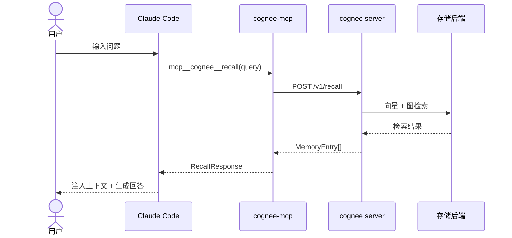
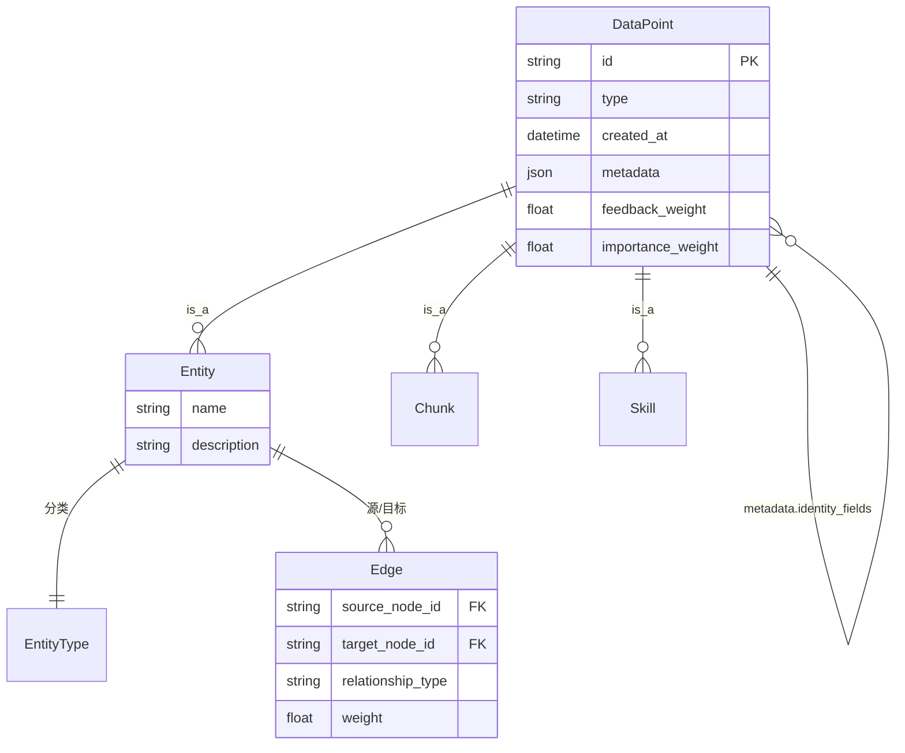
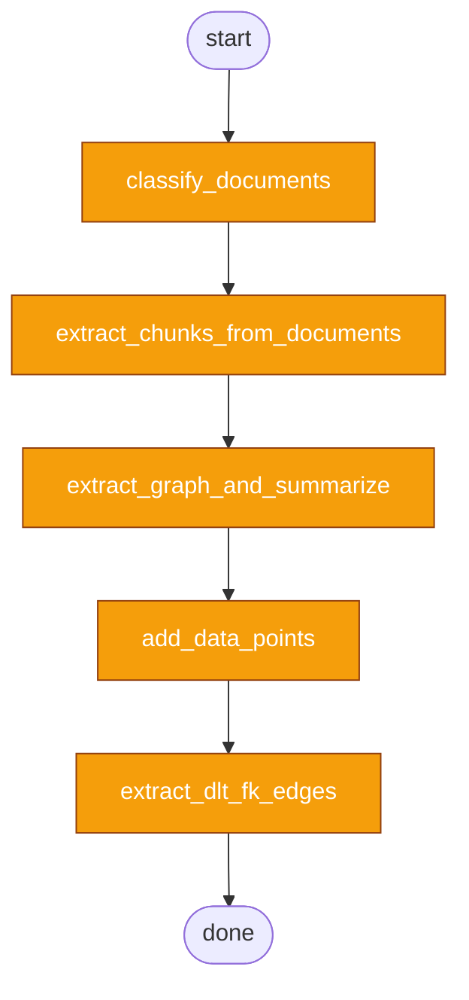
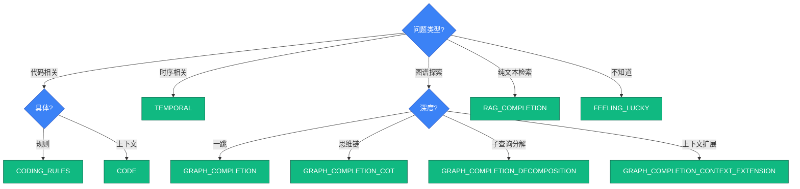
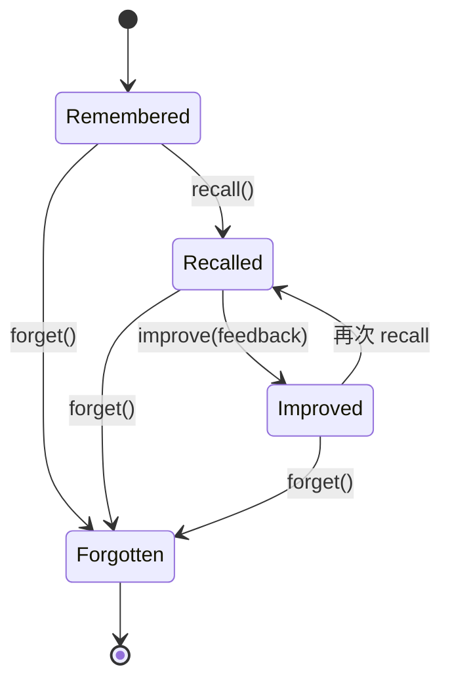
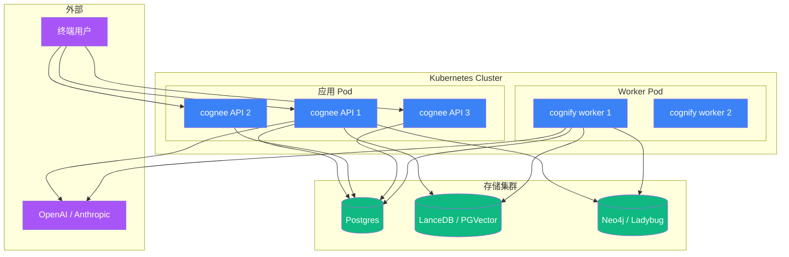
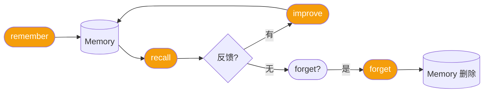
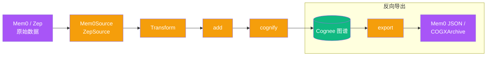

# mermaid 模板与规范

## 配色

```css
/* 节点类型 */
fill_concept: #3B82F6    /* 概念 */
fill_data: #10B981       /* 数据 */
fill_api: #F59E0B        /* API */
fill_external: #A855F7   /* 外部系统 */
fill_error: #EF4444      /* 错误 */

/* 字体与背景 */
font_family: "PingFang SC", "Microsoft YaHei", system-ui
background: #FAFAFA
text_color: #1F2937
```

## 模板 1:流程图(flowchart)

```mermaid
%% title: Ch01 — add → cognify → search 流程
graph LR
    A([用户输入]) --> B["cognee.add"]
    B --> C["resolve_data_directories"]
    C --> D["ingest_data"]
    D --> E["cognee.cognify"]
    E --> F["classify_documents"]
    F --> G["extract_chunks"]
    G --> H["extract_graph"]
    H --> I["summarize"]
    I --> J["add_data_points"]
    J --> K[(SQLite + LanceDB + Ladybug)]
    K --> L["cognee.search"]
    L --> M([LLM 回答])

    classDef concept fill:#3B82F6,color:#fff,stroke:#1E40AF
    classDef data fill:#10B981,color:#fff,stroke:#065F46
    classDef api fill:#F59E0B,color:#fff,stroke:#92400E
    classDef external fill:#A855F7,color:#fff,stroke:#6B21A8

    class A,M concept
    class K data
    class B,E,L api
```



## 模板 2:时序图(sequence)



## 模板 3:ER 图



## 模板 4:DAG(pipeline)



## 模板 5:决策树



## 模板 6:状态机



## 模板 7:部署拓扑



## 模板 8:四步生命周期



## 模板 9:迁移管道



## 模板 10:对比图

```mermaid
%% title: Ch01 — 传统 RAG vs Cognee ECL
graph TB
    subgraph RAG["传统 RAG"]
        R1[文档] --> R2[切片]
        R2 --> R3[向量化]
        R3 --> R4[(向量库)]
        R4 --> R5[相似度检索]
        R5 --> R6[Top-K 段落]
        R6 --> R7[LLM]
    end

    subgraph Cog["Cognee ECL"]
        C1[原始数据] --> C2[add]
        C2 --> C3[classify]
        C3 --> C4[chunk]
        C4 --> C5[extract graph]
        C5 --> C6[summarize]
        C6 --> C7[(图 + 向量 + 关系)]
        C7 --> C8[structured retrieval]
        C8 --> C9[多路重排]
        C9 --> C10[LLM]
    end

    classDef rag fill:#EF4444,color:#fff
    classDef cog fill:#10B981,color:#fff
    class R1,R2,R3,R4,R5,R6,R7 rag
    class C1,C2,C3,C4,C5,C6,C7,C8,C9,C10 cog
```



## 渲染规范

```bash
# 使用 mmdc 渲染(需要先安装)
mmdc -i chapter-XX-diagram.mmd -o assets/diagrams/chXX-name.svg \
     -b transparent \
     -t neutral \
     --configFile templates/mermaid-config.json

# 颜色通过 templates/mermaid-config.json 配置:
# {
#   "theme": "neutral",
#   "themeVariables": {
#     "background": "#FAFAFA",
#     "primaryColor": "#3B82F6",
#     "primaryTextColor": "#fff",
#     "primaryBorderColor": "#1E40AF",
#     "lineColor": "#6B7280",
#     "fontFamily": "PingFang SC, Microsoft YaHei, system-ui"
#   }
# }
```

## 限制

- 节点最大宽度 220px,超出文字必须分行(`<br/>`)
- 不使用 emoji,使用 `[A]` `[B]` 等 letter group
- 必须有标题 `%% title: <章节名> — <图名>`
- 箭头方向明确:`graph LR` / `graph TD` / `graph BT` / `graph RL`
- 子图用 `subgraph Name["显示名"] ... end` 包裹
- 节点标签中的特殊字符必须用双引号 `["含 (括号) 的文本"]`