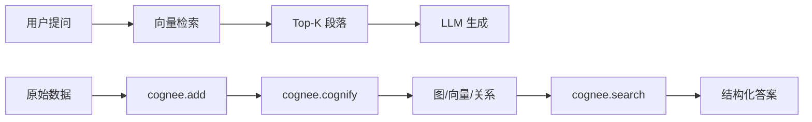

# 写作规范

## 1. 章节开头模板

每章开头必须包含三个固定块:

```markdown
# 第 X 章 `<英文标题>`

> 本章目标:读完本章,你将能够 …

## 前置知识
- 已读完 Ch0X: <章节中文名>
- 需要的基础库:`cognee>=1.4.0`、`pydantic`、`asyncio`

## 本章导览
- 0.0
- 0.1
```

## 2. 章节结尾模板

```markdown
## 小结
- 关键要点 1
- 关键要点 2
- 关键要点 3

## 实践作业
1. (基础) ...
2. (进阶) ...

## 推荐阅读
- [[chapter-XX-...|...]]
- 路径:`<COGNEE_REPO>/...`
```

## 3. 代码块规范

- 四空格缩进、```python ``` 围栏
- 每个代码片段必须在默认主路径(SQLite + LanceDB + Ladybug)可跑
- 异步 API 必须 `await` 包裹
- 占位符用 `<你的API_KEY>` 这种中文角括号格式
- 长片段使用 `\` 续行或拆分成多段
- 引用代码前必须验证文件存在

```python
# 推荐风格
import asyncio
import cognee

async def main():
    await cognee.add("LangChain 是一个 LLM 编排框架...")
    await cognee.cognify()
    results = await cognee.search("LangChain 是什么", "GRAPH_COMPLETION")
    print(results)

asyncio.run(main())
```

## 4. mermaid 图规范



### 配色

| 类型 | 颜色 |
|---|---|
| 概念 | `#3B82F6`(蓝) |
| 数据 | `#10B981`(绿) |
| API | `#F59E0B`(橙) |
| 外部系统 | `#A855F7`(紫) |
| 错误 | `#EF4444`(红) |
| 背景 | `#FAFAFA` |

### 字体

```
font-family: "PingFang SC", "Microsoft YaHei", system-ui
```

### 限制

- 不使用 emoji,使用 `[A]` `[B]` 等 letter group
- 节点最大宽度 220px
- 必须标题 `%% title: <章节名> — <图名>`

## 5. 引用路径规范

- 引用代码文件必须用绝对路径:`<COGNEE_REPO>/cognee/...`
- 引用 examples 时给出文件名:`cognee/examples/demos/simple_cognee_example.py`
- 引用章节时用双向链接:`[[chapter-XX-...|第 X 章 ...]]`

## 6. 版本基线

- cognee: **1.4.0**(基线日期 2026-07-26)
- cognee-integrations: 与 cognee 主仓库同步版本
- Python: **>=3.10, <3.15**

每次提到版本号前必须 `cat <COGNEE_REPO>/cognee/version.py` 校验。

## 7. Markdown lint

统一应用以下 markdownlint 规则:

- `MD013` line-length: 100(允许略长,但不超过 120)
- `MD024` no-duplicate-heading: 允许(章节内小标题)
- `MD033` no-inline-html: 不允许
- `MD041` first-line-h1: 强制
- `MD046` code-block-style: 围栏代码块(```)

---

## 8. 协议层边界(M12 沉淀,**必须遵守**)

cognee 在不同协议层的字段名不同。**示例代码必须明确协议层**,禁止混用:

| 协议层 | 入口 | 关键字段 |
|---|---|---|
| **v1 Python SDK** | `await cognee.search()` | `query_type=` / `query_text=` / `top_k=` / `dataset_name=` |
| **v2 内存 API** | `cognee.remember / recall / improve / forget` | `query_text=`(记忆层) |
| **HTTP / JSON 载荷** | `POST /v1/search`、n8n 节点 payload | `search_type=` / `query=` |
| **CLI** | `cognee --debug cognify` | arg 全局选项须在子命令前 |

**典型错配禁忌**:
- `await cognee.search(search_type=GRAPH_COMPLETION)` ❌(应是 `query_type`)
- n8n 节点 JSON `"query_type":"FEELING_LUCKY"` ❌(应是 `search_type`)
- `cognee cognify --debug` ❌(应 `cognee --debug cognify`,argparse 顺序)
- `cognee.add(data, dataset="...")` ❌(v1.4.0 实参是 `dataset_name=`)

## 9. 代码块静态校验(M12 沉淀)

每个 PR / 章节提交前必须经过:

1. **AST 解析**:`python3 -c "import ast; ast.parse(...)"` 通过
2. **Unicode 引号扫描**:U+2018 / U+2019 / U+201C / U+201D 出现在字符串字面量或字典键名中时,必须换 ASCII `"` `'`
3. **API 形态扫描**:针对上面 4 类典型错配的正则
4. **默认值偏差**:已知的 `top_k` 默认 15 而非 10

扫描脚本见 `code-review/scan_blocks.py`(M12 产物)。

## 10. 数字事实的来源

数字必须由脚本生成或附核验命令,**禁止手填**吸引眼球的近似数字:

| 数字 | 核验命令 |
|---|---|
| cognee 1.4.0 | `cat <COGNEE_REPO>/cognee/version.py` |
| SearchType 数(=18) | `python -c "from cognee.shared.enums import SearchType; print(len(SearchType))"` |
| Python ≥3.10 | `grep requires-python <COGNEE_REPO>/pyproject.toml` |
| 集成总数(inventory 24 entry, 23 unique) | `<COGNEE_INTEGRATIONS_REPO>/integrations/inventory.yml` |
| CLI 子命令数(22) | 实际命令清单见 `<COGNEE_REPO>/cognee/cli/commands/` |

## 11. 引用路径占位符

- 章节文本中出现**绝对路径**时统一用占位符:
  - `<COGNEE_REPO>` = cognee 主仓库根
  - `<COGNEE_INTEGRATIONS_REPO>` = cognee-integrations 根
  - `<HANDBOOK_REPO>` = 本仓库根
- 完整脚本示例或本地二进制路径禁止写入章节文本
- 验证命令:扫 `chapters/` 与 `appendix/`,确保未出现绝对本地路径(literal `~/`、`<USER>/...`、`/Users/...` 等),期望空命中

## 12. 附录与正文一并核查

`appendix/faq.md` 与 `appendix/references.md` 与正文同一次 fact-check,不允许遗留:
- arXiv / DOI 标题需 WebFetch 实证
- 集成数、CLI 子命令数、SearchType 数与正文一致
- HTTP / Python 协议归属清晰

## 13. dist 重建要求

`make all` 必须从当前工作树重建,**禁止复用旧 dist**:
- 重建后建议比较 `dist/cognee-handbook.html` 内嵌的构建元数据(若有)或 git HEAD 哈希
- 不可单看 `dist/` 文件 mtime;时间戳可能在 `make all` 期间被延后,但内容来自旧源
- 每章节做大改动后必须 `make all` 一次,反映到 EPUB / PDF / HTML

## 14. fact-check 友好规约(沉淀历史 drift 模式)

历经 M11 / M12 两轮 fact-check 沉淀的常见 drift:

1. **数量/计数错位**:模块数、参数数、子命令数等手填近似数字 — **必须由脚本验证**
2. **行号偏移**:上游重构后无同步 — **避免在正文中引用脆弱的裸行号**;用符号名或函数名更稳健
3. **类名/方法名手抄拼写**:`TextualSummary` (实为 `TextSummary`)、`prune.prune_data()` 笔误 — **引用前 Read 源码**
4. **API 归属混淆**:把 v1 写法用到 v2 上下文,或把 HTTP 字段用到 Python SDK — **见第 8 节协议层边界**
5. **虚构内容**:无 source-of-truth 的"1M=0.72"等数字 — **见第 10 节数字事实来源**

每次新增章节/修改代码示例前,应当回看 `code-review/fact-check-report.md` 与 `code-review/fact-check-m12.md`,对照规约清单自查。