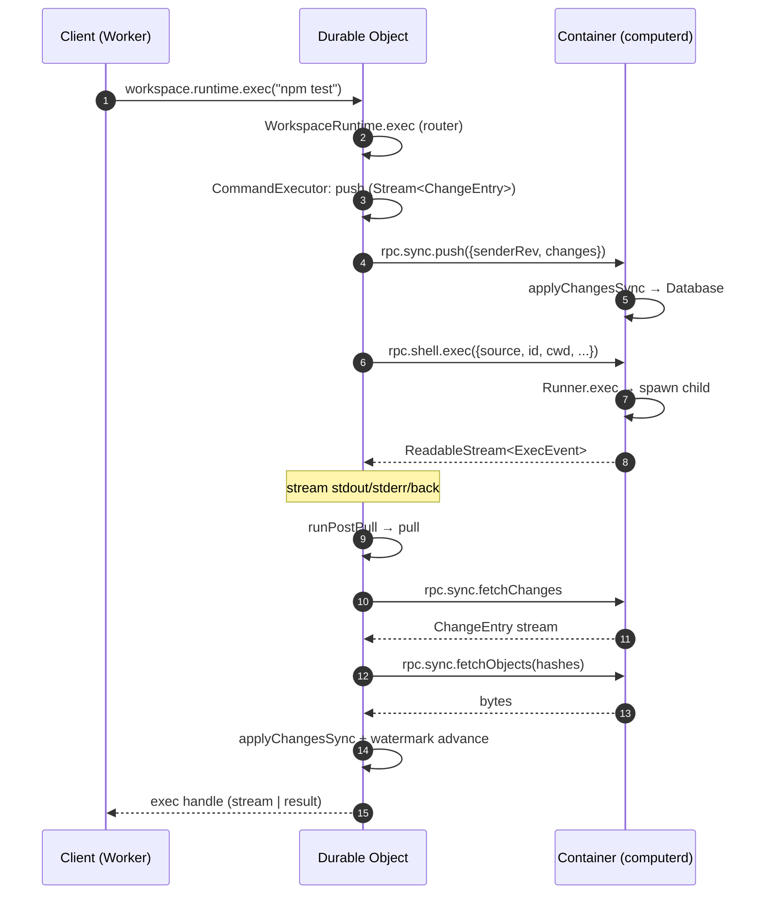

# 1. 项目定位与核心抽象

> **读者**:全员
> **预计阅读**:8 分钟
> **前置依赖**:无

## 目标

一句话讲清楚 Cloudflare Computer 是什么、它要解决什么问题、为什么 1:1 DO↔Container 配对是核心设计决策,以及五个 npm 包各自的边界。

---

## 1.1 一句话定义

**Cloudflare Computer 是一个把 SQLite 虚拟文件系统(VFS)放进 Cloudflare Durable Object 里、再通过 pluggable execution backends 把这个 VFS 投影到不同 runtime 上去执行的统一工作空间抽象。**

三种 backend 在仓库 README 中明确列出(`README.md:1-22`):

- **Container**:把 SQLite state 投影成 sandbox container 中的真实 FUSE mount;
- **Isolate shell**:在 Dynamic Worker 里跑 [just-bash](https://github.com/vercel-labs/just-bash);
- **Isolate JavaScript**:在 Dynamic Worker 里跑 ECMAScript module,可访问 `node:fs/promises`。

> **节选自**:`README.md:5-22`
> ```
> Cloudflare Computer is a virtual filesystem that lives inside a
> Durable Object. The Durable Object holds the authoritative state in
> SQLite and exposes one pluggable execution surface through
> `workspace.runtime`. Three backends ship today:
> - **Container** projects the SQLite state into a sandbox container as
>   a real FUSE mount. ...
> - **Isolate shell** runs [just-bash] in a Dynamic Worker. ...
> - **Isolate JavaScript** runs an ECMAScript module in a fresh Dynamic
>   Worker ...
> ```

---

## 1.2 F1. 系统总览 — 1:1 DO ↔ Container 配对

**F1. 系统总览图** — DO ↔ Container 1:1 配对与 WebSocket 双向同步


*本图引用自 `docs/assets/arch.png`,由仓库维护者提供*

```mermaid
flowchart LR
  subgraph DO["Cloudflare Edge — Durable Object (1:1 with Workspace)"]
    direction TB
    WS["Workspace<br/>(facade)"]
    DB["Database<br/>(SQLite via ctx.storage)"]
    FS["WorkspaceFilesystem"]
    RT["WorkspaceRuntime<br/>(router)"]
    WS --> FS --> DB
    WS --> RT
  end

  subgraph CT["Container (linux-x64)"]
    direction TB
    CD["computerd<br/>(Node SEA binary)"]
    HTTP["HTTP server<br/>(/health, /connect, /ws)"]
    FUSE["FUSE driver<br/>OR shim"]
    VFS["NodeVirtualFileSystem<br/>(in-memory VFS over SQLite)"]
    RUN["Runner<br/>(process supervision)"]
    CD --> HTTP
    CD --> FUSE --> VFS
    CD --> RUN
  end

  DO <-->|capnweb WebSocket<br/>(DO is server)| CT
```

### 关键观察

1. **DO 拥有权威 SQLite store**,所有持久化文件状态都通过 `Database` 抽象写进 DO 的 SQLite。
2. **Container 是次级 client/peer**,持有一份 in-memory VFS 镜像 + FUSE mount(若可用),通过 capnweb WebSocket 与 DO 双向同步。
3. **DO 充当 WebSocket 服务端**(`docs/11_lifecycle.md:39-61` 明确指出这是"对自然所有权的反转"),这是 egress interceptor 可以路由流量的关键,也是后续 hibernation 支持的入口。
4. **1:1 配对是 load-bearing**:每个 DO 只对应一个 container 实例;`pushRev` / `fetchCursor` 只与单一对端协商。

---

## 1.3 为什么是 1:1 配对?

把"存储"和"执行"分到两个独立的进程里(Edge 上的 DO + 用户态的 Container),再用一个稳定的 wire 协议把它们接起来 —— 这是一个有意识的取舍。

| 收益 | 代价 |
|---|---|
| 存储就近放在 Edge,冷启动与读延迟低 | 必须维护同步协议(sync / shell RPC) |
| 执行环境可任意替换(container / worker-shell / worker-javascript) | 每次 `exec` 都要走 push→exec→pull 三个回合 |
| WebSocket 长连接 → 端到端 backpressure | 协议层错误(WS 断、stub 泄漏)需要专门处理 |
| Container 可休眠 / 重启而不丢状态 | 容器冷启动慢(尤其 Container backend) |

`docs/11_lifecycle.md:39-61` 强调:1:1 配对使得 revival、hibernation、reconciliation 都变成"单一对端协商",而不是 multiplexer 调度。

---

## 1.4 五包职责一览

`packages/` 下五个 npm 工作区,职责严格分层(详细依赖图见 [第 7 章](07_dev_packages.md)):

| 包 | 名称 | 角色 | 依赖 |
|---|---|---|---|
| `packages/dofs` | `@cloudflare/dofs` | SQLite-backed VFS 内核(fs primitives + sync protocol) | `node:crypto`, `node:fs/promises`(仅 `@platformatic/vfs` adapter) |
| `packages/rpc` | `@cloudflare/computer-rpc` | capnweb wire types + sync driver | `dofs`, `capnweb` |
| `packages/computerd` | `@cloudflare/computerd` | 在 Container 内运行的 Node SEA 二进制(FUSE / shim / exec runner) | `rpc`, `dofs`, `@platformatic/vfs`, `fuse-native` |
| `packages/computer` | `@cloudflare/computer` | 给 Worker / DO 用的客户端门面(`Workspace` + 后端 + 工具) | `dofs`, `rpc`, `capnweb`(peer),`isomorphic-git`, `ai`, `zod` |
| `packages/computer-computerd-linux-x64` | `@cloudflare/computerd-linux-x64` | Docker 镜像 context(`Dockerfile` + `.dockerignore`) | 无运行时依赖 |

> 注:`packages/computer-computerd-linux-x64` 名义上是 npm package(`private: true`),但实际只承载 Docker 镜像构建上下文。

`docs/10_project_layout.md` 进一步描述了这个分层。

---

## 1.5 一次完整的 `exec` 调用长什么样?

下列时序图来自 [第 4 章](04_user_basics.md) 与 [第 10 章](10_dev_client.md),在此先以"鸟瞰"形式展示,详细 wire 帧见 [第 14 章](14_arch_protocol.md)。



`docs/02_sync_protocol.md` 与 `packages/rpc/src/sync-driver.ts:396`(`pushOnce` / `pullOnce` / `reconcileWatermarks`)是这个流程的核心代码点。

---

## 1.6 三个后续视角,各自从哪里切入?

- **用户视角**:不需要理解 wire 协议,把 `Workspace` 当成一个"装了 fs + exec 的工作目录"用 —— 见 [第 3-6 章](#part-ii--用户视角part-ii)。
- **开发者视角**:要写一个新 backend / 改 VFS / 调试协议 —— 见 [第 7-11 章](#part-iii--开发者视角part-iii)。
- **架构师视角**:要理解为什么这样切分、为什么不 Result/Option、协议版本怎么演进 —— 见 [第 12-18 章](#part-iv--架构师视角part-iv)。

---

## 延伸阅读

- [第 2 章:五分钟跑通最小回路](02_quickstart.md) — 立即动手的最小示例
- [第 7 章:Monorepo 与五包结构](07_dev_packages.md) — 五个包依赖关系的细节
- [第 12 章:系统架构总览](12_arch_overview.md) — 4 层架构图与控制面/数据面分离
- [`docs/10_project_layout.md`](../10_project_layout.md) — 既有专题:monorepo 布局
- [`docs/11_lifecycle.md`](../11_lifecycle.md) — 既有专题:incarnation / 容器生命周期 / WS 会话
- [`README.md`](../../README.md) — 仓库根 README