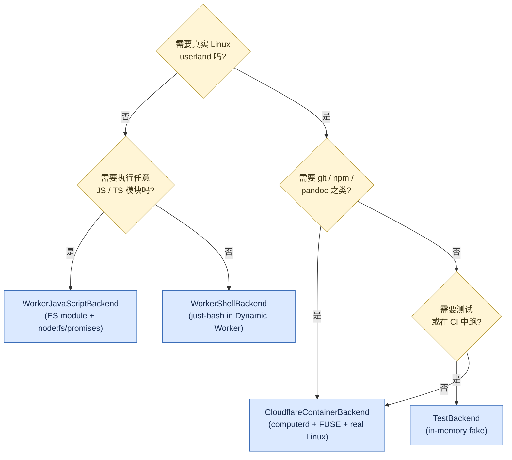

# 3. 安装、配置、4 选 1 后端决策

> **读者**:用户
> **预计阅读**:6 分钟
> **前置依赖**:[第 2 章 五分钟跑通](02_quickstart.md)

## 目标

面对三种部署形态(本地 / Cloudflare Workers / 混合)与四个 backend(`CloudflareContainerBackend` / `WorkerShellBackend` / `WorkerJavaScriptBackend` / `TestBackend`),给出一份"先选形态、再选 backend"的两段决策。

---

## 3.1 环境要求

| 项 | 必需 / 可选 | 说明 |
|---|---|---|
| Node.js ≥ 22 | 必需 | `packages/computerd/package.json:engines.node` 硬性要求 |
| npm(workspace) | 必需 | 不接受 pnpm / yarn |
| Cloudflare 账号 | Worker 部署必需 | DO 与 Container 都是付费能力 |
| Wrangler CLI | Worker 部署必需 | `wrangler@^4.107.1` |
| Docker | Container backend 必需 | 测试 FUSE 用 |
| `libfuse-dev` / macFUSE | `computerd` 真实 FUSE 必需 | 无 FUSE 时回退到 shim |

---

## 3.2 三种部署形态

| 形态 | 谁运行 `computerd` | 谁拥有 SQLite | 适合场景 |
|---|---|---|---|
| **本地 dev** | `npx computerd` | `node:sqlite` 在 Container 内 | 本地开发、Vitest |
| **Cloudflare Workers** | 不需要 `computerd`;改用 WorkerShell / WorkerJavaScript backend | DO 的 `ctx.storage` | 不需要真实 Linux 命令、想要最快冷启动 |
| **混合(推荐生产路径)** | `CloudflareContainerBackend` + `computerd` 跑在 Container | DO 的 `ctx.storage`(权威)+ Container 内 in-memory VFS 镜像 | 需要 `npm` / `git` / `pandoc` 等真实 Linux userland |

**经验法则**:
- 不需要真实 Linux 二进制 → WorkerShell(`just-bash`)或 WorkerJavaScript;
- 需要真实 Linux 二进制 → CloudflareContainer;
- 只想跑测试 / mock → TestBackend。

---

## 3.3 F3. 后端选型决策树

**F3. 后端选型决策树** — 4 个 backend 之间的判断路径



### 四个 backend 速览

| Backend | 入口 | sync 行为 | 冷启动 | 真实 Linux |
|---|---|---|---|---|
| `CloudflareContainerBackend` | `packages/computer/src/backends/container/cloudflare-container.ts:141` | push→exec→pull(`sync: "remote"`) | 慢(拉容器) | ✅ |
| `WorkerShellBackend` | `packages/computer/src/backends/worker-shell/worker-shell.ts:156` | `sync: "none"`(loopback) | 快(Dynamic Worker) | ❌(`just-bash` 子集) |
| `WorkerJavaScriptBackend` | `packages/computer/src/backends/worker-javascript/worker-javascript.ts:134` | `sync: "none"`(loopback) | 快(Dynamic Worker) | ❌(只有 `node:fs/promises`) |
| `TestBackend` | `packages/computer/src/backends/test.ts:1` | push→exec→pull(走外部 `computerd`) | 极快 | — |

> Backend 间的契约详见 [第 9 章](09_dev_backend.md)。

---

## 3.4 配置:三种文件

| 配置 | 载体 | 内容 |
|---|---|---|
| DO / Container binding | `wrangler.jsonc` | `durable_objects.bindings`、`containers`、`r2_buckets`、`migrations.new_sqlite_classes`、`observability.traces.enabled` |
| Worker 运行时选项 | `wrangler.jsonc` 中 `compatibility_flags` (`nodejs_compat`, `experimental`)与 `worker_loaders` | 控制 Dynamic Worker 行为 |
| `computerd` 守护进程 | 环境变量 | `PORT`、`MOUNT_POINT`、`FUSE_MOUNT`、`UPSTREAM_URL`、`EXEC_LOG_MAX_BYTES`、`LOG_FILE`、`CAPNWEB_TRACK_STUBS` |

`wrangler.jsonc` 的 `containers.class_name` 与 `containers.image` 决定 Container 部署形态,见 `examples/container/wrangler.jsonc:0-66`。

---

## 3.5 一份参考 `wrangler.jsonc`(`examples/container`)

```jsonc
{
  "name": "computer-container-example",
  "main": "src/index.ts",
  "compatibility_date": "2025-04-01",
  "compatibility_flags": ["nodejs_compat", "experimental"],
  "containers": [{
    "class_name": "ContainerExample",
    "image": "./Dockerfile",
    "instance_type": "standard-2",
    "max_instances": 5
  }],
  "durable_objects": {
    "bindings": [{ "name": "CONTAINER_EXAMPLE", "class_name": "ContainerExample" }]
  },
  "migrations": [{ "tag": "v1", "new_sqlite_classes": ["ContainerExample"] }],
  "r2_buckets": [{ "binding": "Bucket", "bucket_name": "computer-container-hello" }],
  "observability": { "traces": { "enabled": true } }
}
```

启动后通过 `wrangler dev --local --persist-to .wrangler` 在本地起完整 stack。

---

## 3.6 `computerd` 环境变量一览

| 变量 | 默认 | 必填? | 说明 |
|---|---|---|---|
| `PORT` | `45678` | 否 | HTTP 监听端口,必须 `0-65535` 整数 |
| `MOUNT_POINT` | `/workspace` | 否 | FUSE 挂载点,必须绝对路径 |
| `FUSE_MOUNT` | `auto` | 否 | `auto` / `fuse` / `macfuse` / `shim` / `none` |
| `UPSTREAM_URL` | (空) | 否 | 设为 ws(s)/http(s) URL 时启动时打开 `SyncClient` |
| `EXEC_LOG_MAX_BYTES` | runner 默认 | 否 | in-memory exec log buffer 上限,正整数 |
| `LOG_FILE` | (空) | 否 | 设了就装日志写入 + 崩溃处理 |
| `CAPNWEB_TRACK_STUBS` | `0` | 否 | 打开后 `/__computerd/stubs` 才返回 stub 快照 |

> ⚠ 已废弃:`DISABLE_FUSE` → `FUSE_MOUNT=none`;`FUSE_SHIM` → `FUSE_MOUNT=shim`;`WSD_FUSE_BACKEND` → `FUSE_MOUNT=fuse|macfuse`。

---

## 3.7 部署到哪里?——一句话对照

- **只想看 hello world**:Wrangler dev + TestBackend / WorkerShell(无需 Container);
- **小流量、低复杂度**:Cloudflare Workers + WorkerShell 或 WorkerJavaScript;
- **需要真实 Linux userland**:Cloudflare Container + `computerd` + `CloudflareContainerBackend`。

---

## 延伸阅读

- [第 2 章:五分钟跑通最小回路](02_quickstart.md) — 本地启动步骤
- [第 4 章:基础操作](04_user_basics.md) — 创建 / 读写 / 执行
- [第 9 章:自定义后端](09_dev_backend.md) — Backend 契约细节
- [第 21 章:配置参考](21_ref_config.md) — `wrangler` 字段与环境变量全集
- [`packages/computer/README.md`](../../packages/computer/README.md) — 主包 README
- [`packages/computerd/README.md`](../../packages/computerd/README.md) — `computerd` 完整 README