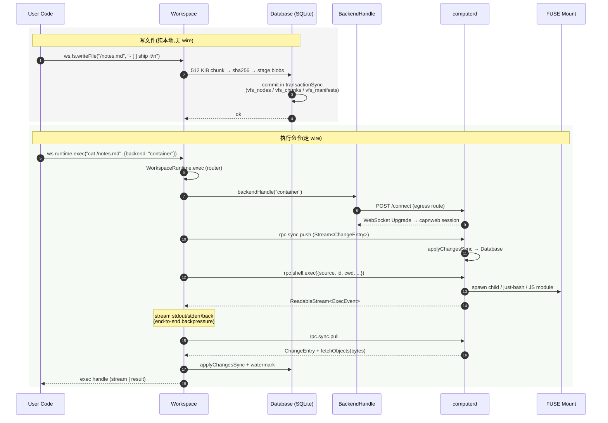

# 4. 基础操作:创建、读写、执行

> **读者**:用户
> **预计阅读**:10 分钟
> **前置依赖**:[第 3 章 安装配置](03_user_install.md)

## 目标

理解 `Workspace` 是什么、`fs` 与 `runtime.exec` 的最常用 API、如何释放 stub(`using` 语法),以及 F4 时序图展示的一次完整读写 + 执行是怎么走通 wire 的。

---

## 4.1 `Workspace` —— 一切的入口

`Workspace` 是给 Worker / DO 用户用的门面,所有 fs / runtime / git / artifacts / assets 都挂在它身上。`packages/computer/src/workspace.ts:259` 是它的入口类。

构造形态(`packages/computer/src/workspace.ts:179ish` `WorkspaceOptions`):

```ts
import { Workspace } from "@cloudflare/computer";

new Workspace({
  storage,           // DO 的 ctx.storage,或 Testing 的 SQLiteTestStorage
  mounts?,           // R2 等挂载(详见 [`docs/06_mount_interface.md`](../06_mount_interface.md))
  backends,          // 1 个或多个 WorkspaceBackend
  git?,              // createGitClient()(默认 isomorphic-git)
  assets?,           // createAssets() / createArtifact()
  defaultGitIdentity?, // { name, email }
  observer?,         // noopObserver | createCloudflareObserver({ tracing })
  useThink?,         // (未在代码中确认)是否启用 Think 兼容
});
```

### 重要边界

- `ws.fs` 在构造后**立即可用**(`Database` 已经初始化完毕);
- `ws.runtime` / `ws.git` 需要 `await ws.ready()` 后才完整可用 — 因为后端 lazy connect。

---

## 4.2 构造方式

### 4.2.1 在 Durable Object 里(`withWorkspace` mixin)

`packages/computer/src/with-workspace.ts:34-79` 是把 `Workspace` 装进 DO 的标准方式:

```ts
import { withWorkspace } from "@cloudflare/computer";
import { DurableObject } from "cloudflare:workers";

class AgentBase extends DurableObject<Env> {}

export class Agent extends withWorkspace(
  AgentBase,
  (self) => ({ storage: self.ctx.storage })
) {}
```

`withWorkspace` 在 `super(...)` 后通过 callback 读取 `ctx/env`,把 `Workspace` 存到 symbol 上,并暴露 `__getWorkspaceStub()`,这是 Worker ↔ DO RPC 的入口。

### 4.2.2 客户端取出 stub

```ts
import { getWorkspace } from "@cloudflare/computer";

// 在 Worker 里:从 stub host 取 stub
const id = env.Agent.idFromName("user-123");
using ws = await getWorkspace(env.Agent.get(id));
// `using` 关键字触发 Symbol.dispose → 自动释放 stub
```

`packages/computer/src/client.ts:366-406` 是 `getWorkspace` 的实现,它既支持 Worker DO RPC,也支持 symbol-stash。

---

## 4.3 F4. 文件读写与 exec 时序

**F4. 文件读写与 exec 时序图** — 一次 `fs.writeFile` + `runtime.exec` 的端到端路径



---

## 4.4 文件操作(`ws.fs`)

API 形状刻意贴近 Node.js `node:fs/promises`(实现见 `packages/dofs/src/fs/filesystem.ts:36-127`):

```ts
await ws.fs.writeFile("/notes.md", "- [ ] ship it\n");
const content = await ws.fs.readFile("/notes.md", "utf8"); // string
const bytes   = await ws.fs.readFile("/notes.md");         // ReadableStream<Uint8Array>

await ws.fs.mkdir("/dir/a/b/c", { recursive: true });
await ws.fs.rm("/dir", { recursive: true, force: true });
const stat = await ws.fs.stat("/notes.md");
```

要点:

- `readFile(path)` 返回 **`ReadableStream<Uint8Array>`**(默认);传 `"utf8"` 拿到 string;
- `writeFile(path, content)` 也接受 `ReadableStream<Uint8Array>`,所以 R2 `body`、HTTP request body 可直接灌入;
- 不存在 → throw `ENOENT`(`err.code === "ENOENT"`,见 `packages/dofs/src/errors.ts`)。

高级操作(`find` / `grep` / `ls` / `symlink` / `readlink` / `rename` / `chmod` / `unlink`) 见 [`docs/04_filesystem_interface.md`](../04_filesystem_interface.md)。

---

## 4.5 执行命令(`ws.runtime.exec`)

签名(`packages/computer/src/runtime/runtime.ts:30`):

```ts
ws.runtime.exec(source, options): WorkspaceRuntimeExecHandle
```

`source` 形态取决于 backend:

- `CloudflareContainerBackend` / `WorkerShellBackend`:`source` 是字符串命令,如 `"npm test"`;
- `WorkerJavaScriptBackend`:`source` 是 ECMAScript module source,可写 `import fs from "node:fs/promises"; export default async () => fs.readFile(...)`。

`options`:

```ts
{
  backend: "container-shell",   // 路由到哪个 backend
  cwd: "/workspace",
  timeoutMs: 60_000,
  env: { NODE_ENV: "test" },
  encoding: "utf8" | "base64",  // 返回 string 还是 ReadableStream<Uint8Array>
}
```

返回值是 `WorkspaceRuntimeExecHandle`,它既是 `ReadableStream<ExecEvent>`,又有 `result()` 访问最终结果(`Symbol.dispose` aware)。

---

## 4.6 处理 stdout / stderr / 退出码

```ts
const run = ws.runtime.exec("npm test", { backend: "container", encoding: "utf8" });

// 路径 A:流式(适合长任务 + SSE 推给前端)
const sse = run.pipeThrough(new TransformStream({
  transform(event, controller) {
    controller.enqueue(new TextEncoder().encode(
      `event: ${event.name}\ndata: ${JSON.stringify(event.value)}\n\n`));
  },
}));
return new Response(sse, { headers: { "content-type": "text/event-stream" } });

// 路径 B:等待完成
const result = await run.result();
// result = { stdout, stderr, exitCode, events: [...] }
```

注意:**handle 是 single-consumer** —— 用过 `stream` 路径,就不能再用 `result()`,反之亦然。详见 [第 14 章](14_arch_protocol.md)。

---

## 4.7 多 backend 路由

```ts
const ws = new Workspace({
  storage: ctx.storage,
  backends: [
    new CloudflareContainerBackend({ id: "container", container: () => this }),
    new WorkerShellBackend({ id: "shell", loader: env.LOADER }),
    new TestBackend({ id: "test" }),
  ],
});

await ws.runtime.exec("grep -r TODO /workspace");          // 默认路由到 shell
await ws.runtime.exec("npm test", { backend: "container" });// 显式选 container
await ws.runtime.exec("1+1", { backend: "worker-javascript" });
```

`WorkspaceRuntime` 通过 `backend.id` 选路;`callable?` 标志决定走 `CommandExecutor`(push→exec→pull)还是 `ModuleExecutor`(host capability calls)。

---

## 4.8 释放 stub(必读)

`getWorkspace(...)` / `ws.runtime.exec(...)` 返回的句柄持有 capnweb 的 export table 项,**必须**用 `using` 或显式 `Symbol.dispose()` 释放,否则远端 stub 会越攒越多。

```ts
// ✅ 推荐
{
  using ws = await getWorkspace(env.Agent.get(id));
  await ws.fs.writeFile("/x", "y");
} // 离开 scope 自动 dispose

// ✅ 也可
const ws = await getWorkspace(env.Agent.get(id));
try {
  await ws.fs.writeFile("/x", "y");
} finally {
  ws[Symbol.dispose]();
}

// ❌ 泄漏
const ws = await getWorkspace(env.Agent.get(id));
await ws.fs.writeFile("/x", "y");
// ws 永远不会被 dispose → 远端 stub 累加
```

调试时可用 `CAPNWEB_TRACK_STUBS=1` 启动 `computerd`,然后 `GET /__computerd/stubs` 看 stub 数量。

---

## 4.9 销毁与回收

- 单次请求结束 → `using` 自动释放 `WorkspaceStub`;
- DO 进入 hibernation → DO 实例被回收,下次 `idFromName` 时重新激活;
- Container 可重启 / 替换:`CloudflareContainerBackend` 会自动重连(详见 [`docs/11_lifecycle.md`](../11_lifecycle.md))。

---

## 延伸阅读

- [第 5 章:进阶用法](05_user_advanced.md) — 大文件分块、流式输出、快照
- [第 10 章:客户端与 SDK](10_dev_client.md) — `withWorkspace` 细节与 capnweb 调用链
- [第 14 章:capnweb 协议与数据流](14_arch_protocol.md) — ExecEvent 帧格式
- [第 19 章:`computer` 客户端 API 参考](19_ref_api.md) — 完整签名表
- [`docs/01_vfs.md`](../01_vfs.md) — 既有专题:VFS 树布局
- [`docs/05_runtime_interface.md`](../05_runtime_interface.md) — 既有专题:`runtime.exec`