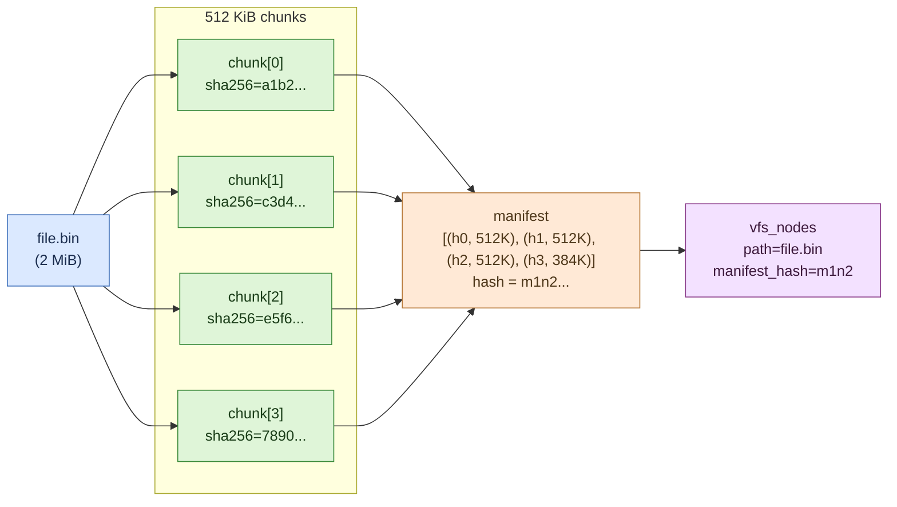

# 5. 进阶用法

> **读者**:用户
> **预计阅读**:8 分钟
> **前置依赖**:[第 4 章 基础操作](04_user_basics.md)

## 目标

处理"大文件 / 长任务 / 跨 Computer 同步"三类典型场景,并理解 **512 KiB chunk + sha256 content-addressing** 这套存储抽象带来的取舍。

---

## 5.1 F5. 512 KiB chunk 存储示意

**F5. 512 KiB chunk 存储示意** — 一个文件被切成 N 个 512 KiB chunk,每块独立 hash,manifest 串起来



### 设计要点

- **chunk 是写盘的最小单位**(默认 512 KiB,见 `packages/dofs/src/fs/writeFile.ts`);
- **manifest 是文件级别的内容寻址**:相同字节的不同路径共享同一份 manifest,从而天然去重;
- **hash = sha256(chunk bytes)**,primary key 进 `vfs_blobs`(`docs/03_filesystem_schema.md:96-178`);
- **写入是事务化的**:整次 `writeFile` 走一次 `transactionSync`,一次性提交 `vfs_nodes` + `vfs_chunks` + `vfs_manifests` + 父目录 tombstone。
- 跨路径 chunk 复用收益显著 —— 比如 100 个 git commit 共享大量相同文件时,实际存储量远小于 `N × size`。

---

## 5.2 大文件流式上传

**反例:把 1 GiB 文件一次性读进内存**

```ts
// ❌ 别这样
const big = new Uint8Array(1 << 30);
for (let i = 0; i < big.length; i++) big[i] = ...;
await ws.fs.writeFile("/huge.bin", big);
```

**正例:直接把 request body / R2 body 灌给 `writeFile`**

```ts
// ✅ writeFile 接受 ReadableStream<Uint8Array>
await ws.fs.writeFile("/upload.bin", request.body, { mode: 0o644 });

// ✅ R2 body → DO FS
const r2obj = await env.Bucket.get("big/video.mp4");
if (r2obj) await ws.fs.writeFile("/videos/incoming.mp4", r2obj.body);
```

流式写入的好处:每个 512 KiB chunk 独立 hash + stage,峰值内存 = 一个 chunk + 源端 backpressure。

---

## 5.3 长任务流式输出

长任务(npm install / 训练 / 大测试套)不适合"跑完再返回",必须 SSE 流式推:

```ts
async function handleExec(req: Request, env: Env): Promise<Response> {
  const { command, backend } = await req.json();
  const id = env.Agent.idFromName("exec-" + Date.now());
  using ws = await getWorkspace(env.Agent.get(id));
  await ws.ready();

  const run = ws.runtime.exec(command, { backend, encoding: "utf8" });

  const sse = run.pipeThrough(new TransformStream({
    transform(event, controller) {
      const data = JSON.stringify({ name: event.name, value: event.value });
      controller.enqueue(new TextEncoder().encode(`event: ${event.name}\ndata: ${data}\n\n`));
    },
  }));

  return new Response(sse, {
    headers: {
      "content-type": "text/event-stream",
      "cache-control": "no-cache",
      "x-accel-buffering": "no",
    },
  });
}
```

要点:

- **handle 是 single-consumer** — 用过 `stream`,`result()` 不可用;
- end-to-end backpressure 由 capnweb 的 `ReadableStream` 承载(`packages/rpc/src/interface.ts:96-99` 注释:consumer-side slowness → kernel pipe → spawned process);
- `Symbol.dispose` 在 stream cancel / fetch abort 时触发。

---

## 5.4 快照与克隆

### 5.4.1 快照(导出整个 workspace)

```ts
// 通过 git 适配器打包成 tarball(在 workspace 内)
await ws.fs.writeFile("/scripts/snapshot.sh", SNAPSHOT_SCRIPT);
const tar = await ws.runtime.exec("bash /scripts/snapshot.sh", { backend: "shell" });
const tarball = await tar.result(); // ReadableStream<Uint8Array> or base64
```

### 5.4.2 跨 Computer 同步

Computer 的 sync RPC 允许两个 DO(或 DO ↔ `Computerd)`之间流式复制状态,典型用法见 [第 14 章](14_arch_protocol.md)。

> ⚠ "把整个 workspace 当成 git repo 克隆回来"这种用例更适合用 `@cloudflare/computer/git`(基于 `isomorphic-git`),不是这里的 sync 协议。

---

## 5.5 `push` / `pull` —— 显式驱动同步

`Workspace` 也暴露底层 push/pull(主要给 `CommandExecutor` 内部用,但用户在某些自定义 backend 里也会直接碰到):

```ts
const changes = await ws.pull();         // 从对端拉变更
await ws.push({ sourceRev: ws.currentRev() }); // 把自己当前的变更推到对端
```

通常你不需要直接用 —— `exec` 会自动调用 `push → exec → pull`。只有在写自定义 backend 时才显式调用。

---

## 5.6 多 backend 协作模式

最常见的混合用法:用 container backend 跑真实 Linux 工具,用 worker-shell backend 做"格式化"或"小计算":

```ts
await ws.runtime.exec("pandoc report.md -o report.pdf", { backend: "container" });
const hash = await ws.runtime.exec("sha256sum /workspace/report.pdf", { backend: "shell" });
```

Backend 之间的 VFS 是**共享的**(都在同一个 DO 的 SQLite 上),所以 pandoc 写的 PDF,worker-shell 立刻能读。

---

## 5.7 性能取舍(用户视角)

来自 `docs/19_performance.md` 的 `fs-bench.sh` 实测(Cloudflare Containers standard-2,REPS=3 WARMUP=1):

- **元数据密集型工作负载**(stat 1000 files、rm 1000 files、mkdir tree、find tree、git init + commit) 比 ext4 略快或持平(0.66x ~ 0.95x 倍,即"接近磁盘速度"或"略慢");
- **大块顺序 I/O**(write 64 MiB / copy 64 MiB / pure read 64 MiB) 显著慢于 ext4 —— 30x ~ 43x 慢;
- **完整 `npm install`(854 packages, 36675 files)**:tmpfs 34.3s,ext4 63.9s,**`computerd` FUSE 124.7s**(对 disk 约 2x 慢,对 tmpfs 约 3.6x 慢)。

> 这不是 bug —— 它的代价是 DO 同步只传差异 + 自动去重。架构师视角下这是 [第 17 章](17_arch_performance.md) 的核心 trade-off。

---

## 延伸阅读

- [第 6 章:常见错误与排查](06_user_troubleshooting.md) — 性能瓶颈初判
- [第 8 章:VFS 深入](08_dev_vfs.md) — chunk 切分 / sha256 / staged-chunk 开发者细节
- [第 14 章:capnweb 协议](14_arch_protocol.md) — ExecEvent / ChangeEntry 帧格式
- [第 17 章:性能、成本、扩展性](17_arch_performance.md) — 架构师视角的取舍
- [`docs/03_filesystem_schema.md`](../03_filesystem_schema.md) — 既有专题:表 DDL
- [`docs/19_performance.md`](../19_performance.md) — 既有专题:完整基准数据