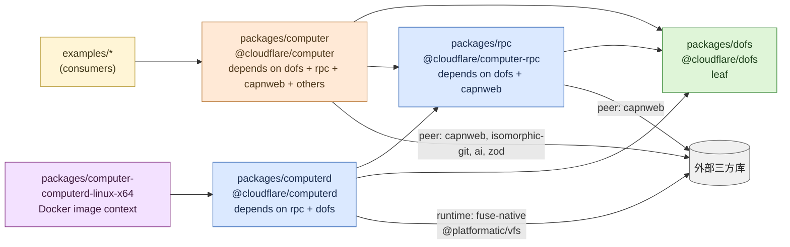

# 7. Monorepo 与五包结构

> **读者**:开发者
> **预计阅读**:7 分钟
> **前置依赖**:[第 1 章 项目定位](01_overview.md)

## 目标

理解 npm workspaces 的拓扑、五个包之间的依赖方向、`exports` 字段的"sub-path 设计"、以及"为什么 `dofs` 在最底层、为什么 `computerd` 不能 import `computer`"。

---

## 7.1 仓库根

`/Users/digoal/new/computer/package.json:0-34` 是 monorepo 协调根,声明:

- `private: true`(只为协调,不直接发布);
- `workspaces`: `packages/dofs, packages/rpc, packages/computerd, packages/computer, examples/*`;
- `packageManager: npm`(**不接受** pnpm / yarn);
- 顶层 devDeps:`@biomejs/biome@^2.4.16`、`@changesets/cli`、`@changesets/changelog-github`、`@types/node`、`esbuild`、`pkg-pr-new`、`postject`、`sherif`、`typescript@^6.0.3`。
- 顶层脚本:`format` / `check` / `check:fix` / `build` / `test` / `typecheck` / `build:all`(完整产物)。

---

## 7.2 F7. 五包依赖关系

**F7. 五包依赖关系** — 严格的"DAG 单向依赖",`dofs` 在最底层

### 依赖方向是严格 DAG

- **`dofs` 是 leaf**,只依赖 `node:crypto` 与 `node:fs/promises`;
- **`rpc` 不 import `computerd`** —— 通过 `RunnerLike` 接口(`packages/rpc/src/server.ts:282-333`)保持依赖向内;
- **`computerd` 不 import `computer`** —— 它只实现被 `rpc` 描述的 server 端;
- **`computer` 是顶层**,可选 peer dep(`capnweb` / `isomorphic-git` / `ai` / `zod`),所以你 import `@cloudflare/computer` 时不会被强制拉这些 peer。
- **无循环依赖**:`packages/computer/src/runtime/runtime.ts` 与 `stub.ts` 的"循环感"被 `capnweb` 的 `RpcTarget` 协议和"stub 是 view,不是构造"打破,`WorkspaceStub` 是 `Workspace` 通过 Workers RPC 暴露的视图,不是构造时引用。

---

## 7.3 包级 entry point 一览

| 包 | entry | sub-path exports | 构建工具 |
|---|---|---|---|
| `packages/dofs` | `.`, `./testing` | — | `tsc -p tsconfig.build.json` |
| `packages/rpc` | `.`(types), `./server`, `./client`, `./driver`, `./debug` | 5 个子入口 | `tsc` + `esbuild` |
| `packages/computer` | `.`, `./git`, `./assets`, `./artifacts`, `./tools`, `./backends/container`, `./backends/worker-javascript`, `./backends/worker-shell`, `./shell/{core,curl,html-to-markdown,python,sqlite,js-exec,yq,file,xan,jq}`, `./observe/cloudflare` | ~18 个子入口 | **Rolldown** + `rolldown-plugin-dts` |
| `packages/computerd` | `.`, `./cli/computerd` | — | `esbuild`(SEA)+ `postject` + Node SEA |
| `packages/computer-computerd-linux-x64` | (Docker image context) | — | — |

### `packages/computer/package.json:16-92` 的 sub-path 设计哲学

每个 `./backends/*` / `./shell/*` 是一个 **独立的 sub-path entry**,目的:

1. **Tree-shake 友好**:用户只 import 用到的 backend / shell 命令,bundler 即可丢弃其余;
2. **避免循环 import**:`./backends/container` 只 export container 相关,不需要把整套 `Workspace` 拉进来;
3. **选择性注入**:`./shell/core` 是必装,`./shell/python`、`./shell/sqlite` 等按需 import 才能加入 bundle。

参见 `packages/computer/rolldown.config.ts:42-52` 和 `packages/computer/src/backends/worker-shell/shell-modules.ts:32` 的 `assembleShellModules(groups)`。

---

## 7.4 各包详情

### `packages/dofs` —— `@cloudflare/dofs`(leaf)

入口:`packages/dofs/src/index.ts:0-67`。导出:

- `Database`、`initializeSchema`、`SQLiteWorkspaceProvider`;
- fs primitives:`mkdir` / `writeFile` / `readFile` / `rm` / `readdir` / `stat` / `chmod` / `find` / `ls` / `grep` / `symlink` / `readlink` / `gc` / `watch`;
- sync building blocks:`applyChanges` / `pushObjects` / `fetchChanges` / `fetchObjects` / `hasObjects` / `buildManifest` / `currentRev`。

子入口 `./testing` 提供 `SQLiteTestStorage`(基于 `node:sqlite`)用于 Vitest。

### `packages/rpc` —— `@cloudflare/computer-rpc`

- `./driver`(`packages/rpc/src/sync-driver.ts:396`):`pullOnce` / `pushOnce` / `tick` / `reconcileWatermarks`;
- `./server`(`packages/rpc/src/server.ts:282-333`):`createSyncServer` / `createShellServer` / `createWorkspaceServer` / `acceptWebSocketSession` / `serveHTTPBatch`;
- `./client`:`createSyncClient` / `createWorkspaceClient`(capnweb stubs);
- `./debug`:stub 跟踪(`enableStubTracking` / `stubSnapshot`);
- `./`(只导出 types,wire 形状契约)。

### `packages/computerd` —— `@cloudflare/computerd`

- CLI:`packages/computerd/src/cli/computerd.ts:448-628` `main()`(HTTP + FUSE + RPC);
- FUSE:`packages/computerd/src/fuse/{driver,backend,vfs,options,tracer}.ts`;
- Shim:`packages/computerd/src/shim/`(用户态 fallback);
- Exec:`packages/computerd/src/exec/{runner,schema,types,log}.ts`;
- 构建:`packages/computerd/scripts/build-{bin,docker}.mjs` + `sea/{bundle,bootstrap}`。

### `packages/computer` —— `@cloudflare/computer`(顶层门面)

- 入口:`packages/computer/src/index.ts:0-105`;
- 核心:`workspace.ts`(facade)、`with-workspace.ts`(DO mixin)、`stub.ts`(RPC stub)、`backend.ts`(接口);
- Runtime:`runtime/{runtime,types,bridge,capability,wire}.ts`;
- Backends:`backends/{container,worker-shell,worker-javascript,test}.ts`;
- Git:`git/index.ts` + `git/{adapter,clone,...}.ts`(基于 `isomorphic-git`);
- Tools:`tools/{ai,exec,publish,fs/*}.ts`(`createAITools` 装 AI SDK tools);
- Artifacts / Assets:`artifacts/`、`assets/`(R2 presigned URL);
- Test harness:`test-harness/{with-workspace,end-to-end,shell}.ts` + `tests/{proxy,worker-backend,stub-soak,script-runner}.test.ts`。

### `packages/computer-computerd-linux-x64`

仅承载 `Dockerfile` + `.dockerignore` + `README.md`,发布物是 Docker 镜像(GHCR + `registry.cloudflare.com`)。详见 [`docs/10_project_layout.md`](../10_project_layout.md)。

---

## 7.5 import 时该怎么选?

| 你想做什么 | 该 import |
|---|---|
| 在 Worker / DO 中构造一个 workspace | `@cloudflare/computer` |
| 把 fs / runtime stub 暴露给另一个 Worker | `@cloudflare/computer`(`__getWorkspaceStub()`) |
| 用 AI SDK 工具集(读 / 写 / 编辑 / ls / exec) | `@cloudflare/computer/tools`(`createAITools`) |
| 在 workspace 里跑 git | `@cloudflare/computer/git`(`createGitClient`) |
| 把文件上传成 R2 presigned URL | `@cloudflare/computer/assets`(`createAssets`) |
| 写一个自定义 backend | `@cloudflare/computer/backends/<your-name>`,模仿 `backends/container` |
| 直接 sync 协议(自己实现对端) | `@cloudflare/computer-rpc/{client,server,driver}` |
| 直接 VFS(不想要 workspace / backend) | `@cloudflare/dofs` |

---

## 7.6 改动一个包时,如何波及?

`AGENTS.md` 与 `COLLABORATORS.md` 强调:"每个变更落在 owning package;一处跨包修改也算一个 commit"。

例如修改了 `packages/dofs/src/sync/manifests.ts` 中的 `ManifestChunk`,那么:

1. `packages/rpc/src/interface.ts` 中 wire 形状可能受影响(若改了 hash 算法);
2. `packages/computer/src/workspace.ts` 中的 `push` / `pull` 可能要重跑回归测试;
3. `packages/computer/test-harness/end-to-end.test.ts` 跑完整链路;
4. examples 中若有对应 demo,需要重跑 `npm run dev` 验证。

`AGENTS.md:175-179` 明确:"每个 example 都是真实消费者,必须随公共 API 变化更新"。

---

## 延伸阅读

- [第 8 章:VFS 深入](08_dev_vfs.md) — `dofs` 内核细节
- [第 9 章:自定义后端](09_dev_backend.md) — 如何扩展 `computer`
- [第 10 章:客户端与 SDK](10_dev_client.md) — `withWorkspace` 与 capnweb 链
- [`docs/10_project_layout.md`](../10_project_layout.md) — 既有专题:monorepo 布局
- [`COLLABORATORS.md`](../../COLLABORATORS.md) — 协作者 commit / PR / 跨包规则