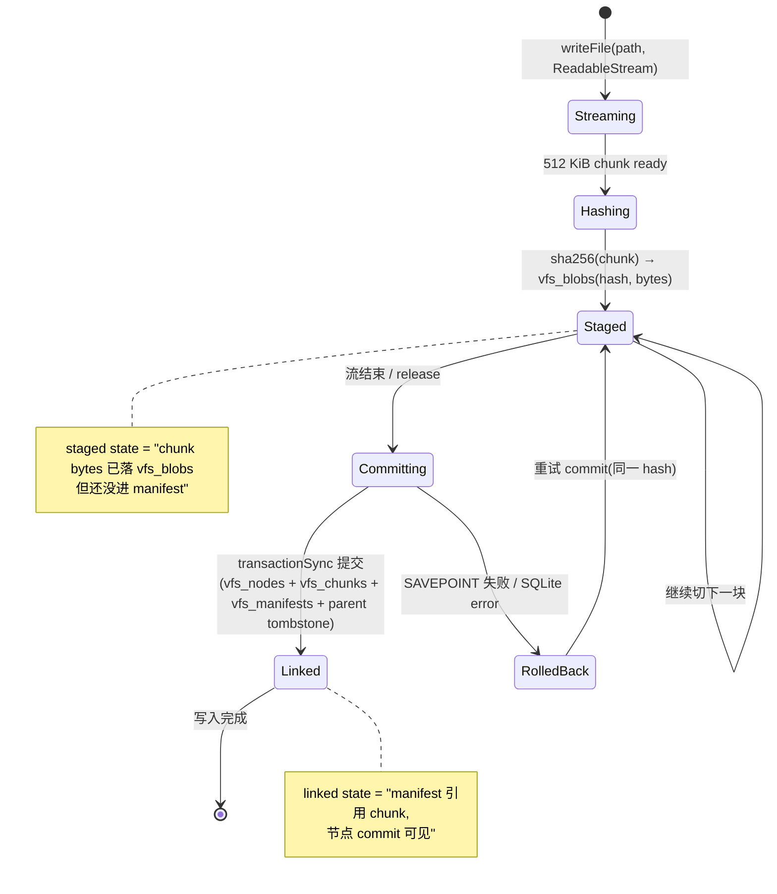
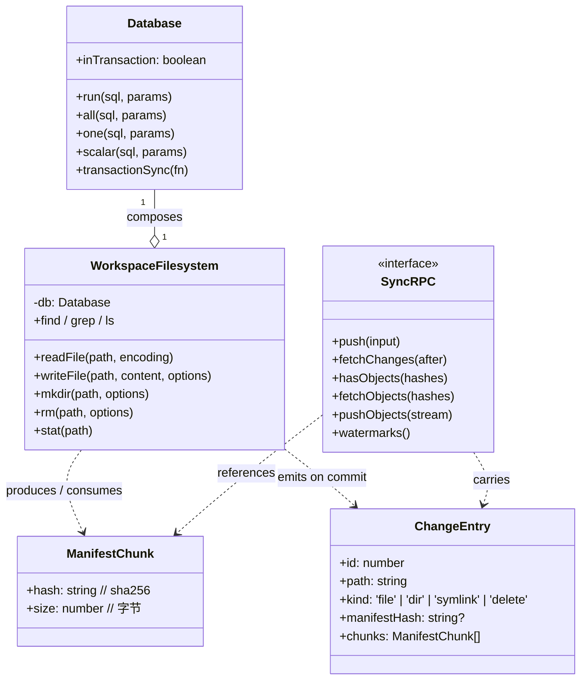

# 8. VFS 深入

> **读者**:开发者
> **预计阅读**:10 分钟
> **前置依赖**:[第 7 章 五包结构](07_dev_packages.md)

## 目标

从数据结构层面理解 VFS:**inode / 目录 / 链接** 怎么落表、**512 KiB chunk + sha256** 如何切分、**staged-chunk 与最终 link** 是怎么一回事(对应 `8758b51` 提交修复的守卫点)。

---

## 8.1 SQLite 表结构(精简版)

详细 DDL 见 [`docs/03_filesystem_schema.md`](../03_filesystem_schema.md)。下表只列与开发者日常相关的内容:

| 表 | 角色 | 关键列 |
|---|---|---|
| `vfs_nodes` | inode 级元数据 | `path` / `kind` / `mode` / `mtime` / `size` / `manifest_hash` / `mount_root` |
| `vfs_dirents` | 目录条目 | `parent` / `name` → child `node_id` |
| `vfs_chunks` | 文件到 chunk 列表 | `manifest_hash` / `idx` / `blob_hash` / `size` |
| `vfs_manifests` | content-addressed manifest | `hash` / `size` / `chunk_count`(主键 = hash) |
| `vfs_blobs` | content-addressed 字节 | `hash` / `bytes`(512 KiB chunk 落点) |
| `vfs_changes` | 同步变更日志(tombstone 风格) | `id` / `path` / `kind` / `manifest_hash` / `deleted` |
| `vfs_meta` | KV 风格元数据 | `key` / `value` |
| `_vfs_watermark` | 同步游标 | `pushRev` / `fetchRev`(持久化对端协商) |
| `_vfs_fetch_cursor` | 拉取游标 | `rev` |
| `_vfs_mounts` | 挂载表(planning) | `path` / `mount_root` / `kind` |

`packages/dofs/src/schema/{core,sync,migrations}.ts` 是这三张核心 DDL 的源码位置。

---

## 8.2 F8. VFS 状态机 — staged → linked

**F8. VFS 状态机** — 一个 chunk 在写入 + 同步过程中的状态迁移



### 关于 `8758b51` 的关键背景

最近一次提交 `dofs: Guard the staged-chunk link path` 修复了一个 VFS 守卫问题:

- 在 `commit` 期间,如果某些 chunk 已被 staged(进了 `vfs_blobs`)但尚未被 manifest 引用,而系统此时异常退出(进程崩溃、事务回滚、外部取消);
- **修复前**:重新打开 workspace 时,可能出现 `vfs_manifests` 引用了不存在的 `vfs_blobs` 行的孤立 manifest;
- **修复后**:commit 路径上的"link 阶段"加了守卫,保证 manifest 引用的每个 blob 都存在且未在回收期。

详见 [第 6 章:常见错误与排查](06_user_troubleshooting.md#69-升级到包含-8758b51-之后) 与提交 `b96015e dofs: Link staged chunks during sync apply`。

---

## 8.3 F9. chunk 存储类图

**F9. chunk 存储类图** — `Database` / `WorkspaceFilesystem` / `ManifestChunk` / `ChangeEntry` 的协作



要点:

- `Database` 是唯一的 SQL 入口(`packages/dofs/src/storage.ts:3`);
- `ManifestChunk` 是 `vfs_manifests` 的 entry 类型(`packages/dofs/src/sync/manifests.ts:14`);
- `ChangeEntry` 是 `vfs_changes` 的 entry 类型(`packages/dofs/src/sync/changes.ts:23`),带 chunk 列表但不带 bytes —— bytes 在后续的 `fetchObjects` / `pushObjects` 步骤中走。

---

## 8.4 写入路径细节

`packages/dofs/src/fs/writeFile.ts`:

1. 把 `ReadableStream<Uint8Array>` 切成 512 KiB 块;
2. 每块独立 sha256 → 写入 `vfs_blobs`(同一 hash 幂等);
3. 等流结束 / release 时,**在一次 `transactionSync` 中**提交:
   - `vfs_nodes`(路径 → manifest_hash);
   - `vfs_chunks`(manifest_hash → blob_hash,idx,size);
   - `vfs_manifests`(hash = sha256(chunks));
   - `vfs_changes` 中父目录的 tombstone(标记 parent dirty)。
4. 返回。

**好处**:

- 峰值内存 = 一个 chunk + source pacing;
- 跨路径 chunk 自动去重;
- 单事务保证:要么全成功,要么全回滚。

`packages/dofs/src/storage.ts:12-58` 的 `Database.transactionSync` 支持 `SAVEPOINT`,允许 FS 层嵌套事务而不打破 DO 最外层事务契约。

`inTransaction` 标志(`packages/dofs/src/storage.ts:72`)防止 resolve cache 在事务中保留未提交的中间态 —— 一旦事务回滚,缓存不会泄露错误结果。

---

## 8.5 读取路径细节

`packages/dofs/src/fs/readFile.ts`:

1. `resolveInode(path)` 走 40 跳限制的符号链接解;
2. 读 `vfs_nodes` → manifest_hash;
3. 顺序拉 manifest 里的每块 → `vfs_blobs` → 拼成 `ReadableStream<Uint8Array>` 返回;
4. 若 `encoding === "utf8"`,串接 chunks 后 `TextDecoder` 解码返回 string。

读路径上有两层缓存:

- **resolve cache**(`packages/dofs/src/fs/resolveCache.ts`):`path → node_id` 缓存,事务感知;
- **blob cache**(`packages/dofs/src/fs/blobCache.ts`):避免同一 chunk 重复 SQL 读。

---

## 8.6 删除 / 重命名

- `rm(path, options)`:在 `vfs_changes` 写 tombstone + `vfs_nodes` 删除行;若 `recursive: true`,先 `readdir` 递归;
- `rename(from, to)`:更新 `vfs_nodes` 行 + 写 `vfs_changes` 让对端感知;
- 注意 `unlink`(只删 link 不删节点)与 `rm` 的区别 —— VFS 把两者合并为同一个语义。

---

## 8.7 链接 / 符号链接

- `symlink(target, linkPath)`:写 `vfs_nodes`(`kind = symlink`),`resolveInode` 在 40 跳内解;
- `readlink(linkPath)`:返回 `vfs_nodes.target`;
- `link(src, dst)`:hard link,目前在 VFS 中只是创建一个 `kind = file` 的新 node 指向同一 manifest,**`vfs_changes` 中会标记两处 dirty** —— 这意味着 DO 同步会传两个 entry。

---

## 8.8 同步时:VFS 表之间的耦合

最关键的两条约束(`docs/02_sync_protocol.md`):

1. **每个 chunk 必须先 staged(进 `vfs_blobs`)再 linked(进 `vfs_manifests`)**;
2. **watermark 与数据在同一事务中持久化**:`_vfs_watermark.pushRev = max(rev)` 与新 `vfs_changes` 行一起 commit,所以 watermark 永远不会"指向没 commit 的数据"。

这两条约束在最近几个 commit 中反复强化:`b96015e` 加 link 步骤,`8758b51` 加 link 守卫,`1273ff86` 把 `hasObjects` 批量化以减少 DO SQLite 调用次数。

---

## 8.9 调试 VFS 状态

```bash
# 看 DOFS 表行数 + orphan blob
curl http://127.0.0.1:$PORT/__computerd/stats | jq

# 看 staged vs linked(详见 packages/dofs/src/bench/counting-storage.ts)
# CountingStorage 装饰 SQL 调用的读 / 写次数,可证明 resolveInode = 1 + 2D
```

`packages/dofs/src/bench/counting-storage.ts` 是性能基准工具,记录每次 `sql.exec` 的读 / 写次数与行数,在 dev / test 时开,在 production 关。

---

## 8.10 性能含义

- **元数据密集**(stat / rm / mkdir / find / git init):O(D) SQL 操作,有 resolve cache + 索引 `vfs_changes_by_path`(`packages/dofs/src/schema/sync.ts:25`)→ 比磁盘快或持平;
- **大块顺序 I/O**:每个 chunk 都要 hash + stage,单 chunk SHA-256 是固定开销 → 30x+ 慢于 ext4;
- **跨路径去重收益**:若多文件共享 chunks(例如 git history),总存储 << N × size。

完整数字见 [`docs/19_performance.md`](../19_performance.md) 与 [第 17 章](17_arch_performance.md)。

---

## 延伸阅读

- [第 6 章:常见错误与排查](06_user_troubleshooting.md#64-写入期错误vfs--chunk--sha256) — 写入错误表
- [第 15 章:一致性与并发](15_arch_consistency.md) — watermark + 最终一致性
- [第 17 章:性能、成本、扩展性](17_arch_performance.md) — chunk SHA-256 是核心 trade-off
- [`docs/01_vfs.md`](../01_vfs.md) — 既有专题:VFS 树布局
- [`docs/03_filesystem_schema.md`](../03_filesystem_schema.md) — 既有专题:表 DDL
- [`docs/02_sync_protocol.md`](../02_sync_protocol.md) — 既有专题:同步协议