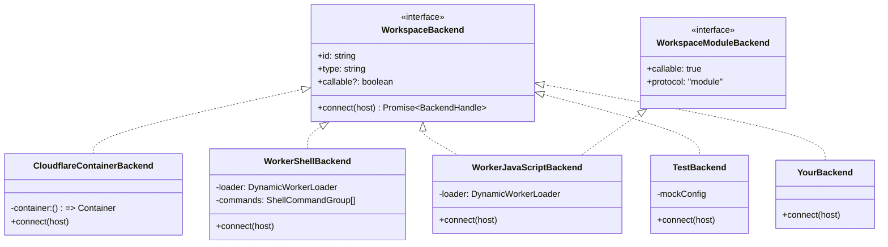

# 9. 自定义后端

> **读者**:开发者
> **预计阅读**:8 分钟
> **前置依赖**:[第 7 章 五包结构](07_dev_packages.md)、[第 8 章 VFS 深入](08_dev_vfs.md)

## 目标

理解 `WorkspaceBackend` 契约、能写一个最小 backend、知道它和 `Workspace` / `WorkspaceRuntime` 的连接点。

---

## 9.1 契约:`WorkspaceBackend`

`packages/computer/src/backend.ts:38` 定义:

```ts
interface WorkspaceBackend {
  readonly id: string;          // 路由时用的 id
  readonly type: string;        // 类型描述("container" / "worker-shell" / "worker-javascript" / "test" / "your-name")
  readonly callable?: boolean;  // 是否支持 callable(模块化)execution
  connect(host: WorkspaceBackendHost): Promise<BackendHandle>;
}
```

`BackendHandle`:

```ts
interface BackendHandle {
  rpc: WorkspaceRPC;            // { sync: SyncRPC, shell: ShellRPC }
  sync: "remote" | "none";      // 走 wire 还是 loopback
  closed?: { reason?: string };
  close?(): Promise<void>;
}
```

`WorkspaceBackendHost` 由 workspace 构造时传入,内含 `db` / `fs` / `git` / `artifacts`,只有 `loopback` / `module` 类型的 backend 会用到。

### `WorkspaceModuleBackend`(子契约)

对于支持 callable execution 的 backend(`callable?: true`),需要:

```ts
interface WorkspaceModuleBackend extends WorkspaceBackend {
  readonly callable: true;
  readonly protocol: "module";  // 协议版本
  // 额外:实现 host-side 的 ModuleExecutor
}
```

---

## 9.2 F10. Backend 适配器模式

**F10. Backend 适配器模式类图** — 4 个参考实现 + 自定义 backend 如何插入



---

## 9.3 四个参考实现对比

| Backend | 入口文件 | `callable?` | `sync` | 真实 Linux | 主要用途 |
|---|---|---|---|---|---|
| `CloudflareContainerBackend` | `packages/computer/src/backends/container/cloudflare-container.ts:141` | `false` | `"remote"` | ✅ | 需要 `npm` / `git` / `pandoc` 等真实 Linux userland |
| `WorkerShellBackend` | `packages/computer/src/backends/worker-shell/worker-shell.ts:156` | `false` | `"none"`(loopback) | ❌ | `just-bash` 子集 + shell 工具(grep / curl / ...) |
| `WorkerJavaScriptBackend` | `packages/computer/src/backends/worker-javascript/worker-javascript.ts:134` | `true` | `"none"`(loopback) | ❌ | 跑 ECMAScript module + `node:fs/promises` |
| `TestBackend` | `packages/computer/src/backends/test.ts:1` | `false` | `"remote"` | — | 测试 / CI / mock |

### 关键差异

- **`sync: "remote"`** 必须支持 wire:`push` / `pull` / `fetchObjects` / `hasObjects` / `pushObjects`;
- **`sync: "none"`** 是 loopback:Workspace 内部知道 host `db` / `fs`,不走 wire;
- **`callable: true`** 让 backend 跳过 `push → exec → pull` 括号,改为"host capability calls"—— 适合 sandboxed 进程隔离场景。

---

## 9.4 写一个最小 backend:loopback shell

下面这个 backend 完全在 host 内运行(没有 wire),适合做"格式化"或"小计算":

```ts
// packages/computer/src/backends/your-name.ts
import type { WorkspaceBackend, BackendHandle, WorkspaceBackendHost } from "../backend.js";

export class LoopbackExecBackend implements WorkspaceBackend {
  readonly id: string;
  readonly type = "loopback-exec";

  constructor(opts: { id: string }) { this.id = opts.id; }

  async connect(_host: WorkspaceBackendHost): Promise<BackendHandle> {
    const ws = this; // already loopback
    return {
      sync: "none",
      rpc: {
        sync: {
          // loopback: 直接用 host.db
          push: async () => {},
          fetchChanges: async function* () {},
          hasObjects: async () => new Set(),
          fetchObjects: async function* () {},
          pushObjects: async () => {},
          watermarks: async () => ({ pushRev: 0n, fetchRev: 0n }),
        },
        shell: {
          // 简化:用 Node 子进程跑命令
          exec: ({ source, cwd, env }) => {
            const { readable, writable } = new TransformStream<Uint8Array, ExecEvent>();
            const proc = spawn(source, { cwd, env, shell: true });
            proc.stdout.on("data", (b) => writable.getWriter().write({ name: "stdout", value: b }));
            proc.stderr.on("data", (b) => writable.getWriter().write({ name: "stderr", value: b }));
            proc.on("close", (code) => {
              writable.getWriter().write({ name: "exit", value: code });
              writable.getWriter().close();
            });
            return readable;
          },
          getExec: async () => null,
          killExec: async () => {},
          disposeExec: () => {},
        },
      } as WorkspaceRPC,
    };
  }
}
```

注册:

```ts
new Workspace({
  storage: ctx.storage,
  backends: [
    new LoopbackExecBackend({ id: "loopback" }),
    // ... 其它
  ],
});
```

---

## 9.5 写一个 remote backend(走 capnweb wire)

如果 backend 跑在另一个进程(Container / 远程 worker),需要实现 `sync: "remote"` —— 即实现 `SyncRPC` + `ShellRPC` 的远端版本,通过 capnweb WebSocket 调用。

实际例子是 `CloudflareContainerBackend.connect`:

1. `container.start()` / `restartAttempts`;
2. `POST /connect`(egress-routed 到 `computer.internal`);
3. WebSocket Upgrade → capnweb session;
4. 返回 `{ rpc: capnweb.createStub<WorkspaceRPC>(), sync: "remote" }`。

`packages/rpc/src/server.ts:282-333` 的 `createWorkspaceServer(db, rpcRunner, opts)` 是对端 server 实现 —— backend 实现者只需要复用这个工厂,不必自己写 capnweb。

`ServerOptions.afterApply` 与 `ServerOptions.beforeFetch`(`packages/rpc/src/server.ts:58`)是同步事件 hook 点 —— Container backend 在这里把 shim 的 `flush()` / `reconcileNow()` 串起来,确保 FUSE 写能进 VFS 后再走下一次 sync。

---

## 9.6 模块后端(`callable: true`)

`WorkerJavaScriptBackend` 是参考实现。它使用:

- `frames.ts` 序列化执行事件;
- `module-graph.ts` 解决 durable relative imports;
- `WorkspaceScopedFS`(`packages/computer/src/runtime/capability.ts:1`)作为 host capability —— 这是"FS 调用必须经过的一扇门",做路径限制、读 / 写权限、字节 / 目录条目限额。

```ts
// 简化骨架
class MyModuleBackend implements WorkspaceModuleBackend {
  readonly id = "my-module";
  readonly type = "my-module";
  readonly callable = true;
  readonly protocol = "module" as const;

  async connect(host: WorkspaceBackendHost): Promise<BackendHandle> {
    const handle = new MyModuleHandle(host);
    return {
      sync: "none",
      rpc: handle.toRPC(),
      close: () => handle.dispose(),
    };
  }
}
```

---

## 9.7 加入到 package.json 的 sub-path

`packages/computer/package.json` 的 `exports` 字段需要加入:

```jsonc
"./backends/your-name": {
  "import": "./dist/backends/your-name.js",
  "types": "./dist/backends/your-name.d.ts"
}
```

并在 `packages/computer/rolldown.config.ts` 中加入新 entry,使 rolldown 把它打成独立 chunk。

---

## 9.8 自检测试

模仿 `packages/computer/src/backends/worker-shell/entrypoint.test.ts` 写一个 `entrypoint.test.ts`,然后:

```bash
npm run build:bin --workspace=@cloudflare/computer
npm test --workspace=@cloudflare/computer -- src/backends/your-name
```

也可以参考 `packages/computer/test-harness/end-to-end.test.ts` 跑完整的"DO ↔ backend"链路。

---

## 9.9 常见陷阱

1. **忘记实现 `disposeExec` / `close`**:stub 泄漏,直到 `getWorkspace(...)` 释放;
2. **loopback backend 错误地返回 `sync: "remote"`**:Workspace 会试图走 push→exec→pull 括号,而 host 没有对端 → 抛 `EAUTH` / `ESHUTDOWN`;
3. **可写 backend 没用 `WorkspaceScopedFS`**:`node:fs/promises` 直读 / 直写 host disk,绕过了事务隔离 → 调试极难;
4. **shell backend 用 `child_process.spawn` 但没 drain stdout**:子进程死锁,exec 永远卡住。

---

## 延伸阅读

- [第 3 章:安装、配置、4 选 1 后端决策](03_user_install.md#33-f3-后端选型决策树) — 决策树
- [第 10 章:客户端与 SDK](10_dev_client.md) — `withWorkspace` 与 capnweb 链
- [第 13 章:核心抽象](13_arch_abstractions.md) — "Execution as a Message" 抽象
- [`packages/computer/src/backend.ts`](../../packages/computer/src/backend.ts) — 完整契约
- [`docs/12_worker_backend.md`](../12_worker_backend.md) — 既有专题:just-bash Dynamic Worker
- [`docs/17_isolate_javascript.md`](../17_isolate_javascript.md) — 既有专题:ECMAScript module