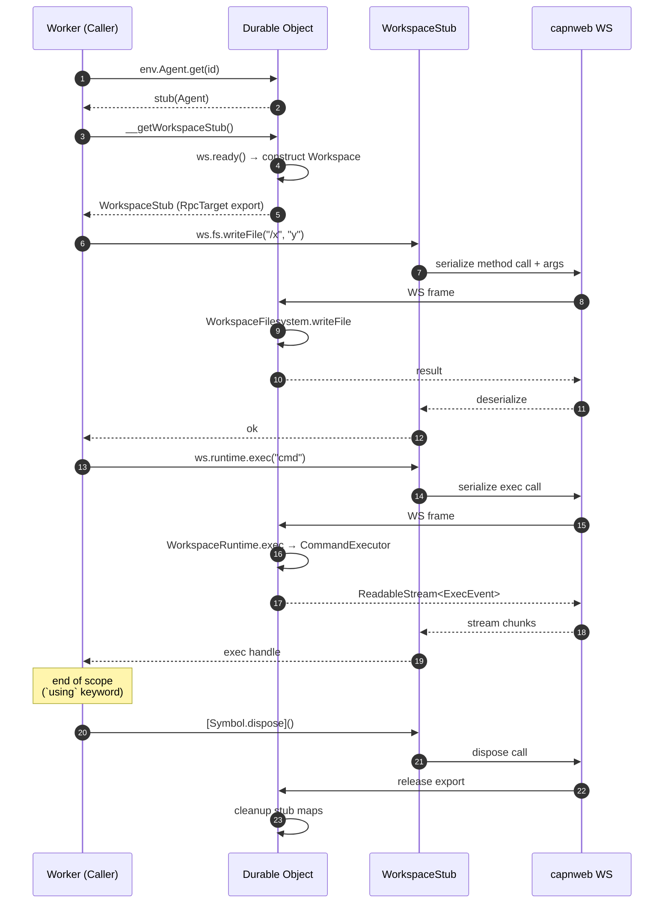

# 10. 客户端与 SDK

> **读者**:开发者
> **预计阅读**:8 分钟
> **前置依赖**:[第 7 章 五包结构](07_dev_packages.md)

## 目标

理解 `withWorkspace` mixin、capnweb 的 `RpcTarget` 是怎么把 DO 暴露成 RPC stub 的、`WorkspaceStub` 怎么消费、stub disposal contract 是什么。

---

## 10.1 `withWorkspace` mixin 完整路径

`packages/computer/src/with-workspace.ts:34-79`:

```ts
export const WORKSPACE = Symbol("workspace");

export interface WorkspaceStubHost {
  __getWorkspaceStub(): Promise<import("./stub.js").WorkspaceStub>;
}

export function withWorkspace<TBase extends DOCtor>(
  Base: TBase,
  options: (self: InstanceType<TBase>) => WorkspaceOptions,
): WithWorkspaceCtor<TBase> {
  class WithWorkspace extends Base {
    constructor(...args: any[]) {
      super(...args);
      (this as unknown as WorkspaceLocalHost)[WORKSPACE] =
        new Workspace(options(self));
    }

    __getWorkspaceStub() {
      const ws = (this as unknown as WorkspaceLocalHost)[WORKSPACE];
      return (async () => {
        await ws.ready();
        return ws.stub();
      })();
    }
  }
  return WithWorkspace as WithWorkspaceCtor<TBase>;
}
```

要点:

- `__getWorkspaceStub()` 是 capnweb `RpcTarget` 的入口 —— 任何标记这个方法的类都可以被远端 RPC 调用;
- `WORKSPACE` 是私有 symbol,只挂 DO 实例上;
- `WorkspaceOptions` 是构造时确定的,运行期不再变化;
- `ws.stub()` 把内部 `Workspace` 转为 `WorkspaceStub`(即 `WorkspaceFilesystemStub` / `WorkspaceRuntimeStub` / ...)。

---

## 10.2 在 Worker 端取出 stub

`packages/computer/src/client.ts:366-406`:

```ts
export async function getWorkspace(host: WorkspaceStubHost): Promise<WorkspaceStub> {
  return await host.__getWorkspaceStub();
}

// 用法
const id = env.Agent.idFromName("user-123");
using ws = await getWorkspace(env.Agent.get(id));
```

`using` 触发 stub 的 `[Symbol.dispose]()`,capnweb 会向 DO 发"释放 export #N" 帧。

---

## 10.3 `WorkspaceStub` 视图

`packages/computer/src/stub.ts:90+` 导出:

| Stub | 职责 |
|---|---|
| `WorkspaceStub` | 顶层组合 |
| `WorkspaceFilesystemStub` | `fs.writeFile` / `fs.readFile` / `fs.mkdir` / ... |
| `WorkspaceRuntimeStub` | `runtime.exec` / `runtime.getExec` / `runtime.killExec` |
| `WorkspaceRuntimeExecHandleStub` | `stream()` / `result()` / `[Symbol.dispose]()` |
| `WorkspaceGitStub` | `git.clone` / `git.add` / `git.commit` / ... |
| `WorkspaceAssetsStub` | `assets.publish` / ... |

这些 stub 都是 `Workspace` 类的"远端视图":客户端看到的方法签名一致,但实现走 capnweb 的序列化 / 反序列化,而不是 in-process 调用。

`stub.ts:132-145` 中 `statOrNull` / `lstatOrNull` 主动 swallow `ENOENT` 返回 `null` —— 这是 stub 层与 in-process 的语义差异,需要调用方注意。

---

## 10.4 F11. 客户端 ↔ DO 数据流

**F11. 客户端 ↔ DO 数据流时序图** — `using ws = getWorkspace(...)` 一次完整生命周期



---

## 10.5 capnweb 调用链解析

`getWorkspace` 客户端返回的 stub 实际上是一个 **capnweb proxy** —— 你对它的每次方法调用都走:

1. **序列化参数** → capnweb 帧(capnweb 自带二进制 schema);
2. 通过 WS 发送;
3. DO 端 `__getWorkspaceStub()` 返回的对象上的同名方法被调用;
4. 返回值序列化 → WS → 客户端反序列化。

关键边界:

- **`ReadableStream` / `TransformStream` 走 capnweb 的 streaming protocol**(不是普通 RPC)—— 端到端 backpressure;
- **错误传播**:`WorkspaceError` 走 `error.code` 保留,其它错误被包装;
- **传输失败**:`packages/computer/src/transport-failure.ts` 的 `isWorkspaceTransportFailure` 区分 WS 断连与业务错误,不要把 transport failure 当作业务错误吞掉。

---

## 10.6 Stub disposal contract(必读)

`packages/rpc/src/interface.ts` 与 `docs/11_lifecycle.md:201-279` 强调:

| 句柄 | 谁负责 dispose? | 何时触发? |
|---|---|---|
| `WorkspaceStub`(`using ws = await getWorkspace(...)`) | 调用方(`using` / `[Symbol.dispose]()`) | scope 结束 |
| `WorkspaceRuntimeExecHandleStub`(`runtime.exec(...)` 返回) | 调用方 | scope 结束,或显式 `[Symbol.dispose]()` |
| `WorkspaceFilesystemStub` / `WorkspaceGitStub` 等子 stub | 跟 `WorkspaceStub` 走 | 不需要单独 dispose |
| `BackendHandle`(在 DO 内部) | workspace 自动管理(`#handles` Map + `connectionGeneration`) | ws 断 / container 重启时 |

**常见错误**:

```ts
// ❌ 泄漏:handle 永不释放 → 远端 stub 累加
const handle = ws.runtime.exec("long-task");
// ... 没有 using,也没有 [Symbol.dispose]

// ✅ 推荐
{
  using handle = ws.runtime.exec("long-task");
  for await (const event of handle) { ... }
}
```

调试时启用 `CAPNWEB_TRACK_STUBS=1` + `GET /__computerd/stubs`。

---

## 10.7 in-process vs RPC 路径

`packages/computer/src/client.ts` 同时支持两条路径:

- **In-process**(DO 内部代码直接拿到 `Workspace`):不走 RPC,无序列化成本;
- **RPC**(Worker 端通过 stub):走 capnweb 序列化 + WS。

`WorkspaceProxy`(`packages/computer/src/proxy.ts`)只在 workerd 中可用;`packages/computer/src/proxy-stub.ts` 是 Node 端 fallback,实例化时 throw —— 这保证 import graph 在 vitest(node)中不会破坏。

---

## 10.8 AI SDK 工具集

`packages/computer/src/tools/ai.ts`(`createAITools({ workspace, read, write, edit, ls, shell, publish? })`)把 fs / runtime 打包成 AI SDK 工具,直接对接 `@cloudflare/think`:

```ts
import { createAITools } from "@cloudflare/computer/tools";
import { Think } from "@cloudflare/think";

const tools = createAITools({ workspace });

const agent = new Think({
  model,
  system: "You are an agent ...",
  tools,
});
```

`examples/think` 演示了完整用法。

---

## 10.9 常见 bug

1. **`new Workspace(...)` 后立刻 `ws.runtime.exec(...)`**:`runtime` 是 lazy 的,要先 `await ws.ready()`,否则 backend 还没建立;
2. **忘记 `using`**:`__computerd/stubs` 数量持续上涨,OOM 后才崩;
3. **In-process 测试用了 RPC stub**:Vitest 是 node 环境,应直接用 `Workspace` + `TestBackend` 而不是 stub;
4. **跨域 DO 访问 stub**:DO 之间的 RPC 必须通过 `idFromName` / `idFromString`,不能用别人构造的 stub。

---

## 延伸阅读

- [第 4 章:基础操作](04_user_basics.md) — 用户视角
- [第 11 章:测试与调试](11_dev_testing.md) — TestBackend + Vitest
- [第 14 章:capnweb 协议与数据流](14_arch_protocol.md) — 协议栈细节
- [`docs/08_capnweb_interface.md`](../08_capnweb_interface.md) — 既有专题:capnweb 协议
- [`docs/11_lifecycle.md`](../11_lifecycle.md) — 既有专题:incarnation / container 生命周期
- [`packages/computer/src/with-workspace.ts`](../../packages/computer/src/with-workspace.ts) — mixin 源码