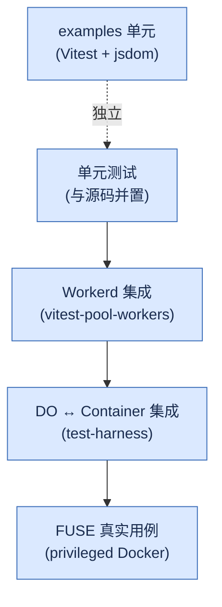

# 11. 测试与调试

> **读者**:开发者
> **预计阅读**:7 分钟
> **前置依赖**:[第 9 章 自定义后端](09_dev_backend.md)、[第 10 章 客户端与 SDK](10_dev_client.md)

## 目标

掌握 `TestBackend` + Vitest 的双 runner 配置(node 与 workerd)、capnweb 报文调试、以及性能基准的入口。

---

## 11.1 测试布局约定

| 范围 | 位置 | Runner |
|---|---|---|
| 单元测试 | `packages/<pkg>/src/**.test.ts`(与源码并置) | Vitest node |
| Workerd 集成测试 | `packages/computer/tests/{proxy,worker-backend,stub-soak,script-runner}.test.ts` | Vitest + `@cloudflare/vitest-pool-workers` |
| DO ↔ Container 集成 | `packages/computer/test-harness/{end-to-end,shell}.test.ts` + `run-harness.sh` | 真 container,需 `COMPUTERD_HARNESS_URL` |
| FUSE 真实用例 | `packages/computerd/src/exec/runner.fuse.test.ts` | privileged Docker + 预编译 `computerd` |
| Examples 单元 | `examples/think-compare-runtimes/src/*.test.tsx` | Vitest + jsdom + React Testing Library |

每条规则详见 [`AGENTS.md`](../../AGENTS.md) 与 `.agents/skills/test-driven-development/SKILL.md`。

---

## 11.2 F12. 测试金字塔

**F12. 测试金字塔** — Computer 的测试分层



---

## 11.3 `TestBackend` 速览

`packages/computer/src/backends/test.ts:1` 是一个 in-memory 假后端,适合 Vitest 与本地 dev:

- 不走 capnweb wire;
- 内部用 `Database` 与真实 fs 接口;
- `runtime.exec` 用 Node 子进程或 mocked handler。

最小用法:

```ts
import { Workspace, TestBackend } from "@cloudflare/computer";
import { SQLiteTestStorage } from "@cloudflare/dofs/testing";

const db = new SQLiteTestStorage();
const ws = new Workspace({
  storage: db,
  backends: [new TestBackend({ id: "test" })],
});

await ws.fs.writeFile("/x", "y");
expect(await ws.fs.readFile("/x", "utf8")).toBe("y");
```

`SQLiteTestStorage` 基于 `node:sqlite`(`packages/dofs/src/testing.ts:33-77`),全 monorepo 48 处复用。

---

## 11.4 Vitest 配置矩阵

`packages/computer` 有 **5 个 vitest config**:

| Config | 用途 | 入口 |
|---|---|---|
| `vitest.config.ts` | 默认(node + `cloudflare:workers` throwing stub + shell module aliases) | `npm test` |
| `vitest.config.proxy.ts` | Proxy 集成 | `npm run test -- --config vitest.config.proxy.ts` |
| `vitest.config.worker-backend.ts` | Worker backend 集成(`@cloudflare/vitest-pool-workers`) | `npm run test -- --config vitest.config.worker-backend.ts` |
| `vitest.config.script-runner.ts` | `script/` 工具 | `npm run test -- --config vitest.config.script-runner.ts` |
| `vitest.config.stub-soak.ts` | Stub leak 长跑 | `npm run test -- --config vitest.config.stub-soak.ts` |

`packages/dofs` 同样有双 runner:`vitest.config.ts`(node)+ `vitest.config.workers.ts`(workerd),后者通过 alias 把 `with-db.js` 指向 `with-db.workers.ts`。

`packages/computerd` 单 config(`environment: node` + `fileParallelism: false` + `testTimeout: 60s`),因为 FUSE 测试需要稳定的进程环境。

---

## 11.5 跑测试的正确顺序

`AGENTS.md` 强调:

```bash
# 干净 checkout 必须先 build 再 test
npm run build
npm test

# 单包
npm test --workspace @cloudflare/dofs
npm test --workspace @cloudflare/dofs -- src/foo.test.ts

# 完整产物
npm run build:all
```

直接 `npm test` 在 clean checkout 上跑会失败(因为 `@cloudflare/dofs/dist/...` 不存在)。

---

## 11.6 TDD 规范

`.agents/skills/test-driven-development/SKILL.md`:

- 新功能 → 先写测试;
- 修 bug → 先写复现测试;
- 重构 → 跑全部测试通过后开始。

> ⚠ 仓库**没有**集中式代码覆盖率工具链(无 vitest --coverage / codecov / c8 配置在 `package.json` 中)。这是个已知的待补项。

---

## 11.7 调试 capnweb 报文

`computerd` 默认 WS 帧不开 permessage-deflate,只有显式开(`noServer: true, perMessageDeflate: true`)才压缩。

调试手法:

```bash
# 1. 启用 stub 跟踪
export CAPNWEB_TRACK_STUBS=1

# 2. 跑一段时间后查 stub 数量
curl http://127.0.0.1:$PORT/__computerd/stubs | jq

# 3. 长跑查 stub 泄漏
node script/computerd-stub-soak.mjs

# 4. 同步一致性长跑
node script/computerd-soak.mjs
```

`@cloudflare/computer-rpc/debug` 子路径(`packages/rpc/src/debug.ts`)提供代码侧的 `enableStubTracking` / `stubSnapshot`。

---

## 11.8 调试 VFS

```bash
# 1) DOFS 表行数 + RSS + heap
curl http://127.0.0.1:$PORT/__computerd/stats | jq

# 2) staged vs linked:看 orphan_blobs 计数
# 持续上涨 → manifest 引用了不存在 blob,升级到 8758b51 之后

# 3) 装饰 SQL:packages/dofs/src/bench/counting-storage.ts
# CountingStorage 记录每次 sql.exec 的读 / 写次数 + 行数
```

---

## 11.9 性能基准

| 脚本 | 用途 |
|---|---|
| `script/fs-bench.sh` / `run-fs-bench.sh` | tmpfs / ext4 / `computerd` FUSE 三方对比 |
| `script/run-npm-bench.sh` / `run-npm-bench-inner.sh` | 完整 `npm install` 对比 |
| `script/exec-tests` | `shell.exec` 场景 |
| `script/run-fs-tests.sh` | FS conformance harness |
| `packages/computer/test-harness/load.bench.ts` | DO ↔ computerd 负载 |
| `script/computerd-soak.mjs` | 双 peer-to-peer 一致性 |
| `script/computerd-stub-soak.mjs` | 长 WS + stub 泄漏检测 |
| `script/computerd-fuse-flush.mjs` | FUSE 写缓存是否进 VFS |

`packages/dofs/src/bench/counting-storage.ts` 在跑这些脚本时通常是关闭的(production);只在 debug / bench 时开。

---

## 11.10 Tracing

`packages/computer/src/observe.ts` + `packages/computer/src/observe/cloudflare.ts` 把以下操作打 span,接入 `ctx.tracing`:

- `workspace.connect`
- `workspace.sync.push` / `workspace.sync.pull`
- `workspace.runtime.exec.spawn`
- `workspace.fs.*`

启用(`examples/container/wrangler.jsonc:0-66` 已有):

```jsonc
"observability": { "traces": { "enabled": true } }
```

然后在 Cloudflare Traces dashboard 看 span。

---

## 11.11 CI 跑测试矩阵

`.github/workflows/ci.yml:38-141`:

- 每个 package 一个 job;
- `computerd` 装 `libfuse2t64 fuse3`;
- 顺序:`npm run build --workspaces` → `npm test --workspace ...`;
- `preview` job 在 PR 上额外 `npx pkg-pr-new publish --peerDeps ./packages/computer`;
- **没有** lint / link-check / mmdc handbook 校验(handbook 当前不在 CI 中)。

---

## 延伸阅读

- [第 6 章:常见错误与排查](06_user_troubleshooting.md) — 用户视角故障排查
- [第 8 章:VFS 深入](08_dev_vfs.md#89-调试-vfs-状态) — VFS 调试
- [第 17 章:性能、成本、扩展性](17_arch_performance.md) — 性能基准
- [`AGENTS.md`](../../AGENTS.md) — 测试 / commit / 协作完整 SOP
- [`.agents/skills/test-driven-development/SKILL.md`](../../.agents/skills/test-driven-development/SKILL.md) — TDD 规则
- [`.agents/skills/debugging-computerd-fuse/SKILL.md`](../../.agents/skills/debugging-computerd-fuse/SKILL.md) — FUSE 调试 skill