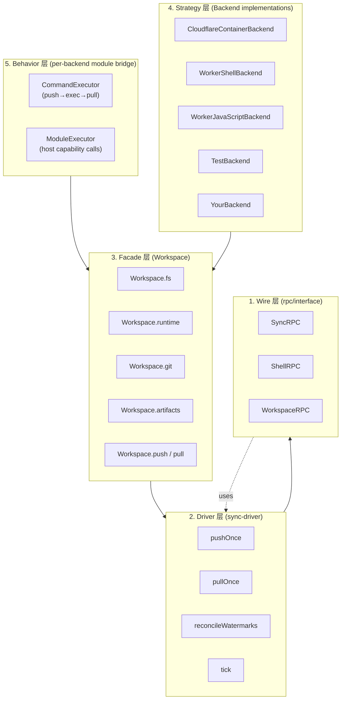

# 12. 系统架构总览

> **读者**:架构师
> **预计阅读**:8 分钟
> **前置依赖**:[第 1 章 项目定位](01_overview.md)

## 目标

从架构师视角画一张"4 层架构图",讲清楚控制面 / 数据面的分离,以及 DO 作为状态拥有者、Container 作为执行者、WebSocket 长连接的角色定位。

---

## 12.1 顶层视角

一句话:**Computer 把"持久化的虚拟文件系统"和"执行命令的环境"拆到两个不同的进程里,用一个稳定的 wire 协议(capnweb)把它们接起来。**

这种拆分不是偶然,而是有意识的取舍:

| 维度 | 存储侧(DO) | 执行侧(Container / Worker) |
|---|---|---|
| 生命周期 | 持久 | 可重启 / 可替换 |
| 状态 | 权威 SQLite | 镜像 / 短期 in-memory |
| 调用入口 | `Workspace.fs` / `Workspace.runtime` | `Runner.exec` / `just-bash` / ES module |
| 冷启动 | 快(Edge) | 慢(Container) / 快(Worker) |
| 主要成本 | DO 请求计费 | Container 运行时 / Worker CPU |

---

## 12.2 F13. 架构分层图(4 层)

**F13. 架构分层图** — Wire / Driver / Facade / Strategy / Behavior 五层抽象



五层(自下而上):

1. **Wire**(`packages/rpc/src/interface.ts`):`SyncRPC` / `ShellRPC` / `WorkspaceRPC`,纯数据形状契约,无 I/O。
2. **Driver**(`packages/rpc/src/sync-driver.ts:396`):`pushOnce` / `pullOnce` / `reconcileWatermarks`,无状态函数对象,接受 `Database` + `SyncRPC`。
3. **Facade**(`packages/computer/src/workspace.ts:259`):`Workspace`,高层编排(序列化、错误处理、span attribution)。
4. **Strategy**(`packages/computer/src/backends/*`):`WorkspaceBackend` 实现,plug-in 点。
5. **Behavior**(`packages/computer/src/runtime/{runtime,bridge,capability,types}.ts`):`Runtime` 路由器 + per-backend module bridge(JS shell 等)。

> 第 6 层 "Cross-cutting"(`observe` / `heartbeat` / `retry` / `transport-failure`)是横切关注点,贯穿所有层。

---

## 12.3 控制面 / 数据面分离

| 面 | 角色 | 接口 |
|---|---|---|
| **数据面**(authority for state) | Durable Object 内的 `Database` | `Workspace.fs.*` / `Workspace.git.*` / `Workspace.artifacts.*` |
| **执行面**(stateless execution) | Backend(Container / Worker) | `runtime.exec` → `WorkspaceRPC.shell` |
| **控制面**(coordination) | Workspace 自身 | `push` / `pull` / `startHeartbeat` / `reconcileWatermarks` |

`docs/11_lifecycle.md:39-61` 强调:**DO 充当 WebSocket 服务端** —— 这是对"自然所有权"的反转,但使 egress interceptor 可以路由流量,也使 hibernation 成为可能。

---

## 12.4 进程拓扑

```
┌──────────────────────────────────────────────────────────────┐
│ Cloudflare Edge                                                │
│  ┌──────────────────────────────────────────────────────────┐  │
│  │ Durable Object (1:1 with Workspace)                      │  │
│  │  ┌────────────────────────────────────────────────────┐  │  │
│  │  │ Workspace                                          │  │  │
│  │  │  ├── Database       (SQLite via ctx.storage)       │  │  │
│  │  │  ├── WorkspaceFilesystem  (dofs)                   │  │  │
│  │  │  ├── WorkspaceRuntime  (router)                    │  │  │
│  │  │  ├── CommandExecutor (push→exec→pull)              │  │  │
│  │  │  ├── GitClient       (isomorphic-git over dofs)    │  │  │
│  │  │  ├── ArtifactClient + AssetsClient                 │  │  │
│  │  │  └── SyncRetryScheduler                           │  │  │
│  │  └────────────────────────────────────────────────────┘  │  │
│  │             ▲ capnweb WebSocket (DO is server)           │  │
│  └─────────────┼─────────────────────────────────────────────┘  │
└────────────────┼─────────────────────────────────────────────┘
                 │
                 ▼
┌──────────────────────────────────────────────────────────────┐
│ Container (linux-x64)                                        │
│  ┌────────────────────────────────────────────────────────┐  │
│  │ computerd (Node SEA binary)                            │  │
│  │  ├── HTTP server (health, connect, /ws)                │  │
│  │  ├── FUSE driver (kernel mode) OR shim (userspace)     │  │
│  │  ├── NodeVirtualFileSystem (in-memory VFS over SQLite) │  │
│  │  ├── Runner (process supervision, exec log)            │  │
│  │  └── ShellRPCServer + SyncRPCServer (capnweb)          │  │
│  └────────────────────────────────────────────────────────┘  │
│  ┌────────────────────────────────────────────────────────┐  │
│  │ /workspace (FUSE mount)                                │  │
│  │  └── bash, npm, git, etc. (real Linux userland)        │  │
│  └────────────────────────────────────────────────────────┘  │
└──────────────────────────────────────────────────────────────┘
```

---

## 12.5 与传统"VM-as-a-Service"的差异

| 维度 | VM-as-a-Service | Computer |
|---|---|---|
| 存储与计算耦合 | 通常 VM disk + 内存共生死 | 拆到 DO SQLite + Container memory |
| 迁移 | 镜像 + volume | 数据走 `SyncRPC`,无需镜像迁移 |
| 启动 | 分钟级(VM boot) | Container ~10s(冷) / Worker ~100ms |
| 状态恢复 | 从 disk | 从 watermark + chunks 自动同步 |
| 扩展维度 | 垂直(VM size) | 水平(后端 plugin) |
| 多语言 runtime | 重启 OS | 换 backend |

> 关键差异:**Computer 把"存储 vs 计算"作为第一性拆分**,VM 模型把它们耦合在 OS 镜像里。

---

## 12.6 关键架构决策记录(ADR-style)

下列每条都是当前代码已实现的设计决策,不是"未来计划":

1. **1:1 DO ↔ Container 配对**:简化 revival / hibernation / reconciliation;不允许多容器并发写同一 workspace。
2. **Wire 协议封闭**:`SyncRPC` / `ShellRPC` 是稳定 API,driver 是唯一知道 wire 形状的地方;**无 plugin registry**(扩展只能通过 TS 模块或构造函数参数)。
3. **后端可插拔**:`WorkspaceBackend` 是窄契约(`id` / `type` / `connect`),详细行为在返回的 `BackendHandle`。
4. **可观测性作为 cross-cutting**:`WorkspaceObserver` 是单一 seam,默认 `noopObserver`,生产换 `createCloudflareObserver({ tracing })`。
5. **Capability 集中**:`WorkspaceScopedFS`(`packages/computer/src/runtime/capability.ts:1`)是模块后端 FS 调用的唯一入口,做路径限制 + 权限 + 限额。
6. **不引入 Result/Option**:错误走 `throw Error + err.code`,POSIX 风格(`packages/dofs/src/errors.ts`)。
7. **同步是单向流**:push / pull 严格单向 wire 调用,双向同步由"序列化的 push → pull"组成。
8. **Schema 为明天预留**:`_vfs_mounts` / `vfs_nodes.mount_root` / `vfs_nodes.stub_size` 已在 schema 中但未完全启用 —— 未来挂载 / stub 限额会基于这套 schema 演进。

---

## 延伸阅读

- [第 13 章:核心抽象](13_arch_abstractions.md) — "File as Stream of Chunks" / "Execution as Message"
- [第 14 章:capnweb 协议与数据流](14_arch_protocol.md) — wire 协议栈
- [第 15 章:一致性与并发](15_arch_consistency.md) — 串行化与最终一致性
- [第 17 章:性能、成本、扩展性](17_arch_performance.md) — 性能取舍
- [第 18 章:演进路线与未决问题](18_arch_roadmap.md) — 演进方向
- [`docs/10_project_layout.md`](../10_project_layout.md) — 既有专题:monorepo 布局
- [`docs/11_lifecycle.md`](../11_lifecycle.md) — 既有专题:incarnation / 容器生命周期