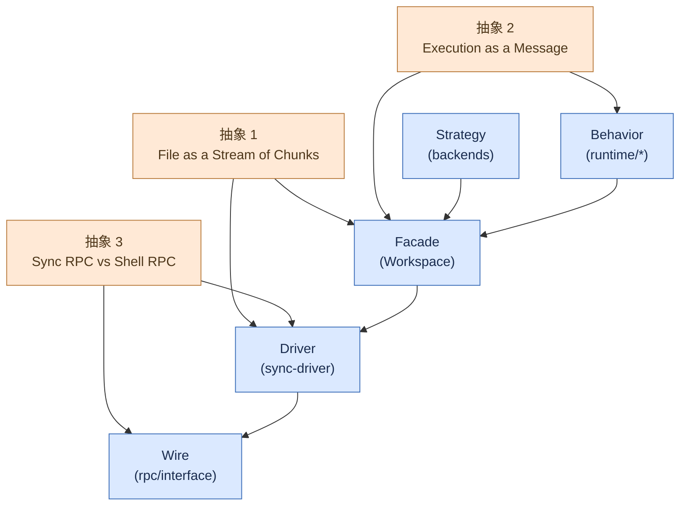

# 13. 核心抽象

> **读者**:架构师
> **预计阅读**:8 分钟
> **前置依赖**:[第 12 章 系统架构总览](12_arch_overview.md)

## 目标

讲清楚三个核心抽象如何把"存储 + 执行 + 同步"三件本质不同的事统一在一套 API 下。

---

## 13.1 抽象 1 — "File as a Stream of Chunks"

### 命题

**"文件不是字节流,而是 512 KiB chunk 的 manifest,而 chunk 是 sha256 内容寻址的。"**

### 实现位置

- `packages/dofs/src/sync/manifests.ts:14` —— `ManifestChunk` 类型;
- `packages/dofs/src/fs/writeFile.ts` —— 写入路径(切 chunk → hash → stage → commit);
- `packages/dofs/src/fs/readFile.ts` —— 读取路径(读 manifest → 拉 chunk → 拼接);
- `packages/dofs/src/sync/blobs.ts` —— `stageBlob` / `fetchBlob` / `hasObjects`。

### 这个抽象的代价

| 收益 | 代价 |
|---|---|
| 自动跨路径去重 | 每个 512 KiB chunk 都要算 SHA-256 |
| 同步只传差异 | 顺序 I/O 速度受限于 hash + stage |
| "写一次,多处共享"成为天然语义 | 错误恢复需要"staged → linked"守卫(对应 `8758b51`) |
| chunk cache + manifest cache 两层加速 | 必须实现 GC(orphan blobs 回收) |

### 何时不该用这个抽象?

- **大文件顺序 I/O**(64 MiB 写 / 读):比 ext4 慢 30x+。如果你要的就是大文件流式 IO,不要把整块文件过 VFS,改用 `assets.publish` 上 R2 + presigned URL;
- **超小文件**(< 1 KiB):chunk 切分浪费,可以接受;
- **超深目录树**(> 10 层):resolve 走 SQL `WHERE path = ?` 链,深度主要受 inode 数影响,不是性能瓶颈。

---

## 13.2 抽象 2 — "Execution as a Message"

### 命题

**"执行命令是 message passing,不是 RPC。"**

每个 `runtime.exec` 是一次"推送 + 启动 + 流式回报 + 拉回"的三段式:

1. **Push**:`Workspace.push(id)` 把当前 `id` 之前的变更打包成 `Stream<ChangeEntry>` 推到对端;
2. **Spawn**:`rpc.shell.exec({ source, id, cwd, ... })` 在对端 spawn,返回 `ReadableStream<ExecEvent>`;
3. **Pull**:`Workspace.runPostPull` 把 exec 后的变更拉回 DO(同步 v2 增量)。

### 实现位置

- `packages/computer/src/shell.ts:97-` —— `CommandExecutor` + `withPostPull`;
- `packages/computerd/src/exec/runner.ts:72-` —— `Runner` 进程监管;
- `packages/rpc/src/interface.ts:93` —— `ShellRPC.exec / getExec / killExec / disposeExec`。

### 这个抽象的代价

| 收益 | 代价 |
|---|---|
| 自然支持"exec 期间产生新文件 → pull 回 DO" | 每次 exec 三次 wire round trip |
| capnweb ReadableStream 端到端 backpressure | 必须实现 `disposeExec` 防泄漏 |
| exec 失败时仍能 pull 已写入部分 | error 码膨胀(`EEXEC_BUSY` / `ELOG_TRUNCATED` / `ESHUTDOWN`) |

### 与传统 RPC exec 的区别

| 维度 | RPC exec | Message exec(Computer 风格) |
|---|---|---|
| 调用语义 | 函数调用 | 启动后台 process + 流式回报 |
| 错误处理 | throw | stream event + result + heartbeat |
| 写文件感知 | 调用结束后看 fs | 显式 push / pull |
| 副作用范围 | 进程内 | 跨进程,且 sync 到 DO |

---

## 13.3 抽象 3 — "Sync RPC vs Shell RPC"

### 命题

**"同步状态用 SyncRPC,执行命令用 ShellRPC —— 两条 RPC 通道,不同的容错语义。"**

### SyncRPC

- `push / fetchChanges / watermarks / readEntry / hasObjects / fetchObjects / pushObjects`;
- 容错:幂等(idempotent),`hasObjects` 可重试;
- 失败语义:`ELOG_TRUNCATED` → 重新 fetch,不需要重新 commit。

### ShellRPC

- `exec / getExec / killExec / disposeExec`;
- 容错:`getExec` 可重放,但 `exec` 不能;
- 失败语义:`EEXEC_BUSY` → 旧 handle 泄漏,`ESHUTDOWN` → 对端死了。

### 为什么分两条?

合并到一条 channel 会引入**类型耦合**:同一帧既可能是"sync 增量"也可能是"exec 事件",client 需要先看到 type 字段再 dispatch。分成两条 channel 后:

- Client 实现简单:看到 SyncRPC 帧就交给 driver,看到 ShellRPC 帧就交给 shell router;
- **服务端可分别扩缩容**:SyncRPC 走稳定的 ws,ShellRPC 可以加更多 event type;
- **权限可分离**:未来要拆权限,SyncRPC 可能比 ShellRPC 更"low risk"(Sync 只动文件状态,Shell 跑代码)。

`packages/rpc/src/interface.ts:142` 的 `WorkspaceRPC = { sync: SyncRPC, shell: ShellRPC }` 是这个分层在 wire 上的体现。

---

## 13.4 F14. 抽象层次图

**F14. 抽象层次图** — 文件、命令、同步三个抽象如何映射到 5 层

---

## 13.5 抽象的边界与代价:一张对照表

| 抽象 | 适用范围 | 范围外 | 主要代价 |
|---|---|---|---|
| File as Stream of Chunks | 元数据密集 + 中小文件 + 跨路径共享 | 大文件顺序 I/O | 每 chunk SHA-256 |
| Execution as Message | 任何需要写文件 + 执行命令组合 | 短小纯计算(无副作用) | 三段式 wire 调用 |
| Sync RPC vs Shell RPC | 跨进程状态 + 跨进程执行 | in-process 调用 | 双 channel 维护 |

---

## 13.6 不做 Result/Option 的原因

> 仓库**不**使用 Result / Option / Either,统一走 `throw Error + err.code` 的 POSIX 风格(`packages/dofs/src/errors.ts`)。

为什么?

1. **capnweb wire 已经有 throw 语义**,远端 throw 自动传回 client(`WorkspaceError` 保留 `code`);
2. **POSIX 风格让 Node 老用户无门槛迁移**:他们已经熟悉 `ENOENT` / `EEXIST`;
3. **统一的 catch + branch on code** 比 union 类型在 async stream 场景下更紧凑;
4. **`createWorkspaceError(code, message, path)` 工厂**保证形状一致(`err.code` + `err.path`)。

> 但在 [第 15 章](15_arch_consistency.md) 会看到,某些 sync 失败不会 throw,而是用 `SyncRetryIntent` 标记为可重试 —— 这是异常流的例外。

---

## 13.7 不做 Plugin Registry 的原因

> 仓库**没有**运行时 plugin registry,所有扩展都是 TS 模块或构造函数参数。

为什么?

1. **wire 是封闭的** —— 加 wire 字段 = breaking change,必须走 changesets;
2. **schema 是封闭的** —— `vfs_*` 表的 DDL 是 git-managed,不能运行时加列;
3. **后端必须经过 reviewer 审核** —— 走 `packages/computer/src/backends/<name>` 路径,`package.json` 加 sub-path export,rolldown config 加 entry。

这个决策让 wire 稳定性有强保证,但代价是 contributor 必须 PR 整个后端,而不是丢个 npm 包。

---

## 13.8 这三个抽象的协同

| 场景 | 走的抽象 |
|---|---|
| 写一个 1 KiB 文件 | 抽象 1(切 1 chunk → hash → commit) |
| 跑 `npm test` | 抽象 2(push → exec → pull) |
| 两个 DO 之间复制 workspace | 抽象 3 + 抽象 1(SyncRPC push / pull ChangeEntry) |
| `WorkerShellBackend` 跑 grep | 抽象 2 + 抽象 3 的"loopback"变体 |
| `WorkerJavaScriptBackend` 跑 ES module | 抽象 2 的 callable 变体(无 push/pull 括号) |

---

## 延伸阅读

- [第 8 章:VFS 深入](08_dev_vfs.md) — chunk + manifest 实现细节
- [第 14 章:capnweb 协议与数据流](14_arch_protocol.md) — wire 帧格式
- [第 15 章:一致性与并发](15_arch_consistency.md) — watermark + 最终一致性
- [第 18 章:演进路线与未决问题](18_arch_roadmap.md) — 抽象的稳定性承诺
- [`docs/02_sync_protocol.md`](../02_sync_protocol.md) — 既有专题:同步协议