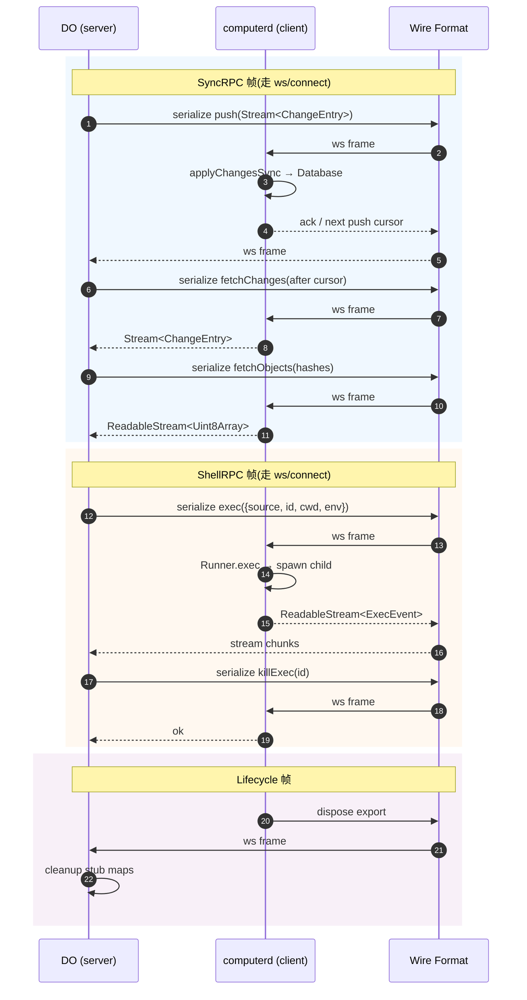

# 14. capnweb 协议与数据流

> **读者**:架构师
> **预计阅读**:8 分钟
> **前置依赖**:[第 12 章 系统架构总览](12_arch_overview.md)、[第 13 章 核心抽象](13_arch_abstractions.md)

## 目标

把 capnweb wire 协议讲清楚:能力子集选用、两条 RPC 通道、帧格式、版本兼容策略。

---

## 14.1 capnweb 是什么

`capnweb` 是 Cloudflare 的"capnproto over WebSocket"子集,作为 Computer 的 RPC 传输层。仓库依赖 `capnweb@^0.8.0`。

为什么选 capnweb?

- **二进制 schema**(比 JSON 小一个数量级);
- **export / answer table 天然适合 stub 生命周期**;
- **WebSocket 复用 capnweb 的 stream 抽象**,端到端 backpressure;
- **Worker 内置支持**(workers runtime 知道如何反序列化)。

`@cloudflare/computer-rpc` 是对 capnweb 的薄包装:定义 `SyncRPC` / `ShellRPC` 的 TypeScript 类型,然后两边各实现 client / server adapter。

---

## 14.2 能力子集:用了哪些

| 能力 | 用途 | 备注 |
|---|---|---|
| Method call (request / response) | 普通 RPC | 默认 |
| Method call streaming (ReadableStream return) | exec event 流 | capnweb 支持 |
| Error propagation | 远端 throw → 本地 catch | `WorkspaceError` 保留 `code` |
| Export table | stub disposal | `__getWorkspaceStub()` 入口 |
| Promise pipelining | 嵌套 call 优化(*未在代码中确认使用深度*) | 仓库中**未看到**深度使用 |
| permessage-deflate | WS 压缩 | `computerd` 端 `noServer: true, perMessageDeflate: true` |

未用的能力:`pipelines` 几乎不出现,`WebSocket.url()` 也没看到 — 这意味着 wire 是相对克制的,便于双向兼容。

---

## 14.3 F15. capnweb 协议栈与消息流

**F15. capnweb 协议栈与消息流** — 帧的分类与流向



---

## 14.4 两条 RPC 通道的帧格式

### SyncRPC(`packages/rpc/src/interface.ts:22`)

| 方法 | 入参 | 返回 |
|---|---|---|
| `push(input)` | `{ senderRev, changes: Stream<ChangeEntry> }` | `{ rev, appliedPushCursor }` |
| `fetchChanges(input)` | `{ after, limit? }` | `Stream<ChangeEntry>` |
| `watermarks()` | — | `{ pushRev, fetchRev }` |
| `readEntry(input)` | `{ path }` | `Entry \| null` |
| `hasObjects(input)` | `{ hashes }` | `{ present: HashSet }` |
| `fetchObjects(input)` | `{ hashes }` | `Stream<{ hash, bytes }>` |
| `pushObjects(input)` | `Stream<{ hash, bytes }>` | `{ accepted }` |

`WireErrorCode = "ENOENT" | "EUNKNOWN_HASH" | "ESHUTDOWN" | "EAUTH" | "EPROTOCOL"`(`packages/rpc/src/interface.ts:158`)。

### ShellRPC(`packages/rpc/src/interface.ts:93`)

| 方法 | 入参 | 返回 |
|---|---|---|
| `exec(input)` | `{ source, id, cwd, env, timeoutMs }` | `ReadableStream<ExecEvent>` |
| `getExec(id)` | `id` | `ReadableStream<ExecEvent> \| null` |
| `killExec(id, signal)` | — | `void` |
| `disposeExec(id)` | — | `void` |

`ExecErrorCode = "EEXEC_BUSY" | "ENOENT" | "ELOG_TRUNCATED"`(`packages/computerd/src/exec/types.ts:71`)。

---

## 14.5 帧流向 vs 心跳

`packages/computer/src/heartbeat.ts:25` 实现了一个 `setInterval` 周期性调用 `SyncRPC.watermarks()`(三个 SQL scalar,无副作用),频率默认 20s。

两个职责:

1. **检测静默死的对端**比下次 call 快;
2. **保持 middlebox idle timer 暖**(避免某些 LB 关闭空闲 ws)。

heartbeat 不是 wire 协议的一部分,是 application-level 探测。

---

## 14.6 端到端 backpressure

`packages/rpc/src/interface.ts:96-99` 的注释明确:

> "consumer-side slowness propagates to the spawned process via the kernel pipe."

链:

```
client stream backpressure
  → capnweb ReadableStream 高水位标记
  → DO 端 ReadableStream backpressure
  → Runner.exec 写入 spawn child 的 stdout/stderr WritableStream drain
  → kernel pipe buffer 满
  → child process 阻塞在 write
```

所以**用户代码卡住 → 子进程卡住**,这是想要的语义。`examples/container` 中演示了把 `run` 接到 SSE Response:

```ts
const sse = run.pipeThrough(new TransformStream({
  transform(event, controller) {
    controller.enqueue(new TextEncoder().encode(
      `event: ${event.name}\ndata: ${JSON.stringify(event.value)}\n\n`));
  },
}));
return new Response(sse, { headers: { "content-type": "text/event-stream" } });
```

如果客户端断网,SSE 停止 enqueue → capnweb stream backpressure → Runner exec 卡 → child 卡,**不会浪费 CPU**。

---

## 14.7 协议版本与兼容性策略

Computer 当前是 PREVIEW,wire 协议没有"显式 version 字段",但通过 **changesets** 强制:

- 任何 wire 形状变化(`packages/rpc/src/interface.ts`) → minor changeset → `computer` 包 minor bump;
- `dofs` / `rpc` 内部 schema 变化 → `dofs` / `rpc` patch(这两个包是 private,不发布 npm,但仍版本化);
- 老 client / 新 server 不兼容 → 由 `EAUTH` / `EPROTOCOL` 立即识别。

详见 [第 18 章](18_arch_roadmap.md) 与 `.changeset/config.json:0-14`。

---

## 14.8 Stub disposal contract(wire 视角)

capnweb export table 是有限资源,每个 `WorkspaceStub` / `BackendHandle` / `RuntimeExecHandle` 都占一项。

```
client → server: __getWorkspaceStub() → export #N
client → server: ws.fs.writeFile(...)    # call on export #N
client → server: ws.runtime.exec(...)   # call on export #N
client → server: dispose export #N       # `using` 触发
server: drop export #N from table        # server-side cleanup
```

**泄漏症状**:`CAPNWEB_TRACK_STUBS=1` 后 `GET /__computerd/stubs` 数持续上涨 → OOM。

正确做法:每个 stub / handle 都用 `using` 包裹,或在 `finally` 显式 `[Symbol.dispose]()`。

`docs/11_lifecycle.md:201-279` 详解 stub 生命周期。

---

## 14.9 协议错误 vs 业务错误

| 类型 | 来源 | 客户端处理 |
|---|---|---|
| `WireErrorCode` | RPC server 主动 throw | `instanceof WorkspaceError`,branch on `code` |
| `ExecErrorCode` | `Runner.exec / get` throw | 同上 |
| `isWorkspaceTransportFailure(...)` | WS 断 / capnweb stale stub | 重连,不要当业务错误吞 |

`packages/computer/src/transport-failure.ts` 定义了 transport failure 的辨识。

---

## 14.10 协议扩展的可行路径

- **加 SyncRPC 方法**(例:`readSnapshot`)→ minor changeset,client 不更新会拿到 `undefined`(返回值)或 `EPROTOCOL`;
- **加 ExecEvent 类型**(例:`progress`)→ minor changeset,client 不更新会忽略未知 event;
- **加新 wire 通道**(例:`ArtifactsRPC`)→ major changeset(影响 wire shape)。

永远不要:

- 改 SyncRPC 方法签名;
- 删 wire 方法(只能 deprecate + mark stub error);
- 改 `WireErrorCode` 枚举值(只能加)。

---

## 延伸阅读

- [第 4 章:基础操作](04_user_basics.md) — 用户视角的 F4 时序图
- [第 10 章:客户端与 SDK](10_dev_client.md) — stub 生命周期
- [第 15 章:一致性与并发](15_arch_consistency.md) — watermark + 错误恢复
- [`docs/08_capnweb_interface.md`](../08_capnweb_interface.md) — 既有专题:capnweb 协议
- [`docs/11_lifecycle.md`](../11_lifecycle.md) — 既有专题:incarnation / 容器生命周期