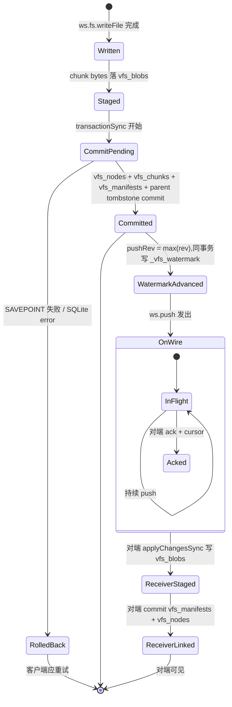

# 15. 一致性与并发

> **读者**:架构师
> **预计阅读**:7 分钟
> **前置依赖**:[第 13 章 核心抽象](13_arch_abstractions.md)、[第 14 章 capnweb 协议](14_arch_protocol.md)

## 目标

讲清楚 DO 串行化模型、`staged → committed` 的最终一致性、跨 workspace 同步的边界,以及失败场景与恢复路径。

---

## 15.1 并发模型:Promise + 单 SQLite 互斥

> Computer 在 JS 侧**没有线程、没有锁、没有 shared mutable state**,唯一的互斥原语是 SQLite 的 `transactionSync`。

- Workers isolate 是单线程的;
- DO 是单线程的(任意时刻只一个 event loop);
- `computerd` 是单个 Node 进程;
- 跨进程同步通过 `pushRev` / `fetchRev` watermark 串行化。

`packages/dofs/src/storage.ts:3-115` 的 `Database` 类是唯一的 SQL 入口,`transactionSync` 区分两种模式:

- **`storage.transactionSync`**(Cloudflare DO SQLite 原生):顶层事务;
- **`SAVEPOINT`**:嵌套事务,允许 FS 层在 DO 的最外层事务中再开嵌套,不需要新顶层事务。

---

## 15.2 Per-backend FIFO 串行化

`packages/computer/src/workspace.ts:252` 声明 **per-backend FIFOs**,序列化"mutating entry points"(`push` / `pull` / shell exec 括号)。

```ts
// 简化
const mutexes = new Map<string, Promise<unknown>>();

async function serialize(backendId: string, op: () => Promise<unknown>) {
  const prev = mutexes.get(backendId) ?? Promise.resolve();
  const next = prev.catch(() => {}).then(op);
  mutexes.set(backendId, next);
  try { return await next; }
  finally { if (mutexes.get(backendId) === next) mutexes.delete(backendId); }
}
```

这是**系统级**的"事务隔离":同一 backend 的 `push` 和 `pull` 不会交错,不会出现"我拉了旧数据,你想推新数据"的 race。

---

## 15.3 Resolve Cache 的事务感知

`packages/dofs/src/fs/resolveCache.ts` 缓存 `path → node_id`,**`Database.inTransaction` 标志让 cache 在事务期间不写入**:

- 事务中读取 → 走 cache;
- 事务中写入 → 写入新 cache 项被推迟到事务 commit;
- 事务回滚 → 任何"假成功" 的 cache 项都不存在。

这避免了一个常见 bug:事务回滚后 cache 还指向了未提交的数据。

---

## 15.4 F16. 一致性模型状态机

**F16. 一致性模型状态机** — 一次 chunk 从"产生"到"对端可见"的全过程



### 关键不变量

1. **`_vfs_watermark` 与数据同一事务 commit**:`pushRev` 永远不会指向未 commit 的数据;
2. **`vfs_manifests.hash` 引用 `vfs_blobs.hash` 必须存在**:由 `8758b51` 的 staged-chunk link 路径守卫保证;
3. **push 与 pull 在同一 watermark 上推进**:`_vfs_fetch_cursor` + `vfs_changes.id DESC` 决定下一次 fetch 起点。

---

## 15.5 同步协议的 conflict 策略:Last-Write-Wins

`docs/02_sync_protocol.md` 明确:冲突策略是 **LWW**(last-write-wins):

- 双方修改同一路径 → 时间戳(`mtime`)晚的覆盖早的;
- tombstone(deleted)也算一次"写入",所以"删了又改回"可能丢失;

**为什么不走 CRDT 或 3-way merge?**

- workspace 是单用户 / 单 agent 场景为主,冲突极少;
- 复杂 merge 算法会显著拉长 wire 上的对端成本;
- git 在 workspace 之上跑,真正的"history merge"靠 git 完成。

未来若出现"多 agent 共写同一 workspace"需求,这条会演进 —— 但**当前不是**。

---

## 15.6 失败场景与恢复

| 失败点 | 检测 | 恢复 |
|---|---|---|
| `runtime.exec` 后 pull 失败 | `Workspace.runPostPull` catch | `sync: { status: "pending" }` → `SyncRetryScheduler` 后续重试 |
| `push` 失败(WS 断) | 抛 `isWorkspaceTransportFailure` | client 重连后重新 push(幂等:`hasObjects` 跳过已存在 chunk) |
| Container 重启 | `BackendHandle.closed` 事件 | workspace 自动重连,watermark 协商 |
| 进程崩溃 staged chunk 残留 | `8758b51` 提交后的 link 守卫 | manifest 不会引用不存在的 blob;orphan blob 由 GC 回收 |
| 网络分区后恢复 | watermark 落后于对端 | 追 push / pull 至 watermark 一致 |
| `EEXEC_BUSY` 出现 | exec id 已在 runner 中 | 旧 handle 泄漏,显式 `disposeExec` 后重试 |
| `ELOG_TRUNCATED` 出现 | exec log 满了 | 调大 `EXEC_LOG_MAX_BYTES`,或用流式消费 |

---

## 15.7 `SyncRetryScheduler` —— 应用层重试

`packages/computer/src/workspace.ts:59` 定义 `SyncRetryScheduler`,用于"post-pull 失败"的场景:

```ts
interface SyncRetryIntent {
  id: string;
  attemptedAt: number;
  reason: string;
  // ... 可挂 DO storage 做持久化重试
}

class SyncRetryScheduler {
  schedule(intent: SyncRetryIntent): void;
  cancel(id: string): void;
  pending(): SyncRetryIntent[];
}
```

`workspace.ts:239` 的 `runPostPull` 失败时调用 `scheduler.schedule(intent)`,后续可由后台 job 重跑。

> 这不是 wire 协议的部分,是应用层策略。

---

## 15.8 跨 Computer 一致性边界

跨 workspace 同步(如"把 workspace A 复制到 B")走:

1. A 端 `push(rev)` → B 端 `applyChangesSync`;
2. B 端 `hasObjects(hashes)` → A 端 `pushObjects` 灌字节;
3. B 端写 watermark 到与新数据同一事务。

**当前不支持**自动 conflict resolution —— 跨 workspace 复制本质是 single-source(单向复制),不是双向同步。

---

## 15.9 Heartbeat 与 stale detection

`packages/computer/src/heartbeat.ts:25` 周期调用 `SyncRPC.watermarks()`:

- 默认 20s;
- 检测对端静默死;
- 保持 ws 不被 LB idle timeout 关闭;
- **不**做应用层 push / pull —— 那是 explicit 的。

`stale` 的判定:**连续 N 次 heartbeat 失败** → 标记 backend 为 `closed`,触发重连。

---

## 15.10 不变量总结

下列不变量若被违反,代码必须立即报错(throw),**不能继续**:

1. `vfs_manifests.hash` 引用的所有 `vfs_blobs.hash` 都存在(由 `8758b51` 守卫);
2. `_vfs_watermark.pushRev >= max(vfs_changes.id)`;
3. `vfs_changes.path` 不指向 `vfs_nodes.path` 之外的路径(被 `path.ts` 规范化);
4. `WorkspaceRuntimeExecHandle` 单 consumer(stream 或 result,不能同时);
5. capnweb export #N 的 dispose 是"幂等可重入"的(必须)。

---

## 延伸阅读

- [第 8 章:VFS 深入](08_dev_vfs.md) — 表结构 + 写入路径
- [第 13 章:核心抽象](13_arch_abstractions.md) — "File as Stream of Chunks" 抽象
- [第 14 章:capnweb 协议](14_arch_protocol.md) — wire 错误码
- [第 17 章:性能、成本、扩展性](17_arch_performance.md) — 同步对延迟的影响
- [`docs/02_sync_protocol.md`](../02_sync_protocol.md) — 既有专题:同步协议
- [`docs/11_lifecycle.md`](../11_lifecycle.md) — 既有专题:hibernation / revival