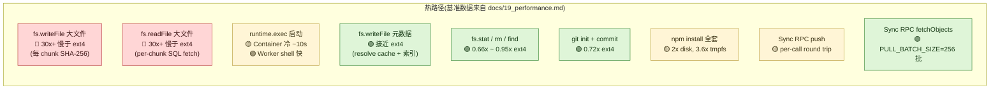

# 17. 性能、成本、扩展性

> **读者**:架构师
> **预计阅读**:7 分钟
> **前置依赖**:[第 12 章 系统架构总览](12_arch_overview.md)、[第 13 章 核心抽象](13_arch_abstractions.md)

## 目标

把"性能热点 / 成本模型 / 扩展策略 / 已知瓶颈"四项一起画图,避免架构师只看一个维度就下结论。

---

## 17.1 性能热点:F18. 节点带色热点图

**F18. 性能热点图** — 每个节点的热度颜色:🔴 慢,🟡 中,🟢 快



---

## 17.2 性能关键路径(详细)

### 17.2.1 FUSE 写热路径

`packages/computerd/src/fuse/driver.ts:279-389`:

- **`Map<path, FileEntry>`**:in-memory per-regular-file map,避免 `platformatic VFS` 的 O(N²) read-then-rewrite;
- **`pendingCreate` 窗口**:从 `create()` 到 `release/flush/fsync` 期间冻结 mtime,使连续 `stat()` 稳定;
- **`dirtyRanges`**:让 `flushEntry` 只持久化受影响部分(走 `writeFileRangesSync`);
- **缓冲写路径**:`openWriteBufferForCreateSync` + `openWriteBufferSync` + `releaseWriteBufferSync` 把整个 open/write/release 折叠为单事务。

> 这是仓库中**最被精心调优**的代码。

### 17.2.2 Sync push/pull 热路径

- `packages/rpc/src/sync-driver.ts` 的 `pushOnce` / `pullOnce`;
- `packages/dofs/src/sync/coalesce.ts` 把同路径 N 个操作折叠为 1 个 entry;
- `applyChangesSync` 是**唯一**写路径,dispatches 到 free fns,每个 fn 自带 transactionSync;
- **`PULL_BATCH_SIZE = 256`** 限制 per-batch 内存;`(rev, path)` cursor 让崩溃可恢复;
- **`vfs_changes_by_path` 索引**(`packages/dofs/src/schema/sync.ts:25`)消除全表扫描;
- 最近 `1273ff86` 把 `hasObjects` 批量化,减少 DO SQLite 调用次数。

### 17.2.3 `writeFile` 流式热路径

- `packages/dofs/src/fs/writeFile.ts` 重新 window 到 512 KiB chunks;
- 边 hash 边 stage;
- 单事务 commit。

---

## 17.3 成本模型

| 资源 | 计费维度 | 量级(以 Cloudflare 当前定价为参考,**未在代码中确认具体数值**) |
|---|---|---|
| DO 请求 | 请求数 | 百万级 |
| DO 存储 | GB × 时间 | GB × 月 |
| DO CPU | GB-s | 与请求大小相关 |
| Container 运行时 | 秒数 | ~$0.0000x / 秒(*未在代码中确认*) |
| Container 存储(EBS-like) | GB × 时间 | GB × 月 |
| WS 数据传输 | GB 出入 | GB |
| R2 存储 | GB × 时间 | GB × 月 |
| R2 操作 | 操作数 | 百万级 |

> 具体数字以 Cloudflare 官方定价为准,代码中无 billing 提示。

---

## 17.4 性能基准数据(`docs/19_performance.md`)

`script/fs-bench.sh` 在 Cloudflare Containers standard-2(REPS=3, WARMUP=1):

**元数据密集型**(更接近或略胜磁盘):

| 操作 | `computerd` | ext4 | 倍数 |
|---|---|---|---|
| stat 1000 files | 1971.9 ms | 2659.3 ms | 0.91x |
| rm 1000 files | 827.7 ms | 1281.8 ms | 0.66x |
| mkdir tree (10×10×10) | 1597.5 ms | 3034.7 ms | 0.74x |
| find tree | 1813.6 ms | 4404.2 ms | 0.72x |
| git init + commit 100 | 459.2 ms | 635.4 ms | 0.72x |
| git clone (shallow ~1MB) | 549.1 ms | 576.2 ms | 0.84x |
| npm init + tiny install | 598.5 ms | 630.7 ms | 0.95x |

**大块顺序 I/O**(显著慢于磁盘):

| 操作 | `computerd` | ext4 | 倍数 |
|---|---|---|---|
| write 64 MiB | 230.6 ms | 16.8 ms | 16.93x |
| copy 64 MiB | 1037.2 ms | 39.8 ms | 40.46x |
| pure read 64 MiB | 263.1 ms | 8.5 ms | 30.26x |
| overwrite 64 MiB | 272.6 ms | 8.5 ms | 43.35x |

**完整 `npm install`(854 packages, 36675 files)**:

| 后端 | 时间 |
|---|---|
| tmpfs | 34.3 s |
| ext4 | 63.9 s |
| `computerd` FUSE | 124.7 s |

**延迟来源**:每个 ~512 KiB chunk 在 release 时算 SHA-256、入 content-addressed blob store;好处是 DO 同步只传差异 + 自动去重。

---

## 17.5 扩展策略

### 17.5.1 水平扩展 — DO 与 Container 都是 per-instance 独立

- **加 DO**:每个 workspace 一个独立 DO,`idFromName` 自动 sharding;
- **加 Container**:每个 DO 持有 1 个 Container(`max_instances` 是 per-DO 上限,而非全局)。

> ⚠ **没有跨 workspace 共享 Container 的概念** —— 1:1 配对是 load-bearing 的(见 [第 12 章](12_arch_overview.md))。

### 17.5.2 垂直扩展

- **DO**:升级 instance_type 不是直接概念(DO 是平台管理的),改用更大的 ctx.storage / memory tier;
- **Container**:`wrangler.jsonc` 的 `instance_type: "standard-2"` 可以调高到更大的 instance type,影响成本。

### 17.5.3 协议层扩展

- **新 wire 方法**(minor changeset);
- **新 SyncRPC 子能力**(minor);
- **新 ShellRPC event type**(minor);
- **新 wire 通道**(major)。

详见 [第 14 章](14_arch_protocol.md#1410-协议扩展的可行路径)。

---

## 17.6 已知瓶颈(架构师视角下的"必须知道")

1. **大文件顺序 I/O 比磁盘慢 30x+** —— 不要把 Computer 当成"通用文件系统";
2. **每 chunk SHA-256 是固定开销** —— 大文件下不可优化,只能换成 R2 + presigned URL;
3. **每 exec 三段式 wire round trip** —— 高频小 exec 不适合(改成 batch exec);
4. **FUSE 在 macOS 上有性能差异** —— Linux 真 FUSE 比 macFUSE 快 ~10x;
5. **Container 冷启动慢**(~10s) —— 长任务友好,短任务不友好;
6. **WS 重连成本** —— 每次重连要重新 push watermark 之前的变更(增量 OK,但首连接冷);
7. **GC 的频率** —— orphan blob GC 在 commit 时执行,长事务会推迟 GC。

---

## 17.7 优化建议(按 ROI 排序)

| 优化 | 工作量 | 收益 | 备注 |
|---|---|---|---|
| 大文件用 R2 而非 VFS | 1 行 | 🔴 大 | `assets.publish` 已实现 |
| 减少 `runtime.exec` 调用次数 | batch | 🟡 中 | 业务层优化 |
| 把 npm install 缓存到 VFS 镜像 | 1 天 | 🟡 中 | 首次 install 后第二次秒开 |
| 把 hot backend 换成 `WorkerShellBackend` | 1 小时 | 🟡 中 | 跳过 push/pull 括号 |
| 调大 `EXEC_LOG_MAX_BYTES` | 1 行 | 🟢 小 | 减少流式消费压力 |
| 把 ws 心跳间隔从 20s 调成 60s | 1 行 | 🟢 小 | 减少 wire 流量 |
| 把 `PULL_BATCH_SIZE` 从 256 调成更大 | config | 🟢 小 | 减少 fetchObjects 调用次数(*未在代码中确认可调*) |

---

## 17.8 监控指标

`GET /__computerd/stats` 返回:

- DOFS 表行数(`vfs_nodes` / `vfs_changes` / `vfs_blobs` / `vfs_chunks` / `vfs_manifests`);
- blob 总字节;
- **orphan blob 计数**(GC 落后信号);
- RSS / heapUsed / external / arrayBuffers(Node 进程内存)。

Tracing 通过 `examples/container/wrangler.jsonc` 开启:

```jsonc
"observability": { "traces": { "enabled": true } }
```

Span 列表:

- `workspace.connect`
- `workspace.sync.push` / `workspace.sync.pull`
- `workspace.runtime.exec.spawn`
- `workspace.fs.*`

---

## 延伸阅读

- [第 8 章:VFS 深入](08_dev_vfs.md) — 写入路径
- [第 13 章:核心抽象](13_arch_abstractions.md) — 三个抽象的代价
- [第 14 章:capnweb 协议](14_arch_protocol.md) — wire 优化
- [第 15 章:一致性与并发](15_arch_consistency.md) — per-backend FIFO
- [`docs/19_performance.md`](../19_performance.md) — 既有专题:完整基准数据
- [`packages/dofs/src/bench/`](../../packages/dofs/src/bench/) — CountingStorage 基准工具