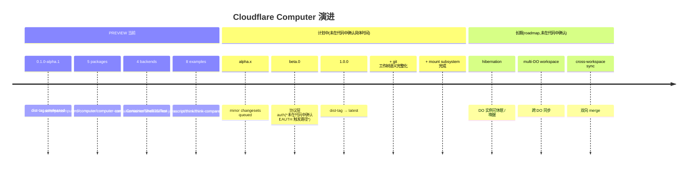

# 18. 演进路线与未决问题

> **读者**:架构师
> **预计阅读**:6 分钟
> **前置依赖**:[第 12 章 系统架构总览](12_arch_overview.md)

## 目标

把"当前 PREVIEW 状态 / 公开 API 稳定性承诺 / 计划中的后端与特性 / 已知未决问题"按时间线串起来。

---

## 18.1 F19. 演进时间线

**F19. 演进时间线** — 从 0.1.0-alpha.1 到未来稳定版的关键节点

---

## 18.2 当前阶段:PREVIEW

| 项 | 状态 |
|---|---|
| 仓库名 | `@cloudflare/computer` |
| 当前版本 | `0.1.0-alpha.1` |
| dist-tag | `unreleased`(**未升 latest**) |
| 公开承诺 | "APIs are unstable" — `docs/README.md` 明确 |
| 包发布 | `@cloudflare/computer` 是唯一 public npm 包;`dofs` / `rpc` / `computerd` 是 private(仍版本化) |
| Docker 镜像 | `ghcr.io/cloudflare/computer-computerd-linux-x64:main` |
| License | MIT |

变更通过 changesets 管理(`.changeset/config.json:0-14`):

- 公开 API 改动 → `@cloudflare/computer` minor/major;
- 内部 schema 改动 → `dofs` / `rpc` patch(private 但仍版本化);
- 当前活跃 changesets:
  - `.changeset/link-staged-chunks-on-apply.md` → `dofs` patch + `computer` patch
  - `.changeset/quick-fixes-git-sync-rpc.md` → 三包 patch
  - `.changeset/worker-shell-opt-in-commands.md` → `computer` minor("Heavy worker-shell commands are now opt-in to reduce the final bundle size")

---

## 18.3 公开 API 稳定性承诺

来自 `COLLABORATORS.md` 与 changesets 流程的隐含承诺:

| 类别 | 稳定性 | 变化如何走 |
|---|---|---|
| `@cloudflare/computer` 的 public exports(`Workspace` / `withWorkspace` / `getWorkspace` / ...) | 较低(PREVIEW) | minor → major changeset |
| `@cloudflare/computer` 的 sub-path exports | 较低(PREVIEW) | 同上 |
| `WireErrorCode` / `ExecErrorCode` 枚举值 | 中等 | 只能加,不能改 |
| `WorkspaceRPC` / `SyncRPC` / `ShellRPC` 方法名与签名 | 中等 | minor changeset,加新方法 |
| `Database` / `WorkspaceFilesystem` API | 较低 | 跟随 dofs 内部演化 |
| `computerd` env vars | 较高 | deprecated → 拒绝启动 + 提示新变量 |
| `computerd` HTTP 端点路径 | 较高 | 改动走 major |
| `wrangler.jsonc` schema | 跟随 Cloudflare 平台 | 跟随 wrangler 演化 |
| Backend `id` 字符串 | 用户层 | 用户自己 pick,无强约束 |

**承诺边界**:PREVIEW 阶段**不承诺** backward compatibility;只有 `computerd` env vars / HTTP 端点是相对稳定的(因为有"拒绝启动"兜底)。

---

## 18.4 计划中的后端与特性

### 18.4.1 后端

当前已实现的 4 个 backend:

- `CloudflareContainerBackend`
- `WorkerShellBackend`
- `WorkerJavaScriptBackend`
- `TestBackend`

**计划中(*未在代码中确认,以下从 commits / docs / 注释推断*)**:

- 更多 shell 命令组(`./shell/python` / `./shell/sqlite` 等已经是 opt-in);
- 可能:基于 wasm 的轻量级 backend(无 FUSE 依赖);
- 可能:第三方 backend 模板(只在 docs 中提及,代码中**未看到**具体接口)。

### 18.4.2 特性

- **Mount subsystem**:`docs/06_mount_interface.md` 标注 "(planned)",`_vfs_mounts` / `vfs_nodes.mount_root` / `vfs_nodes.stub_size` 已在 schema 但未启用;
- **Git 工作树语义完整化**:最近 commit `73ba5ddf fix: report staged deletions as clean worktree` / `587bdfbc computer: Keep empty file diff summaries` 等持续修边界;
- **Hibernation**:`docs/11_lifecycle.md:52-61` 提到"future hibernation",代码中**未看到**已实现;
- **Bidirectional sync**:当前是单向 wire push / pull,双向 merge 是长期 roadmap;
- **Wire layer auth**:见 [第 16 章](16_arch_security.md#163-协议层-auth--未在代码中确认)。

---

## 18.5 已知未决问题

| 问题 | 现状 | 跟踪点 |
|---|---|---|
| 协议层 auth 触发路径未明 | PREVIEW 假定 Cloudflare 平台保证 | [第 16 章](16_arch_security.md#163-协议层-auth--未在代码中确认) |
| Hibernation 未实现 | docs 中提及,代码中无 | `docs/11_lifecycle.md:52-61` |
| 多 DO workspace 未实现 | 当前 1 DO = 1 workspace | wire 协议未扩展 |
| 跨 workspace 双向 merge 未实现 | 当前单向 wire push / pull | 见 [第 15 章](15_arch_consistency.md#158-跨-computer-一致性边界) |
| 审计日志未实现 | tracing 有,audit 未见 | [第 16 章](16_arch_security.md#166-未来工作) |
| 代码覆盖率工具链未配置 | `vitest --coverage` / codecov 未在 CI 中 | [第 11 章](11_dev_testing.md#116-tdd-规范) |
| Handbook CI 校验未配置 | `markdownlint` / `mmdc` / `link-check` 还没在 CI 中跑 | 当前 PREVIEW 不要求 |
| Conventional commits 未启用 | 仓库用 `<scope>:` + subject 形式,但无 commitlint | `COLLABORATORS.md:121-164` |
| CLA 流程未启用 | 仓库不接 unsolicited PR,故未强制 CLA | `CONTRIBUTING.md` |
| 根 `CHANGELOG.md` 未维护 | CHANGELOG 由 changesets 按包生成 | 仓库设计如此 |

---

## 18.6 已废弃但保留兜底

| 已废弃 | 替代 | 兜底位置 |
|---|---|---|
| `DISABLE_FUSE` env | `FUSE_MOUNT=none` | `rejectLegacyFuseEnv`(`packages/computerd/src/cli/computerd.ts`) |
| `FUSE_SHIM` env | `FUSE_MOUNT=shim` | 同上 |
| `WSD_FUSE_BACKEND` env | `FUSE_MOUNT=fuse` / `macfuse` | 同上 |

**这是合约**:已废弃 env 出现即拒绝启动 + 提示替代值。

---

## 18.7 节奏与节奏

最近一周(`git log` 摘要):

| 主题 | 提交数 |
|---|---|
| dofs 同步路径优化(staged-chunk / hasObjects 批量化) | 5 |
| git 工作树语义(diff / log / status 边界) | 4 |
| Worker shell 命令加载机制 | 2 |
| CI / 镜像发布 | 2 |

提交作者主要是 `aron-cf`(主导)+ `Caio Nogueira`(偶尔)。

**信号**:

- 主线在 **dofs 同步路径**:watermark + chunk staging + link 是当前最复杂的部分;
- git 在 workspace 上的语义是**持续打磨**主题,边界条件多;
- Worker shell 命令的 tree-shake 优化是**新方向**(最近 2 个 commit 集中);
- CI / 镜像是**维护性**工作,不是新功能。

---

## 18.8 升级到 PRODUCTION 之前的清单

架构师评审生产化方案时,以下项目必须先解决:

1. **EAUTH 触发路径明确** —— [第 16 章](16_arch_security.md#163-协议层-auth--未在代码中确认);
2. **API 稳定性承诺正式化** —— 当前是"PREVIEW"措辞,PRODUCTION 需要"stable" / "deprecated" 标签;
3. **公开 API freeze** —— 哪些是 stable / deprecated,文档化;
4. **审计日志** —— 谁访问了哪个路径,何时;
5. **资源限额测试** —— 多租户下的公平性;
6. **wire 升级策略** —— 老 client 如何探测 wire 版本(目前没有 version 字段);
7. **错误恢复 SLA** —— pull 失败的恢复时间;
8. **观测性完备性** —— tracing 已经接,但 metrics / alerting 未明;
9. **CI 加 handbook 校验** —— `markdownlint` / `mmdc` / `link-check` 在 PR 上跑;
10. **最终 `latest` tag** —— `@cloudflare/computer` 从 `unreleased` 升 `latest`。

---

## 延伸阅读

- [第 16 章:安全与隔离](16_arch_security.md) — auth 与隔离
- [第 17 章:性能、成本、扩展性](17_arch_performance.md) — 扩展策略
- [`README.md`](../../README.md) — "PREVIEW" 状态声明
- [`.changeset/config.json`](../../.changeset/config.json) — changesets 配置
- [`COLLABORATORS.md`](../../COLLABORATORS.md) — 协作流程
- [`CONTRIBUTING.md`](../../CONTRIBUTING.md) — 公开贡献路径
- [`docs/README.md`](../README.md) — 既有专题索引
- [`docs/18_runtime_migration.md`](../18_runtime_migration.md) — breaking change 映射表