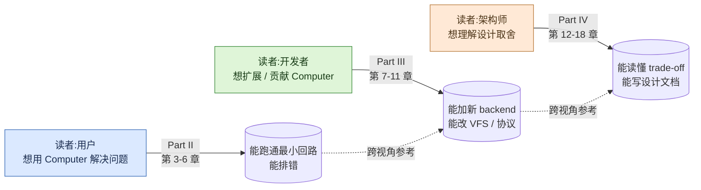

# Cloudflare Computer · Handbook

> **项目**:Cloudflare Computer —— 基于 Durable Object SQLite 的虚拟文件系统 + pluggable execution backends
> **状态**:PREVIEW(`@cloudflare/computer@0.1.0-alpha.1`,dist-tag `unreleased`)
> **基线**:`main` @ `8758b51 dofs: Guard the staged-chunk link path`
> **受众**:用户 / 开发者 / 架构师

本 handbook 基于当前源代码(基线 `8758b51`)生成,以"由浅入深"的线性阅读路径串联三个视角:用户 → 开发者 → 架构师。**不**重写既有专题(`docs/01..19_*.md`),仅做导读 + 跨视角串联 + 一句话总结,通过相对路径相互引用。

---

## F2. 三视角阅读路径

---

## 目录

### Part I · 总览(全员必读)

| # | 章节 | 一句话 |
|---|---|---|
| 01 | [项目定位与核心抽象](01_overview.md) | 一句话定义 + 1:1 DO↔Container 配对动机 + 五包职责 |
| 02 | [五分钟跑通最小回路](02_quickstart.md) | 本地启动 `computerd` + 客户端 hello world |

### Part II · 用户视角(Part II)

| # | 章节 | 一句话 |
|---|---|---|
| 03 | [安装、配置、4 选 1 后端决策](03_user_install.md) | 三种部署形态 + 后端选型决策树 |
| 04 | [基础操作:创建、读写、执行](04_user_basics.md) | `Workspace` 构造 + `fs.*` + `runtime.exec` |
| 05 | [进阶用法](05_user_advanced.md) | 512 KiB 分块上传 + 流式输出 + 快照 |
| 06 | [常见错误与排查](06_user_troubleshooting.md) | 错误码表 + WS 断连 + staged-chunk 守护 |

### Part III · 开发者视角(Part III)

| # | 章节 | 一句话 |
|---|---|---|
| 07 | [Monorepo 与五包结构](07_dev_packages.md) | workspaces 拓扑 + 包级依赖图 |
| 08 | [VFS 深入](08_dev_vfs.md) | inode/目录/链接 + 512 KiB chunk + sha256 + staged-chunk |
| 09 | [自定义后端](09_dev_backend.md) | `WorkspaceBackend` 契约 + 四参考实现 |
| 10 | [客户端与 SDK](10_dev_client.md) | `withWorkspace` mixin + capnweb 调用链 |
| 11 | [测试与调试](11_dev_testing.md) | `TestBackend` + Vitest 配置 + 调试 capnweb 报文 |

### Part IV · 架构师视角(Part IV)

| # | 章节 | 一句话 |
|---|---|---|
| 12 | [系统架构总览](12_arch_overview.md) | 控制面/数据面分离 + 4 层架构 |
| 13 | [核心抽象](13_arch_abstractions.md) | "File as Stream of Chunks" + "Execution as Message" |
| 14 | [capnweb 协议与数据流](14_arch_protocol.md) | Sync/Shell 双 RPC + 帧格式 + 兼容性 |
| 15 | [一致性与并发](15_arch_consistency.md) | DO 串行化 + staged → committed 最终一致性 |
| 16 | [安全与隔离](16_arch_security.md) | 信任边界 + 资源限制(*auth 未在代码中确认*) |
| 17 | [性能、成本、扩展性](17_arch_performance.md) | 性能热点 + 成本模型 + 已知瓶颈 |
| 18 | [演进路线与未决问题](18_arch_roadmap.md) | PREVIEW 现状 + changesets 稳定性承诺 |

### Part V · 参考(全员)

| # | 章节 | 一句话 |
|---|---|---|
| 19 | [`computer` 客户端 API 参考](19_ref_api.md) | 函数签名 + 参数 + 返回类型(带 `path:line`) |
| 20 | [`computerd` CLI 参考](20_ref_cli.md) | 环境变量 + HTTP 端点 + SEA 二进制 |
| 21 | [配置参考](21_ref_config.md) | wrangler 字段 + env vars |
| 22 | [错误码与异常](22_ref_errors.md) | 错误码表 + throw 路径 + 处理建议 |
| 23 | [术语表](23_glossary.md) | Computer / DO / Container / chunk / capnweb / SEA 等 |

---

## 阅读路径建议

- **新用户**:01 → 02 → 03 → 04 → 06 → 23
- **新贡献者(已有 Cloudflare 平台经验)**:01 → 07 → 08 → 10 → 11 → 23
- **架构师**:01 → 12 → 13 → 14 → 15 → 17 → 18 → 23
- **排错**:直接看 06 → 22

---

## 配图索引

| 编号 | 类型 | 章节 | 标题 |
|---|---|---|---|
| F1 | 架构图 | 01 | 系统总览(引用 `docs/assets/arch.png`) |
| F2 | flowchart | README | 三视角阅读路径(本页) |
| F3 | flowchart | 03 | 后端选型决策树 |
| F4 | sequenceDiagram | 04 | 文件读写与 exec |
| F5 | ASCII + Mermaid | 05 | 512 KiB chunk 存储 |
| F6 | flowchart | 06 | 错误处理流程 |
| F7 | graph LR | 07 | 五包依赖关系 |
| F8 | stateDiagram-v2 | 08 | VFS 状态机 |
| F9 | classDiagram | 08 | chunk 存储类 |
| F10 | classDiagram | 09 | Backend 适配器模式 |
| F11 | sequenceDiagram | 10 | 客户端 ↔ DO 数据流 |
| F12 | Mermaid | 11 | 测试金字塔 |
| F13 | Mermaid 4 层 | 12 | 架构分层 |
| F14 | graph TD | 13 | 抽象层次 |
| F15 | Mermaid + ER | 14 | capnweb 协议栈 |
| F16 | stateDiagram-v2 | 15 | 一致性模型 |
| F17 | flowchart | 16 | 信任边界 |
| F18 | Mermaid(节点带色) | 17 | 性能热点 |
| F19 | timeline | 18 | 演进路线 |

---

## 维护说明

- **基线锁定**:本 handbook 以 `8758b51` 为基线;后续 PR 若改变函数签名 / 文件路径 / 章节结构,需在对应章节显式注明。
- **导读原则**:所有引用既有专题 `docs/XX_*.md` 的内容,只用一句话总结 + 相对路径链接,不重写。
- **未知标注**:凡未在代码中确认的细节,统一用 `*(未在代码中确认,需读 X 后填入)*` 占位。
- **PREVIEW 措辞**:全书以 PREVIEW 视角写作;任何"将发布 / 将提供"替换为"计划中"或"待稳定后"。