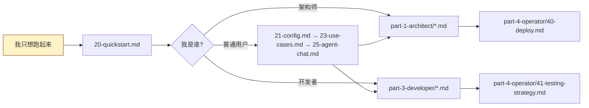

# Cortrix Handbook

> **版本基线**:`v1.0.0-rc.1`(对应仓库根 `VERSION` 文件与 `sdk/python/cortrix/_constants.py:3` 中的 `SDK_VERSION = "1.0.0rc1"`)。

> **许可证**:Cortrix 自有材料按 `AGPL-3.0-only`(`README.md:8`)分发;第三方材料保留各自许可。

---

## 这是什么

Cortrix 是一个 **local-first 的语义存储服务器**,为 Agent 和 AI 应用提供可编程的检索、记忆与 API 接入层。它不是一个单纯的向量库包装器,而是一个完整的、由 C++17 后端 + 多条 Agent 接入路径共同组成的**产品级产物**(`README.md:6-15`)。

这本 handbook 的目标,是让**架构师 / 用户 / 开发者**三类读者都能在 30 分钟内:

- **架构师**:看清楚 Cortrix 由哪些组件构成、数据怎么流、错误怎么传播、安全边界在哪。
- **用户**:5 分钟内把它跑起来,跑通一个端到端的检索/对话,知道配置项怎么改、能力当前处于哪个状态。
- **开发者**:会调 Python SDK、能把 SDK 包成 MCP/Skills/Agent 喂给任意 LLM 框架、能诊断错误信封。

---

## 读者路径(从你开始)



| 你的目标 | 推荐路径 | 大约阅读时间 |
|---|---|---|
| 我是**首次接触者** | 20 → 21 → 23 → 25 | 30 分钟 |
| 我想**理解架构** | 10 → 11 → 12 → 13 → 14 | 60 分钟 |
| 我要**集成 SDK** | 30 → 31 → 32 → 33 → 34 | 60 分钟 |
| 我要把 **LLM 接进来** | 35 → 36 → 37(任选其一) | 45 分钟 |
| 我要**部署 / 调优** | 40 → 41 → 42 | 45 分钟 |

---

## 阅读顺序建议

如果你是**第一次读这本 handbook**,建议按下面的顺序读:

1. **[00-glossary.md](00-glossary.md)**(5 分钟) — 把所有代号记一遍:看到 `F04`、`P-HNSW`、`MEM02` 不会懵。
2. **[01-status-matrix.md](01-status-matrix.md)**(5 分钟) — 把"现在能用什么、不能用、计划中"这件事一次理清。
3. **第一篇 架构师视角**(`part-1-architect/`):10 → 11 → 12 → 13 — 先看全貌。
4. **第二篇 用户视角**(`part-2-user/`):20 → 23 — 跑起来、看场景。
5. **第三篇 开发者视角**(`part-3-developer/`):按需 30~37。

> ⚠️ **状态标签是关键**:手册里每一个能力描述都带一个标签 — `Verified` / `Verification required` / `Blocked` / `Roadmap`。这四个标签是 Cortrix 官方对"现在能用吗"这件事的统一答案(参见 `README.md:55-61`)。**手册不会替你承诺 Blocked 的能力**。

---

## 内容地图(30 章)

```
docs/handbook/
├── README.md                          # 你正在读
├── 00-glossary.md                     # 术语表(读第一篇前先看)
├── 01-status-matrix.md                # 能力状态总表(读之前先看)
│
├── part-1-architect/                  # 第一篇:架构师视角(7 章)
│   ├── 10-what-is-cortrix.md          # 产品定位
│   ├── 11-topology.md                 # 部署拓扑
│   ├── 12-component-map.md            # 组件地图
│   ├── 13-data-flow.md                # 数据流
│   ├── 14-security-model.md           # 安全模型
│   ├── 15-observability.md            # 可观测性
│   └── 16-api-contract.md             # API 合约
│
├── part-2-user/                       # 第二篇:用户视角(7 章)
│   ├── 20-quickstart.md               # 5 分钟上手
│   ├── 21-config.md                   # 配置
│   ├── 22-models.md                   # 模型
│   ├── 23-use-cases.md                # 业务场景
│   ├── 24-web-ui.md                   # Web UI
│   ├── 25-agent-chat.md               # Agent 对话
│   └── 26-ops-and-maintenance.md      # 运维与维护
│
├── part-3-developer/                  # 第三篇:开发者视角(10 章)
│   ├── 30-sdk-overview.md             # SDK 概览
│   ├── 31-resources.md                # Resources 全表
│   ├── 32-errors.md                   # 错误体系
│   ├── 33-retry-and-tracing.md        # 重试与追踪
│   ├── 34-types-and-schemas.md        # 类型与 Schema
│   ├── 35-mcp-server.md               # MCP Server
│   ├── 36-skills-frameworks.md        # Skills 框架适配
│   ├── 37-builtin-agent.md            # 内置 Agent
│   ├── 38-pgcortrix.md                # pgcortrix
│   └── 39-end-to-end-trace.md         # 端到端追踪
│
└── part-4-operator/                   # 第四篇:运维与扩展(3 章)
    ├── 40-deploy.md                   # 部署
    ├── 41-testing-strategy.md         # 测试体系
    └── 42-ci-cd.md                    # CI/CD
```

## 当前 handbook 统计

| 维度 | 数量 |
|---|---|
| 总章节数 | 30(含 README + glossary + status-matrix) |
| Mermaid 图 | 26+ |
| ASCII 示意 / 表格 | 70+ |
| 引用的源码路径 | 100+ |
| 引用的文档路径 | 20+ |

---

## 与现有文档的关系

这本 handbook **不复制**以下现有文档,而是引用并串联:

- `README.md`(仓库根)— 全景与状态总览
- `docs/QUICKSTART.md` — 5 分钟 Docker 启动
- `docs/AGENT_QUICKSTART.md` — Agent 辅助的版本锁定启动
- `docs/agent-access.md` — 4 条 Agent 接入路径选择
- `docs/compatibility.md` — 当前兼容性状态细节
- `docs/adoption/stack-fit.md` — 是否引入的决策卡
- `docs/operations/cuda-execution-provider.md` — CUDA 切换细节
- `sdk/python/README.md` — Python SDK 用法
- `cortrix-mcp/README.md` — MCP 工具参考
- `cortrix-agent/README.md` — 内置 Agent 用法
- `api/openapi.yaml` — API 契约(`redocly.yaml` 校验)

Handbook 的价值在于**把这些散落的文档与源码按"读者视角"重新组织**,并补足它们没覆盖的视角(架构师视角的端到端追踪、开发者视角的错误体系结构)。

---

## 维护约定

- 每章末尾都有「下一步」链接,沿目录结构递进;链断了请开 issue。
- 每条事实都有 `file_path:line_number` 引用;引用失效请开 issue 或提 PR。
- Mermaid 图都使用 GitHub 兼容语法(`flowchart`、`sequenceDiagram`、`graph LR/TD`);若不能渲染,提 issue 描述你的渲染环境。
- 状态标签变动以 `docs/compatibility.md` 为准。

---

## 下一步

👉 **[00-glossary.md](00-glossary.md)** — 把所有代号记一遍
