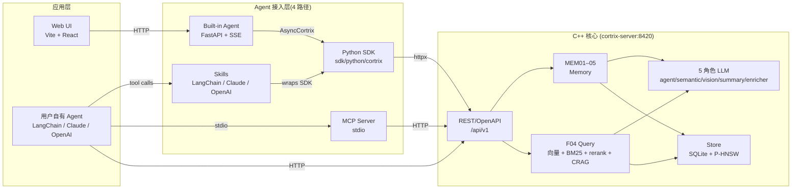
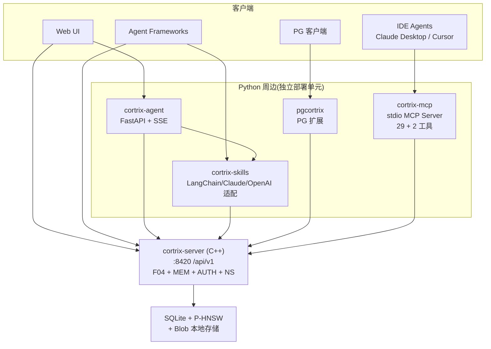

# 10 · Cortrix 是什么 — 产品定位与适用场景

> **目标读者**:架构师、技术决策者。
> **阅读时间**:10 分钟。
> **关键事实**:Cortrix 是 **local-first 语义存储服务器**(C++17 + 5 个 Python 周边);为 Agent / AI 应用提供可编程的检索、记忆与 API 接入层;**不是**单纯的向量库包装器。

---

## 1. 一句话定位

> **Agent-native semantic storage for retrieval, memory, and API-driven AI applications.**
>
> —— `README.md:6`

把这句话拆开看:

- **Agent-native**:不是给人用的 GUI 工具,而是给 Agent 调用的。每一个 API 都设计了"程序化使用"和"Agent 决策友好"的属性(见 4 字段错误模型、`docs/compatibility.md`)。
- **semantic storage**:存储的核心单位是"语义",即"文档 → 块 → 向量 + 全文 + 元数据"的多模态持久化,而非纯字符串。
- **retrieval, memory, API-driven**:三种典型用法 — 检索(query)、长期记忆(MEM01–05)、API 驱动的应用接入(OpenAPI/MCP/SDK/Skills)。
- **AI applications**:不局限于 RAG chat;支持合同检索、工单支持、合规归档、跨 NS 联邦检索等"程序化检索"场景。

---

## 2. 三层组件概览

> 这张图对应 `README.md:23-30` 的 6 个子项目清单。**核心层只有一个可执行**:`cortrix-server`,其余都是接入层或 UI。

---

## 3. 适用场景

| 场景 | 用 Cortrix 的方式 | 状态 |
|---|---|---|
| **RAG 增强的客服 / 工单** | 上传历史工单 → 按"语义相似"检索 → 喂给 LLM 草拟回复 | 🟡 Verification required |
| **合同 / 法规知识库** | 上传合同 PDF → 按"哪条提到了不可抗力"跨 NS 检索 | � Verification required |
| **Agent 长期记忆** | 调用 `memory.log` 写入 → 后续 `memory.search(user_id=...)` 召回 | 🟡 Verification required(MEM02 抽取 🚫 Blocked) |
| **跨部门知识联邦** | 给每个部门建一个 NS,统一权限(ACL)后跨 NS 检索 | 🟡 Verification required(ACL 路径 🚫 Blocked) |
| **GDPR 数据导出 / 删除** | 走 `/api/v1/gdpr/*`(SDK / HTTP) | 🟡 Verification required |
| **Postgres 内做检索** | 用 `pgcortrix` 扩展,在 SQL 里直接调 | 🟡 Verification required |
| **生产多租户 SaaS** | Tenant / API Key / 配额 | � Blocked,等升 ✅ |

### 3.1 与"同类产品"的关系(决策视角)

Cortrix **不直接对标**任何单一产品;它的设计意图是:

- **不是 Pinecone / Weaviate** — 那些是纯向量库;Cortrix 自带 BM25、CRAG、混合检索、命名空间 ACL、记忆系统。
- **不是 LangChain / LlamaIndex** — 那些是 Agent 框架;Cortrix 是它们**调用的存储后端**(`cortrix-skills` 就是反例:LangChain 调用 Cortrix)。
- **不是 Postgres + pgvector** — `pgcortrix` 是 Postgres 之上的**HTTP 桥**,不是把向量塞进 PG;不与 pgvector 竞争,而是互补。
- **不是 Elasticsearch** — 没有倒排索引的全部能力,但默认开启 BM25 + 向量混合检索;查询体验更像"搜索 + 检索的混合体"。

### 3.2 决策卡(Keep / Add / Replace / Unknown)

完整决策卡见 `docs/adoption/stack-fit.md`。**本手册不复制决策卡**,但给一个最简版:

| 你的现状 | 建议 |
|---|---|
| 已经在用 LangChain / LlamaIndex + 向量库 | **Add** Cortrix 作为"高质量语料 + 记忆"后端(用 Skills 接入) |
| 自研检索、想换掉 Elasticsearch | **Evaluate** — 看 `23-use-cases.md`,重点关注混合检索质量与部署成本 |
| Postgres-only 团队 | **Add** `pgcortrix`,最小代价获得语义检索 |
| 多租户 SaaS,需要生产级隔离 | **Wait** — Auth / Tenant / RBAC / Quota 路径当前 🚫 Blocked |
| 想做 Agent 工具调用,但不想写后端 | **Use** `cortrix-mcp` 喂 Claude Desktop / Cursor / Qoder |

---

## 4. 关键设计原则(架构师必读)

下面这些原则贯穿 Cortrix 全栈,是理解任何模块的"语境"。

### 4.1 Local-first 默认
- 服务端默认监听 `127.0.0.1:8420`(`config.yaml.example:22`),不开 auth 时拒绝外部连接。
- 首次启动会从 HuggingFace 下载约 **1.17 GB** 的模型到 volume;后续复用缓存(`README.md:101`)。
- 模型 SHA-256 锁定(`deploy/model-manifest.tsv`),不被 supply-chain 攻击替换。

### 4.2 GEN-Agent 4 字段错误协议
- 每个错误响应都带 `code` / `retryable` / `category` / `retry_after_ms` / `structured_data`(见 [00-glossary §4](../00-glossary.md))。
- Agent 框架收到错误时**不丢失**这些字段,而是包装成各框架原生的 tool 错误回传(`cortrix-skills/src/cortrix_skills/toolkit.py:12-19` 注释明确"不 catch `CortrixError`")。

### 4.3 类型稳定 + wire 兼容
- OpenAPI 是契约源(`api/openapi.yaml`)。
- SDK 用手写生成器(`sdk/python/scripts/generate_types.py`)把 OpenAPI → Python `dataclass`,而不是用 pydantic(见 [34-types-and-schemas.md](../part-3-developer/34-types-and-schemas.md))。
- `parse_model` 容错:忽略未知键、缺失 `Optional` 字段填 `None`、嵌套 dataclass 递归解析(`sdk/python/cortrix/_models.py:52-73`)。这保证服务端多返字段时客户端不破。

### 4.4 ONNX 推理与 CUDA 可选
- BGE-M3 embedding + bge-reranker-v2-m3 reranker 都是 ONNX(`config.yaml.example:71-99`)。
- ONNX Runtime 1.x ABI 锁定(`cmake/Dependencies.cmake:94-99`),同 major 升级只需替换 `.so`/dylib,无需重编译。
- Apple Silicon 自动检测 CoreML(`cmake/Dependencies.cmake:70-81`)。
- CUDA 单独走 `docker-compose.cuda.yml`。

### 4.5 多语言并存但单一真相源
- 服务端是 C++17 主体(`src/main.cpp`,约 350 个 cpp/h)。
- 接入层是 Python 生态(SDK / MCP / Skills / Agent / pgcortrix)。
- 测试覆盖用 C++ gtest + Python pytest + Web Playwright + Locust load;CI 三套 workflow(`pr-ci` / `nightly-ci` / `release-gate`)。
- **OpenAPI 是接入层与核心层之间的唯一真相源**。

---

## 5. 不在 Cortrix 范围里

为了避免期望错位,这里列出**当前不在 v1.0-rc.1 范围**的事:

| 不做的事 | 原因 / 状态 |
|---|---|
| 远程 MCP Streamable HTTP | 🗺️ Roadmap;当前 MCP 仅 stdio |
| 自动化的 plan-and-execute Agent | 🗺️ V2;当前只有 `ChatExecutor` |
| 多租户生产级隔离 / RBAC | 🚫 Blocked |
| Auth login 实测可用 | 🚫 Blocked(spec 已定义,运行时漂移) |
| MEM02 自动抽取 | 🚫 Blocked(LLM 传输超时) |
| 答案质量 / 延迟 / 成本的 production 测量 | 🟡 Verification required(已发布 BEIR 检索质量,不等于答案质量) |

---

## 6. 一图看完整形态

---

## 下一步

👉 **[11 · 部署拓扑](11-topology.md)** — 6 个组件是怎么部署的,端口怎么连。
