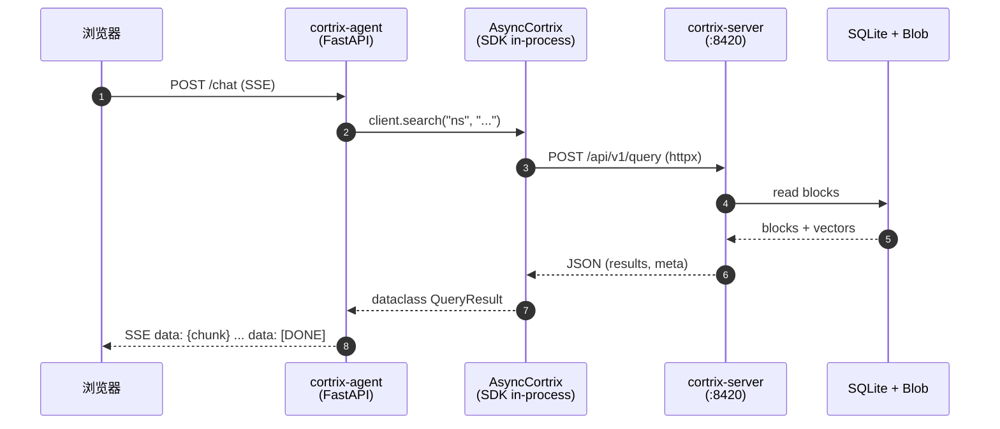

# 11 · 部署拓扑 — 6 个组件怎么连

> **目标读者**:架构师、运维。
> **阅读时间**:10 分钟。
> **关键事实**:Cortrix 由 **6 个独立部署单元**组成,默认全部 loopback;Web UI / Agent / MCP 都不依赖 SDK(它们是 SDK 的"客户端"或"等价路径")。

---

## 1. 6 个进程 / 5 个部署单元

```mermaid
graph TD
    subgraph 客户端["客户端"]
        Browser["浏览器<br/>Web UI"]
        IDE["IDE Agent<br/>Claude Desktop / Cursor"]
        UserAgent["用户自有 Agent"]
        PGClient["PG 客户端<br/>psql / 应用代码"]
    end

    subgraph Host["同一台机器或同一 overlay 网络"]
        direction TB
        WebUI["Web UI<br/>Vite dev / 容器后由 Caddy 静态服务"]
        BuiltInAgent["cortrix-agent<br/>FastAPI :8001"]
        MCPServer["cortrix-mcp<br/>stdio transport"]
        Server["cortrix-server<br/>:8420 /api/v1"]
        PGCortrix["pgcortrix<br/>PG 扩展 in-process"]
        DB[("SQLite<br/>+ Blob 文件")]
    end

    Browser -->|"HTTP (dev)"| WebUI
    Browser -->|"SSE /chat"| BuiltInAgent
    IDE -->|"stdio JSON-RPC"| MCPServer
    UserAgent -->|"HTTP or SDK"| Server
    PGClient -->|"SQL 函数"| PGCortrix
    PGCortrix -->|"HTTP"| Server
    BuiltInAgent -->|"AsyncCortrix"| Server
    WebUI -->|"HTTP"| Server
    MCPServer -->|"HTTP"| Server
    Server --> DB
```



---

## 2. 端口 / 进程矩阵

| 进程 | 部署单元 | 默认端口 | transport | 引用 |
|---|---|---|---|---|
| **`cortrix-server`** | C++ 二进制 / Docker | **8420** | HTTP(loopback 默认) | `config.yaml.example:22`、`deploy/docker-compose.yml:10` |
| **`cortrix-agent`** | Python FastAPI | **8001** | HTTP(SSE `/chat`) | `cortrix-agent/main.py:123`、`cortrix-agent/README.md:68-73` |
| **`cortrix-mcp`** | Python stdio | **无端口** | stdio JSON-RPC | `cortrix-mcp/src/cortrix_mcp/server.py:44` |
| **Web UI** | Vite + React | dev 端口(5173 等),容器化后由 Caddy 静态服务 | HTTP | `web/package.json`、`deploy/caddy/Caddyfile` |
| **`pgcortrix`** | PG 扩展 | 跟随 PG(默认 5432) | SQL 函数 | `sql-extensions/pgcortrix/Makefile` |
| **SQLite + Blob** | 内嵌 | — | 文件 I/O | `src/store/cortrix_store_sqlite.cpp`、`src/store/cortrix_blob_local.cpp` |

> ⚠️ **远程 MCP Streamable HTTP 是 🗺️ Roadmap**,不要按这条路径部署(参考 `README.md:181-182`)。

---

## 3. 三种启动形态

### 3.1 源码启动(`dev.sh`)

```bash
git clone https://github.com/cortrix/cortrix.git
cd cortrix
cp config.yaml.example build/config.yaml
./dev.sh                       # 构建 + 启动 + 健康检查
curl -fsS http://127.0.0.1:8420/api/v1/system/health/ready
```

- 单进程,只跑 `cortrix-server`。
- 数据目录:`build/data/`(`config.yaml.example:55-58`)。
- 适合开发者 / 调试。

### 3.2 Docker Compose(CPU)— 默认推荐

```bash
CORTRIX_SOURCE_REVISION="$(git rev-parse HEAD)" \
  docker compose -f deploy/docker-compose.yml up --build --wait
```

- `deploy/docker-compose.yml:9-10`:只把 `:8420` 映射到 `127.0.0.1`,不暴露到 LAN。
- 首次启动下载约 **1.17 GB**(`README.md:101`);`cortrix-data` 是命名 volume,持久化 SQLite / 模型 / Blob。
- 内置 healthcheck(`deploy/docker-compose.yml:28-33`),`start_period=30m` 给模型下载留时间。
- `CORTRIX_LLM_ENABLED=false`、`CORTRIX_AGENT_ENABLED=false`(`deploy/docker-compose.yml:21-22`),默认**不**启用 LLM 与 Agent。

### 3.3 Docker Compose(CUDA)

- `deploy/docker-compose.cuda.yml`(README 提及),Linux x86_64 + NVIDIA runtime。
- 模型与 CPU 路径一致,但 ONNX Runtime 走 `cuda`(`cmake/Dependencies.cmake:85-99`)。
- 切换前必读 `docs/operations/cuda-execution-provider.md`。

### 3.4 容器化的反向代理(Caddy)

```text
demo.cortrix.ai (Caddy :443)
  ├─ /api/v1/admin/*        → 403(loopback-only)
  ├─ /api/v1/system/tenants/* → 403
  ├─ /api/v1/system/units/* → 403
  └─ * (其他)                → reverse_proxy localhost:8420
```

- `deploy/caddy/Caddyfile:29-38`:**Admin / tenants / units 路径在边缘被 403 拒绝**(因为 `AdminGuard` 检查 `remote_addr=127.0.0.1`,反代会绕过)。
- HTTPS 自动签发(Let's Encrypt)。
- `request_body { max_size 100MB }` 配合 `cortrix max_payload_bytes`(`deploy/caddy/Caddyfile:64-65`)。

---

## 4. 谁连谁(进程级调用图)



> 这是一个**用户**触发的最常见的路径。Agent / SDK / Server 是三层;`SDK` 是 in-process 进程内连接(由 `cortrix-agent/main.py:37-39` 通过 `sys.path` 注入 `sdk/python`)。

---

## 5. 部署单元的依赖矩阵

| 部署单元 | 运行时依赖 | 是否依赖 SDK |
|---|---|---|
| `cortrix-server` | ONNX Runtime 1.x、SQLite、cpp-httplib、yaml-cpp、spdlog、nlohmann/json、OpenSSL | 否(它就是 SDK 的目标) |
| `cortrix-agent` | FastAPI、httpx、openai、sse-starlette、pydantic-settings | ✅ **dogfood**(`main.py:145` `from cortrix import AsyncCortrix`) |
| `cortrix-mcp` | `mcp>=2.0,<3.0`、httpx | ❌ **不依赖 SDK**(README 第 15 行声明),直连 HTTP |
| `cortrix-skills`(库) | `cortrix>=1.0.0rc1`、pydantic;可选 `langchain` / `anthropic` / `openai` | ✅ **强依赖**(`pyproject.toml:38`) |
| `pgcortrix` | plpython3u + 标准库 `urllib` | ❌ 不依赖 SDK,独立 PGXS 构建 |

> 这张表是部署决策的核心:**Skills / Agent 一定需要 SDK 在线安装或可 import**;**MCP / pgcortrix 只需要后端可达**。

---

## 6. 数据持久化边界

| 数据 | 物理位置 | 容器化对应 |
|---|---|---|
| SQLite + vector index + Blob | `build/data/`(`config.yaml.example:55-58`) | `cortrix-data:/data` 命名 volume |
| 模型权重 | `models/` | `deploy/download-models.sh` 下载,SHA-256 锁定(`deploy/model-manifest.tsv`) |
| 日志 | stdout / stderr / 文件 | `config.yaml.example:48-49`(`log.format=text|json`) |
| Web UI 静态资产 | `web/dist/` | 由 Caddy 静态服务 |

---

## 7. 部署形态选择决策

| 你的场景 | 推荐 |
|---|---|
| 本地试用 / 调 SDK | 源码(`dev.sh`) |
| CI / demo | `docker-compose.yml`(默认 CPU,1.17 GB 模型下载) |
| 服务器 + 多租户 | 等 Auth / Tenant 升 ✅;当前用 `auth.enabled=false` + loopback |
| GPU 推理 | `docker-compose.cuda.yml`;读 `docs/operations/cuda-execution-provider.md` |
| 反向代理 + HTTPS | `deploy/caddy/Caddyfile`,确保 loopback-only 在容器内开启 |

---

## 下一步

👉 **[12 · 组件地图](12-component-map.md)** — C++ 32 子模块 + Python 周边怎么拼起来。
