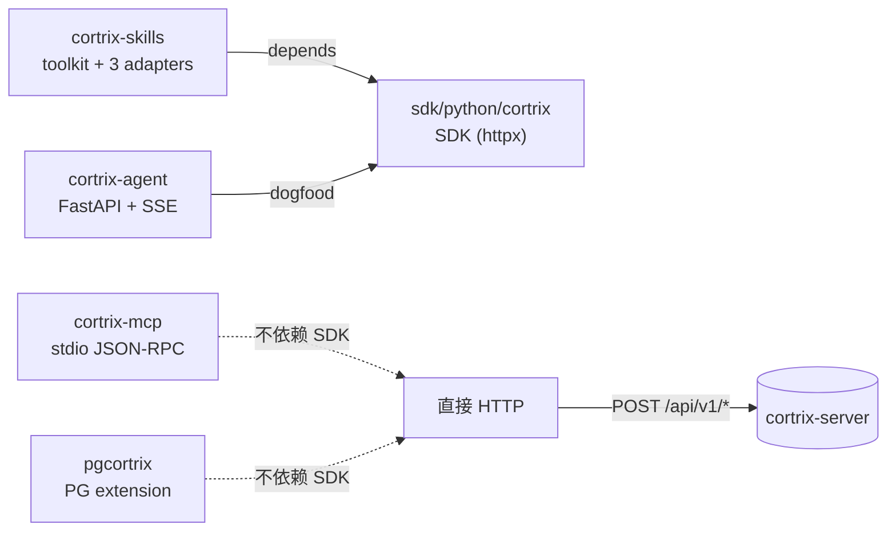
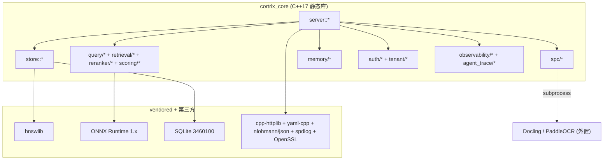

# 12 · 组件地图 — C++ 子模块与 Python 周边

> **目标读者**:架构师、想读源码的开发者。
> **阅读时间**:10 分钟。
> **关键事实**:**核心层**是一个 C++17 静态库 `cortrix_core`,外加一个 thin shim 可执行 `cortrix-server`;**接入层**是 4 个独立 Python 包 + 1 个 PG 扩展。

---

## 1. C++ 主后端的物理形态

```text
src/main.cpp
  └─ src/server/bootstrap.cpp :: RunServer()
        └─ src/server/http_server.cpp    (cpp-httplib)
              ├─ src/server/routes/health_routes.cpp
              ├─ src/server/routes/namespace_routes.cpp
              ├─ src/server/gc_cli.cpp   (运维 CLI)
              └─ … 更多 routes
```

| 产物 | 类型 | 来源 | 备注 |
|---|---|---|---|
| `cortrix_core` | **静态库** | `CMakeLists.txt:28`(约 350 个 .cpp) | 整个 `src/` 被打成单一 lib |
| `cortrix-server` | **可执行** | `src/main.cpp` | 薄 shim,只调用 `bootstrap::RunServer` |
| 测试 | 可执行 | `tests/CMakeLists.txt`,BUILD_TESTS=ON | ~250 gtest,见 [41-testing-strategy.md](../part-4-operator/41-testing-strategy.md) |

CMake 关键配置:
- `CMAKE_CXX_STANDARD 17`(`CMakeLists.txt:13`)
- 必装依赖:`OpenSSL REQUIRED`(`CMakeLists.txt:20`)
- Vendored:`src/store/phnsw/hnswlib/` 浅 fork(F01 P-HNSW),通过 `add_subdirectory(src/store/phnsw)`(`CMakeLists.txt:22-25`)暴露 `cortrix::hnswlib_vendored` INTERFACE target。
- `CMAKE_EXPORT_COMPILE_COMMANDS ON`(`CMakeLists.txt:15`):生成 `compile_commands.json` 给 clangd / IDE。

---

## 2. C++ 子模块分桶(`src/`)

| 子模块 | 领域 | 关键文件 |
|---|---|---|
| `server/` | HTTP 引导 + 路由 + GC CLI | `bootstrap.cpp`、`http_server.cpp`、`routes/health_routes.cpp`、`gc_cli.cpp` |
| `auth/` | API Key / JWT / bcrypt / bootstrap / admin user / email | `api_key_auth.cpp`、`jwt_utils.cpp`、`pbkdf2_password_hasher.cpp`、`admin_users_service.cpp` |
| `namespace/` | 命名空间管理 | `namespace_manager.cpp` |
| `tenant/` | 多租户管理 | (与 auth 联动) |
| `store/` | SQLite / P-HNSW / Blob / pending log | `cortrix_store_sqlite.cpp`、`phnsw/phnsw.cpp`、`cortrix_blob_local.cpp`、`write_coordinator.cpp` |
| `query/` | F04 检索入口 | (与 retrieval 协作) |
| `retrieval/` | 向量召回 + BM25 + hybrid | |
| `reranker/` | F02 cross-encoder rerank | |
| `scoring/` | 排序融合 + CRAG 评估 | |
| `chunker/` | 切块策略 | |
| `spc/` | 解析桥接(Docling / PaddleOCR) | `parser_subprocess.cpp`、`docling_parser.cpp`、`paddleocr_parser.cpp` |
| `ml/` / `onnx/` | ONNX Runtime 适配 | |
| `doc_summary/` | F41 Doc Summary | |
| `memory/` | MEM01–05 | |
| `memory_scorer.h` | Memory 排序 | |
| `import/` | F16a DB 导入 | |
| `upload/` | 文档上传 | |
| `connector/` | 外部数据连接器 | |
| `async/` | 异步执行引擎 | |
| `catalog/` | 资源目录 | |
| `resource/` | 资源管理 | |
| `agent_friendly/` | GEN-Agent 4 字段协议 | |
| `agent_trace/` | Agent 调用追踪 | |
| `metadata/` | 元数据管理 | |
| `security/` | 安全边界 | |
| `middleware/` | HTTP 中间件 | `http_observability_middleware` |
| `health/` | 健康检查 | |
| `observability/` | 指标 / 日志 / tracing | |
| `id/` | ID 生成 | |
| `logging/` | 日志适配 | |
| `common/` | 通用工具 | `status.cpp`、`executor_engine.cpp`、`in_memory_global_config.cpp`、`agent_llm_config_codec.cpp` |
| `config/` | 配置加载 | `config.cpp` |
| `llm/` | LLM 适配层 | |
| `deploy/` | 部署辅助 | |

> 这是 **32 个一级子模块**(与探索报告一致)。每个子模块通常 `*.cpp` + `*.h` 共存;`include/cortrix/` 是对应的公共头镜像。

---

## 3. 第三方 C++ 依赖(`cmake/Dependencies.cmake`)

| 依赖 | 版本 | 来源 | 用途 |
|---|---|---|---|
| **cpp-httplib** | `v0.18.3` | FetchContent | header-only HTTP server |
| **nlohmann/json** | `v3.11.3` | FetchContent | JSON 解析 |
| **yaml-cpp** | `0.8.0` | FetchContent | 配置文件 |
| **spdlog** | `v1.14.1` | FetchContent | 日志 |
| **SQLite amalgamation** | `3460100` | FetchContent(直链) | 内嵌 DB(`FTS5` + `JSON1`) |
| **Google Test** | `v1.17.0` | FetchContent | C++ 测试 |
| **Google Benchmark** | `v1.9.1` | FetchContent | 性能测试 |
| **rapidcheck** | commit `ff6af6fc…` | FetchContent | property-based(`RC_GTEST_PROP` 集成 gtest) |
| **hnswlib** | vendored(`src/store/phnsw/hnswlib/`) | 不再 FetchContent | F01 P-HNSW 浅 fork |
| **ONNX Runtime** | `1.x` ABI 锁定 | 预编译二进制 + SHA-256 | 推理(`cmake/Dependencies.cmake:85-99`) |
| **Apple CoreML** | 系统 | `find_library` 自动检测 | macOS GPU(`cmake/Dependencies.cmake:70-81`) |
| **OpenSSL** | 系统 | REQUIRED | httplib SSL + JWT + bcrypt |

> **rapidcheck 是 unversioned 的,锁到 commit**(`cmake/Dependencies.cmake:42-46`),这是为了复现 property-based 测试结果。

---

## 4. Python 周边(独立包)



| 包 | 入口 | 关键运行时依赖 | 是否依赖 SDK |
|---|---|---|---|
| `sdk/python` (`cortrix`) | `cortrix/__init__.py` | `httpx>=0.25,<1.0` | — |
| `cortrix-skills` | `cortrix_skills/toolkit.py` | `cortrix>=1.0.0rc1,<2.0.0`、`pydantic>=2`;可选 `langchain` / `anthropic` / `openai` | ✅ 强依赖 |
| `cortrix-agent` | `cortrix-agent/main.py:123` | FastAPI、httpx、openai、sse-starlette、pydantic-settings | ✅ dogfood(`main.py:145`) |
| `cortrix-mcp` | `cortrix-mcp/src/cortrix_mcp/server.py:44` | `mcp>=2.0,<3.0`、httpx | ❌ 不依赖 |
| `pgcortrix` | `pgcortrix_helper.py` + SQL 包装 | plpython3u + urllib | ❌ 不依赖 |

---

## 5. SDK 内部模块(`sdk/python/cortrix/`)

```text
cortrix/
├── __init__.py            # 公开表面(Cortrix / AsyncCortrix / 异常 / 类型)
├── _constants.py          # SDK_VERSION、DEFAULT_BASE_URL 等
├── _compat.py             # Python 3.9 兼容垫片
├── _client.py             # 同步客户端 Cortrix(BaseClient)
├── _async_client.py       # 异步客户端 AsyncCortrix(AsyncBaseClient)
├── _async_base.py         # AsyncBaseClient(BaseClient):只补 async 签名
├── _base_client.py        # BaseClient:_url / _build_headers / _build_exception / should_retry
├── _exceptions.py         # 12 L1 + 23 L2 + ErrorCategory + 4 字段
├── _models.py             # parse_model(容错 dataclass 构造)
├── resources/             # 12 个 resource 模块
│   ├── _base.py           # SyncResource / AsyncResource
│   ├── documents.py       # 上传 / 列表 / F42 任务 / batch_submit
│   ├── namespaces.py      # CRUD + ACL grant
│   ├── query.py           # 检索(快捷方式:client.search)
│   ├── memory.py          # MEM01–05
│   ├── sql.py             # Text-to-SQL + schema CRUD
│   ├── watchers.py        # 文件监听
│   ├── sync.py            # 批量同步
│   ├── auth.py            # 注册 / 登录 / 刷新 / 我
│   ├── system.py          # 健康 / 版本 / 配置
│   ├── tenants.py         # 多租户
│   ├── imports.py         # F16a DB 导入
│   └── ops/
│       ├── __init__.py    # client.ops 属性
│       └── gc.py          # status / run / restore / purge
└── types/
    ├── __init__.py        # 公开类型
    ├── _generated.py      # 34 个 dataclass(OpenAPI 生成)
    └── lists.py           # 10 个 list 包装 dataclass
```

> 关键观察:`_base_client.py` 是**所有**逻辑的家。`_client.py` / `_async_client.py` 只是 thin wrapper,`_async_base.py` 只是为了 mypy 把 `_client` 类型化为 awaitable。这保证改 retry/header/exception 时,只改一处。

---

## 6. Skills / Agent 内部

```text
cortrix-skills/src/cortrix_skills/
├── __init__.py            # 公开 CortrixToolKit + TOOL_METHOD_NAMES
├── toolkit.py             # 29 个工具方法(按 P12 SoT 顺序)
├── descriptor.py          # ToolDescriptor + pydantic_model_from_method + json_schema_from_method
└── adapters/
    ├── __init__.py        # iter_descriptors(kit) — 唯一发现入口
    ├── langchain.py       # as_langchain_tools + _wrap(ToolException)
    ├── claude.py          # as_claude_tools + dispatch_claude_tool_use
    └── openai.py          # as_openai_functions + dispatch_openai_tool_call
```

```text
cortrix-agent/
├── main.py                # build_app() + 3 router
├── config.py              # 4 层优先级 Settings
├── agent_core/
│   ├── executor.py        # IAgentExecutor / ChatExecutor(L1/L2/L3) / ToolUseExecutor(stub)
│   ├── sdk_rag.py         # SdkRagProvider(client, namespace, top_k)
│   ├── prompt.py          # build_chat_prompt(注入硬化 + 8-char hex 后缀)
│   ├── session_store.py   # SessionStore(N=10 滑动窗口)
│   ├── mem_coprocess.py   # MemoryCoprocessor(record_turn fire-and-forget)
│   ├── errors.py          # ERROR_TABLE(7) + STARTUP_ERROR_TABLE(5) + AgentError(4 字段)
│   └── explain.py         # build_response_meta(A/B/C 档)
├── llm/
│   ├── base.py            # BaseLLMAdapter 接口
│   ├── openai_adapter.py
│   ├── claude_adapter.py
│   ├── ollama_adapter.py
│   ├── glm_adapter.py
│   ├── deepseek_adapter.py
│   └── mock_adapter.py
└── routes/
    ├── chat.py            # POST /chat(SSE)
    ├── sessions.py
    └── config.py          # GET/PUT /config/...
```

---

## 7. 进程级依赖图(扩展)



---

## 下一步

👉 **[13 · 数据流](13-data-flow.md)** — 一个请求从 Web UI 到 F04 pipeline 的完整链路。
