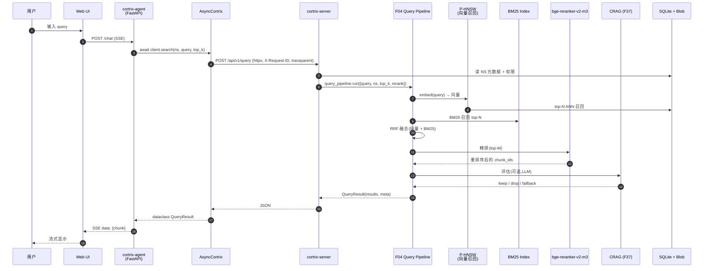
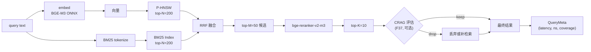
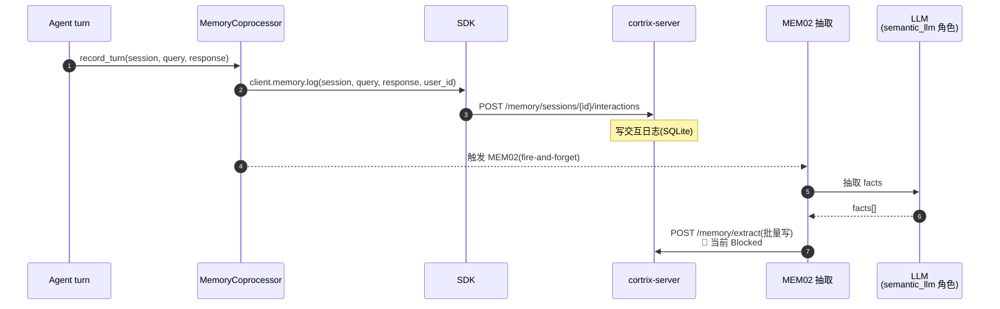
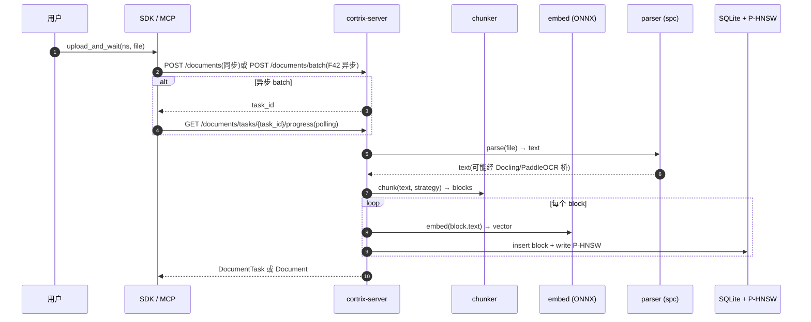
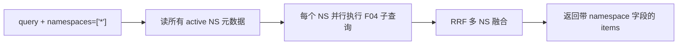

# 13 · 数据流 — 一个查询从 UI 到 F04 pipeline

> **目标读者**:架构师、想理解检索质量的开发者。
> **阅读时间**:15 分钟。
> **关键事实**:F04 query pipeline = 向量召回(P-HNSW)→ BM25 召回 → RRF 融合 → bge-reranker-v2-m3 精排 → CRAG(F37)评估 → 返回 Top-K;每一步都有 LLM fallback / 短路。

---

## 1. 端到端时序

> 这是"理想路径"。实际还有若干 fallback:CRAG 失败 → `CX_ERR_F37_CRAG_EVAL_FAILED`(500,带 fallback)→ 用 reranker 结果直返;expand_queries 超时 → `CX_ERR_F36_EXPAND_TIMEOUT`(timeout)。

---

## 2. F04 Query Pipeline 的内部阶段

| 阶段 | 模块 | 失败行为 | 引用 |
|---|---|---|---|
| Embedding | `src/ml/`, `src/onnx/` | ONNX 加载失败 → 启动失败(硬阻塞) | `config.yaml.example:71-77` |
| 向量召回 | `src/store/phnsw/`(P-HNSW fork) | 索引不存在 → 空候选 | `src/store/phnsw/phnsw.cpp` |
| BM25 召回 | `src/store/` 内 SQLite FTS5 | 同上 | `cmake/Dependencies.cmake:54-57` |
| RRF 融合 | `src/scoring/` | 退化为单路召回 | — |
| Rerank | `src/reranker/`(F02) | ONNX 失败 → 返回融合结果 | `config.yaml.example:92-94` |
| CRAG | `src/scoring/`(F37) | `CX_ERR_F37_CRAG_EVAL_FAILED`(500, fallback) | `_exceptions.py:186-187` |

---

## 3. 记忆(Memory)数据流

> �️ **MEM02 当前 🚫 Blocked**(`README.md:73`):最新验证观察到 LLM 传输超时路径。代码已写(`cortrix-agent/agent_core/mem_coprocess.py:27`),但跑不通。MEM01(显式 log)/ MEM03(CRUD)/ MEM04(opt-out)/ MEM05(user_id 隔离)仍是 🟡 Verification required。

---

## 4. 文档摄取路径(upload)

---

## 5. 跨 Namespace 检索(`["*"]`)

> 跨 NS 检索在 SDK 层是单条 `client.search(namespaces=["*"], query=...)`,后端负责扇出与合并(`sdk/python/cortrix/resources/query.py:103`)。返回结果带 `namespace` 字段,Agent 端据此判断来源。

---

## 6. 错误在数据流中的传播

| 阶段失败 | 错误代号 | SDK 异常 | 兜底行为 |
|---|---|---|---|
| ONNX 加载 | `CX_ERR_ONNXRT_VERSION_MISMATCH` 等 | 启动失败 | 不进入服务 |
| P-HNSW 不可用 | — | `CX_ERR_STORE_NOT_FOUND` | 空召回 + 错误信封 |
| CRAG LLM 失败 | `CX_ERR_F37_CRAG_EVAL_FAILED` | `F37CragEvaluationFailedError` | 用 reranker 结果直返 |
| MEM02 LLM 抽取失败 | `CX_ERR_MEM02_EXTRACTION_FAILED` | `MEM02ExtractionFailedError` | fallback(本轮不抽取) |
| LLM 全局熔断 | `CX_ERR_LLM_CIRCUIT_OPEN` | `LlmCircuitOpenError`(503) | 不重试 |
| Agent tool 不存在 | `CX_ERR_F48_TOOL_NOT_FOUND` | `F48AgentToolNotFoundError`(404) | — |
| 配额超限 | `CX_ERR_QUOTA_*` | `QuotaExceededError`(429) | 按 `retry_after_ms` 退避 |

> 这套代号 → 异常 → 兜底 的链路就是 [32-errors.md](../part-3-developer/32-errors.md) 要展开的图。

---

## 7. 关键时延预算(参考)

| 阶段 | CPU 路径典型值 | 备注 |
|---|---|---|
| Embedding | 50–200 ms / query | BGE-M3,512 tokens |
| P-HNSW 召回(top-N=200) | 5–30 ms | 数据量小时极快 |
| BM25 召回 | 5–20 ms | SQLite FTS5 |
| Rerank(top-M=50) | 200–600 ms | bge-reranker-v2-m3 cross-encoder |
| CRAG(可选) | 1–3 s | 一次 LLM 调用 |
| HTTP + JSON 序列化 | < 10 ms | loopback |

> **CUDA 路径**:embedding / rerank 通常各快 5–10×,CRAG 受限于 LLM provider。

---

## 下一步

👉 **[14 · 安全模型](14-security-model.md)** — Auth / RBAC / ACL / GDPR 边界。
