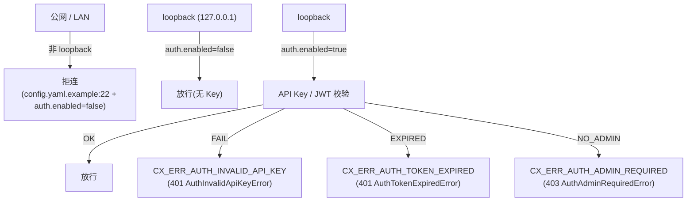

# 14 · 安全模型 — Auth / RBAC / ACL / GDPR

> **目标读者**:架构师、安全工程师、决策者。
> **阅读时间**:15 分钟。
> **关键事实**:**Auth login、Tenant/RBAC/ACL/Quota 当前全部 🚫 Blocked**(`README.md:71-74`)。本手册只描述**已落地的边界与契约**,不承诺当前能用。**生产部署前必须重读 `docs/compatibility.md` 与 `SECURITY.md`**。

---

## 1. 默认安全边界



### 1.1 默认 loopback-only

`config.yaml.example:22`:

```yaml
server:
  host: "127.0.0.1"
  port: 8420
```

注释明确:`# Safe local default; non-loopback binding requires auth.enabled: true`。

### 1.2 auth 关闭与开启

```yaml
auth:
  enabled: false   # 默认关闭(仅 loopback)
  # 开启时:
  # enabled: true
  # api_keys:
  #   - key_hash: "<echo -n 'your-key' | shasum -a 256 | cut -d' ' -f1>"
  #     tenant_id: "default"
  #     allowed_namespaces: []
  #     permissions: 7   # READ=1, WRITE=2, ADMIN=4; 7=all
  #     expires_at: 0
```

- `key_hash` 用 **SHA-256**,注释里给出生成命令(`config.yaml.example:37`)。
- `permissions` 是 3 位位掩码(`config.yaml.example:40`)。

---

## 2. Auth 错误体系(已定义,运行时 Blocked)

`_exceptions.py:122-211` 中已定义了 11 个 Auth 相关异常:

| 错误代号 | SDK 异常 | HTTP | 说明 |
|---|---|---|---|
| `CX_ERR_AUTH_EMAIL_ALREADY_EXISTS` | `AuthEmailAlreadyExistsError` | 409 | 注册冲突 |
| `CX_ERR_AUTH_INVALID_CREDENTIALS` | `AuthInvalidCredentialsError` | 401 | email/password 不匹配 |
| `CX_ERR_AUTH_INVALID_RESET_CODE` | `AuthInvalidResetCodeError` | 400 | 重置码无效 |
| `CX_ERR_AUTH_TOKEN_EXPIRED` | `AuthTokenExpiredError` | 401 | JWT / API Key 过期 |
| `CX_ERR_AUTH_BOOTSTRAP_TOKEN_INVALID` | `AuthBootstrapTokenInvalidError` | 401 | bootstrap token 无效 |
| `CX_ERR_AUTH_INVALID_API_KEY` | `AuthInvalidApiKeyError` | 401 | API Key 无效 / 撤销 |
| `CX_ERR_AUTH_ADMIN_REQUIRED` | `AuthAdminRequiredError` | 403 | 需 admin |
| `CX_ERR_AUTH_TOKEN_VERIFICATION_FAILED` | `AuthTokenVerificationFailedError` | 500 | 签名校验失败 |
| `CX_ERR_AUTH_EMAIL_SEND_FAILED` | `AuthEmailSendFailedError` | 503 | SMTP 失败 |
| `CX_ERR_AUTH_BCRYPT_TIMEOUT` | `AuthBcryptTimeoutError` | 500 | bcrypt 超时 |
| `CX_ERR_AUTH_JWT_INIT_FAILED` | `AuthJwtInitFailedError` | 500 | JWT 模块初始化失败 |
| `CX_ERR_AUTH_CSRF_MISMATCH` | `CsrfMismatchError` | 403 | CSRF token 缺失 / 不匹配(V4 CC-02) |

> ⚠️ 这些异常类**已实现**(`sdk/python/cortrix/_exceptions.py:122-164`),但 `README.md:71` 明确指出:**Auth login 当前 Blocked**,spec 与运行时存在契约漂移。生产部署前**必须**实测。

---

## 3. RBAC 与 Tenant 隔离(Blocked)

`README.md:74`:

> RBAC and tenant isolation denial matrix — `Blocked`. Cannot be proven in the current auth-disabled local runtime.

也就是说:

- **模型上**:`permissions: 7 = READ(1) | WRITE(2) | ADMIN(4)` 三档(`config.yaml.example:40`)。
- **运行时**:auth-disabled 本地模式无法验证跨 Tenant 拒绝矩阵。
- **spec**:`api/components/security*.yaml` 已声明完整 RBAC schema。
- **API examples**:`api/examples/admin/adminCreateTenant.py`、`adminCreateUser.py`、`adminListTenants.py`、`adminListUsers.py`、`adminGetAuditLog.py`、`adminRotateJwtSecret.py`、`adminUpdateTenantQuota.py` — 7 个 admin endpoints 已有示例。
- **🟡 决策**:生产多租户 SaaS,等升 ✅ 后再做。

---

## 4. Namespace ACL(已声明,Blocked)

`api/examples/acl/` 下已有完整示例:

| 操作 | 路径 | 示例 |
|---|---|---|
| Grant | `POST /namespaces/{ns_id}/acl` | `api/examples/acl/grantNsAcl/success/curl.sh` |
| List | `GET /namespaces/{ns_id}/acl` | `api/examples/acl/listNsAcl/` |
| Revoke | `DELETE /namespaces/{ns_id}/acl/{grantee}` | `api/examples/acl/revokeNsAcl/` |

- SDK 入口:`client.namespaces.set_permission(name, grantee_tenant_id, *, permission)`(`sdk/python/cortrix/resources/namespaces.py`)。
- **状态**:**Blocked**(`README.md:72`),不可用于生产授权。

---

## 5. GDPR(已声明,Verification required)

`api/examples/gdpr/` 下:

| 操作 | 端点 | 用途 |
|---|---|---|
| Export | `/api/v1/gdpr/export` | 数据主体可携带性 |
| Delete | `/api/v1/gdpr/delete` | 被遗忘权 |

- 状态:**🟡 Verification required**(未列入 Blocked,但 production-ready 前需复核)。

---

## 6. 网络与传输

| 层 | 措施 | 引用 |
|---|---|---|
| HTTP | cpp-httplib + OpenSSL | `cmake/Dependencies.cmake:3-8` |
| 反向代理 | Caddy,自动 HTTPS + HSTS | `deploy/caddy/Caddyfile:56-60` |
| 安全响应头 | `X-Content-Type-Options nosniff` / `X-Frame-Options DENY` / `X-XSS-Protection` / `Referrer-Policy` / `Strict-Transport-Security` | `deploy/caddy/Caddyfile:54-61` |
| 请求体限制 | 100MB | `deploy/caddy/Caddyfile:64-65` |
| AdminGuard 路径 | `/api/v1/admin/*`、`/api/v1/system/tenants/*`、`/api/v1/system/units/*` 在边缘被 403 | `deploy/caddy/Caddyfile:29-38` |

### 6.1 AdminGuard 与 loopback 假定

`src/middleware/admin_guard.cpp` 中的 `kAdminPrefixes` 假定 `remote_addr=127.0.0.1`(`deploy/caddy/Caddyfile:13-18` 注释解释)。反代会把请求的 remote_addr 改成 127.0.0.1,所以边缘必须**主动拦截**这三条前缀,否则 admin 路径会被公网访问到。

> 这是一条**部署侧的不变量**:如果你换掉 Caddy、改用 nginx/Envoy,必须把同样的拦截规则带上。

---

## 7. Anti-enumeration 与安全测试

`tests/security/` 目录独立编译,包含:

| 测试 | 文件 | 目的 |
|---|---|---|
| Auth bypass | `test_auth_bypass.cpp` | 各种绕路尝试 |
| Injection | `test_injection_attacks.cpp` | SQL / prompt / header 注入 |
| Namespace crossing | `test_namespace_crossing.cpp` | 跨 NS 越权 |
| RBAC | `test_sec_*.cpp` | 角色边界 |
| Tenant isolation | `test_sec_*.cpp` | 多租户隔离 |
| JWT hardening | `test_sec_*.cpp` | JWT 攻击向量 |
| Anti-enumeration | `test_sec_*.cpp` | 用户 / NS 探测防御 |
| ZAP baseline | `zap-baseline.conf` | OWASP ZAP 扫描基线 |

> 这些测试在 `tests/security/CMakeLists.txt` 下独立链接,**当前因 auth-disabled 跑不全矩阵**(`README.md:74`)。

---

## 8. CSRF(V4 CC-02)

`_exceptions.py:210-211` 引入 `CsrfMismatchError(ForbiddenError)`(403)。这是 V4 阶段引入的反 CSRF 路径,但同样受 Auth Blocked 影响。

---

## 9. 安全部署清单(decision)

部署到 LAN / 公网之前,至少要回答以下问题:

1. **auth.enabled=true 是否生效?**——目前 `Blocked`,需实测。
2. **跨 Tenant 拒绝矩阵是否覆盖你定义的权限模型?**——目前 `Blocked`。
3. **QuotaExceededError 是否会按 `retry_after_ms` 退避?**——`Blocked` 状态。
4. **AdminGuard 路径在你用的反代里被拦截了吗?**——必须有这条边缘规则。
5. **GDPR export / delete 是否覆盖你业务的所有数据主体?**——`Verification required`,需复核。
6. **CSRF token 路径是否对所有 state-changing endpoint 生效?**——`Blocked`。
7. **日志是否做了 redaction?**——`config.yaml.example:48` 支持 JSON 日志,但**redaction 字段配置不在 example 中**,需自行审查 `src/observability/` 与 `src/logging/`。

> 🔴 当前阶段(2026-08,v1.0.0-rc.1):**不建议**将 Cortrix 暴露到公网或承载真实租户数据。

---

## 下一步

👉 **[15 · 可观测性](15-observability.md)** — 追踪 / 日志 / metrics 在哪里、怎么接。
