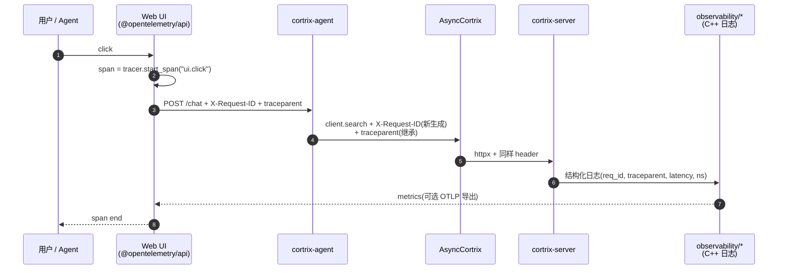

# 15 · 可观测性 — 追踪 / 日志 / metrics

> **目标读者**:架构师、运维、SRE。
> **阅读时间**:10 分钟。
> **关键事实**:每次请求都有 `X-Request-ID`(UUIDv4)+ `traceparent`(W3C,可选)+ `User-Agent` + `Authorization`,可由 `trace_id_provider` 注入;**服务端日志支持 text/json 两种格式**;Web UI 已接入 `@opentelemetry/api`。

---

## 1. 请求头(SDK → Server)

来自 `sdk/python/cortrix/_base_client.py:124-149` 的 `_build_headers`:

| Header | 来源 | 是否必有 |
|---|---|---|
| `User-Agent` | `cortrix-python/{SDK_VERSION}`(常量 `_constants.py:9`) | ✅ |
| `X-Request-ID` | `uuid4()`(`_base_client.py:131` 附近) | ✅(每请求唯一) |
| `Authorization` | `Bearer <api_key>`(由 `__init__` 入参 `api_key`) | 配置即有 |
| `X-Tenant-Id` | `__init__` 入参 `tenant_id` | 可选 |
| `X-Client-Id` | `__init__` 入参 `client_id` | 可选 |
| `traceparent` | `trace_id_provider()` 调用结果 | 可选 |
| 用户传入 `headers` | 调用方临时覆盖 | 可选 |

> `trace_id_provider` 抛出异常会被 `_build_headers` 静默吞咽(`_base_client.py:140-149` 防御性),不会让追踪失败把正常请求搞砸。

---

## 2. trace_id_provider 接入 OpenTelemetry

来自 `sdk/python/README.md:127-146`:

```python
from opentelemetry import trace
from opentelemetry.trace import SpanContext, TraceFlags

def provider() -> str | None:
    span = trace.get_current_span()
    sc: SpanContext = span.get_span_context()
    if not sc.is_valid:
        return None
    return f"00-{sc.trace_id:032x}-{sc.span_id:016x}-{sc.trace_flags:02x}"

client = AsyncCortrix(
    base_url="http://localhost:8420",
    api_key="...",
    trace_id_provider=provider,
)
```

> W3C traceparent 格式:`00-<trace_id 32 hex>-<span_id 16 hex>-<flags 2 hex>`。

---

## 3. 一次请求的追踪字段传播



> **关键点**:Web UI 用 `@opentelemetry/api` 与 `@opentelemetry/exporter-metrics-otlp-http`(在 `web/package.json`);服务端 `src/observability/` 与 `src/middleware/http_observability_middleware.*` 写日志;**两端不直接串联**——靠 `traceparent` 在跨进程传播。

---

## 4. 服务端日志

### 4.1 配置

`config.yaml.example:46-49`:

```yaml
log:
  level: "info"      # debug / info / warning / error
  format: "text"     # text (development) / json (production / log collection)
  output: "stdout"   # stdout / stderr / /path/to/file.log
```

### 4.2 推荐生产配置

```yaml
log:
  level: "info"
  format: "json"
  output: "stdout"  # 由容器 runtime(Compose / k8s)统一收集
```

- JSON 格式方便 Loki / Elasticsearch 摄入。
- 注意:**redaction 字段配置不在 example 中**(`README.md:184` 把"logging redaction"列为 production-readiness 待办)。

### 4.3 agent_trace

`src/agent_trace/` 与 `src/agent_friendly/`:

- `agent_trace/`:Agent 调用链的细粒度 trace(哪一步用了哪个 chunk_id、retrieval latency、LLM latency)。
- `agent_friendly/`:把内部错误编码为 GEN-Agent 4 字段,见 `_exceptions.py:9-12` 与 [00-glossary §4](../00-glossary.md)。

---

## 5. 健康检查与版本

来自 `sdk/python/cortrix/resources/system.py` 与 `api/openapi.yaml`:

| 端点 | 用途 |
|---|---|
| `GET /api/v1/system/health` | 综合健康 |
| `GET /api/v1/system/health/ready` | 就绪(quickstart 专用,等模型加载完) |
| `GET /api/v1/system/health/live` | 存活 |
| `GET /api/v1/system/version` | 服务端版本 |
| `GET /api/v1/system/namespace_stats/{ns}` | NS 统计 |
| `GET /api/v1/system/agent_llm_config` | Agent LLM 配置 |
| `GET /api/v1/system/features` | 能力清单 |

`deploy/docker-compose.yml:28-33` 的 healthcheck:

```yaml
healthcheck:
  test: ["CMD", "/app/healthcheck.sh"]
  interval: 5s
  timeout: 5s
  start_period: 30m   # 给模型下载留时间
  retries: 3
```

---

## 6. 错误信封的可观测性

每个 `CortrixError` 携带:

| 字段 | 来自 | 用于 |
|---|---|---|
| `request_id` | 服务端响应头 `X-Request-ID` 回传 | 跨进程日志关联 |
| `status_code` | HTTP status | 路由 |
| `error_code` | 服务端 `code` 字段 | 业务路由 |
| `category` | 5 类 | 自动退避 / 路由决策 |
| `retry_after_ms` | 服务端 / `Retry-After` header | 客户端退避 |
| `structured_data` | 服务端自由格式 | 自动修复输入 |
| `body` | 原始 JSON | 调试 |

> 完整错误体系见 [32-errors.md](../part-3-developer/32-errors.md)。

---

## 7. 指标(Metrics)

- **服务端**:`src/observability/` 提供内部 metrics;**OTLP 导出不在 example 中**,production 部署前需自行接入。
- **Web UI**:`@opentelemetry/exporter-metrics-otlp-http` 已集成,可配 OTLP endpoint(`web/package.json`)。

> ⚠️ **当前没有内置的 Prometheus exporter**;若要 Prometheus,需要自己写一个 `src/observability/` 扩展或在反向代理层做 access log 解析。

---

## 8. 故障排查速查

| 现象 | 看哪里 |
|---|---|
| 请求慢 | 服务端 `agent_trace/` 日志,按 `X-Request-ID` 关联前后端 |
| LLM 抽取失败 | 找 `CX_ERR_F36_EXPAND_TIMEOUT` / `CX_ERR_F37_CRAG_EVAL_FAILED` / `CX_ERR_MEM02_EXTRACTION_FAILED` / `CX_ERR_LLM_CIRCUIT_OPEN` |
| 上传任务卡住 | `client.documents.task_status(task_id)` 或 `GET /documents/tasks/{task_id}/progress` |
| Auth 失败 | 区分 `INVALID_API_KEY` / `TOKEN_EXPIRED` / `INVALID_CREDENTIALS` |
| 模型加载失败 | `config.yaml.example` 注释明确"非空但缺失或无效 → 启动失败" |

---

## 下一步

👉 **[16 · API 合约](16-api-contract.md)** — OpenAPI 结构、错误信封、契约测试。
