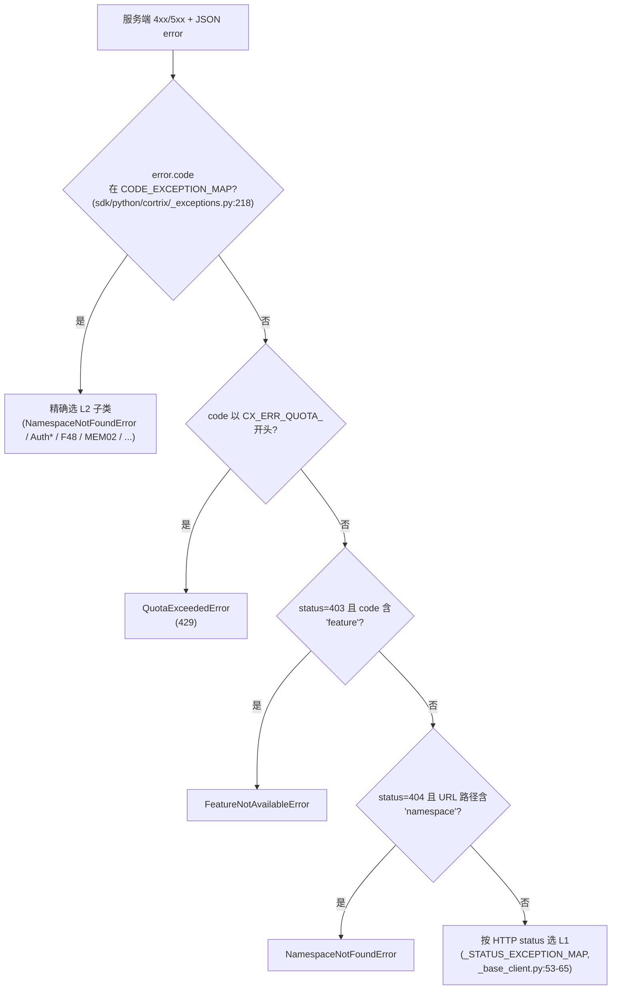

# 16 · API 合约 — OpenAPI 结构与错误信封

> **目标读者**:架构师、API 集成方、SDK 维护者。
> **阅读时间**:10 分钟。
> **关键事实**:`api/openapi.yaml` 是 SDK 与服务端的**单一真相源**;`redocly.yaml` 与 `swagger_ui.config.yaml` 做契约校验;错误有 5 类 `category`,所有 SDK 异常都映射自这里。

---

## 1. OpenAPI 仓库布局

```text
api/
├── openapi.yaml                    # 主合约
├── redocly.yaml                    # Redocly 校验配置
├── swagger_ui.config.yaml          # Swagger UI 配置
├── paths/                          # 路径定义(按域拆分)
│   ├── namespaces.yaml
│   ├── documents.yaml
│   ├── query.yaml
│   ├── memory.yaml
│   ├── sql.yaml
│   ├── sync.yaml
│   ├── watch.yaml
│   ├── auth.yaml
│   ├── admin.yaml
│   ├── gdpr.yaml
│   ├── system.yaml
│   ├── tenants.yaml
│   ├── agent.yaml
│   ├── ops.yaml
│   └── acl.yaml
├── components/                     # 复用 schema / security / parameters
│   ├── schemas.yaml
│   ├── security*.yaml
│   ├── parameters.yaml
│   └── responses.yaml
└── examples/                       # 15 域 × 4-5 类别 = 60+ 用例
    └── README.md                   # 命名规范
```

| 域 | 子路径 | 用例数(估) |
|---|---|---|
| `namespaces/` | `create/list/get/update/delete/...` | 8+ |
| `documents/` | `upload_*/...` | 10+ |
| `query/` | `success/...` | 5+ |
| `memory/` | `search_*/log_*/extract_*/...` | 10+ |
| `acl/` | `grantNsAcl/listNsAcl/revokeNsAcl` | 9+ |
| `auth/` | `register/login/refresh/...` | 14+ |
| `tenants/` | `listMyTenants/addTenantMember/...` | 8+ |
| `admin/` | `adminCreateTenant/adminCreateUser/...` | 12+ |
| `gdpr/` | `gdprExport/gdprDelete` | 6+ |
| `ops/` | `gc*/maintenance*` | 10+ |
| `system/` | `getSystemHealth/...` | 8+ |
| `sync/` / `watch/` / `sql/` / `agent/` | ... | ... |

---

## 2. 错误信封(5 类 category)

来自 `sdk/python/cortrix/_exceptions.py:20` 与 `api/examples/README.md:6-9`:

```python
ErrorCategory = Literal["auth", "quota", "transient", "permanent", "timeout"]
```

| Category | 含义 | SDK 异常族 | HTTP 倾向 |
|---|---|---|---|
| `auth` | 认证 / 授权失败 | `AuthenticationError`、`ForbiddenError`、`Auth*` | 401 / 403 |
| `quota` | 配额超限 | `QuotaExceededError` | 429 |
| `transient` | 可重试服务端错误 | `InternalServerError`、`ServiceUnavailableError`、`F37CragEvaluationFailedError` | 500 / 503 |
| `permanent` | 永久性错误(请求有问题) | `InvalidRequestError`、`NotFoundError`、`ConflictError` | 400 / 404 / 409 |
| `timeout` | 超时 | `TimeoutError`、`F36ExpandQueriesTimeoutError` | 504 / timeout |

> �️ **category 与 HTTP status 是两个独立维度**:`api/examples/README.md:30-46` 强调"按 `category` 而非 HTTP code 分类用例",因为 category 是更稳定的语义维度。

---

## 3. 错误选择决策树



> 这棵决策树来自 `sdk/python/cortrix/_base_client.py:153-170` 的 `_select_exception_class`(`_exceptions.py:214-217` 注释也有说明)。

---

## 4. SDK 异常类的 L1 / L2 完整清单

### 4.1 L1(12 个,HTTP status 分组)

来自 `_exceptions.py:58-113`:

| 异常类 | HTTP | 用途 |
|---|---|---|
| `InvalidRequestError` | 400 | 请求格式错误 |
| `AuthenticationError` | 401 | 未认证 / token 过期 |
| `ForbiddenError` | 403 | 权限不足 |
| `NotFoundError` | 404 | 资源不存在 |
| `ConflictError` | 409 | 资源冲突 |
| `PayloadTooLargeError` | 413 | 请求体过大 |
| `RateLimitError` | 429 | 限流(带 `retry_after`) |
| `InternalServerError` | 500 | 服务端内部错误 |
| `ServiceUnavailableError` | 503 | 服务暂不可用 |
| `TimeoutError` | 504 | 超时 |
| `FeatureNotAvailableError` | — | 部署特性缺失 |
| `ConnectionError` | — | 网络层失败 |

### 4.2 L2(23 个,精确业务子类)

来自 `_exceptions.py:115-211`、`CODE_EXCEPTION_MAP` `_exceptions.py:218-246`:

| 异常类 | code | 父类 |
|---|---|---|
| `NamespaceNotFoundError` | `CX_ERR_NAMESPACE_NOT_FOUND` | `NotFoundError` |
| `AuthEmailAlreadyExistsError` | `CX_ERR_AUTH_EMAIL_ALREADY_EXISTS` | `ConflictError` |
| `AuthInvalidCredentialsError` | `CX_ERR_AUTH_INVALID_CREDENTIALS` | `AuthenticationError` |
| `AuthInvalidResetCodeError` | `CX_ERR_AUTH_INVALID_RESET_CODE` | `InvalidRequestError` |
| `AuthTokenExpiredError` | `CX_ERR_AUTH_TOKEN_EXPIRED` | `AuthenticationError` |
| `AuthBootstrapTokenInvalidError` | `CX_ERR_AUTH_BOOTSTRAP_TOKEN_INVALID` | `AuthenticationError` |
| `AuthInvalidApiKeyError` | `CX_ERR_AUTH_INVALID_API_KEY` | `AuthenticationError` |
| `AuthAdminRequiredError` | `CX_ERR_AUTH_ADMIN_REQUIRED` | `ForbiddenError` |
| `AuthTokenVerificationFailedError` | `CX_ERR_AUTH_TOKEN_VERIFICATION_FAILED` | `InternalServerError` |
| `AuthEmailSendFailedError` | `CX_ERR_AUTH_EMAIL_SEND_FAILED` | `ServiceUnavailableError` |
| `AuthBcryptTimeoutError` | `CX_ERR_AUTH_BCRYPT_TIMEOUT` | `InternalServerError` |
| `AuthJwtInitFailedError` | `CX_ERR_AUTH_JWT_INIT_FAILED` | `InternalServerError` |
| `CsrfMismatchError` | `CX_ERR_AUTH_CSRF_MISMATCH` | `ForbiddenError` |
| `StoreNotFoundError` | `CX_ERR_STORE_NOT_FOUND` | `NotFoundError` |
| `StoreDbError` | `CX_ERR_STORE_DB_ERROR` | `ServiceUnavailableError` |
| `F14InvalidFilterError` | `CX_ERR_F14_INVALID_FILTER` | `InvalidRequestError` |
| `F36ExpandQueriesTimeoutError` | `CX_ERR_F36_EXPAND_TIMEOUT` | `TimeoutError` |
| `F37CragEvaluationFailedError` | `CX_ERR_F37_CRAG_EVAL_FAILED` | `InternalServerError` |
| `F41DocSummaryFailedError` | `CX_ERR_F41_DOC_SUMMARY_FAILED` | `InternalServerError` |
| `F48AgentToolNotFoundError` | `CX_ERR_F48_TOOL_NOT_FOUND` | `NotFoundError` |
| `MEM02ExtractionFailedError` | `CX_ERR_MEM02_EXTRACTION_FAILED` | `InternalServerError` |
| `LlmCircuitOpenError` | `CX_ERR_LLM_CIRCUIT_OPEN` | `ServiceUnavailableError` |
| `QuotaExceededError` | `CX_ERR_QUOTA_*`(前缀匹配) | `RateLimitError` |

---

## 5. 契约生成与校验

| 文件 | 用途 |
|---|---|
| `sdk/python/scripts/generate_types.py` | 手写生成器,把 `api/openapi.yaml` → `sdk/python/cortrix/types/_generated.py`(34 个 dataclass) |
| `redocly.yaml` | Redocly lint(OpenAPI 3.1) |
| `swagger_ui.config.yaml` | Swagger UI 渲染 |
| `tests/ci/test_classify_changes.sh` | PR 变更分级(决定跑哪些 CI lane) |

> SDK 类型系统**不是** pydantic / TypedDict——是手写 dataclass + `parse_model` 容错解析,见 [34-types-and-schemas.md](../part-3-developer/34-types-and-schemas.md)。

---

## 6. 路径命名约定

`api/examples/README.md:30-46`:

```
<domain>/<endpoint>/<scenario>/<format>
        └─ scenario ∈ {success, unsupported, error_category_auth, error_category_quota,
                       error_category_transient, error_category_permanent, error_category_timeout,
                       error_category_<x>_<httpcode>...}
```

例:
- `query/success/python.py` — 唯一手精的可运行 Python 示例
- `query/unsupported/curl.sh` — 该部署不支持 query 的例子
- `documents/upload_error_category_auth/curl.sh` — 上传时的 auth 错误
- `documents/upload_error_category_quota_429_rate_limit/curl.sh` — HTTP code 后缀

> **手精可运行**:`success/python.py` 不允许含 TODO,只有 `query/success/python.py` 是手精的(`api/examples/README.md:40-42`)。

---

## 7. wire ↔ SDK 字段翻译(以 query 为例)

`sdk/python/cortrix/resources/query.py` 的 `_adapt_wire_result` 把服务端 wire schema 翻译成 SDK 的 dataclass:

| wire 字段 | SDK 字段 |
|---|---|
| `chunk_text` | `content` |
| `block_id` | `child_id` |
| `doc_id` | `parent_id` |
| `filters`(复数) | `filter`(单数,作为请求体) |

> 这条翻译规则保证 wire 改名时,SDK 的 dataclass 不变 → 调用方代码不破。完整 34 个 dataclass 见 `sdk/python/cortrix/types/_generated.py:0-360`。

---

## 8. 接入层与契约的关系

| 接入层 | 如何消费 OpenAPI |
|---|---|
| **Python SDK** | `scripts/generate_types.py` 生成 dataclass;`resources/*` 写明 path 常量 |
| **MCP Server** | 直 HTTP,OpenAPI 是请求/响应参照;29+2 工具与 P12 SoT 一致 |
| **Skills** | 透过 SDK(强依赖),所以也是 dataclass |
| **Web UI** | 手写 TS client(`web/src/api/`),不直接读 OpenAPI |
| **pgcortrix** | 直 HTTP,不消费 dataclass |
| **C++ 服务端** | OpenAPI 是手工维护的"目标",由 `api/paths/*.yaml` 描述 |

---

## 下一步

👉 **[第二篇 · 20 · 5 分钟上手](part-2-user/20-quickstart.md)** — 用户视角,把 Cortrix 跑起来。
