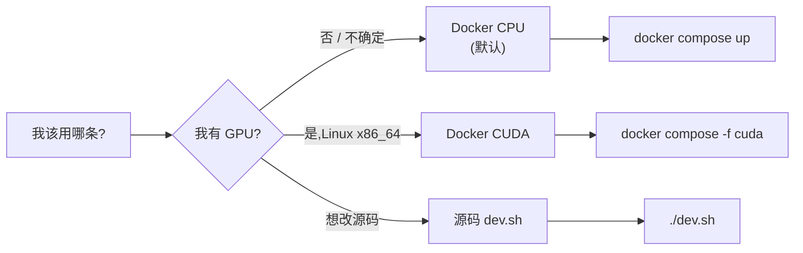

# 20 · 5 分钟上手 — 三种启动路径

> **目标读者**:首次接触 Cortrix 的用户。
> **阅读时间**:5 分钟。
> **关键事实**:有**三条**路径启动 Cortrix:**源码**(`dev.sh`)、**Docker CPU**(默认推荐)、**Docker CUDA**(GPU)。每条路径都默认只监听 `127.0.0.1:8420`,不开 auth。



---

## 1. Docker CPU(默认,大多数用户选这条)

来自 `docs/QUICKSTART.md`、`README.md:79-108`、`deploy/docker-compose.yml`。

### 1.1 启动

```bash
git clone https://github.com/cortrix/cortrix.git
cd cortrix

CORTRIX_SOURCE_REVISION="$(git rev-parse HEAD)" \
  docker compose -f deploy/docker-compose.yml up --build --wait
```

- 首次启动会**下载约 1.17 GB** 模型到 `cortrix-data` 命名 volume(`README.md:101`)。
- `start_period=30m`(`deploy/docker-compose.yml:32`),给下载留时间。
- 后续启动复用 volume,极快。

### 1.2 检查就绪

```bash
curl -fsS http://127.0.0.1:8420/api/v1/system/health/ready
```

> "就绪"意味着:API 在线、embedding 模型加载完、reranker 模型加载完、source-backed demo fixture 就绪(`docs/QUICKSTART.md:48-52`)。

### 1.3 跑一个检索

```bash
curl -fsS -H 'Content-Type: application/json' \
  -d '{
    "namespaces": ["demo"],
    "query": "What does semantic storage keep close to the agents that need it?",
    "top_k": 5,
    "rerank": true
  }' \
  http://127.0.0.1:8420/api/v1/query
```

预期响应包含 `quickstart-demo.txt` 内容片段与 `rerank_score` 数值(`docs/QUICKSTART.md:64-67`)。

### 1.4 停止 / 清理

```bash
docker compose -f deploy/docker-compose.yml down           # 停服务,保留 volume
docker compose -f deploy/docker-compose.yml down --volumes  # 停服务 + 删模型 / 数据
```

---

## 2. 源码构建(开发者 / 调试)

来自 `dev.sh` + `CMakeLists.txt`。

```bash
git clone https://github.com/cortrix/cortrix.git
cd cortrix
cp config.yaml.example build/config.yaml

# 编译
cmake -S . -B build -DCMAKE_BUILD_TYPE=Release
cmake --build build -j

# 启动(等价于 dev.sh)
./build/cortrix/cortrix-server
```

或者:

```bash
./dev.sh
```

> **数据目录**:`build/data/`(`config.yaml.example:55-58`)。第一次跑会从 `models/` 读模型,如果不存在请先 `bash deploy/download-models.sh`。

---

## 3. Docker CUDA(Linux x86_64 + NVIDIA)

来自 `deploy/docker-compose.cuda.yml`(README 提及)。

```bash
docker compose -f deploy/docker-compose.cuda.yml up --build --wait
```

- **前提**:宿主机有 NVIDIA Container Toolkit + 兼容驱动。
- **模型**:同 BGE-M3 / bge-reranker-v2-m3,只是 ONNX Runtime 走 `cuda`(`cmake/Dependencies.cmake:85-99`)。
- **切换前必读**:`docs/operations/cuda-execution-provider.md`。

---

## 4. macOS / Apple Silicon

- **Docker 路径**:docker-compose CPU 镜像通常可在 macOS 上跑,但 ONNX Runtime 用 CPU。
- **源码路径**:`cmake/Dependencies.cmake:70-81` 自动检测 CoreML + Foundation,如可用则启用 GPU 加速。
- **构建**:`cmake -S . -B build && cmake --build build -j`。

---

## 5. 三条路径的差异

| 维度 | Docker CPU | Docker CUDA | 源码 |
|---|---|---|---|
| 模型位置 | `cortrix-data` volume | 同左 | `models/` 或 `build/data/...` |
| ONNX Runtime | `cpu` | `cuda` | 自动 / 配置 |
| 启动耗时(首次) | 镜像 + 模型下载 | 镜像 + 模型下载 + CUDA 校验 | 仅编译 |
| 后续启动 | 秒级 | 秒级 | 秒级 |
| Auth 默认 | off | off | off |
| loopback-only | ✅ | ✅ | ✅(`server.host: 127.0.0.1`) |
| 适合谁 | 大多数用户 / 试用 | GPU 推理 / 性能评测 | 改源码 / 调试 |

---

## 6. 第一次启动后做什么

| 任务 | 怎么做 |
|---|---|
| 看健康 | `curl http://127.0.0.1:8420/api/v1/system/health/ready` |
| 看版本 | `curl http://127.0.0.1:8420/api/v1/system/version` |
| 建 NS | `POST /api/v1/namespaces`(见 [23-use-cases.md](23-use-cases.md)) |
| 上传文档 | `POST /api/v1/documents`(见 [23 §1](23-use-cases.md#1-合同检索)) |
| 检索 | `POST /api/v1/query`(见上 §1.3) |
| 启用 Agent | 改 env / 配置,见 [25-agent-chat.md](25-agent-chat.md) |

---

## 7. 状态门槛

> 启动本身是 ✅ Verified(loopback 路径 + health 端点)。
> 跑通端到端检索是 🟡 Verification required(需要 e2e 复核)。
> 跑多租户、跑 auth login、跑 MEM02 自动抽取 → 当前 🚫 Blocked,不要按这条路径做。

---

## 下一步

👉 **[21 · 配置](21-config.md)** — `config.yaml` 字段、环境变量、5 个 LLM 角色。
