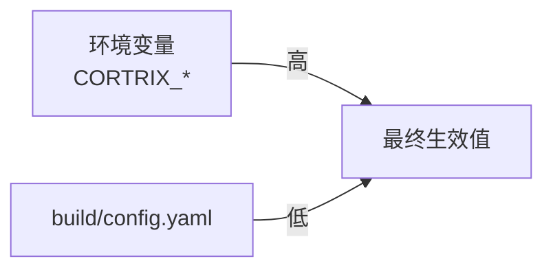
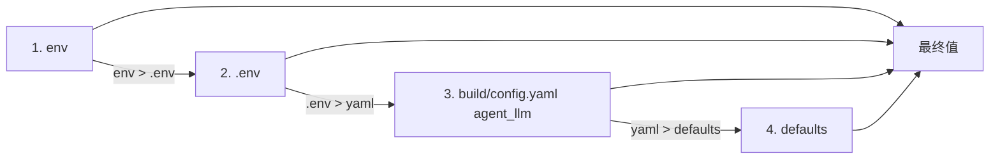

# 21 · 配置 — config.yaml 与环境变量

> **目标读者**:用户、运维。
> **阅读时间**:15 分钟。
> **关键事实**:服务端配置分**两层优先级**:**YAML 文件**(`build/config.yaml`,从 `config.yaml.example` 复制)与**环境变量**(env 通常 win)。`cortrix-agent` 有**自己的 4 层优先级**(env → `.env` → build/config.yaml 的 `agent_llm` → defaults)。

---

## 1. 服务端优先级



> 注释中显式说"env wins over yaml"的有:`reranker`(`config.yaml.example:90`)、`query_complexity`(`config.yaml.example:107`)、`retrieval`(`config.yaml.example:117`)。
>
> **deprecated alias**(`config.yaml.example:78-80`、`:96-98`):`gpu_provider` 与 `use_coreml` 是别名,不能与新的 `execution_provider` 同时设置,否则启动失败。

---

## 2. 顶层字段(`config.yaml.example`)

### 2.1 `server` — HTTP 服务(`config.yaml.example:21-24`)

| 字段 | 默认 | 说明 |
|---|---|---|
| `host` | `"127.0.0.1"` | loopback-only 是默认安全边界 |
| `port` | `8420` | HTTP 端口 |
| `thread_count` | `4` | 工作线程数,推荐 = CPU 核数 |

### 2.2 `auth` — 鉴权(`config.yaml.example:31-42`)

| 字段 | 默认 | 说明 |
|---|---|---|
| `enabled` | `false` | **🚫 关闭时**:仅 loopback 可访问 |
| `api_keys[].key_hash` | — | SHA-256 of key |
| `api_keys[].tenant_id` | — | 绑定的 Tenant |
| `api_keys[].allowed_namespaces` | `[]` | 空 = 允许所有 NS |
| `api_keys[].permissions` | `7` | READ=1 / WRITE=2 / ADMIN=4 |
| `api_keys[].expires_at` | `0` | 0 = 永不过期 |

> ⚠️ `auth.enabled=true` 后,`server.host` 必须是非 loopback,否则启动失败。

### 2.3 `log` — 日志(`config.yaml.example:46-49`)

| 字段 | 默认 | 说明 |
|---|---|---|
| `level` | `"info"` | `debug` / `info` / `warning` / `error` |
| `format` | `"text"` | `text` / `json` |
| `output` | `"stdout"` | `stdout` / `stderr` / 绝对路径 |

### 2.4 `namespace` — 数据存储(`config.yaml.example:55-58`)

| 字段 | 默认 | 说明 |
|---|---|---|
| `data_dir` | `"./build/data"` | SQLite + vector index + Blob |
| `max_active` | `10` | 同时 active 的 NS 上限 |
| `idle_timeout_s` | `300` | idle 超时自动 unload,`0`=不 unload |

### 2.5 `embedding` — 向量模型(`config.yaml.example:71-77`)

| 字段 | 默认 | 说明 |
|---|---|---|
| `model_path` | `"./models/bge-m3/model.onnx"` | BGE-M3 ONNX |
| `tokenizer_path` | `"./models/bge-m3/tokenizer.json"` | |
| `dimension` | `1024` | **固定 1024**,不可改 |
| `max_seq_length` | `512` | max tokens per encode |
| `execution_provider` | `"auto"` | `auto` / `cpu` / `coreml` / `cuda` |

> **空 model_path 是唯一显式 stub 模式**;非空但缺失/无效/tokenizer 加载失败 → **启动失败**(fail-closed)(`config.yaml.example:69`)。

### 2.6 `reranker` — F02 cross-encoder(`config.yaml.example:92-99`)

| 字段 | 默认 | 说明 |
|---|---|---|
| `model_dir` | `"./models/bge-reranker-v2-m3"` | ONNX + tokenizer |
| `execution_provider` | `"auto"` | 同上 |

### 2.7 `query_complexity` — F39 classifier(`config.yaml.example:109-110`)

- 缺失时,F39 回退到启发式后端(所有 query 走 Complex)。
- env: `CORTRIX_QUERY_COMPLEXITY_MODEL_DIR` 优先。

### 2.8 `retrieval` — 候选池(`config.yaml.example:119-121`)

```yaml
retrieval:
  candidate_multiplier: 3   # top_k * N,候选池上界
  max_candidates: 50        # 硬上限
```

### 2.9 `spc` — 摄取管线(`config.yaml.example:127-145`)

```yaml
spc:
  worker_count: 2
  chunk_size: 512
  chunk_overlap: 50
  embedding_batch_size: 1
  onnx_intra_threads: 4
  onnx_inter_threads: 1
  python_bin: "./scripts/ocr_venv/bin/python3.12"
  parse_pdf_script: "./scripts/parse_pdf.py"
  parse_word_script: "./scripts/parse_word.py"
  ocr_script: "./scripts/run_ocr.py"
  parser_timeout_s: 120
  ocr_timeout_s: 3600
  # 可选:vision_llm_script / vision_llm_timeout_s(配合 vision_llm 角色)
```

### 2.10 `watch_dir` — 本地目录监听(`config.yaml.example:257-260`)

| 字段 | 默认 | 说明 |
|---|---|---|
| `data_dir` | `""` | 空 = 禁用 |
| `namespace_name` | `"local"` | 自动创建 NS |
| `watch_enabled` | `true` | `false` = 只导入已有 |

### 2.11 `memory` — Memory(`config.yaml.example:266-269`)

| 字段 | 默认 | 说明 |
|---|---|---|
| `default_ttl_seconds` | `0` | 0 = 永不过期 |
| `inject_recent_turns` | `5` | 注入最近 N 轮 |
| `inject_max_tokens` | `2000` | 注入的 token 上限 |

### 2.12 `rag_fusion` — F36(`config.yaml.example:279-285`)

```yaml
rag_fusion:
  default_enabled: false        # V1.0 OSS / Cloud V1 默认关闭
  default_variant_count: 3      # N=3,NS 级 [1-10]
  default_rrf_k: 60
  default_timeout_ms: 5000
```

### 2.13 `gc` — 三阶段 GC(`config.yaml.example:293-300`)

| 字段 | 默认 | 说明 |
|---|---|---|
| `enabled` | `true` | 后台 GC 线程开关 |
| `soft_delete_retention_days` | `30` | Stage 1 → 2 窗口 |
| `blob_gc_retention_days` | `90` | Stage 2 → 3 窗口 |
| `scan_interval_hours` | `24` | 后台扫描频率 |
| `max_purge_per_run` | `10000` | 单次 unlink 上限 |
| `max_run_duration_minutes` | `5` | 单次运行 wall time 上限 |

---

## 3. LLM 5 角色(`config.yaml.example:148-250`)

服务端解析 5 个独立 section(`src/config/config.cpp`):

| 角色 | 用途 | 调用方 |
|---|---|---|
| `semantic_llm` | F39 query 复杂度分类 + F02 rerank(fast/cheap) | C++ 后端(OpenAI-compatible wire) |
| `vision_llm` | OCR 图像增强 | C++ 后端(OpenAI-compatible) |
| `agent_llm` | 对话 RAG/chat | **Python Agent**(`cortrix-agent/`,native 协议) |
| `doc_summary_llm` | F41 摄取侧摘要(异步 F42) | C++ 后端(OpenAI-compatible) |
| `enricher_llm` | F03 SPC 摄取 enricher(NER + summary) | C++ 后端(OpenAI-compatible) |

每个角色 4 个字段:

```yaml
<role>:
  provider: "openai" | "glm" | "claude" | "ollama" | "deepseek" | "mock"
  api_key:  "..."
  model:    "..."
  base_url: "..."   # 例:https://open.bigmodel.cn/api/paas/v4
```

> 4 字段**全部**设置才算配置上,否则该 feature OFF(`config.yaml.example:159-161`)。

### 3.1 协议分流(关键)

`config.yaml.example:165-179`:

- **agent_llm**:Python Agent 用,**走各 vendor 原生协议**(Anthropic → `/v1/messages`)。
  - Claude 不需要 `base_url`(adapter 自定端点)。
- **其他 4 个**:C++ 后端用,**只走 OpenAI-compatible wire**(`POST {base_url}/chat/completions` + `Authorization: Bearer`)。
  - Claude 必须经 OpenAI-compatible 代理网关。

### 3.2 推荐组合

| 角色 | 推荐模型 | 备注 |
|---|---|---|
| `semantic_llm` | `gpt-4o-mini` / `glm-4-flash` | fast/cheap,高 QPS |
| `vision_llm` | `glm-4v-flash` / `gpt-4o` | 多模态 |
| `agent_llm` | `claude-haiku-4-5-20251001` / `gpt-4o` | 质量优先 |
| `doc_summary_llm` | `gpt-4o-mini` | 摘要 |
| `enricher_llm` | `gpt-4o-mini` | NER + 摘要 |

---

## 4. Agent 4 层优先级(`cortrix-agent/config.py:1-8`)



| 优先级 | 来源 | 例 |
|---|---|---|
| 1 (最高) | 环境变量 | `LLM_PROVIDER=claude` |
| 2 | `.env` 文件 | `LLM_PROVIDER=claude` |
| 3 | `build/config.yaml` 的 `agent_llm` | 上面 LLM 5 角色 |
| 4 (最低) | `cortrix-agent/config.py` defaults | `mock` provider |

---

## 5. 常用环境变量速查

| 变量 | 作用 |
|---|---|
| `CORTRIX_HTTP_PORT` | 覆盖 server.port |
| `CORTRIX_DATA_DIR` | 覆盖 namespace.data_dir |
| `CORTRIX_SERVER_ALLOW_UNAUTHENTICATED_CONTAINER_BIND` | 容器内非 loopback 时仍允许(仅 quickstart 容器) |
| `CORTRIX_PROFILE` | `quickstart` / `source` / 等 |
| `CORTRIX_LLM_ENABLED` | `"true"` / `"false"` |
| `CORTRIX_AGENT_ENABLED` | `"true"` / `"false"` |
| `CORTRIX_EMBEDDING_EXECUTION_PROVIDER` | `cpu` / `cuda` / `coreml` |
| `CORTRIX_RERANKER_EXECUTION_PROVIDER` | 同上 |
| `CORTRIX_RERANKER_MODEL_DIR` | 覆盖 reranker.model_dir(env win) |
| `CORTRIX_QUERY_COMPLEXITY_MODEL_DIR` | 覆盖 query_complexity.model_dir |
| `CORTRIX_RETRIEVAL_MAX_CANDIDATES` | 覆盖 retrieval.max_candidates |
| `CORTRIX_RETRIEVAL_CANDIDATE_MULTIPLIER` | 覆盖 retrieval.candidate_multiplier |
| `CORTRIX_SOURCE_REVISION` | 注入到容器,便于 provenance |

> `deploy/docker-compose.yml:7-27` 完整列出 quickstart 容器的 env。

---

## 6. 修改建议(用户视角)

| 想做的事 | 怎么改 |
|---|---|
| 切到 GPU 推理 | 改 `embedding.execution_provider` / `reranker.execution_provider` = `cuda`,或用 `deploy/docker-compose.cuda.yml` |
| 启用某个 LLM 角色 | 在 yaml 中**完整**填 4 字段(provider/api_key/model/base_url) |
| 调大切候选池 | 改 `retrieval.max_candidates`(大语料下 100–200 合理) |
| 禁用 GC 后台线程 | `gc.enabled: false` |
| 改日志格式 | `log.format: json`(生产推荐) |
| 加租户 API Key | `auth.enabled: true` + `api_keys[]`,**当前 Blocked,需实测** |

---

## 下一步

👉 **[22 · 模型](22-models.md)** — BGE-M3 / bge-reranker-v2-m3 的来源、SHA-256、ONNX Runtime。
