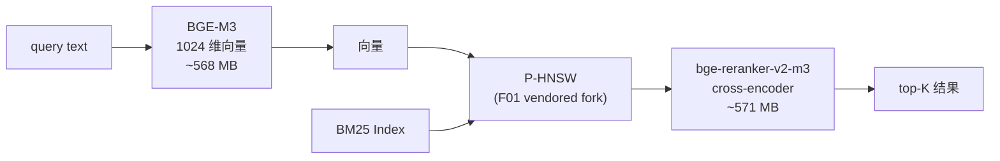

# 22 · 模型 — BGE-M3 / bge-reranker-v2-m3 / ONNX Runtime

> **目标读者**:用户、运维、SRE。
> **阅读时间**:10 分钟。
> **关键事实**:Cortrix 用 **2 个 ONNX 本地模型**做 embedding 与 rerank,共约 **1.17 GB**;**SHA-256 锁定**防止 supply-chain 替换;ONNX Runtime 1.x ABI 锁定(`cmake/Dependencies.cmake:94-99`)。

---

## 1. 两个模型

### 1.1 BGE-M3(embedding)

| 字段 | 值 |
|---|---|
| **来源** | `onnx-community/bge-m3-ONNX`(`deploy/model-manifest.tsv:2-3`) |
| **上游** | `BAAI/bge-m3@5617a9f61b028005a4858fdac845db406aefb181`(MIT) |
| **模型文件** | `onnx/model_quantized.onnx`(量化版) |
| **大小** | 568,479,395 字节 ≈ **542 MiB** |
| **SHA-256** | `2237f770aad5c71bbc1fc2d361a57f9a37400574cc9eff32626f0cdb49234730` |
| **tokenizer** | `tokenizer.json`,16 MB,SHA-256 `249df0778f2…` |
| **dimension** | 1024(固定,不可改)(`config.yaml.example:74`) |
| **max_seq_length** | 512 tokens |
| **License** | MIT |

### 1.2 bge-reranker-v2-m3(reranker)

| 字段 | 值 |
|---|---|
| **来源** | `onnx-community/bge-reranker-v2-m3-ONNX`(`deploy/model-manifest.tsv:4-5`) |
| **上游** | `BAAI/bge-reranker-v2-m3@953dc6f6f85a1b2dbfca4c34a2796e7dde08d41e`(Apache-2.0) |
| **模型文件** | `onnx/model_quantized.onnx` |
| **大小** | 570,727,094 字节 ≈ **544 MiB** |
| **SHA-256** | `912fc1215c2dbff6499700534bd8d31253af01573861abbfc43afd1fab6cce5d` |
| **tokenizer** | `tokenizer.json`,16 MB,SHA-256 `8bf8afbfd113…` |
| **License** | Apache-2.0 |

> 两个模型加起来约 **1.17 GB**(`README.md:101`)。

---

## 2. 下载与完整性校验

来自 `docs/QUICKSTART.md:84-90`、`deploy/model-manifest.tsv` 各行注释。

### 2.1 启动时自动下载

- Docker quickstart:容器首次启动时 bootstrap 脚本读 `model-manifest.tsv`,下载精确条目,校验 size + SHA-256。
- 任何不匹配 → readiness 保持 false,**fail-closed**(`docs/QUICKSTART.md:52`)。

### 2.2 校验内容

对每个资产(`deploy/model-manifest.tsv:1`):

| 列 | 用途 |
|---|---|
| `component` | 资产角色(embedding_model / reranker_model / *_tokenizer) |
| `destination` | 容器内 / 本地路径 |
| `repository` | HuggingFace 仓库 |
| `revision` | HuggingFace commit(锁) |
| `source_path` | 仓库内路径 |
| `size_bytes` | 期望大小 |
| `sha256` | SHA-256(锁) |
| `upstream_repository` / `upstream_revision` | 上游原始仓库与 commit |
| `license` | 上游 license |

---

## 3. ONNX Runtime 与 Execution Provider

来自 `cmake/Dependencies.cmake:83-99`、config `embedding.execution_provider` / `reranker.execution_provider`。

| Provider | 适用平台 | 速度 | 备注 |
|---|---|---|---|
| `cpu` | 全部 | 1×(baseline) | 默认 |
| `cuda` | Linux x86_64 + NVIDIA | 5–10× | `docker-compose.cuda.yml` |
| `coreml` | macOS | 取决于芯片 | 自动检测(`cmake/Dependencies.cmake:70-81`) |
| `auto` | 全部 | 系统选 | 推荐未指定时用 |

### 3.1 ABI 锁定

`cmake/Dependencies.cmake:94-99` 注释:

> Within one major (1.x), ONNX Runtime keeps ABI compatibility, so a same-major upgrade (e.g. 1.17 -> 1.19) is just a `.so`/dylib swap + restart — no rebuild.

- **同 major 升级**:只换 `.so` / dylib + 重启。
- **跨 major**(1.x → 2.x):需要重编并 bump `ONNXRT_MAJOR_VERSION` 标志。
- 启动时 `cortrix::onnx::StartupValidator` 比对编译期期望与运行时版本,不匹配 → `CX_ERR_ONNXRT_VERSION_MISMATCH` 启动失败。

### 3.2 切换 Provider

| 路径 | 步骤 |
|---|---|
| **Docker CPU → CUDA** | 改用 `deploy/docker-compose.cuda.yml` |
| **源码,Linux** | 重编,设 `CORTRIX_ONNX_RUNTIME_FLAVOR=cuda` |
| **源码,macOS** | 默认 auto,Apple Silicon 自动用 CoreML |
| **运行时热切** | ❌ 不支持,需重启服务 |

详细 CUDA 切换指南:`docs/operations/cuda-execution-provider.md`。

---

## 4. 何时需要手动下载模型

| 场景 | 怎么做 |
|---|---|
| Docker quickstart | 自动 |
| 源码 + 本地首次跑 | `bash deploy/download-models.sh` |
| 想用别的 embedding | 改 `embedding.model_path`(注意 dimension 默认 1024,需同步改) |
| 离线 / air-gapped | 先联网下载,然后把模型目录打包带到离线机器 |

> ⚠️ **空 model_path 是唯一显式 stub 模式**;非空但缺失/无效/tokenizer 加载失败 → 启动失败(`config.yaml.example:69`)。

---

## 5. 模型清单扩展

要加新模型(例如换 reranker),需要:

1. 在 `deploy/model-manifest.tsv` 加一行,带 SHA-256。
2. 改 `config.yaml.example` 的 `reranker.model_dir`。
3. 同步 `config.yaml.example` 的 deprecated alias 注释(若有)。
4. CI:`tests/ci/` 跑 `validate_openapi_structure.py` 等验证,确保不破坏契约。

---

## 6. 模型与 LLM 角色的关系

| 角色 | 用途 | 本地 ONNX? |
|---|---|---|
| `embedding` | query / chunk 向量化 | ✅ BGE-M3 |
| `reranker` | F02 cross-encoder 精排 | ✅ bge-reranker-v2-m3 |
| `query_complexity`(F39) | DistilBERT-tiny 分类 | ✅(`config.yaml.example:109-110`) |
| `semantic_llm` | intent / rerank 决策 | ❌ 外部 LLM |
| `vision_llm` | OCR 图像增强 | ❌ 外部 LLM |
| `agent_llm` | 对话 | ❌ 外部 LLM |
| `doc_summary_llm` | F41 摄取摘要 | ❌ 外部 LLM |
| `enricher_llm` | F03 NER + 摘要 | ❌ 外部 LLM |

> **关键区别**:**ONNX 模型**是 Cortrix 内置语义能力的载体(查询 / 检索);**外部 LLM 角色**是增强器(可选,不启用 = 仅用本地 ONNX 也能跑)。

---

## 7. 模型与 BEIR 检索质量声明

`README.md:75`:

> Full-corpus BEIR retrieval quality — `Verified`. Accepted SciFact, FiQA, and NFCorpus measurements are published.

- 这是**检索质量**声明(SciFact / FiQA / NFCorpus),**不等于**答案质量、延迟、成本或 production 性能。
- 完整方法与 provenance 见 [pinned benchmark bundle](https://github.com/cortrix/cortrix-benchmarks/tree/7bc29aa840c20db3935dfcf80eb048e553ebe2b0/results/published/beir-three-full-corpus-2026-07-v1)。

---

## 8. 故障排查

| 现象 | 看哪里 |
|---|---|
| 启动卡在 ready | docker compose logs,找 `sha256 mismatch` / `size drift` / `symlink` |
| ONNX Runtime 加载失败 | `cx_err_onnxrt_version_mismatch`,确认编译期 vs 运行期 ABI major |
| Apple Silicon 没用 GPU | `cmake/Dependencies.cmake:70-81` 自动检测,确认 `COREML_FRAMEWORK` 与 `FOUNDATION_FRAMEWORK` 都存在 |
| CUDA 跑不起来 | 读 `docs/operations/cuda-execution-provider.md` |

---

## 下一步

👉 **[23 · 业务场景](23-use-cases.md)** — 6 个端到端用例,直接复制就能跑。
