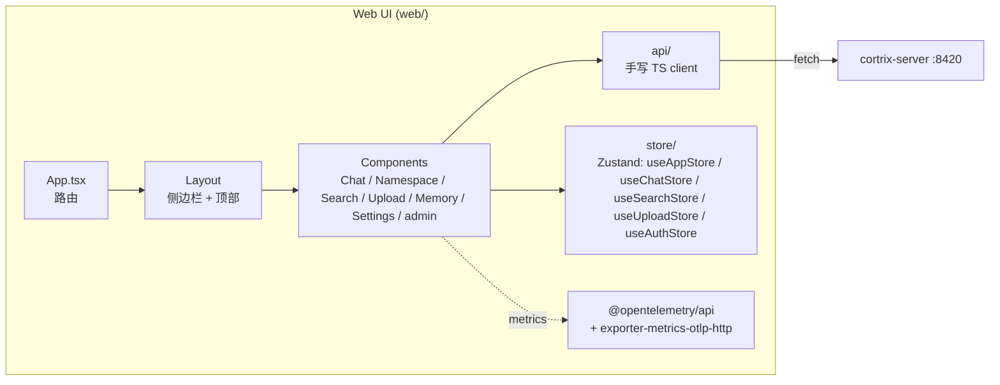

# 24 · Web UI — 浏览器里怎么用 Cortrix

> **目标读者**:用户、产品经理、首次接触者。
> **阅读时间**:10 分钟。
> **关键事实**:Web UI 是一个 **Vite + React + TypeScript + Tailwind + Zustand + react-query** 单页应用(`web/`);**不直接读 OpenAPI**,而是手写 TS client(`web/src/api/`);**支持 OpenTelemetry metrics 导出**。

---

## 1. UI 架构



---

## 2. 主要页面(`web/src/components/`)

| 页面 | 目录 | 做什么 |
|---|---|---|
| **Chat** | `Chat/` | Agent 对话界面(调 `cortrix-agent :8001` 或直接 `/api/v1/agent/chat`) |
| **Search** | `Search/` | 跨 NS 语义检索,显示 score / namespace / coverage |
| **Upload** | `Upload/` | 拖拽上传 PDF / DOCX / 图片;批量提交;任务进度 |
| **Namespace** | `Namespace/` | 创建 / 列表 / 配置 NS;watch_dir 配置 |
| **Memory** | `Memory/` | Memory CRUD(按 user_id 隔离) |
| **Settings** | `Settings/` | 系统配置 / API Key / 模型 |
| **admin** | `admin.ts` | 租户 / 配额 / 审计(`api/examples/admin/`) |
| **Common / Layout / Table / ui** | 公共组件 | |
| **EntPlaceholder** | 企业版占位(暂存) | |

---

## 3. 状态管理

来自 `web/src/store/`,Zustand:

| Store | 状态 |
|---|---|
| `useAppStore` | 全局:NS / Tenant / 主题 |
| `useAuthStore` | 登录 / Token |
| `useChatStore` | 聊天消息流 / session |
| `useSearchStore` | 当前 query / 结果 / filters |
| `useUploadStore` | 上传队列 / 进度 |

> 测试覆盖:`useAppStore.test.ts`、`useSearchStore.test.ts` 等(单元 + Playwright e2e)。

---

## 4. API Client(`web/src/api/`)

| 文件 | 端点族 |
|---|---|
| `client.ts` | 通用 fetch 封装 + 拦截器 |
| `auth.ts` | 登录 / 刷新 |
| `health.ts` | health / version |
| `namespaces.ts` | NS CRUD + ACL(测试覆盖) |
| `namespaceConfig.ts` | NS 级别配置 |
| `documents.ts` | 上传 / 列表 / 任务 |
| `batch.ts` | 批量提交 |
| `query.ts` | 检索 |
| `memory.ts` | Memory CRUD |
| `operations.ts` | GC / maintenance |
| `apiKeys.ts` | API Key 管理 |
| `admin.ts` | 租户 / 配额 / 审计 |
| `connector.ts` | 外部连接器 |
| `mock.ts` | 开发 mock |
| `fallback.ts` | 后端不可用降级 |
| `errors.ts` | 错误处理工具 |

> **错误信封**:与 [16-api-contract.md §2](../part-1-architect/16-api-contract.md) 一致;前端用 5 类 category 做 UI 决策(限流提示 vs auth 跳转 vs 重试)。

---

## 5. 测试

| 类型 | 工具 | 入口 |
|---|---|---|
| 单元 | vitest | `web/src/**/*.test.ts`(e.g. `client.test.ts`、`useAppStore.test.ts`) |
| e2e | Playwright | `web/e2e/cortrix-ui.spec.ts` |
| 性能 | Lighthouse | `web/lighthouserc.json` |

```bash
# 单元测试
cd web && npm test

# e2e(需先启动后端)
npm run playwright

# Lighthouse
npm run lighthouse
```

---

## 6. 启动 UI

```bash
cd web
npm install
npm run dev
# 默认 http://localhost:5173,proxy 到 :8420(后端)
```

> **dev 模式**:Vite 自带 proxy 转发 `/api/v1/*` 到 `http://localhost:8420`。
> **生产模式**:`npm run build` → 静态文件 → 由 Caddy / nginx 服务(参考 `deploy/caddy/Caddyfile:42`)。

---

## 7. 状态门槛

| 能力 | 状态 |
|---|---|
| 基础页面(NS / Document / Query / Memory) | 🟡 Verification required |
| 上传 + 进度跟踪 | 🟡 Verification required |
| Chat UI | 🟡 Verification required |
| admin 操作 | 🟡 Verification required |
| 跨租户 ACL(UI) | 🚫 Blocked(后端 Blocked) |

---

## 8. UI 截图占位(ASCII)

```
┌─────────────────────────────────────────────┐
│  Cortrix                  [user@tenant ▼]   │
├──────────┬──────────────────────────────────┤
│ ▸ Chat   │  Query: "Party A breach clause"  │
│   Search │  NS: [contracts ▼] [support_docs]│
│   Upload │  [ Search ]                       │
│   NS     │  ───────────────────────────────  │
│   Memory │  #1 [0.91] contracts              │
│   Admin  │     "Party A shall not..."        │
│   ...    │  #2 [0.84] support_docs           │
│          │     "Refund policy §3..."         │
└──────────┴──────────────────────────────────┘
```

> 当前 handbook **不嵌入实际截图**(避免截图漂移);后续可用 Playwright 截屏后回填。

---

## 下一步

👉 **[25 · Agent 对话](25-agent-chat.md)** — 用 curl 玩转 `/chat` SSE。
