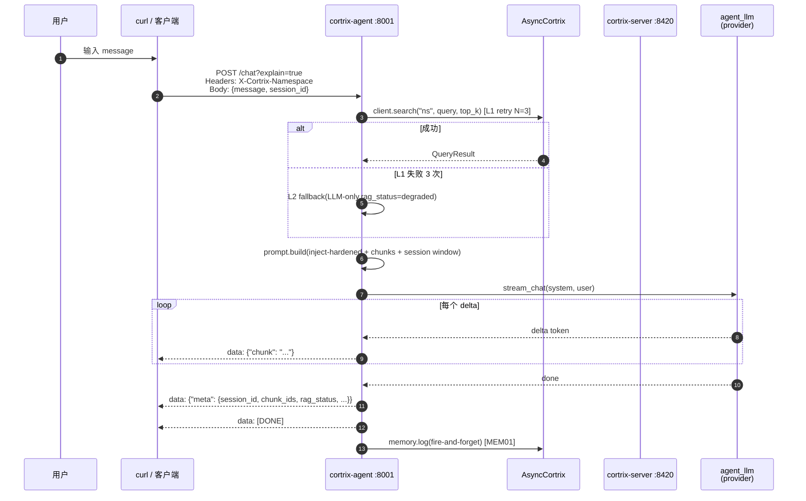
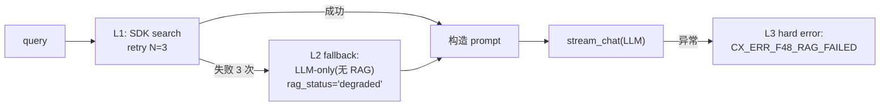

# 25 · Agent 对话 — SSE 流式 chat 详解

> **目标读者**:用户、想集成 Agent 的开发者。
> **阅读时间**:15 分钟。
> **关键事实**:`POST /chat` 输出 **SSE(Server-Sent Events)**;每条 `data:` 帧是 JSON;三帧:content chunk / meta / 错误,最后 `data: [DONE]`;`?explain=true` 与 `?debug=true` 加元数据。

---

## 1. 一次完整 chat 的时序



---

## 2. 请求格式

来自 `cortrix-agent/README.md:65-86` + `routes/chat.py:85`。

```bash
curl -N -X POST 'http://localhost:8001/chat?explain=true' \
  -H 'Content-Type: application/json' \
  -H 'X-Cortrix-Namespace: default' \
  -H 'X-Cortrix-Tenant-Id: tenant_001' \
  -H 'Authorization: Bearer cx_live_xxx' \
  -d '{"message": "find privacy documents", "session_id": "s-001"}'
```

### 2.1 Query 参数

| 参数 | 默认 | 作用 |
|---|---|---|
| `explain=true` | `false` | meta 帧含 explain 元数据(A/B/C 档) |
| `debug=true` | `false` | 错误时含详细 debug 字段 |

### 2.2 Headers

| Header | 是否必填 | 作用 |
|---|---|---|
| `Content-Type` | ✅ | `application/json` |
| `X-Cortrix-Namespace` | 可选 | 覆盖默认 NS(默认 `default`) |
| `X-Cortrix-Tenant-Id` | 可选 | 多租户(当前 Blocked) |
| `Authorization` | 可选 | 取决于 server auth 模式 |

### 2.3 Body

| 字段 | 类型 | 必填 | 说明 |
|---|---|---|---|
| `message` | str | ✅ | 用户消息 |
| `session_id` | str | 可选 | 不传则后端生成 |

---

## 3. SSE 响应帧

来自 `cortrix-agent/README.md:88-94`。

### 3.1 content chunk

```text
data: {"chunk": "Based on"}
data: {"chunk": " the retrieved documents..."}
```

- 多个 `data: {"chunk": ...}` 帧拼接成完整回复。
- **客户端**:累加拼接即可显示。

### 3.2 meta

```text
data: {"meta": {"session_id": "s-001", "chunk_ids": [], "rag_status": "success"}}
```

- meta 字段(节选):
  - `session_id`:本次会话 ID
  - `chunk_ids`:实际引用的 chunk ID 列表
  - `rag_status`:`success` / `degraded`(L1 全失败时 L2 fallback)
  - `explain`(当 `?explain=true`):A/B/C 档元数据,来自 `agent_core/explain.py`

### 3.3 错误

```text
data: {"error": {"code": "CX_ERR_F48_RAG_FAILED", "message": "...", "category": "transient", "retry_after_ms": 5000}}
```

- 错误帧携带 GEN-Agent 4 字段,与 [32-errors.md §4](../part-3-developer/32-errors.md) 一致。
- 客户端可按 `category` 决定是否重试(见下表)。

### 3.4 结束

```text
data: [DONE]
```

- **结束标志**:客户端见到 `data: [DONE]` 就关流。

---

## 4. RAG 降级(L1 / L2 / L3)

`agent_core/executor.py:95-224`:



> **L2 不是错误**:用户拿到的回复可能是 LLM 直觉答复,不是基于语料。`rag_status="degraded"` 提示 UI 标记。

---

## 5. 错误码

来自 `agent_core/errors.py:29-72` 的 `ERROR_TABLE`(7 个 V1.0 chat-path 代码):

| code | 用途 |
|---|---|
| `CX_ERR_F48_RAG_FAILED` | L1/L2 都失败 |
| ... | (其余 6 个,详见源码) |

`STARTUP_ERROR_TABLE`(5 个)在 `errors.py:76`,用于启动期。

`AgentError`(`errors.py:142-153`)同样带 GEN-Agent 4 字段。

---

## 6. Memory 联动

`agent_core/mem_coprocess.py:27-70`:

- 每次 turn 结束,**fire-and-forget** 调 `client.memory.log(...)`(MEM01)。
- 同时**尝试**触发 MEM02 自动抽取(LLM)— 🚫 当前 Blocked,但 hook 已埋好。

---

## 7. Prompt 注入硬化

`agent_core/prompt.py:64-131`:

- **XML-style 分段**:system / context / chunks / user,清晰边界。
- **8 字符 hex 后缀**:每次构造随机后缀,降低 LLM "ignore previous instructions" 攻击成功率。
- 来源标注:每个 chunk 都有 namespace + chunk_id,便于事后追溯。

---

## 8. 客户端示例(Node.js)

```javascript
const res = await fetch("http://localhost:8001/chat?explain=true", {
  method: "POST",
  headers: {
    "Content-Type": "application/json",
    "X-Cortrix-Namespace": "default",
  },
  body: JSON.stringify({ message: "...", session_id: "s-001" }),
});

const reader = res.body.getReader();
const dec = new TextDecoder();
let buf = "", full = "";
while (true) {
  const { value, done } = await reader.read();
  if (done) break;
  buf += dec.decode(value, { stream: true });
  const parts = buf.split("\n\n");
  buf = parts.pop();
  for (const p of parts) {
    const line = p.split("\n").find(l => l.startsWith("data: "));
    if (!line) continue;
    const payload = line.slice(6);
    if (payload === "[DONE]") { console.log("[end]"); continue; }
    const evt = JSON.parse(payload);
    if (evt.chunk) full += evt.chunk;
    if (evt.meta) console.log("[meta]", evt.meta);
    if (evt.error) console.error("[err]", evt.error);
  }
}
console.log("FULL:", full);
```

---

## 9. 调试技巧

| 现象 | 怎么办 |
|---|---|
| `rag_status="degraded"` | 看后端日志,搜 `F04` / `CX_ERR_F37_CRAG_EVAL_FAILED` |
| LLM 没返回 | `LLM_ENABLED=false` 或 provider key 错;`GET /config` 看生效配置 |
| chunk_ids 空 | 检索无命中;调 `top_k` 或检查 NS 内容 |
| meta 缺失 | 没传 `?explain=true` |
| session 不持久 | 重启 agent 会丢(`SessionStore` 内存);长期记忆走 Memory |

---

## 下一步

👉 **[26 · 运维与维护](26-ops-and-maintenance.md)** — GC / vacuum / reindex / 配额查看。
