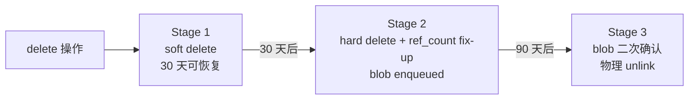

# 26 · 运维与维护 — GC / vacuum / reindex / 配额

> **目标读者**:用户、运维、SRE。
> **阅读时间**:10 分钟。
> **关键事实**:GC 是 **三阶段**(soft → hard → blob unlink),默认后台每 24h 扫一次;Ops 危险操作(`gc.run` / `gc.purge`)需 `X-Ops-Confirm: true` 头;Quota 当前 🚫 Blocked。

---

## 1. GC 三阶段

来自 `config.yaml.example:287-300`、`api/examples/ops/gcRun/success/curl.sh`。



| 阶段 | 时间窗(默认) | 行为 | 关键参数 |
|---|---|---|---|
| Stage 1 | 0–30 天 | 软删除,可恢复 | `gc.soft_delete_retention_days` |
| Stage 2 | 30–90 天 | 硬删 metadata,blob 入队,ref_count fix-up | `gc.blob_gc_retention_days` |
| Stage 3 | 90 天+ | 二次确认后物理 unlink | `gc.max_purge_per_run` = 10000 |

> 后台线程每 `gc.scan_interval_hours = 24` 小时扫描一次(`config.yaml.example:297`)。

---

## 2. Ops 端点(危险操作)

来自 `sdk/python/cortrix/resources/ops/gc.py`、`api/examples/ops/`。

### 2.1 看状态

```python
status = client.ops.gc.status()
print(status)
# {"stage1_pending": N, "stage2_pending": N, "last_run": "...", "next_run": "..."}
```

### 2.2 强制跑一次

```python
# ⚠️ 需要 X-Ops-Confirm: true 头
client.ops.gc.run()
```

```bash
curl -X POST 'http://127.0.0.1:8420/api/v1/ops/gc/run' \
  -H 'X-API-Key: cx_live_xxx' \
  -H 'X-Ops-Confirm: true'
```

### 2.3 恢复 Stage 1

```python
client.ops.gc.restore(["doc_id_1", "doc_id_2"])
```

### 2.4 立即物理 purge

```python
# ⚠️ 危险:跳过二次确认
client.ops.gc.purge()
```

### 2.5 列出后台操作

```python
ops = client.ops.list_operations(limit=50)
```

### 2.6 Maintenance(reindex / vacuum)

```bash
# 重新建索引
curl -X POST 'http://127.0.0.1:8420/api/v1/ops/maintenance/reindex' \
  -H 'X-API-Key: cx_live_xxx'

# vacuum(SQLite)
curl -X POST 'http://127.0.0.1:8420/api/v1/ops/maintenance/vacuum' \
  -H 'X-API-Key: cx_live_xxx'
```

> Maintenance 也是 � Verification required。

---

## 3. 配额(Quota)

> 🚫 **Blocked**(`README.md:72`)。当前无 Quota 执行。
>
> **生产部署前**:用 `nginx` / Envoy 在反代层做 rate-limit;或者等 Quota 升 ✅。

---

## 4. 健康与版本检查

```bash
# 综合健康
curl http://127.0.0.1:8420/api/v1/system/health

# 就绪(模型加载完)
curl http://127.0.0.1:8420/api/v1/system/health/ready

# 存活
curl http://127.0.0.1:8420/api/v1/system/health/live

# 版本
curl http://127.0.0.1:8420/api/v1/system/version
```

容器内 healthcheck 脚本(`deploy/docker-compose.yml:28-33`)调 `/app/healthcheck.sh`。

---

## 5. 配置查看 / 修改(运行中)

Agent LLM 配置可在运行时通过 Agent 配置端点修改(`cortrix-agent/routes/config.py`):

```bash
# 当前配置(key 已 mask)
curl http://localhost:8001/config

# provider 列表
curl http://localhost:8001/config/providers

# 修改(需运行时支持 admin)
curl -X PUT 'http://localhost:8001/config/agent_llm' \
  -H 'Content-Type: application/json' \
  -d '{"provider": "claude", "model": "claude-haiku-4-5-20251001", "api_key": "..."}'
```

> **Persistence is not currently verified**(`cortrix-agent/README.md:114`),重启后丢失。

---

## 6. 日志与 metrics

| 维度 | 怎么做 |
|---|---|
| 日志格式 | `log.format: json`(生产) |
| 日志路径 | `log.output: stdout`(容器内) → 由 docker / k8s 收集 |
| 指标(服务端) | `src/observability/`,无内置 OTLP 导出器 |
| 指标(Web UI) | `@opentelemetry/exporter-metrics-otlp-http`,在 `web/` 配 OTLP endpoint |

详见 [15-observability.md](../part-1-architect/15-observability.md)。

---

## 7. 数据备份与迁移

| 数据 | 位置 | 备份 |
|---|---|---|
| SQLite + vector index + Blob | `build/data/` 或 `cortrix-data` volume | `cp -r` / `docker volume cp` |
| 模型 | 同上,`bge-m3/` + `bge-reranker-v2-m3/` | 可重新下载(SHA-256 锁定) |
| Web UI 配置 | 浏览器 localStorage | 用户级别 |

> **迁移**:跨主机迁移,先 `docker compose down`(保留 volume),打包 `cortrix-data` volume,新机器 `docker volume create` + `cp`。

---

## 8. 升级

| 升级类型 | 操作 |
|---|---|
| 同一 v1.0-rc 内补丁 | 重新拉镜像 + `docker compose up --build`;volume 保留 |
| ONNX Runtime 同 major 升级 | 换 `.so` / dylib + 重启(`cmake/Dependencies.cmake:94-99`) |
| ONNX Runtime 跨 major | 重编 + bump `ONNXRT_MAJOR_VERSION` 编译标志 |
| 模型升级 | 改 `model-manifest.tsv` + 重启;SHA-256 锁定保证一致 |

---

## 9. 状态门槛

| 操作 | 状态 |
|---|---|
| 看 GC 状态 | 🟡 |
| `gc.run` / `gc.purge` | � |
| Quota 执行 | 🚫 Blocked |
| Admin Guard 路径 | ✅ Verified(loopback 假定) |
| 跨租户 RBAC 拒绝矩阵 | 🚫 Blocked |

---

## 下一步

👉 **[第三篇 · 30 · SDK 概览](part-3-developer/30-sdk-overview.md)** — 开发者视角,开始写代码。
