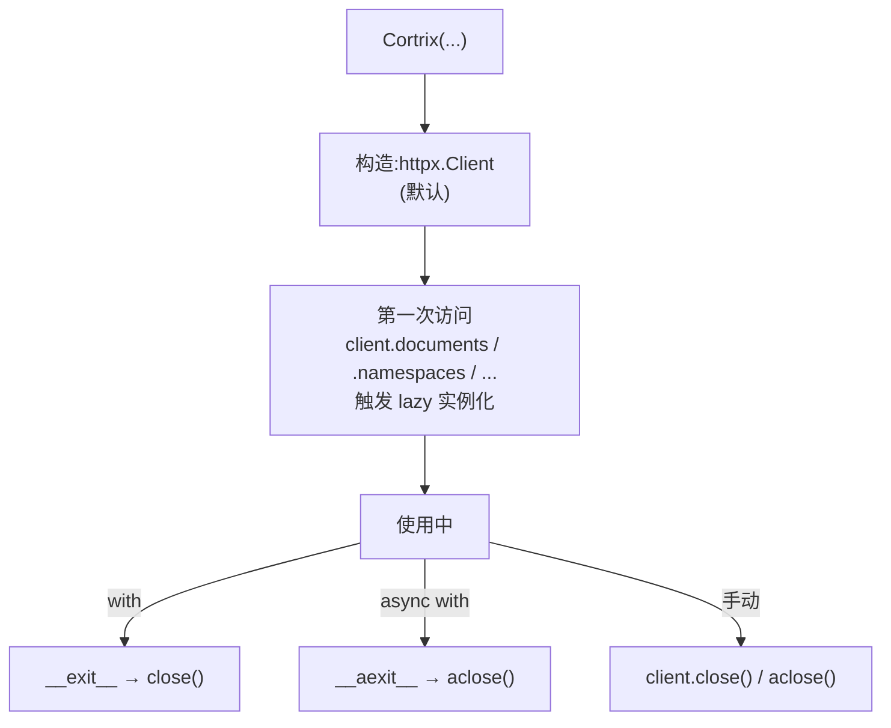

# 30 · SDK 概览 — 客户端构造与生命周期

> **目标读者**:开发者、想接 SDK 的工程师。
> **阅读时间**:10 分钟。
> **关键事实**:Python SDK 入口是 `cortrix` 包;同步 `Cortrix`、异步 `AsyncCortrix`;**关键字参数构造**;支持 `with`/`async with`;**资源(lazy 属性)**。

---

## 1. 一句话安装

```bash
pip install cortrix   # sdk/python,依赖仅 httpx
```

版本:`1.0.0rc1`(`sdk/python/cortrix/_constants.py:3`)。Python `>=3.9`(`sdk/python/pyproject.toml:10`)。

---

## 2. 客户端构造

### 2.1 同步客户端(`sdk/python/cortrix/_client.py:38-73`)

```python
from cortrix import Cortrix

client = Cortrix(
    base_url="http://localhost:8420",   # 默认 http://localhost:8420
    api_key="cx_live_xxx",              # 可选;未启用 auth 时不强制
    tenant_id="default",                # 可选,送 X-Tenant-Id
    timeout=30.0,                       # 秒,默认 30
    max_retries=2,                      # 默认 2
    http_client=None,                   # 注入自定义 httpx.Client(可选)
    client_id=None,                     # 送 X-Client-Id
    trace_id_provider=None,             # 送 traceparent W3C 头
)
```

- **关键字参数**:所有 `__init__` 参数都是 keyword-only(`_client.py:39-49` 的 `*,` 之后)。
- **http_client 注入**:传自己创建的 `httpx.Client(timeout=...)` 时,SDK **不会** 在 `close()`/`__exit__` 时关闭它(`_client.py:60-61` `_owns_http`)。自己创建的 client 你自己负责。

### 2.2 异步客户端(`sdk/python/cortrix/_async_client.py:38-74`)

```python
from cortrix import AsyncCortrix

client = AsyncCortrix(
    base_url="http://localhost:8420",
    api_key="cx_live_xxx",
    # ... 与同步对称
)
```

> **对称**:签名、行为、错误完全一致。`AsyncBaseClient`(`_async_base.py:0-66`)只是为了让 mypy 把 `_client` 类型化为 awaitable,所有逻辑在 `BaseClient`。

---

## 3. 生命周期



### 3.1 同步:context manager

```python
with Cortrix(base_url=..., api_key=...) as client:
    task = client.documents.upload("ns", "/path/to/file.pdf")
    # __exit__ 关闭 client._http(若是 SDK 自己创建的)
```

### 3.2 异步:async context manager

```python
async with AsyncCortrix(base_url=..., api_key=...) as client:
    task = await client.documents.upload("ns", "/path/to/file.pdf")
```

### 3.3 资源懒加载

12 个资源在第一次访问属性时实例化(`_client.py:62-74` 缓存字段):

```python
client.documents    # 第一次访问:创建 Documents(self._client)
client.query        # 创建 Query(self._client)
# 之后都是缓存的
```

> 资源模块见 `sdk/python/cortrix/resources/`,每个提供 `SyncX` / `AsyncX` 平行类。

---

## 4. 资源命名空间(12 个)

| 属性 | 文件 | 领域 | 入口方法 |
|---|---|---|---|
| `client.documents` | `resources/documents.py` | 文档上传 / 任务 / 批量 | `upload` / `upload_and_wait` / `batch_submit` / `list` / `task_status` |
| `client.namespaces` | `resources/namespaces.py` | NS CRUD + ACL | `create` / `list` / `get` / `update` / `delete` / `set_permission` |
| `client.query` | `resources/query.py` | 检索 | `run` / `get_sources` |
| `client.memory` | `resources/memory.py` | MEM01–05 | `search` / `log` / `extract` / `list` / `create` / `edit` / `invalidate` / `opt_out` |
| `client.sql` | `resources/sql.py` | Text-to-SQL | `query` / `register_schema` / `get_schema` / `delete_schema` |
| `client.watchers` | `resources/watchers.py` | 文件监听 | `add` / `list` / `remove` / `events` |
| `client.sync` | `resources/sync.py` | 批量同步 | `configure` / `status` / `stop` / `trigger` |
| `client.auth` | `resources/auth.py` | 鉴权 | `register` / `login` / `logout` / `refresh` / `password_reset` / `me` |
| `client.system` | `resources/system.py` | 系统 | `health` / `version` / `namespace_stats` / `agent_llm_config` / `features` |
| `client.tenants` | `resources/tenants.py` | 租户 | `list` / `get` / `invite` / `update_role` / `remove_member` / `quota` / `create` |
| `client.ops.gc` | `resources/ops/gc.py` | GC | `status` / `run` / `restore` / `purge` |
| `client.ops.list_operations` | `resources/ops/__init__.py` | 操作列表 | F18a |
| `client.import_database(...)` | `resources/imports.py` | DB 导入 | F16a |

---

## 5. 顶层快捷方式

为了减少 `client.query.run(...)` 的冗余,SDK 在 `Cortrix` 上提供几个快捷方法(`_client.py:242-269`、`_async_client.py:221`)。

### 5.1 `client.search(...)`

```python
# 等价于 client.query.run(...)
results = client.search("ns", "query text", top_k=10, rerank=True)
results = await client.search(["ns1", "ns2"], "query", top_k=5)
```

### 5.2 `client.get_sources(...)`

```python
sources = client.get_sources("ns", document_id="...")
```

### 5.3 `client.import_database(...)`

```python
client.import_database(
    "ns",
    connection={"host": "...", "user": "...", "password": "...", "dbname": "..."},
    query="SELECT * FROM invoices WHERE id > %s",
    mode="per_row",    # per_row | bulk
)
```

---

## 6. SDK 常量

来自 `sdk/python/cortrix/_constants.py:0-9`:

| 名称 | 值 |
|---|---|
| `SDK_VERSION` | `"1.0.0rc1"` |
| `DEFAULT_BASE_URL` | `"http://localhost:8420"` |
| `DEFAULT_TIMEOUT` | `30.0`(秒) |
| `UPLOAD_TIMEOUT` | `300.0`(秒) |
| `DEFAULT_MAX_RETRIES` | `2` |
| `API_PREFIX` | `"/api/v1"` |
| `USER_AGENT` | `"cortrix-python/1.0.0rc1"` |

---

## 7. 类型提示与 mypy

- 包带 `py.typed`(`sdk/python/pyproject.toml:53`)。
- CI:`mypy --strict`(`pyproject.toml:62-64`)对 Python 3.10 跑。
- `ruff` + `target-version = "py39"`(`pyproject.toml:66-68`)。

IDE 里可以直接看类型:

```python
def search(
    self,
    namespace: Union[str, List[str]],
    query: str,
    *,
    top_k: int = 10,
    rerank: bool = True,
    include_sources: bool = False,
    filters: Optional[QueryFilter] = None,
    timeout: Optional[float] = None,
) -> QueryResult: ...
```

---

## 8. 第一个 demo(5 行代码)

```python
from cortrix import Cortrix

client = Cortrix(base_url="http://localhost:8420")
ns = client.namespaces.create("demo", display_name="My Demo")
task = client.documents.upload("demo", "/path/to/contract.pdf")
res = client.search("demo", "Party A breach clause", top_k=5)
for r in res.results:
    print(r.score, r.namespace, r.content[:80])
```

> 这个 demo 不需要 API Key(auth 默认关闭,loopback-only)。

---

## 9. 常见踩坑

| 现象 | 原因 / 解决 |
|---|---|
| 注入自定义 `http_client` 后 `with` 块关闭它 | SDK 只关闭自己创建的(`_owns_http=True`),你传入的不关 |
| `AttributeError: NoneType has no attribute ...` | 异步 client 上漏了 `await` |
| `Client.search(...)` 异步签名不对 | 用 `await client.search(...)` |
| 资源缓存问题(测试) | 用新的 client 实例,或显式 `_documents = None` |
| 长任务超时 | upload 用 `timeout=` 单独设置,默认 `UPLOAD_TIMEOUT=300s` |

---

## 下一步

👉 **[31 · Resources 全表](31-resources.md)** — 12 个 resource 的 I/O 详表。
