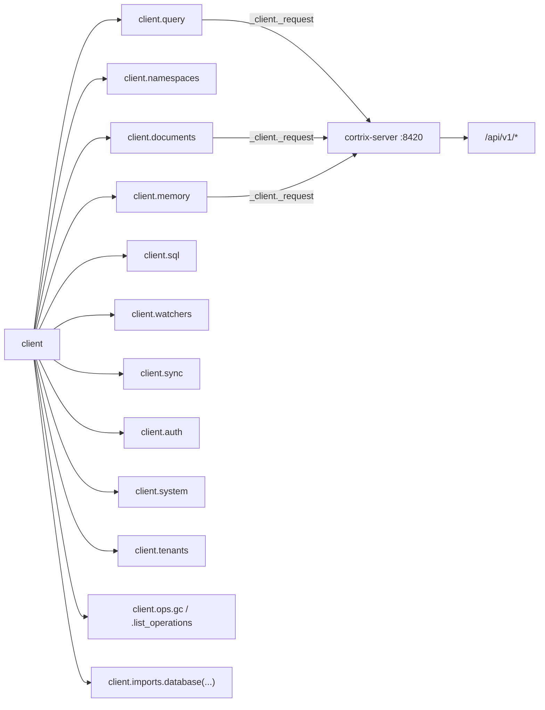

# 31 · Resources 全表 — 12 个 resource 的 I/O 详表

> **目标读者**:开发者、写 SDK 集成的人。
> **阅读时间**:25 分钟。
> **关键事实**:12 个 resource,每个都有 `Sync` + `Async` 平行类;**路径在模块顶部声明为常量**(`resources/query.py:23-24`、`resources/documents.py:26-34`),改 path 只改一行。

---

## 1. 资源清单(12)

| Resource | Sync | Async | Path 常量 | 模块 |
|---|---|---|---|---|
| `Documents` | `Documents` | `AsyncDocuments` | `PATH_DOCUMENTS` 等 4 个 | `resources/documents.py:115 / :236` |
| `Namespaces` | `Namespaces` | `AsyncNamespaces` | `/namespaces`, `/namespaces/{ns}`, `/namespaces/{ns}/acl` | `resources/namespaces.py` |
| `Query` | `Query` | `AsyncQuery` | `PATH_QUERY`, `PATH_INTERACTION_SOURCES` | `resources/query.py:103 / :131` |
| `Memory` | `Memory_`(避免与 stdlib 冲突) | `AsyncMemory_` | `/memory*` 6 个 | `resources/memory.py` |
| `SQL` | `SQL` | `AsyncSQL` | `/sql/query`, `/namespaces/{ns}/sql/schema` | `resources/sql.py` |
| `Watchers` | `Watchers` | `AsyncWatchers` | `/watchers*` | `resources/watchers.py` |
| `Sync` | `Sync` | `AsyncSync` | `/sync/configure`, `/sync/status` | `resources/sync.py` |
| `Auth` | `Auth` | `AsyncAuth` | `/auth/register`, `/auth/login`, `/auth/refresh`, ... | `resources/auth.py` |
| `System` | `System` | `AsyncSystem` | `/system/health`, `/system/version`, ... | `resources/system.py` |
| `Tenants` | `Tenants` | `AsyncTenants` | `/tenants`, `/tenants/{id}/members`, ... | `resources/tenants.py` |
| `OpsNamespace` | `OpsNamespace` | `AsyncOpsNamespace` | `/ops/gc/*`, `/operations` | `resources/ops/__init__.py` |
| `Imports` | `Imports` | `AsyncImports` | `/imports/database` | `resources/imports.py` |

> 类名 `Memory_` 带尾下划线(`resources/memory.py`)是为了避免与 `typing.Memory` 等名字冲突。

---

## 2. Documents(`resources/documents.py`)

### 2.1 核心方法

| 方法 | Path | 返回 | 关键参数 |
|---|---|---|---|
| `upload(ns, file, *, filename=None, metadata=None)` | `POST /documents` | `DocumentTask`(202, F42 异步) | `file` 可以是路径或 `BinaryIO` |
| `upload_and_wait(...)` | 同上 + 轮询 | `DocumentTask`(终态) | `poll_interval=1.0`, `timeout=300.0` |
| `batch_submit(ns, docs, *, async_=True, on_duplicate="skip")` | `POST /documents/batch` | partial-success envelope dict | `docs` 每项 `{doc_id, content, filename?, metadata?}` |
| `list(ns, *, limit=50, offset=0)` | `GET /documents?ns=&limit=&offset=` | `DocumentList` | |
| `get(document_id)` | `GET /documents/{id}` | `Document` | |
| `status(document_id)` | alias of `get` | `Document` | |
| `task_progress(task_id)` | `GET /documents/tasks/{task_id}/progress` | `DocumentTask` | |
| `cancel_task(task_id)` | `DELETE /documents/tasks/{task_id}` | `DocumentTask` | |
| `delete(document_id)` | `DELETE /documents/{id}` | `None`(204) | |

### 2.2 `DocumentTask` dataclass(节选)

```python
@dataclass
class DocumentTask:
    task_id: str
    status: str          # pending | processing | ready | failed | cancelled
    document_id: Optional[str] = None
    progress: Optional[DocumentProgress] = None
    error: Optional[str] = None
```

终态集合(`resources/documents.py:40`):`{"ready", "failed", "cancelled"}`。

### 2.3 文件读取规则(`_read_content`,`resources/documents.py:45-73`)

- **路径**:读字节,`filename` 默认用 basename。
- **`BinaryIO`**:必须显式 `filename=`,否则 `InvalidRequestError(category="permanent")`。
- **UTF-8 文本**:原样发送。
- **二进制**:`base64` 编码(spec 的 `content` 字段同时接受文本与 base64)。

### 2.4 `batch_submit` 的部分成功信封

```json
{
  "results": [...],
  "meta": {
    "total_submitted": 100,
    "succeeded": [...],
    "failed": [
      {"doc_id": "d_42", "code": "CX_ERR_QUOTA_*", "category": "quota", "retryable": true, "retry_after_ms": 5000}
    ],
    "coverage_ratio": 0.97
  }
}
```

> Agent 可以**逐 doc** 决定重试,而不必整批重来。

---

## 3. Namespaces(`resources/namespaces.py`)

### 3.1 核心方法

| 方法 | Path | 返回 | 备注 |
|---|---|---|---|
| `create(name, *, display_name=None, description=None, embedding_model=None, chunk_strategy=None, visibility=None)` | `POST /namespaces` | `Namespace` | |
| `list()` | `GET /namespaces` | `NamespaceList` | |
| `get(name)` | `GET /namespaces/{ns}` | `Namespace` | |
| `update(name, ...)` | `PATCH /namespaces/{ns}` | `Namespace` | |
| `delete(name)` | `DELETE /namespaces/{ns}` | `None` | |
| `set_permission(name, grantee_tenant_id, *, permission)` | `POST /namespaces/{ns}/acl` | raw | 🚫 Blocked |

### 3.2 `Namespace` dataclass(节选)

```python
@dataclass
class Namespace:
    name: str
    display_name: Optional[str] = None
    description: Optional[str] = None
    embedding_model: Optional[str] = None
    chunk_strategy: Optional[ChunkStrategy] = None
    visibility: Optional[str] = None  # private | tenant | public
    created_at: Optional[str] = None
```

---

## 4. Query(`resources/query.py`)

### 4.1 核心方法

| 方法 | Path | 返回 |
|---|---|---|
| `run(namespace, query, *, top_k=10, rerank=True, include_sources=False, filters=None)` | `POST /query` | `QueryResult` |
| `get_sources(interaction_id)` | `GET /interactions/{id}/sources` | raw(§2.12-only) |

### 4.2 wire → SDK 字段翻译(`_adapt_wire_result`,`resources/query.py:49-100`)

| wire | SDK |
|---|---|
| `chunk_text` | `content` |
| `block_id` | `child_id`(字符串化) |
| `doc_id` | `parent_id` |
| `source_path` / `block_type` / `hit_routes` / `vector_score` / `related_blocks_count` | 折入 `metadata` |
| `filters`(复数) | `filter`(单数,作为请求体) |
| `meta.degraded=true` | `meta.warnings[0].code="ROUTES_DEGRADED"` |

> 已 §2.12 / F04 形状的响应直通;只对 pre-mount MVP 响应做翻译。

### 4.3 `QueryResult` dataclass

```python
@dataclass
class QueryResult:
    results: List[QueryResultItem]
    meta: QueryMeta

@dataclass
class QueryResultItem:
    child_id: Optional[str] = None
    parent_id: Optional[str] = None
    content: Optional[str] = None
    score: Optional[float] = None
    rerank_score: Optional[float] = None
    namespace: Optional[str] = None
    metadata: dict = field(default_factory=dict)

@dataclass
class QueryMeta:
    namespaces_queried: List[str] = field(default_factory=list)
    namespaces_succeeded: List[str] = field(default_factory=list)
    coverage_ratio: float = 1.0
    latency_ms: int = 0
    warnings: Optional[List[dict]] = None
```

---

## 5. Memory(`resources/memory.py`)

### 5.1 核心方法

| 方法 | Path | 返回 | 备注 |
|---|---|---|---|
| `search(ns, query, *, user_id, top_k=5)` | `POST /memory/search` | `MemorySearchResponse` | MEM05:`user_id` 必填 |
| `log(ns, *, query, response, user_id, session_id, context=None)` | `POST /memory/sessions/{id}/interactions`(auto-create session) | raw | MEM01 |
| `extract(...)` | `POST /memory/extract` | raw | MEM02🚫 Blocked |
| `list(ns, *, user_id, ...)` | `GET /memory` | `MemoryList` | |
| `create(ns, user_id, content, *, memory_type, ...)` | `POST /memory` | `MemoryCreateAck` | MEM03 |
| `edit(memory_id, content, ...)` | `PATCH /memory/{id}` | `MemoryEditAck` | |
| `invalidate(memory_id)` | `DELETE /memory/{id}` | `MemoryDeleteAck` | 软删除 |
| `opt_out(session_id)` | `POST /memory/session/{id}/opt-out` | raw | MEM04 |

### 5.2 `user_id` 必须性(MEM05)

`memory.search(ns, query, ..., user_id="...")` 是 user 隔离的硬性要求。漏传会拿到 400(`InvalidRequestError`)。

---

## 6. SQL(`resources/sql.py`)

```python
result = client.sql.query(
    namespace="bi",                       # 可选
    question="上季度退货数量",
    max_rows=100,
    explain=False,
)  # SqlResult
```

> 403 → `FeatureNotAvailableError`(该部署未启用 Text-to-SQL)。

---

## 7. Watchers / Sync / Auth / System / Tenants(简表)

| Resource | 主要方法 | 关键路径 |
|---|---|---|
| `Watchers` | `add(path, namespaces, *, recursive=True)`、`list()`、`remove(id)`、`events(id, limit=50)` | `/watchers*` |
| `Sync` | `configure(ns, *, interval_seconds=3600)`、`status(ns=None)`、`stop(ns)`、`trigger(ns)` | `/sync/*` |
| `Auth` | `register(email, password, display_name=None)`、`login(email, password)`、`refresh(token)`、`password_reset(...)`、`me()` | `/auth/*` |
| `System` | `health()`、`version()`、`namespace_stats(ns)`、`agent_llm_config()`、`features()` | `/system/*` |
| `Tenants` | `list()`、`get(id)`、`invite(id, email, role)`、`update_role(...)`、`remove_member(...)`、`quota(id)`、`create(...)` | `/tenants/*` |

> **Auth / Tenants** 当前 🚫 Blocked(README §71-72)。

---

## 8. Ops(`resources/ops/`)

### 8.1 `client.ops.gc`

| 方法 | Path | Header | 备注 |
|---|---|---|---|
| `status()` | `GET /ops/gc/status` | — | 看三阶段积压 |
| `run()` | `POST /ops/gc/run` | `X-Ops-Confirm: true` | 强制跑 |
| `restore([doc_id, ...])` | `POST /ops/gc/restore` | — | Stage 1 恢复 |
| `purge()` | `POST /ops/gc/purge` | `X-Ops-Confirm: true` | 跳过二次确认 |

### 8.2 `client.ops.list_operations`

```python
ops = client.ops.list_operations(limit=50)
# 返回最近后台操作(GC / vacuum / reindex / ...)
```

---

## 9. Imports(`resources/imports.py`)

```python
client.import_database(
    "ns",
    connection={
        "host": "localhost", "port": 5432,
        "user": "...", "password": "...",
        "dbname": "...",
    },
    query="SELECT id, body FROM invoices WHERE id > %s",
    table=None,             # 或直接指定 table
    mode="per_row",         # per_row | bulk
)
```

> 实际由 `client.imports.database(...)` 与顶层快捷方法共用。**F16a**(手动 DB 导入)。

---

## 10. 类型与 dataclass

34 个生成 dataclass(`sdk/python/cortrix/types/_generated.py:0-360`)+ 10 个 list 包装(`types/lists.py:0-156`)。

详见 [34-types-and-schemas.md](34-types-and-schemas.md)。

---

## 11. 一图看完整调用关系



---

## 下一步

👉 **[32 · 错误体系](32-errors.md)** — 12 L1 + 23 L2 + 4 字段 + 选择算法。
