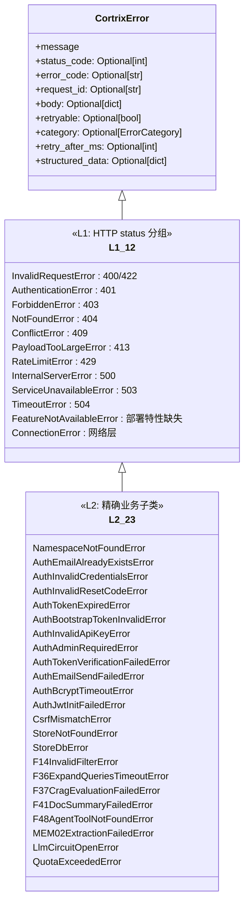
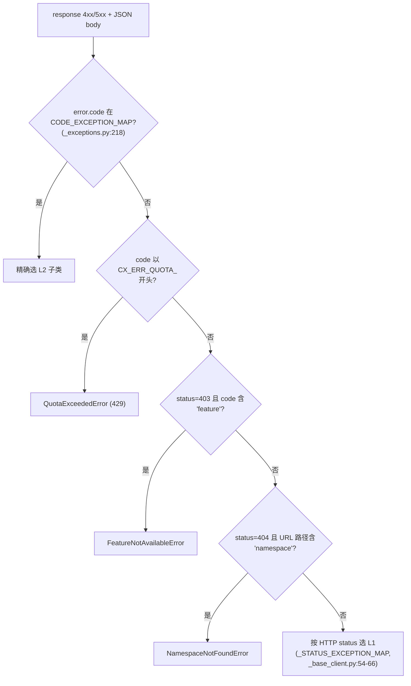

# 32 · 错误体系 — 12 L1 + 23 L2 + 4 字段

> **目标读者**:开发者、写错误处理逻辑的人。
> **阅读时间**:20 分钟。
> **关键事实**:每个 `CortrixError` 必带 **4 个 GEN-Agent 字段**(`retryable` / `category` / `retry_after_ms` / `structured_data`);**23 个 L2 子类**精确对应业务 `code`;**选择算法**有 4 级优先级。

---

## 1. 异常类层次



> 完整源码:`sdk/python/cortrix/_exceptions.py:23-211`。L1 在 `:58-113`,L2 在 `:115-211`。

---

## 2. 4 个 GEN-Agent 字段

来自 `_exceptions.py:32-55`、`AGENT_FRIENDLY.md issue 4`(注释中引用):

| 字段 | 类型 | 含义 | Agent 用途 |
|---|---|---|---|
| `retryable` | `Optional[bool]` | 服务端声明此错误可重试 | 自动重试判定 |
| `category` | `Literal["auth", "quota", "transient", "permanent", "timeout"]` | 错误类别 | 路由 / 用户提示 |
| `retry_after_ms` | `Optional[int]` | 建议等待毫秒数 | 退避 |
| `structured_data` | `Optional[dict]` | 服务端携带结构化数据 | 自动修复输入 |

```python
try:
    res = client.search("ns", "query")
except CortrixError as e:
    if e.retryable:
        # 按 retry_after_ms 退避后重试
        ...
    if e.category == "auth":
        # 跳登录
        ...
    if e.category == "quota":
        # 显示配额提示
        ...
```

---

## 3. 选择算法

来自 `_base_client.py:154-171` 的 `_select_exception_class`:



> **关键**:`CX_ERR_QUOTA_*` 用前缀匹配,**不进** `CODE_EXCEPTION_MAP`(`_exceptions.py:215-217` 注释)。

---

## 4. L1 完整清单(12 类)

来自 `_exceptions.py:58-113` + `_base_client.py:54-66`:

| L1 异常 | HTTP | 父类 | 备注 |
|---|---|---|---|
| `InvalidRequestError` | 400, 422 | `CortrixError` | |
| `AuthenticationError` | 401 | `CortrixError` | |
| `ForbiddenError` | 403 | `CortrixError` | |
| `NotFoundError` | 404 | `CortrixError` | |
| `ConflictError` | 409 | `CortrixError` | |
| `PayloadTooLargeError` | 413 | `CortrixError` | |
| `RateLimitError` | 429 | `CortrixError` | 额外有 `retry_after`(秒,`Retry-After` 头) |
| `InternalServerError` | 500 | `CortrixError` | |
| `ServiceUnavailableError` | 503 | `CortrixError` | |
| `TimeoutError` | 504 | `CortrixError` | |
| `FeatureNotAvailableError` | — | `CortrixError` | 非标准 HTTP,如部署未启用某特性 |
| `ConnectionError` | — | `CortrixError` | 客户端网络层失败(httpx.ConnectError) |

---

## 5. L2 完整清单(23 类)

来自 `_exceptions.py:115-211` 与 `CODE_EXCEPTION_MAP`:

| L2 异常 | L1 父类 | code |
|---|---|---|
| `NamespaceNotFoundError` | `NotFoundError` | `CX_ERR_NAMESPACE_NOT_FOUND` |
| `AuthEmailAlreadyExistsError` | `ConflictError` | `CX_ERR_AUTH_EMAIL_ALREADY_EXISTS` |
| `AuthInvalidCredentialsError` | `AuthenticationError` | `CX_ERR_AUTH_INVALID_CREDENTIALS` |
| `AuthInvalidResetCodeError` | `InvalidRequestError` | `CX_ERR_AUTH_INVALID_RESET_CODE` |
| `AuthTokenExpiredError` | `AuthenticationError` | `CX_ERR_AUTH_TOKEN_EXPIRED` |
| `AuthBootstrapTokenInvalidError` | `AuthenticationError` | `CX_ERR_AUTH_BOOTSTRAP_TOKEN_INVALID` |
| `AuthInvalidApiKeyError` | `AuthenticationError` | `CX_ERR_AUTH_INVALID_API_KEY` |
| `AuthAdminRequiredError` | `ForbiddenError` | `CX_ERR_AUTH_ADMIN_REQUIRED` |
| `AuthTokenVerificationFailedError` | `InternalServerError` | `CX_ERR_AUTH_TOKEN_VERIFICATION_FAILED` |
| `AuthEmailSendFailedError` | `ServiceUnavailableError` | `CX_ERR_AUTH_EMAIL_SEND_FAILED` |
| `AuthBcryptTimeoutError` | `InternalServerError` | `CX_ERR_AUTH_BCRYPT_TIMEOUT` |
| `AuthJwtInitFailedError` | `InternalServerError` | `CX_ERR_AUTH_JWT_INIT_FAILED` |
| `CsrfMismatchError` | `ForbiddenError` | `CX_ERR_AUTH_CSRF_MISMATCH` |
| `StoreNotFoundError` | `NotFoundError` | `CX_ERR_STORE_NOT_FOUND` |
| `StoreDbError` | `ServiceUnavailableError` | `CX_ERR_STORE_DB_ERROR` |
| `F14InvalidFilterError` | `InvalidRequestError` | `CX_ERR_F14_INVALID_FILTER` |
| `F36ExpandQueriesTimeoutError` | `TimeoutError` | `CX_ERR_F36_EXPAND_TIMEOUT` |
| `F37CragEvaluationFailedError` | `InternalServerError` | `CX_ERR_F37_CRAG_EVAL_FAILED` |
| `F41DocSummaryFailedError` | `InternalServerError` | `CX_ERR_F41_DOC_SUMMARY_FAILED` |
| `F48AgentToolNotFoundError` | `NotFoundError` | `CX_ERR_F48_TOOL_NOT_FOUND` |
| `MEM02ExtractionFailedError` | `InternalServerError` | `CX_ERR_MEM02_EXTRACTION_FAILED` |
| `LlmCircuitOpenError` | `ServiceUnavailableError` | `CX_ERR_LLM_CIRCUIT_OPEN` |
| `QuotaExceededError` | `RateLimitError` | `CX_ERR_QUOTA_*`(前缀) |

> 🚫 `Auth*` 类已定义但运行时 `Blocked`(`README.md:71`)。

---

## 6. 错误构造(`_build_exception`,`_base_client.py:173-200`)

```python
def _build_exception(self, resp: httpx.Response) -> CortrixError:
    try:
        body = resp.json()
    except Exception:
        body = {"error": {"message": resp.text or "<no body>"}}
    if not isinstance(body, dict):
        body = {"error": {"message": str(body)}}

    err = body.get("error", {}) or {}
    path = resp.request.url.path if resp.request is not None else ""
    exc_class = self._select_exception_class(resp.status_code, err.get("code"), path)

    kwargs: dict[str, Any] = dict(
        status_code=resp.status_code,
        error_code=err.get("code"),
        request_id=resp.headers.get("X-Request-ID")
        or resp.headers.get("x-cortrix-trace-id")
        or err.get("request_id"),
        body=body,
        retryable=err.get("retryable"),
        category=err.get("category"),
        retry_after_ms=err.get("retry_after_ms"),
        structured_data=err.get("structured_data"),
    )
    if issubclass(exc_class, RateLimitError):
        ra = resp.headers.get("Retry-After")
        kwargs["retry_after"] = _parse_retry_after(ra) if ra is not None else None
    return exc_class(err.get("message", resp.text or "<no message>"), **kwargs)
```

> **request_id 三级回退**:`X-Request-ID` 头 → `x-cortrix-trace-id` 头 → body `request_id` 字段。

---

## 7. 处理模板

### 7.1 基础

```python
from cortrix import Cortrix
from cortrix import (
    CortrixError,
    AuthInvalidCredentialsError,
    AuthTokenExpiredError,
    QuotaExceededError,
    RateLimitError,
    NamespaceNotFoundError,
)

try:
    res = client.search("ns", "query")
except NamespaceNotFoundError as e:
    # 404 + 路径含 namespace
    print("NS 不存在", e.namespace, e.request_id)
except AuthInvalidCredentialsError as e:
    # 401 + code = CX_ERR_AUTH_INVALID_CREDENTIALS
    print("凭证错误", e.error_code)
except QuotaExceededError as e:
    # 429 + code 前缀 CX_ERR_QUOTA_
    print("配额", e.retry_after_ms, "ms 后重试")
except RateLimitError as e:
    # 其它 429
    print("限流,Retry-After:", e.retry_after, "s")
except CortrixError as e:
    # 兜底
    print("其他", e.category, e.retryable)
```

### 7.2 Agent 自动重试

```python
import time

def call_with_retry(client, fn, *args, max_attempts=3, **kwargs):
    for attempt in range(max_attempts):
        try:
            return fn(*args, **kwargs)
        except CortrixError as e:
            if not e.retryable or attempt == max_attempts - 1:
                raise
            wait_ms = e.retry_after_ms or 1000
            time.sleep(wait_ms / 1000.0)
```

### 7.3 按 category 路由

```python
HINT_BY_CATEGORY = {
    "auth": "请重新登录",
    "quota": "已达本月配额上限",
    "transient": "服务暂忙,请稍后再试",
    "permanent": "请求无效,请检查输入",
    "timeout": "响应超时,请重试",
}

try:
    res = client.search("ns", "query")
except CortrixError as e:
    hint = HINT_BY_CATEGORY.get(e.category or "permanent", "未知错误")
    show_to_user(hint, e.message, e.request_id)
```

---

## 8. 异常类导出与导入

来自 `sdk/python/cortrix/__init__.py`:

```python
from ._exceptions import (
    CortrixError,
    ErrorCategory,
    InvalidRequestError, AuthenticationError, ForbiddenError, NotFoundError,
    ConflictError, PayloadTooLargeError, RateLimitError,
    InternalServerError, ServiceUnavailableError, TimeoutError,
    FeatureNotAvailableError, ConnectionError,
    NamespaceNotFoundError, AuthEmailAlreadyExistsError, AuthInvalidCredentialsError,
    AuthInvalidResetCodeError, AuthTokenExpiredError, AuthBootstrapTokenInvalidError,
    AuthInvalidApiKeyError, AuthAdminRequiredError, AuthTokenVerificationFailedError,
    AuthEmailSendFailedError, AuthBcryptTimeoutError, AuthJwtInitFailedError,
    CsrfMismatchError,
    StoreNotFoundError, StoreDbError,
    F14InvalidFilterError, F36ExpandQueriesTimeoutError, F37CragEvaluationFailedError,
    F41DocSummaryFailedError, F48AgentToolNotFoundError,
    MEM02ExtractionFailedError, LlmCircuitOpenError, QuotaExceededError,
)
```

> 用 `isinstance` 而不是 `e.error_code == ...` 来路由 — 更稳、更 IDE 友好。

---

## 9. 错误与重试的关系

详见 [33-retry-and-tracing.md](33-retry-and-tracing.md)。简言之:

- 服务端声明 `retryable: true` → 客户端按 `retry_after_ms` → 否则 `Retry-After` 头 → 否则**指数退避**(`_base_client.py:69-89`)。
- 状态码 429 / 500 / 503 在 `retryable` 缺失时也重试(`_FALLBACK_RETRY_STATUS`)。
- **不重试**:`retryable=false` 或 400/401/403/404/409/413/422。

---

## 下一步

👉 **[33 · 重试与追踪](33-retry-and-tracing.md)** — `should_retry` 四级优先级 + `trace_id_provider`。
