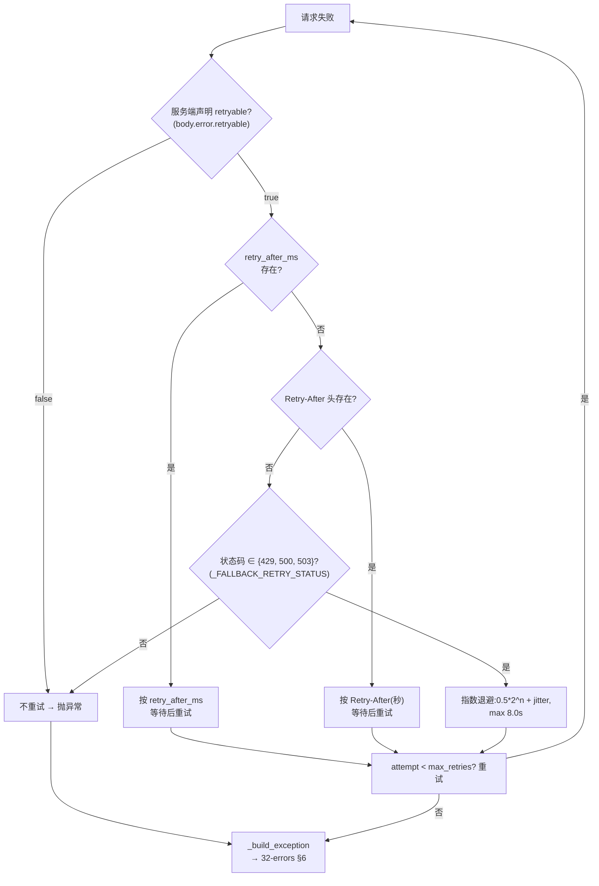
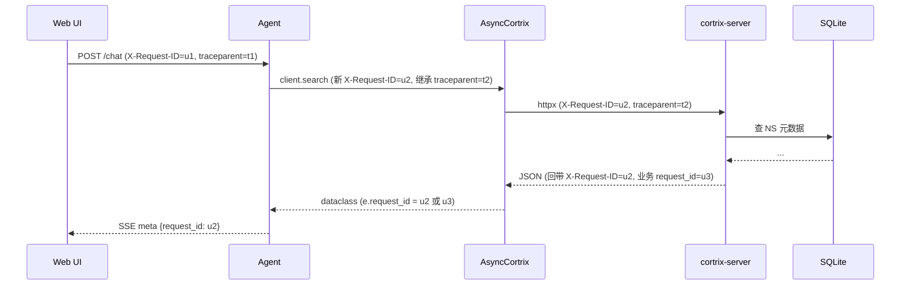

# 33 · 重试与追踪 — `should_retry` 与 `traceparent`

> **目标读者**:开发者、关心 resilience 的 SRE。
> **阅读时间**:15 分钟。
> **关键事实**:**重试有 4 级优先级**(服务端 `retryable:false` → `retryable:true` + `retry_after_ms` → `Retry-After` 头 → 指数退避);`trace_id_provider` 异常**被吞咽**,不会拖垮正常请求。

---

## 1. `should_retry` 的 4 级优先级

来自 `sdk/python/cortrix/_base_client.py:204-252`:



> **设计意图**(注释 `_base_client.py:5-11`):服务端是 source of truth,客户端只在服务端沉默时退化。

---

## 2. 网络层重试

| 错误类型 | 行为 |
|---|---|
| `httpx.ConnectError`(DNS / refused) | `should_retry(e, attempt)` → True → 等 0.5s + 退避 → 重试 |
| `httpx.TimeoutException`(读 / 连接超时) | 同上 |
| 其它网络异常 | 不重试,直接 `ConnectionError`(`_client.py:153-161`) |

```python
# _client.py:107-161 简化
for attempt in range(self.max_retries + 1):
    try:
        resp = self._http.request(method, url, ...)
    except (httpx.ConnectError, httpx.TimeoutException) as e:
        if not self.should_retry(e, attempt) or attempt == self.max_retries:
            raise self._network_exception(e)
        time.sleep(_exponential_backoff(attempt))
        continue

    if resp.is_success:
        return self._parse_success(resp, response_model)

    if self.should_retry(resp, attempt) and attempt < self.max_retries:
        time.sleep(self._wait_seconds(resp, attempt))
        continue

    raise self._build_exception(resp)
```

---

## 3. 指数退避(`_base_client.py:85-89`)

```python
_BASE_BACKOFF = 0.5
_MAX_BACKOFF = 8.0

def _exponential_backoff(attempt: int) -> float:
    base = _BASE_BACKOFF * (2 ** attempt)
    jitter = random.uniform(0.0, 0.25 * base)
    return min(base + jitter, _MAX_BACKOFF)
```

| attempt | base | 范围 |
|---|---|---|
| 0 | 0.5 | 0.5–0.625 |
| 1 | 1.0 | 1.0–1.25 |
| 2 | 2.0 | 2.0–2.5 |
| 3 | 4.0 | 4.0–5.0 |
| 4 | 8.0 | 8.0(上限) |

---

## 4. 配置重试

```python
client = Cortrix(
    base_url="...",
    max_retries=0,    # 关闭重试
    # max_retries=2,  # 默认
    # max_retries=5,  # 激进
)
```

`DEFAULT_MAX_RETRIES = 2`(`_constants.py:7`)。

---

## 5. 不重试的场景

| 场景 | 原因 |
|---|---|
| `retryable=false` | 服务端明确不要重试 |
| HTTP 400 / 401 / 403 / 404 / 409 / 413 / 422 | 客户端错误,重试无意义 |
| `max_retries=0` | 显式关闭 |
| L1 / L2 异常已抛出 | 重试循环退出 |

---

## 6. 追踪:`trace_id_provider` + `X-Request-ID` + `traceparent`

### 6.1 三层 header

| Header | 来源 | 必有 |
|---|---|---|
| `X-Request-ID` | `uuid4()` 每请求新生成 | ✅ |
| `Authorization` | `api_key` → `Bearer` | 配置即有 |
| `X-Tenant-Id` | `tenant_id` 参数 | 可选 |
| `X-Client-Id` | `client_id` 参数 | 可选 |
| `traceparent` | `trace_id_provider()` 结果 | 可选 |

来自 `_base_client.py:125-150` 的 `_build_headers`:

```python
headers: dict[str, str] = {
    "User-Agent": USER_AGENT,
    "X-Request-ID": str(uuid.uuid4()),
}
if self.api_key:
    headers["Authorization"] = f"Bearer {self.api_key}"
if self.tenant_id:
    headers["X-Tenant-Id"] = self.tenant_id
if self.client_id:
    headers["X-Client-Id"] = self.client_id
if self.trace_id_provider is not None:
    try:
        traceparent = self.trace_id_provider()
        if traceparent:
            headers["traceparent"] = traceparent
    except Exception:
        pass  # 防御:provider 异常不破坏请求
if extra:
    headers.update(extra)
return headers
```

### 6.2 OpenTelemetry 接入(`sdk/python/README.md:127-146`)

```python
from opentelemetry import trace
from opentelemetry.trace import SpanContext, TraceFlags

def provider() -> str | None:
    span = trace.get_current_span()
    sc: SpanContext = span.get_span_context()
    if not sc.is_valid:
        return None
    return f"00-{sc.trace_id:032x}-{sc.span_id:016x}-{sc.trace_flags:02x}"

client = AsyncCortrix(
    base_url="http://localhost:8420",
    api_key="...",
    trace_id_provider=provider,
)
```

### 6.3 `trace_id_provider` 异常吞咽

`_base_client.py:138-146` 注释明确:

> A failing provider must never break the HTTP request (defensive — design § 4.3.1).

- 写自己的 `trace_id_provider` 时,可以放心抛异常;SDK 会吞咽并继续发请求。
- **不推荐**靠"吞咽"做业务异常处理 — 这是 SDK 的"绝不破坏主路径"承诺。

---

## 7. 跨进程追踪



> **request_id 三级回退**(`_build_exception`,`_base_client.py:188-190`):`X-Request-ID` 头 → `x-cortrix-trace-id` 头 → body `request_id`。错误时 `e.request_id` 就是日志关联键。

---

## 8. 实战:把请求 ID 传给上层日志

```python
import logging
log = logging.getLogger(__name__)

try:
    res = client.search("ns", "query")
except CortrixError as e:
    log.error(
        "search failed",
        extra={
            "request_id": e.request_id,
            "category": e.category,
            "retryable": e.retryable,
            "code": e.error_code,
        },
    )
```

配合反代层 access log(`deploy/caddy/Caddyfile:69-75`)用 `request_id` 关联,即可做**端到端追踪**。

---

## 下一步

👉 **[34 · 类型与 Schema](34-types-and-schemas.md)** — dataclass 生成器与 `parse_model` 容错。
