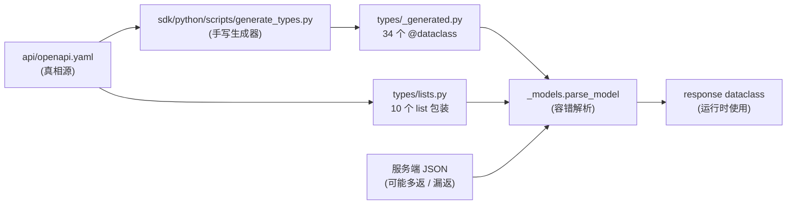

# 34 · 类型与 Schema — dataclass 生成器与 `parse_model` 容错

> **目标读者**:开发者、想理解 wire 兼容性的工程师。
> **阅读时间**:15 分钟。
> **关键事实**:SDK 类型系统**只用 dataclass**(不用 pydantic / TypedDict);**`parse_model` 容错**(未知键忽略、缺失 `Optional` 填 `None`、嵌套 dataclass + `List[X]` 递归);生成器**手写**(`sdk/python/scripts/generate_types.py`)。

---

## 1. 类型系统全景



> **手写生成器**:不用 openapi-generator,直接解析 YAML → emit dataclass(`generate_types.py`)。这保证生成代码可读、可改、可在 PR review 里 diff。

---

## 2. 34 个生成 dataclass

来自 `sdk/python/cortrix/types/_generated.py:0-360`(行号按 `_generated.py` 实际行数;`__all__` 在文件顶部)。

| Dataclass | 用途 |
|---|---|
| `ChunkStrategy` | 切块策略配置 |
| `Namespace` | NS 元数据 |
| `NamespaceCreateRequest` | 创建 NS 请求 |
| `Document` | 文档详情 |
| `DocumentProgress` | 文档处理进度 |
| `DocumentTask` | 异步任务 |
| `QueryFilter` | 检索 filter |
| `QueryRequest` | 检索请求 |
| `QueryResult` | 检索结果(results + meta) |
| `QueryResultItem` | 单个 chunk |
| `QueryMeta` | 结果元数据(8 字段) |
| `Memory` | 记忆详情 |
| `MemorySearchRequest` | 记忆搜索请求 |
| `MemoryLogRequest` | 记忆写入请求 |
| `MemoryCreateRequest` | 记忆创建请求 |
| `SqlRequest` | SQL 请求 |
| `SqlResult` | SQL 结果 |
| `SyncStatus` | 同步状态 |
| `Watcher` | 文件监听 |
| `WatchEvent` | 监听事件 |
| `RegisterRequest` | 注册请求 |
| `TenantRef` | 租户引用 |
| `User` | 用户 |
| `LoginResponse` | 登录响应 |
| `ApiKey` | API Key |
| `Quota` | 配额 |
| `TenantMember` | 租户成员 |
| `Tenant` | 租户 |
| `NsAclEntry` | NS ACL 项 |
| `ChatRequest` | Chat 请求 |
| `AgentSession` | Agent 会话 |
| `AgentLlmConfig` | Agent LLM 配置 |
| `NsStats` | NS 统计 |
| `GcStatus` | GC 状态 |

> 用法:在 IDE 里 `from cortrix.types import QueryResult, QueryMeta, QueryResultItem`,所有字段都有类型提示。

---

## 3. 10 个 list 包装

来自 `sdk/python/cortrix/types/lists.py:0-156`,提供 `__iter__` / `__len`:

| 类 | 用途 |
|---|---|
| `SearchResults` | 检索结果包装 |
| `DocumentList` | 文档列表(分页) |
| `NamespaceList` | NS 列表 |
| `MemoryList` | 记忆列表 |
| `MemorySearchResponse` | 记忆搜索响应 |
| `MemorySearchResultItem` | 记忆搜索单项 |
| `MemoryCreateAck` | 记忆创建 ack |
| `MemoryEditAck` | 记忆编辑 ack |
| `MemoryDeleteAck` | 记忆删除 ack |
| `WatcherList` | 监听列表 |

```python
items = client.documents.list("ns", limit=50)
for doc in items:        # __iter__
    print(doc.id)
print(len(items))        # __len__
```

---

## 4. `parse_model` 的容错规则

来自 `sdk/python/cortrix/_models.py:53-74`:

```python
def parse_model(model: Type[T], data: Any) -> T:
    if not dataclasses.is_dataclass(model):
        return typing.cast(T, data)
    if not isinstance(data, dict):
        raise TypeError(f"Cannot parse {model.__name__} from {type(data).__name__}")

    hints = typing.get_type_hints(model)
    kwargs: dict[str, Any] = {}
    for field in dataclasses.fields(model):
        tp = hints.get(field.name, Any)
        if field.name in data:
            kwargs[field.name] = _coerce(tp, data[field.name])
        elif (
            field.default is not dataclasses.MISSING
            or field.default_factory is not dataclasses.MISSING
        ):
            continue  # use dataclass default
        elif _is_optional(tp):
            kwargs[field.name] = None
        # else: required field absent -> let dataclass raise a clear TypeError
    return typing.cast(T, model(**kwargs))
```

### 4.1 三条容错规则

| 规则 | 例子 |
|---|---|
| **未知键忽略** | 服务端多返 `{"foo": "bar"}` 时,不抛错 |
| **缺失 `Optional` 字段 → `None`** | `Optional[str]` 漏传时,字段值是 `None` |
| **嵌套 dataclass + `List[X]` 递归** | `QueryResultItem.metadata: dict` 内的子对象也会按类型解析 |

### 4.2 严格场景

- **缺失 required 字段**:由 dataclass 自身抛 `TypeError`(清晰报错)。
- **`data` 不是 dict**:`raise TypeError`。

### 4.3 `_coerce` 类型推导(`_models.py:35-50`)

- **Optional**:剥 `Union[X, None]`,按 X 处理。
- **`List[X]` / `list[X]`**:`[coerce(inner, v) for v in value]`。
- **嵌套 dataclass + dict**:`parse_model(inner, value)` 递归。
- 其它:原值返回。

---

## 5. 手动扩展 dataclass

如果 OpenAPI 没覆盖你的场景,**不要**手改 `_generated.py`(会被下次生成覆盖)。

正确做法:

```python
# 在自己的代码里
from dataclasses import dataclass
from cortrix.types import QueryResultItem

@dataclass
class MyItem(QueryResultItem):
    my_extra_field: str = "default"

# 或者独立定义,不用继承
@dataclass
class MyThing:
    field_a: str
    field_b: int | None = None
```

---

## 6. `py.typed` 与 mypy strict

- 包带 `py.typed`(`sdk/python/pyproject.toml:53`)。
- CI 跑 `mypy --strict`(`pyproject.toml:62-64`)对 Python 3.10。
- `ruff` + `target-version = "py39"`(`pyproject.toml:66-68`)。

IDE 自动补全 / 类型检查:

```python
result = client.search("ns", "query")
for item in result.results:    # item: QueryResultItem
    print(item.score)          # float | None
    print(item.namespace)      # str | None
    print(item.metadata)       # dict
```

---

## 7. 重新生成类型(改 OpenAPI 后)

```bash
cd sdk/python
python scripts/generate_types.py
# 或在 CI 里跑
```

生成器做的事:

1. 读 `../../api/openapi.yaml`(或绝对路径)。
2. 解析 `components.schemas`。
3. emit `@dataclass` 写到 `cortrix/types/_generated.py`。

> **手写的意义**:遇到 OpenAPI 表达不清的字段,可以人工调整 dataclass;下次生成会按新 OpenAPI 覆盖,**所以 PR review 时一定要看 diff**。

---

## 8. wire 兼容性案例

| 场景 | 行为 |
|---|---|
| 服务端多返 `{"new_field": ...}` | `parse_model` 忽略,dataclass 不变 |
| 服务端少返可选字段 | `parse_model` 用 dataclass default 或 `None` |
| 服务端改名 wire 字段 | 由 resource 模块的 `_adapt_wire_result` 翻译(以 [query.py](31-resources.md#4-queryresourcesquerypy) 为例) |
| 客户端用旧 SDK,服务端是新版 | 通常没问题,新字段被忽略 |
| 客户端用新 SDK,服务端是旧版 | 新 SDK 需要的字段缺失 → dataclass `TypeError`,但 `Optional` 字段安全 |

---

## 下一步

👉 **[35 · MCP Server](35-mcp-server.md)** — 29+2 工具、stdio、协议握手。
