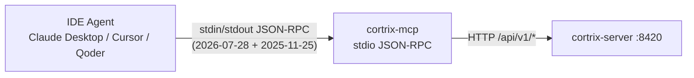
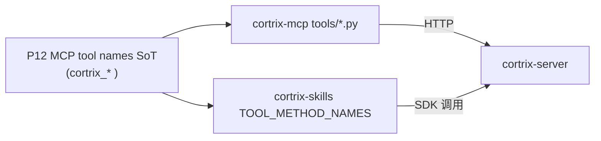
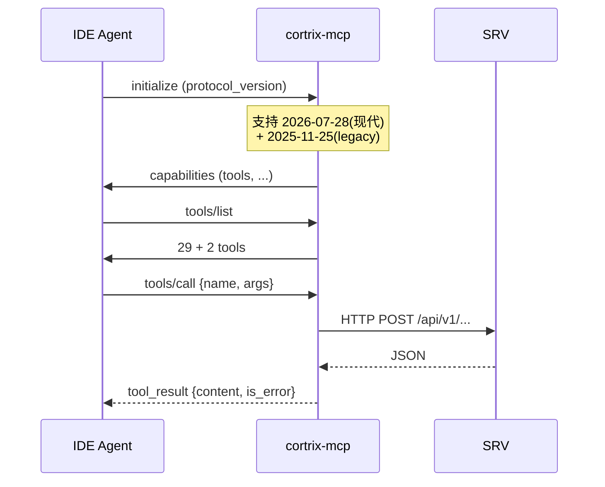

# 35 · MCP Server — 29+2 工具与协议

> **目标读者**:开发者、想用 MCP 接 IDE Agent 的人。
> **阅读时间**:15 分钟。
> **关键事实**:MCP server 是 **stdio transport**;**不依赖 Python SDK**,直接 HTTP;支持**现代 `2026-07-28` + legacy `2025-11-25`** 双协议握手;**29 tools + 2 admin**;命名 `cortrix_<action>` 1:1 对齐 P12 SoT。

---

## 1. 协议与传输



> **当前 transport 是 stdio**(`cortrix-mcp/src/cortrix_mcp/server.py:44 main()`)。
> **远程 Streamable HTTP 是 🗺️ Roadmap**(`README.md:181-182`)。

---

## 2. 安装与运行

```bash
pip install cortrix-mcp
cortrix-mcp   # 入口 server.py:44
```

配置 Claude Desktop(`~/.config/claude/claude_desktop_config.json` 等价):

```json
{
  "mcpServers": {
    "cortrix": {
      "command": "cortrix-mcp",
      "env": {
        "CORTRIX_BASE_URL": "http://localhost:8420",
        "CORTRIX_API_KEY": "cx_live_xxx"
      }
    }
  }
}
```

---

## 3. 29 + 2 工具全表

来自 `cortrix-mcp/src/cortrix_mcp/tools/{core,extended,new,memory,admin}.py`。

### 3.1 MVP / Core(12)

| Tool | 来源 | 用途 |
|---|---|---|
| `cortrix_health` | `core.py` | 健康检查 |
| `cortrix_query` | `core.py` | 检索 |
| `cortrix_upload` | `core.py` | 文档上传 |
| `cortrix_list_documents` | `core.py` | 文档列表 |
| `cortrix_list_namespaces` | `core.py` | NS 列表 |
| `cortrix_create_namespace` | `core.py` | 创建 NS |
| `cortrix_memory_search` | `core.py` | 记忆搜索 |
| `cortrix_log_interaction` | `core.py` | 记录交互 |
| `cortrix_list_interactions` | `core.py` | 交互列表 |
| `cortrix_document_status` | `core.py` | 文档状态 |
| `cortrix_add_watcher` | `core.py` | 加文件监听 |
| `cortrix_list_watchers` | `core.py` | 监听列表 |

### 3.2 Extended(4)

| Tool | 用途 |
|---|---|
| `cortrix_cross_ns_query` | 跨 NS 检索 |
| `cortrix_async_upload` | 异步上传 |
| `cortrix_memory_search_filter` | 带 filter 的记忆搜索 |
| `cortrix_memory_extract_trigger` | 触发 MEM02 抽取(🚫) |

### 3.3 New(4)

| Tool | 用途 |
|---|---|
| `cortrix_memory_extract` | 显式抽取 |
| `cortrix_task_status` | 任务状态 |
| `cortrix_cancel_task` | 取消任务 |
| `cortrix_query_explain` | 检索解释 |

### 3.4 Memory 反向 / TD-F42 / F18a(8)

| Tool | 用途 | 状态 |
|---|---|---|
| `cortrix_memory_get_audit` | MEM02 审计 | 🚫 Blocked(MEM02) |
| `cortrix_memory_revoke_fact` | 撤销事实 | 🚫 Blocked(MEM02) |
| `cortrix_memory_opt_out` | MEM04 退出 | 🟡 |
| `cortrix_batch_submit` | F42 批量提交 | 🟡 |
| `cortrix_list_operations` | F18a 操作列表 | 🟡 |
| `cortrix_memory_list` | MEM03 列表 | 🟡 |
| `cortrix_memory_create` | MEM03 创建 | 🟡 |
| `cortrix_memory_edit` | MEM03 编辑 | � |
| `cortrix_memory_invalidate` | MEM03 撤销 | 🟡 |

### 3.5 Admin(2)

| Tool | 用途 |
|---|---|
| `cortrix_admin_*` | admin 操作(`admin.py`)(租户 / 配额 / 审计 / JWT 轮换) |

> 2 个 admin 工具 + 29 个业务工具 = **31 个**;按 P12 命名为 `cortrix_<action>`。

---

## 4. P12 SoT 与命名

来自 `cortrix-skills/src/cortrix_skills/toolkit.py:1-10` 注释:

> `kit.cortrix_<action>` 1:1 mirrors the P12 MCP `cortrix_<action>` tool names.



> 这保证了:**MCP / Skills / 未来其它适配器**命名一致,改一处同步。

---

## 5. 协议握手(mcp_server.py)



> **dual-era 兼容**:同一进程支持两版协议握手(测试覆盖 `cortrix-mcp/tests/`)。

---

## 6. 错误处理

来自 `cortrix-mcp/src/cortrix_mcp/errors.py`:

- HTTP 4xx/5xx → MCP `tool_result.is_error=true` + content 是 GEN-Agent 4 字段 JSON。
- 客户端可用 `is_error` 触发 Agent 重试决策。

---

## 7. 测试

| 类型 | 路径 |
|---|---|
| 单元 + e2e | `cortrix-mcp/tests/` |
| Claude Code 端到端 | `tests/test_e2e_claude_code.py` |
| 双协议握手 | `tests/` 内相关 case |
| stdio 测试桩 | `tests/stdio_test_server.py` |

```bash
cd cortrix-mcp
pytest -q
```

---

## 8. 状态门槛

| 能力 | 状态 |
|---|---|
| stdio MCP server(29 tools + 2 admin) | 🟡 Verification required |
| 双协议握手 | � Verification required |
| 远程 Streamable HTTP | 🗺️ Roadmap |
| MCP 端 MEM02 路径 | 🚫 Blocked(MEM02) |

---

## 下一步

👉 **[36 · Skills 框架适配](36-skills-frameworks.md)** — LangChain / Claude / OpenAI 三适配器。
