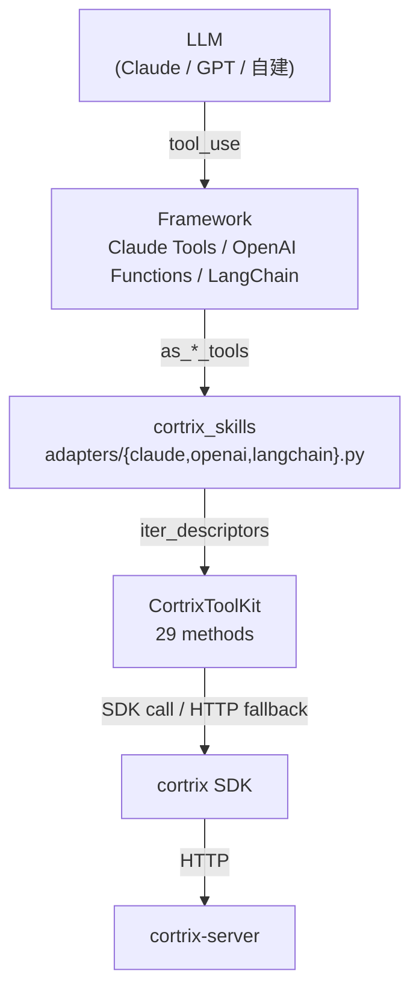

# 36 · Skills 框架适配 — LangChain / Claude / OpenAI

> **目标读者**:开发者、想把 Cortrix 接入 LLM 框架的人。
> **阅读时间**:20 分钟。
> **关键事实**:`cortrix-skills` 是 **Python SDK 的薄包装**(`pyproject.toml:38` 强依赖 `cortrix>=1.0.0rc1,<2.0.0`);**29 个工具方法**(`TOOL_METHOD_NAMES`,`toolkit.py:39-77`);三适配器共享 `iter_descriptors(kit)` 单一发现入口;**GEN-Agent 4 字段透传**(不 catch `CortrixError`)。

---

## 1. 三层架构



---

## 2. 安装

```bash
pip install cortrix-skills             # 核心
pip install cortrix-skills[langchain]  # + LangChain
pip install cortrix-skills[claude]     # + Anthropic
pip install cortrix-skills[openai]     # + OpenAI
pip install cortrix-skills[all]        # 三个全装
```

依赖(`pyproject.toml:38`):`cortrix>=1.0.0rc1,<2.0.0`、`pydantic>=2.0,<3.0`。
可选:`langchain>=0.2.0,<0.3.0` / `anthropic>=0.40.0,<1.0.0` / `openai>=1.0,<2.0`。

---

## 3. `CortrixToolKit`

```python
from cortrix_skills import CortrixToolKit

kit = CortrixToolKit(
    base_url="http://localhost:8420",
    api_key="cx_live_xxx",
    default_namespace="default",
    client=None,           # 可注入现成 SDK client
)

# 直接调用(不走框架)
res = kit.cortrix_query(query="...", top_k=5)
res = kit.cortrix_memory_search(query="...", user_id="u1")
res = kit.cortrix_list_namespaces()
```

### 3.1 29 个方法(`toolkit.py:39-77`)

按 P12 SoT 顺序:

| # | 方法 | 用途 | 状态 |
|---|---|---|---|
| 1 | `cortrix_health` | 健康 | � |
| 2 | `cortrix_query` | 检索 | 🟡 |
| 3 | `cortrix_upload` | 上传 | 🟡 |
| 4 | `cortrix_list_documents` | 文档列表 | 🟡 |
| 5 | `cortrix_list_namespaces` | NS 列表 | 🟡 |
| 6 | `cortrix_create_namespace` | 创建 NS | 🟡 |
| 7 | `cortrix_memory_search` | 记忆搜索 | 🟡 |
| 8 | `cortrix_log_interaction` | 记录交互 | 🟡 |
| 9 | `cortrix_list_interactions` | 交互列表 | 🟡 |
| 10 | `cortrix_document_status` | 文档状态 | 🟡 |
| 11 | `cortrix_add_watcher` | 加监听 | 🟡 |
| 12 | `cortrix_list_watchers` | 监听列表 | 🟡 |
| 13 | `cortrix_cross_ns_query` | 跨 NS | 🟡 |
| 14 | `cortrix_async_upload` | 异步上传 | 🟡 |
| 15 | `cortrix_memory_search_filter` | 带 filter 记忆搜索 | 🟡 |
| 16 | `cortrix_memory_extract_trigger` | MEM02 触发 | 🚫 |
| 17 | `cortrix_memory_extract` | 显式抽取 | 🟡 |
| 18 | `cortrix_task_status` | 任务状态 | 🟡 |
| 19 | `cortrix_cancel_task` | 取消任务 | 🟡 |
| 20 | `cortrix_query_explain` | 检索解释 | � |
| 21 | `cortrix_memory_get_audit` | MEM02 审计 | 🚫 |
| 22 | `cortrix_memory_revoke_fact` | MEM02 撤销 | 🚫 |
| 23 | `cortrix_memory_opt_out` | MEM04 退出 | 🟡 |
| 24 | `cortrix_batch_submit` | F42 批量 | 🟡 |
| 25 | `cortrix_list_operations` | F18a | 🟡 |
| 26 | `cortrix_memory_list` | MEM03 列表 | 🟡 |
| 27 | `cortrix_memory_create` | MEM03 创建 | � |
| 28 | `cortrix_memory_edit` | MEM03 编辑 | � |
| 29 | `cortrix_memory_invalidate` | MEM03 撤销 | � |

> 命名 1:1 对应 MCP `cortrix_<action>`(`toolkit.py:1-10` 注释)。

### 3.2 两条分发路径

来自 `toolkit.py:151-168` 与各方法体:

1. **SDK 调用**(首选):`self._client.<resource>.verb(...)`,然后 `_to_dict(...)` 标准化为 JSON(`toolkit.py:80-94` 的递归 dataclass → dict)。
2. **HTTP 兜底**:`self._client._request(...)`,针对 SDK 未直接暴露的端点。

两条路径**都走** SDK 的请求循环,所以 GEN-Agent 4 字段不丢。

### 3.3 GEN-Agent 4 字段透传

`toolkit.py:12-19` 注释:

> methods do **not** catch `CortrixError` — it propagates unchanged.

后果:
- 异常携带 `retryable` / `category` / `retry_after_ms` / `structured_data` 抵达框架适配层。
- 各适配器负责把这些**包装成**该框架的 tool error 形式(见下表)。

---

## 4. 框架适配器

### 4.1 入口:`iter_descriptors(kit)`

```python
from cortrix_skills.adapters import iter_descriptors

for d in iter_descriptors(kit):
    # d: ToolDescriptor(name, description, input_schema, method)
    print(d.name, d.description)
```

> **唯一发现入口**:三适配器都从这里取 29 个 `ToolDescriptor`,保证顺序与 schema 一致(`adapters/__init__.py:39-47`)。

### 4.2 Claude Tools(`adapters/claude.py`)

```python
from cortrix_skills.adapters.claude import (
    as_claude_tools,
    dispatch_claude_tool_use,
)

tools = as_claude_tools(kit)
# tools: list[dict] = [{name, description, input_schema}, ...] × 29

resp = anthropic_client.messages.create(
    model="claude-haiku-4-5-20251001",
    tools=tools,
    messages=[{"role": "user", "content": "..."}],
)

for block in resp.content:
    if block.type == "tool_use":
        result = dispatch_claude_tool_use(kit, block)
        # result: dict {type: "tool_result", tool_use_id, content, is_error?}
```

**错误包装**:

```python
# dispatch_claude_tool_use 内部(伪代码):
try:
    out = kit.cortrix_<action>(**block.input)
    return {"type": "tool_result", "tool_use_id": ..., "content": json.dumps(_to_dict(out))}
except CortrixError as e:
    return {
        "type": "tool_result",
        "tool_use_id": ...,
        "is_error": True,
        "content": json.dumps({
            "code": e.error_code,
            "message": e.message,
            "category": e.category,
            "retryable": e.retryable,
            "retry_after_ms": e.retry_after_ms,
            "structured_data": e.structured_data,
            "request_id": e.request_id,
        }),
    }
```

### 4.3 OpenAI Function Calling(`adapters/openai.py`)

```python
from cortrix_skills.adapters.openai import (
    as_openai_functions,
    dispatch_openai_tool_call,
)

tools = as_openai_functions(kit)
# tools: list[dict] = [{type: "function", function: {name, description, parameters}}, ...] × 29

resp = openai_client.chat.completions.create(
    model="gpt-4o-mini",
    tools=tools,
    messages=[...],
)

for call in resp.choices[0].message.tool_calls:
    content = dispatch_openai_tool_call(kit, call)
    # content: JSON string for role:"tool" message
```

**错误包装**:`role:"tool"` message,`content` 是 4 字段 JSON(同上)。

### 4.4 LangChain(`adapters/langchain.py`)

```python
from cortrix_skills.adapters.langchain import as_langchain_tools

tools = as_langchain_tools(kit)
# tools: list[StructuredTool] × 29

from langchain.agents import create_react_agent, AgentExecutor
from langchain_anthropic import ChatAnthropic

agent = create_react_agent(
    ChatAnthropic(model="claude-haiku-4-5-20251001"),
    tools,
)
executor = AgentExecutor(agent=agent, tools=tools, verbose=True)
executor.invoke({"input": "..."})
```

**错误包装**:`ToolException(json.dumps(4_field))`(`_wrap`,`langchain.py:63-83`)。

---

## 5. 三适配器对比

| 维度 | LangChain | Claude | OpenAI |
|---|---|---|---|
| 输出类型 | `list[StructuredTool]` | `list[dict]`(裸) | `list[dict]`(裸) |
| tool 形状 | `StructuredTool` | `{name, description, input_schema}` | `{type:"function", function:{name, description, parameters}}` |
| 错误包装 | `ToolException(JSON)` | `tool_result {is_error:true, content:JSON}` | `role:"tool"` message content JSON |
| 框架依赖 | `langchain>=0.2` | `anthropic>=0.40` | `openai>=1.0` |
| 导入策略 | 软导入 + `_INSTALL_HINT` | 同 | 同 |

> 三个适配器**输出 schema 同一来源**(`json_schema_from_method`),保证模型看到的工具描述一致。

---

## 6. `descriptor.py` 关键

### 6.1 `pydantic_model_from_method`(`descriptor.py:58-88`)

- 反射方法签名,跳 `self`,忽略 `*args` / `**kwargs`。
- 用 `typing.get_type_hints` 解析 `from __future__ import annotations` 下的字符串注解。
- `pydantic.create_model(...)` 生成 `BaseModel`,模型名形如 `CortrixQueryInput`。

### 6.2 `json_schema_from_method`(`descriptor.py:91-104`)

- 调 `pydantic` 的 `model_json_schema()`,返回 `{type, properties, required}`。
- 去掉 `title`(`descriptor.py:101-103` 注释解释)。
- **直接可用**为 Claude `input_schema` 或 OpenAI `parameters`。

### 6.3 `ToolDescriptor`(`descriptor.py:107-127`)

```python
class ToolDescriptor:
    __slots__ = ("name", "description", "input_schema", "method")
    # name: "cortrix_query"  (方法名 = 工具名)
    # description: docstring 第一行
    # input_schema: JSON Schema dict
    # method: bound callable
```

---

## 7. `examples/`:三份 Jupyter Notebook

| Notebook | 演示 |
|---|---|
| `examples/claude_tools_demo.ipynb` | Anthropic Messages round-trip + 工具调用 |
| `examples/openai_functions_demo.ipynb` | OpenAI Chat round-trip + tool_calls |
| `examples/langchain_demo.ipynb` | LangChain ReAct agent + 工具 |

启动方式:在 `cortrix-skills/` 下 `jupyter lab`。

---

## 8. spec_lint 三方规范校验

`tools/spec_lint_p12_vs_p14_vs_p04.py`:

- P12 = MCP tool 名(`cortrix_*`)
- P14 = Skills adapter 输出 schema
- P04 = SDK 异常体系

脚本断言三套规范一致 — 这也是为什么 MCP / Skills / SDK 命名必须 1:1。

---

## 9. 状态门槛

| 能力 | 状态 |
|---|---|
| Skills + 3 适配器 | 🟡 Verification required |
| GEN-Agent 4 字段透传 | ✅ Verified(代码层面) |
| MEM02 路径(21/22) | 🚫 Blocked |
| 三框架 e2e | 🟡 Verification required(需真实 provider key) |

---

## 下一步

👉 **[37 · 内置 Agent](37-builtin-agent.md)** — FastAPI + ChatExecutor L1/L2/L3 + 6 LLM 适配器。
