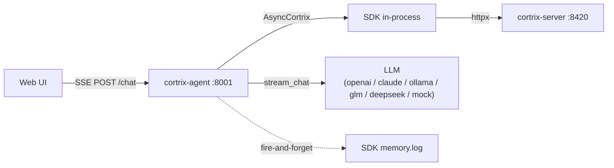
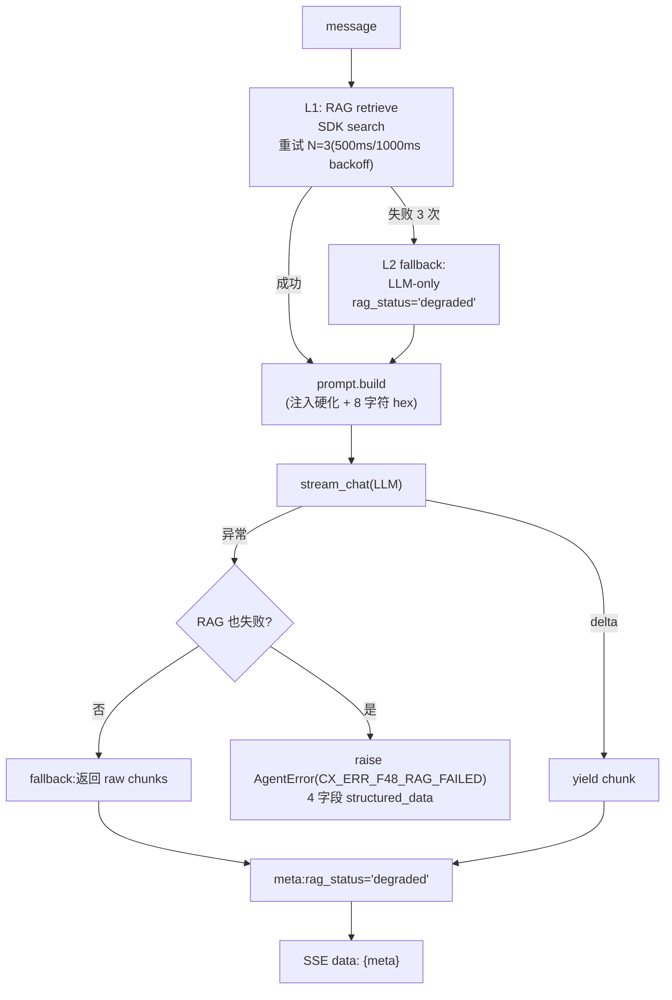
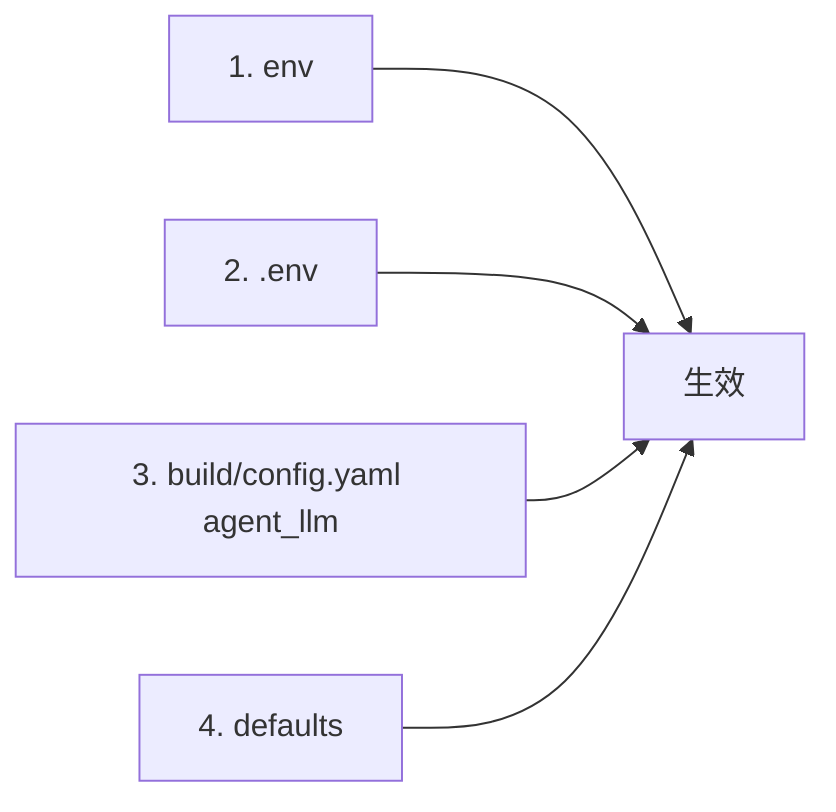

# 37 · 内置 Agent — FastAPI + ChatExecutor L1/L2/L3 + 6 LLM 适配器

> **目标读者**:开发者、想本地跑 Agent 的人。
> **阅读时间**:20 分钟。
> **关键事实**:`cortrix-agent` 是 **FastAPI + SSE 流式 chat** 服务(端口 8001);**dogfood SDK**(`main.py:37-39` sys.path 注入 + `from cortrix import AsyncCortrix`);**只有 `ChatExecutor`**(`ToolUseExecutor` 是 V1.5,`PlanExecuteExecutor` 是 V2);**6 个 LLM 适配器**;**4 层配置优先级**(env > .env > build/config.yaml agent_llm > defaults)。

---

## 1. 进程形态



---

## 2. 入口与依赖图

```text
cortrix-agent/
├── main.py            # build_app() + 3 router
├── config.py          # Settings(Pydantic)
├── agent_core/        # UI 无关:RAG / prompt / session / errors / explain / mem_coprocess
├── llm/               # BaseLLMAdapter + 6 个实现
└── routes/            # chat / sessions / config
```

### 2.1 main.py 关键路径

| 位置 | 行号 | 作用 |
|---|---|---|
| `sys.path` 注入 `sdk/python` | `:37-39` | 让 `from cortrix import AsyncCortrix` 找到 SDK |
| `from cortrix import AsyncCortrix` | `:145` | SDK 导入 |
| `_create_llm_adapter()` | `:83-120` | 工厂:按 `settings.llm_provider` 选 adapter |
| `build_app()` | `:123` | FastAPI 工厂 |
| `app = build_app()` | `:305` | 模块级实例化(uvicorn `main:app` 直接跑) |
| mount routers | `:207-209` | `chat_routes`、`session_routes`、`config_routes` |
| `GET /health` | `:241-260` | 健康检查 |

---

## 3. 路由

| 路由 | 文件 | 端点 |
|---|---|---|
| `chat_routes` | `routes/chat.py` | `POST /chat`(SSE) |
| `session_routes` | `routes/sessions.py` | `GET /sessions/{id}` |
| `config_routes` | `routes/config.py` | `GET /config`、`GET /config/providers`、`PUT /config/agent_llm` |
| inline | `main.py:241-260` | `GET /health` |

### 3.1 `POST /chat`(SSE)

```bash
curl -N -X POST 'http://localhost:8001/chat?explain=true' \
  -H 'Content-Type: application/json' \
  -H 'X-Cortrix-Namespace: default' \
  -d '{"message": "find privacy documents", "session_id": "s-001"}'
```

| 参数 | 位置 | 作用 |
|---|---|---|
| `message` | body | 用户消息 |
| `session_id` | body | 可选 |
| `Authorization` | header | 取决于 server auth |
| `X-Cortrix-Namespace` | header | 覆盖默认 NS |
| `X-Cortrix-Tenant-Id` | header | 多租户(🚫 Blocked) |
| `?explain=true` | query | 加 A/B/C 档元数据 |
| `?debug=true` | query | 加详细 debug 信息 |

详细见 [25-agent-chat.md §3](../part-2-user/25-agent-chat.md)。

---

## 4. ChatExecutor L1/L2/L3(`agent_core/executor.py`)



### 4.1 L1 — SDK search + retry

`_retrieve_with_retry`(`executor.py:103-120`):

```python
_RAG_MAX_ATTEMPTS = 3
_RAG_BACKOFF_MS = [500, 1000]   # 第二次与第三次尝试前的等待

for attempt in range(_RAG_MAX_ATTEMPTS):
    try:
        result = await self._rag.retrieve(message, namespace=namespace)
        return result, None
    except Exception as err:
        last_err = err
        if attempt < len(_RAG_BACKOFF_MS):
            await asyncio.sleep(_RAG_BACKOFF_MS[attempt] / 1000.0)
return None, last_err
```

> 任何异常都触发重试;`max_attempts=3`(`executor.py:46`)。

### 4.2 L2 — degraded RAG

- `rag_status = "degraded"`(`explain.py` 的 `RAG_STATUS_DEGRADED`)。
- chunks=[]。
- 仍然把 prompt 喂给 LLM(LLM-only)。

### 4.3 L3 — 硬错误

`executor.py:184-194`:

```python
raise AgentError(
    "CX_ERR_F48_RAG_FAILED",
    retryable=False,
    structured_data={
        "cortrix_server_error": rag_failed_detail.get("cortrix_server_error") if rag_failed_detail else None,
        "fallback_attempted": True,
        "llm_error": str(llm_err),
    },
) from llm_err
```

> RAG 失败 + LLM 失败才 L3。RAG 成功但 LLM 失败 → L2(返回原始 chunks)。

### 4.4 `AgentError`(`agent_core/errors.py:142-153`)

与 GEN-Agent 4 字段同构:`code`、`message`、`retryable`、`category`、`retry_after_ms`、`structured_data`。

---

## 5. Prompt 注入硬化(`agent_core/prompt.py:64-131`)

```python
def build_chat_prompt(message, rag_texts, *, history, doc_inventory):
    # XML-style 分段:system / context / chunks / user
    # 随机 8 字符 hex 后缀,降低"ignore previous instructions"成功率
    ...
```

- 每个 chunk 前置 `[source_path: ...]`,让 LLM 能 cite 来源。
- `doc_inventory`(尽力收集,不阻塞)帮助 chat 回答"有哪些文档"。
- 8-char hex suffix 在每次构造时随机生成。

---

## 6. SessionStore(`agent_core/session_store.py:42-138`)

- 内存,N=10 滑动窗口。
- `GET /sessions/{id}` 返回窗口内历史。
- **重启即丢**(非持久)。

---

## 7. MemoryCoprocessor(`agent_core/mem_coprocess.py:27-70`)

- 每次 turn 结束,fire-and-forget 调 `client.memory.log(...)`(MEM01)。
- 同时尝试触发 MEM02 自动抽取(LLM)— 🚫 当前 Blocked,代码已埋。

---

## 8. 6 个 LLM 适配器(`llm/`)

### 8.1 接口(`llm/base.py:7-22`)

```python
class BaseLLMAdapter(ABC):
    @abstractmethod
    async def stream_chat(
        self, system_prompt: str, user_message: str, temperature: float = 0.7
    ) -> AsyncIterator[str]: ...

    @abstractmethod
    async def check_connection(self) -> bool: ...
```

### 8.2 6 个实现

| 适配器 | 文件 | provider key | 协议 |
|---|---|---|---|
| `OpenAIAdapter` | `llm/openai_adapter.py:8-43` | `openai` | OpenAI AsyncClient(可改 base_url 兼容代理) |
| `ClaudeAdapter` | `llm/claude_adapter.py:11-118` | `claude` | 直 HTTP httpx + Anthropic `/v1/messages`(SSE `content_block_delta` 解析) |
| `OllamaAdapter` | `llm/ollama_adapter.py` | `ollama` | 本地模型 |
| `GLMAdapter` | `llm/glm_adapter.py` | `glm` | Zhipu(OpenAI-compatible) |
| `DeepSeekAdapter` | `llm/deepseek_adapter.py` | `deepseek` | V1.5 scope |
| `MockAdapter` | `llm/mock_adapter.py` | `mock` | **默认**,只返 retrieval 结果,不调外部 |

### 8.3 工厂选择(`main.py:83-120`)

```python
match settings.llm_provider:
    case "openai": ...
    case "claude": ...
    case "ollama": ...
    case "glm": ...
    case "deepseek": ...   # V1.5
    case "mock" | _:       # default
        return MockAdapter(...)
```

> `Literal["openai","claude","ollama","glm","mock","deepseek"]`(`config.py:94`)。
> 默认 `mock`(`config.py:94`)。

---

## 9. 错误码(`agent_core/errors.py`)

### 9.1 `ERROR_TABLE`(7 个 V1.0 chat-path)

来自 `agent_core/errors.py:29-72`:

- `CX_ERR_F48_RAG_FAILED` 等等(详细见源码)。

### 9.2 `STARTUP_ERROR_TABLE`(5 个)

启动期错误:`agent_core/errors.py:76`。

### 9.3 `AgentError` 4 字段

`agent_core/errors.py:142-153` — 与 GEN-Agent 协议一致。

---

## 10. 配置优先级(`config.py:1-8`)



| 优先级 | 来源 | 例 |
|---|---|---|
| 1 (最高) | env | `LLM_PROVIDER=claude` |
| 2 | `.env` | `LLM_PROVIDER=claude` |
| 3 | `build/config.yaml` 的 `agent_llm` | `provider: claude` |
| 4 (最低) | `config.py` defaults | `mock` |

> 服务端其他 LLM 角色(semantic / vision / doc_summary / enricher)由 C++ 后端直接读 `config.yaml`,**不走** Agent 4 层。

---

## 11. 启动

```bash
cd cortrix-agent
python3 -m venv .venv
.venv/bin/pip install -r requirements.txt
cp .env.example .env
.venv/bin/uvicorn main:app --port 8001 --reload
```

```bash
curl http://localhost:8001/health
# {"status":"ok","cortrix_server":true,"llm_reachable":true}
```

---

## 12. 状态门槛

| 能力 | 状态 |
|---|---|
| `ChatExecutor`(固定 RAG 流) | 🟡 |
| `ToolUseExecutor`(V1.5) | 🗺️ |
| `PlanExecuteExecutor`(V2) | 🗺️ |
| 6 个 LLM 适配器 | 🟡 |
| SSE 流式 | � |
| Memory 联动(MEM02) | 🚫 Blocked |
| Session 持久化 | 🟡(内存,N=10) |
| `PUT /config/agent_llm` 持久化 | 🟡(live persistence 未验证) |

---

## 下一步

👉 **[38 · pgcortrix](38-pgcortrix.md)** — PostgreSQL 扩展 SQL 函数。
