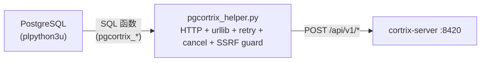

# 38 · pgcortrix — 在 SQL 里调 Cortrix

> **目标读者**:开发者、Postgres 用户。
> **阅读时间**:10 分钟。
> **关键事实**:`pgcortrix` 是 **`plpython3u` 包装的 PG 扩展**;**不依赖 Python SDK**,直接 HTTP(`urllib`);**5 主函数 + 2 助手函数**;**4 个 GUC 配置项**;**独立 PGXS 构建**(不进 `cortrix/` CMake)。

---

## 1. 架构



> **不用 C 扩展 + 共享内存 IPC**(`sql-extensions/pgcortrix/README.md:11-23`):
> - PG 版本无关(PG 13–17 via 稳定 `plpython3u` ABI)
> - 函数体改完不用重编 PG
> - 故障隔离:Server 挂了 PG 仍能服务
> - Cloud V1.5 可换 `aws_lambda` transport,函数签名不变

---

## 2. 安装

### 2.1 构建(需要 `pg_config` + `plpython3u`)

```bash
cd sql-extensions/pgcortrix
make            # PGXS 构建
make install    # 安装到 PG extension 目录
```

### 2.2 在数据库启用

```sql
CREATE EXTENSION pgcortrix CASCADE;   -- CASCADE 自动拉 plpython3u
```

> 权限:`pgcortrix.control` 要求 superuser(V3-E-02 SSRF defense)。

---

## 3. 5 个主函数(`sql/pgcortrix--1.0.sql`)

| 函数 | 返回 | HTTP 端点 | 状态 |
|---|---|---|---|
| `pgcortrix_search(namespace, query, top_k, filter, rerank)` | `SETOF pgcortrix_search_result` | `POST /api/v1/query` | 🟡 |
| `pgcortrix_upload(namespace, file_path)` | `TEXT`(doc_id) | `POST /api/v1/documents` | � |
| `pgcortrix_list_documents(namespace)` | `SETOF pgcortrix_doc_info` | `GET /api/v1/namespaces/{ns}/documents` | 🟡 |
| `pgcortrix_memory_search(namespace, query, user_id, top_k)` | `SETOF pgcortrix_memory_result` | `POST /api/v1/memory/search` | 🟡 |
| `pgcortrix_list_interactions(namespace, user_id, filter, limit_n, offset_n)` | `SETOF pgcortrix_interaction_info` | `GET /api/v1/memory/interactions` | 🟡 |

> `pgcortrix_memory_search` / `pgcortrix_list_interactions` 强制 `user_id`(MEM05 三方一致:`pgcortrix` + MCP + HTTP)。

---

## 4. 2 个助手函数

| 函数 | 返回 | 用途 |
|---|---|---|
| `pgcortrix_configure(api_key)` | `VOID` | 在 session 内设 API Key(`SET LOCAL pgcortrix.api_key = ...`) |
| `pgcortrix_status()` | `JSONB` | 后端健康 + 配置摘要 |

---

## 5. 4 个 GUC 配置项

| GUC | 默认 | scope | 用途 |
|---|---|---|---|
| `pgcortrix.endpoint` | `http://localhost:8420` | **SUSET** | superuser-only(SSRF 防御,V3-E-02) |
| `pgcortrix.api_key` | `''` | USERSET | 空 = 匿名(CE 默认) |
| `pgcortrix.timeout_ms` | `30000` | USERSET | HTTP 超时 |
| `pgcortrix.retry_max` | `3` | USERSET | 5xx 重试上限 |

```sql
-- 全局(需要 superuser)
ALTER SYSTEM SET pgcortrix.endpoint = 'http://cortrix:8420';

-- session 内(普通用户)
SELECT pgcortrix_configure('cx_live_xxx');
SET LOCAL pgcortrix.timeout_ms = 60000;
```

---

## 6. SQL 示例

### 6.1 语义检索

```sql
SELECT *
FROM pgcortrix_search(
    namespace := 'contracts',
    query     := 'Party A breach-of-contract clause',
    top_k     := 10,
    filter    := NULL,         -- F14 allowlist 内可选
    rerank    := TRUE
);
```

### 6.2 上传文档

```sql
SELECT pgcortrix_upload(
    namespace := 'contracts',
    file_path := '/var/lib/pgcortrix/incoming/contract_001.pdf'
);
-- 异步任务 → 轮询 document_status
```

### 6.3 记忆检索(强制 user_id)

```sql
SELECT *
FROM pgcortrix_memory_search(
    namespace := 'user_memory',
    query     := 'project progress the user mentioned',
    user_id   := 'user_001',   -- MEM05 强制
    top_k     := 5
);
```

---

## 7. 测试

`tests/` 下有 3 个测试文件,全部用 Python 标准库 `unittest`,**不需要 live PG**:

```bash
cd sql-extensions/pgcortrix
python3 -m unittest discover -s tests -v
```

| 测试 | 覆盖 |
|---|---|
| `test_sql_contract.py` | SQL DDL 自检(types / columns / signatures / volatility / GUCs) |
| `test_helper.py` | HTTP client(urllib + plpy mock):call shape / user_id 合成 / filter 白名单 / SSRF / retry / cancel / status() |
| `test_sql_helper_seam.py` | SQL 与 helper 方法一一对应(arity 对齐),捕捉漂移 |

> Live PG 加载 + `CREATE EXTENSION` + `pg_regress` 集成是 🗺️ D3.5(构建机无 PostgreSQL)。

---

## 8. 错误处理

`pgcortrix_helper.py` 把 HTTP 错误转换为 PG `RAISE EXCEPTION`,带 `SQLSTATE` 分类:

| HTTP 状态 | PG SQLSTATE |
|---|---|
| 401 / 403 | `28000`(auth) |
| 404 | `P0001`(not_found) |
| 429 | `P0002`(quota_exceeded,带 retry_after_ms) |
| 5xx | `P0003`(transient) |

```sql
DO $$
BEGIN
    PERFORM pgcortrix_search('contracts', 'foo', 5, NULL, TRUE);
EXCEPTION WHEN SQLSTATE 'P0002' THEN
    RAISE NOTICE 'quota exceeded, retry later';
END$$;
```

---

## 9. SSRF 防御

- `pgcortrix.endpoint` 是 **SUSET**(superuser-only)— 普通用户不能改成内网地址(V3-E-02)。
- helper 内对 endpoint 做 scheme / host 白名单检查(详见 `pgcortrix_helper.py`)。

---

## 10. 状态门槛

| 能力 | 状态 |
|---|---|
| plpython3u + urllib + 5 主函数 | 🟡 |
| 测试(mock 无 PG) | ✅ |
| Live PG 加载 / `pg_regress` | 🗺️ D3.5 |
| Cloud V1.5 aws_lambda 切换 | 🗺️ |
| V3+ 共享内存 IPC | 🗺️ |

---

## 下一步

👉 **[39 · 端到端追踪](39-end-to-end-trace.md)** — 一段 prompt 跨 6 组件的完整时序。
