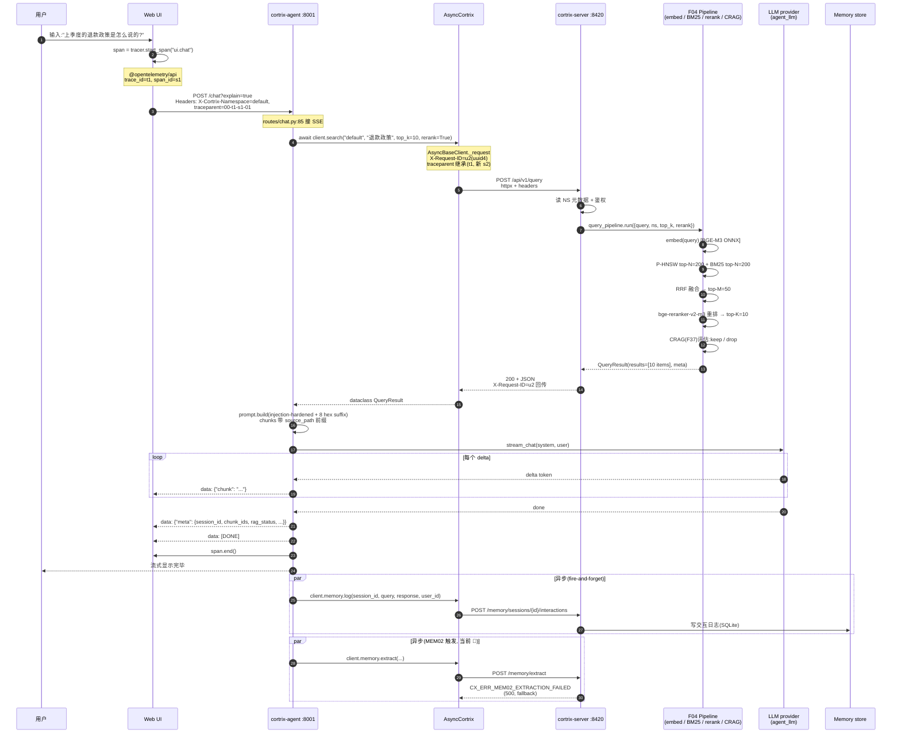
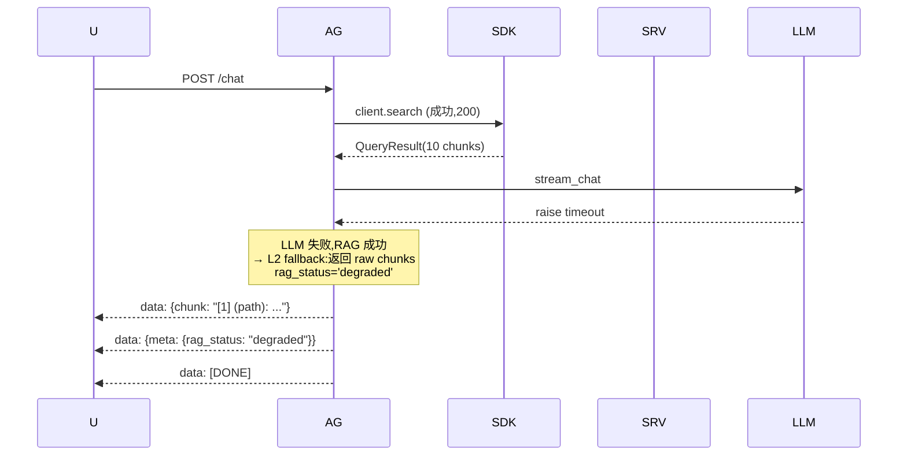
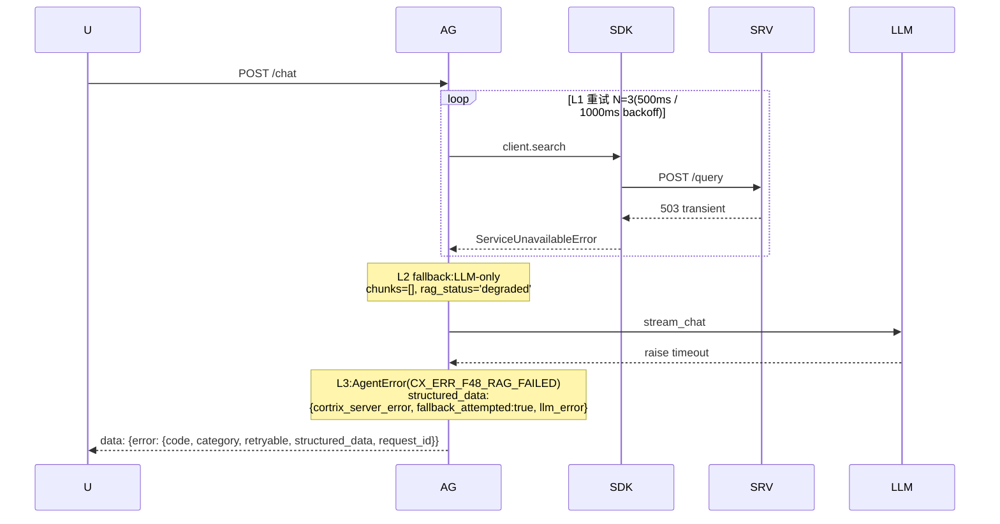
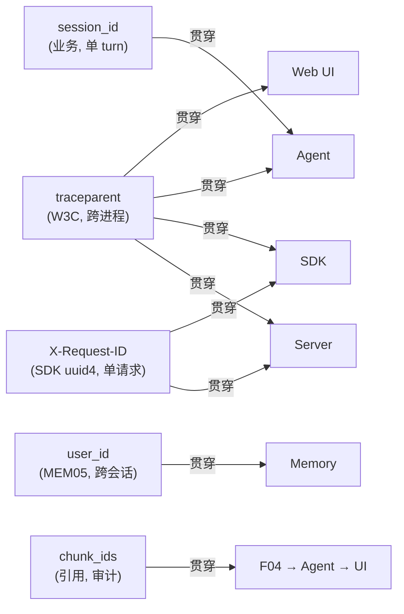

# 39 · 端到端追踪 — 一段 prompt 跨 6 组件

> **目标读者**:开发者、SRE、想看完整 trace 的人。
> **阅读时间**:10 分钟。
> **关键事实**:把"上季度的退款政策是怎么说的?"作为示例,追踪它如何穿过 **Web UI → Agent → SDK → Server → ONNX → 回传 → 落 Memory** 的完整链路,看到每一步的字段传播与失败兜底。

---

## 1. 完整时序



---

## 2. 字段在链路中的传播

| 字段 | 起点 | 中间 | 终点 |
|---|---|---|---|
| **trace_id** | Web UI span | traceparent → SDK → SRV 日志 | AG meta.frame |
| **X-Request-ID** | SDK `uuid4()` | SRV 日志 / 错误回带 | AG logs / UI |
| **session_id** | request body | AG SessionStore(N=10) | meta.frame |
| **chunk_ids** | F04 pipeline | SDK dataclass → AG prompt | AG meta.frame |
| **rag_status** | ChatExecutor(`success` / `degraded`) | prompt + meta | AG meta.frame |
| **explain tier** | `?explain=true` | `explain.py` A/B/C | meta.frame |
| **user_id** | MEM05(必填) | memory.log | Memory store |
| **request_id** | SDK 错误回带(`X-Request-ID`/`x-cortrix-trace-id`/body) | error.frame | UI 错误展示 |

---

## 3. 失败路径示例(LLM 调用失败 + RAG 成功)



> 用户能看到原始引用片段,但**不会**有 LLM 总结的"上季度的退款政策是 XX"。

---

## 4. 失败路径示例(RAG 三次失败 + LLM 失败)



---

## 5. 端到端追踪的串联手段

### 5.1 三类 ID

| ID 类型 | 作用 | 传播路径 |
|---|---|---|
| `trace_id`(W3C) | 跨进程 / 跨服务的端到端追踪 | Web UI → traceparent → AG → SDK → SRV → 日志 |
| `X-Request-ID`(UUIDv4) | 单次 HTTP 调用的关联键 | SDK 生成 → SRV 日志 → 错误回带 → AG logs |
| `session_id`(业务) | 一次 chat turn 的语义 ID | body → AG SessionStore → meta.frame |

### 5.2 反代层关联

`deploy/caddy/Caddyfile:69-75` 写 access log(JSON 格式),含 `request_id`、`latency`、`status`。把 access log 与 SRV 日志按 `X-Request-ID` join,可还原单次请求的完整链路。

### 5.3 错误信封的回带

```python
# SDK 错误
e = client.search("ns", "query")  # raises
# e.request_id 是 SRV 回传的 X-Request-ID(也可能是 x-cortrix-trace-id 或 body.request_id)

# Agent error
agent_error = AgentError("CX_ERR_F48_RAG_FAILED", ...)
# agent_error.request_id 来自上游 SDK 的 e.request_id(若可用)
```

---

## 6. 实战:从 UI 报错到后端定位

```text
[UI] 用户看到:"对话失败,请重试"
       ↓ 点击"查看详情"
[UI] 显示 code=CX_ERR_F48_RAG_FAILED, request_id=u2-...
       ↓ 复制 request_id
[Ops] 查 Caddy access log:grep "u2-..." /var/log/caddy/cortrix-access.log
       ↓ 找到 SRV 这条请求的 status / latency
[SRE] 查 SRV 日志:grep "X-Request-ID=u2-..." cortrix.log
       ↓ 看是 F04 哪个阶段失败(CPU/embedding/rerank/CRAG)
[SRE] 查 OTel trace:在 UI 上搜 trace_id=t1
       ↓ 看完整 span tree(ui → agent → sdk → server → embedding → ANN → ...)
```

---

## 7. 一图看所有不变量



---

## 下一步

👉 **[第四篇 · 40 · 部署](part-4-operator/40-deploy.md)** — 运维视角,部署资产详解。
